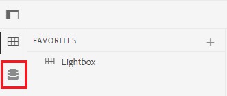
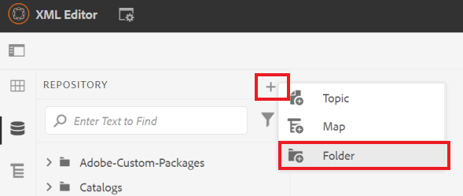
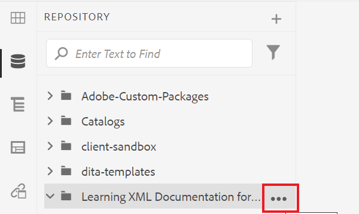
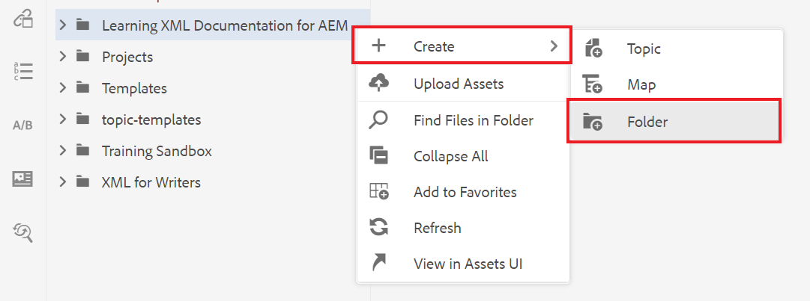
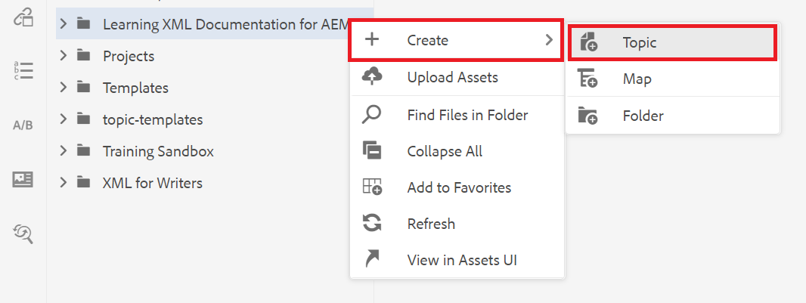
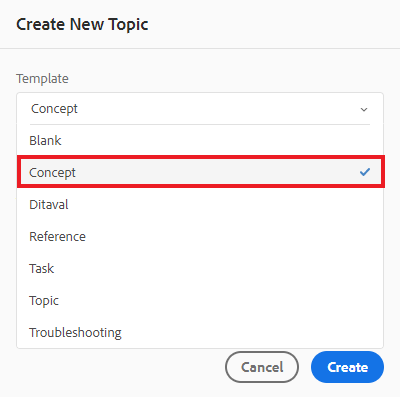
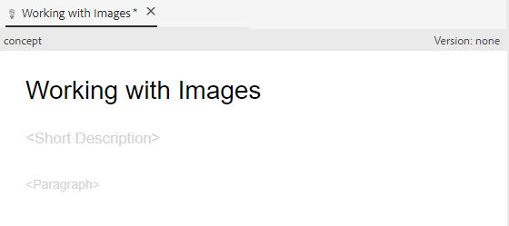

# Criar e estruturar conteúdo

Depois de se familiarizar com a interface do usuário, você pode começar a criar e estruturar seu próprio conteúdo.

>[!VIDEO](https://video.tv.adobe.com/v/336657?quality=12&learn=on)

## Criação de uma pasta

1. Selecione o ícone **Repositório** para exibir suas pastas e arquivos.

   

1. Selecione o ícone **+** e **Pasta**.

   Ícone 

1. Atribua um título à pasta.
1. Selecione **Criar**.
Você criou uma nova pasta, que agora é exibida no Repositório. Esta pasta será a sua página inicial para todo o conteúdo do curso.

## Criação de uma subpasta

Agora podemos criar uma pasta dentro da sua nova pasta para conter imagens ou outro conteúdo.

1. Passe o mouse sobre a nova pasta no Repositório e selecione o ícone de reticências exibido.

   

   O menu Opções é exibido.

1. Selecione **Criar \> Pasta**.
   

1. Dê um título à subpasta (por exemplo, &quot;imagens&quot;) e selecione **Criar**.

## Criação e preenchimento de um novo conceito

1. Passe o mouse sobre a pasta principal no Repositório e selecione o ícone de reticências.

   

   O menu Opções é exibido.

1. Selecione **Criar \> Tópico**.

   

   A caixa de diálogo Criar novo tópico será exibida.

1. No menu suspenso Modelo na caixa de diálogo, selecione **Conceito**.

   

1. Dê um título ao seu conceito e selecione **Criar**.

   O novo conceito é exibido no editor, preenchido com seu título.

   

1. Preencha o conceito clicando na descrição curta ou no parágrafo e digitando o conteúdo.

## Salvar e Salvar como nova versão

Você pode salvar seu trabalho a qualquer momento com Salvar ou Salvar como nova versão. Use Salvar para manter suas alterações e use Salvar como Nova Versão para criar uma nova versão do tópico com as alterações atuais.

### Salvando seu trabalho sem controle de versão

1. Selecione o ícone **Salvar**.

   

### Salvar como uma nova versão

1. Selecione o ícone **Salvar como nova versão** à direita do ícone Salvar.

   

   A caixa de diálogo Salvar como nova versão é exibida.

1. No campo Comentários para nova Versão, informe um resumo breve mas claro das alterações.
1. No campo Rótulos de versão, informe todos os rótulos relevantes.

   Rótulos permitem especificar a versão que você deseja incluir ao publicar.

   >[!NOTE]
   > 
   Se o seu programa estiver configurado com rótulos predefinidos, é possível selecionar um deles para garantir uma rotulagem consistente.

1. Selecione **Salvar**.

   Você criou uma nova versão do seu tópico e o número da versão é atualizado.
