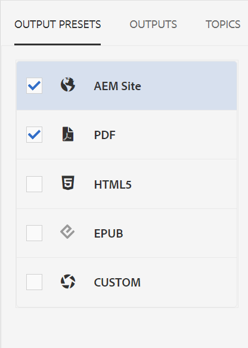

# Saída Padrão de Publicação

Depois de concluir um mapa, você pode publicar seu conteúdo em vários formatos de saída.

>[!VIDEO](https://video.tv.adobe.com/v/336662?quality=12&learn=on)

## Publicar seu mapa como um site AEM e um PDF

Há várias predefinições de saída disponíveis para você escolher. Este guia terá como foco as saídas do Site e PDF do AEM.

1. No repositório, selecione o ícone de reticências no mapa para abrir o menu Opções e **Abra no painel do mapa.**

   

   O Painel do mapa é aberto em outra guia.

1. Na guia Predefinições de saída, selecione AEM Site e PDF.

   

1. Selecionar **Gerar.**

1. Navegue até a página Saídas para visualizar o status das saídas geradas.

   Um círculo verde indica que a geração está completa.

   

## A saída do site AEM

Na saída do site AEM, tópicos, listas, imagens, títulos, tabelas e outros conteúdos criados com o Editor XML são publicados automaticamente em conteúdo compatível com a Web pelo AEM.

Você pode ver tópicos secundários no índice, bem como na seção Informações relacionadas. Todos esses links podem ser usados para navegar.

## A saída do PDF

O documento de PDF concluído contém o título padrão do mapa como o título principal na página de capa. As folhas de rosto do capítulo são estilizadas com o número do capítulo e contêm links para os tópicos em.
