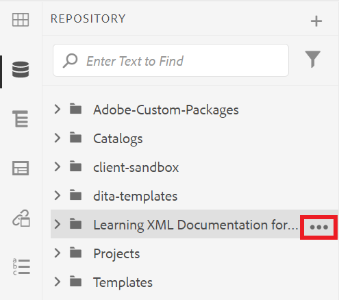

# Compreender a interface do usuário do AEM

Saiba mais sobre como gerenciar ativos, arquivos e pastas no Editor de XML para Experience Manager.

>[!VIDEO](https://video.tv.adobe.com/v/336659?quality=12&learn=on)

## Acessando o Editor de XML

1. Na tela de logon, digite seu nome de usuário e senha e selecione **[!UICONTROL Entrar]**.
1. Selecione **[!UICONTROL Editor XML]** na página de Navegação do AEM.

## Visualizações do Editor de XML

Na barra lateral, você pode escolher entre várias exibições para o Editor de XML para melhor atender às suas necessidades organizacionais. Isso inclui a exibição padrão e [!UICONTROL Exibição do Repositório].

O modo de exibição padrão mostra seus [!UICONTROL Favoritos]. É possível personalizá-lo ainda mais com atalhos, conforme necessário. Por outro lado, a [!UICONTROL Exibição do Repositório] exibe uma estrutura de pastas mais tradicional.

### Alternando para a [!UICONTROL Exibição do Repositório] da exibição padrão

1. No painel à esquerda, selecione **[!UICONTROL Exibição do Repositório]**.

   

   A [!UICONTROL Exibição do Repositório] é exibida.

## A interface do usuário do Assets

Na interface [!UICONTROL Assets], você pode exibir

### Exibição de conteúdo na interface do Assets

Você pode executar ações adicionais com o seu conteúdo. Uma dessas opções é exibir o arquivo na interface do usuário do Assets.

1. Passe o mouse sobre uma pasta ou tópico no Repositório e selecione o ícone de reticências exibido.

   

   O menu Opções é exibido.

1. No menu, selecione **Exibir na Interface do Usuário do Assets.**

   

### Seleção de uma exibição

Você pode escolher entre várias exibições para a interface do usuário do Assets que melhor se adaptam às suas necessidades organizacionais.

1. Selecione o ícone **Exibir alternador** no canto superior direito.

   

   Um menu suspenso é exibido.

1. Selecione o modo de exibição com o qual deseja trabalhar.

### Visualizações da interface do usuário do Assets

| Nome | Descrição |
| --- | --- |
| Exibição de cartão | Exibe cada ativo como um ícone |
| Exibição de coluna | Exibe ativos em uma estrutura de pastas condensada e expansível |
| Exibição de lista | Exibe ativos em uma lista, juntamente com seus detalhes |

## Retornando ao Editor de XML

Você pode retornar ao Editor de XML a partir de qualquer visualização da interface do usuário do Assets.

### Retornando da Exibição de Lista e Coluna

1. Selecione o tópico que deseja editar na lista.
O tópico é exibido na interface do Assets.
1. Selecione **Editar** na barra de ferramentas superior.
Você retorna ao Editor de XML.

### Retornando da exibição de cartão

1. Selecione o ícone de lápis em um tópico na interface do [!UICONTROL Assets].

   

   Você retorna ao Editor de XML.
