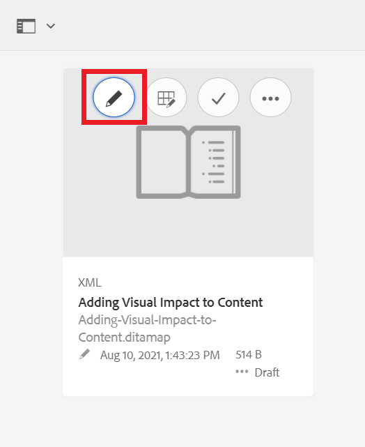

# Compreensão da interface do usuário do AEM

Saiba mais sobre como gerenciar ativos, arquivos e pastas no Editor XML para Experience Manager.

>[!VIDEO](https://video.tv.adobe.com/v/336659?quality=12&learn=on)

## Acesso ao Editor XML

1. Na tela de logon, digite seu nome de usuário e senha e selecione **[!UICONTROL Fazer logon]**.
2. Selecionar **[!UICONTROL Editor XML]** na página Navegação de AEM.

## Visualizações do Editor XML

Na barra lateral, é possível escolher entre várias exibições para o Editor XML, para atender melhor às suas necessidades organizacionais. Eles incluem a exibição padrão e [!UICONTROL Exibição do Repositório].

A exibição padrão exibe [!UICONTROL Favoritos]. Você pode personalizá-lo ainda mais com atalhos, conforme necessário. Por outro lado, a variável [!UICONTROL Exibição do Repositório] exibe uma estrutura de pastas mais tradicional.

### Alternar para o [!UICONTROL Exibição do Repositório] na exibição padrão

1. No painel à esquerda, selecione **[!UICONTROL Exibição do Repositório]**.

   

   O [!UICONTROL Exibição do Repositório] será exibido.

## A interface do usuário do Assets

No [!UICONTROL Ativos] , você pode visualizar

### Visualização de conteúdo na interface do usuário do Assets

Você pode executar ações adicionais com seu conteúdo. Uma dessas opções é exibir seu arquivo na interface do usuário do Assets.

1. Passe o mouse sobre uma pasta ou tópico no Repositório e selecione o ícone de reticências exibido.

   

   O menu Opções é exibido.

1. No menu, selecione **Exibir na interface do usuário do Assets.**

   

### Seleção de uma exibição

É possível escolher entre várias exibições para a interface do usuário do Assets, para atender melhor às suas necessidades organizacionais.

1. Selecione o **Alternador de visualização** no canto superior direito.

   

   Um menu suspenso é exibido.

1. Selecione a exibição com a qual deseja trabalhar.

### Exibições da interface do usuário do Assets

| Nome | Descrição |
| --- | --- |
| Exibição de cartão | Exibe cada ativo como um ícone |
| Exibição de coluna | Exibe ativos em uma estrutura de pastas condensada e expansível |
| Exibição de lista   | Exibe ativos em uma lista, juntamente com seus detalhes |

## Retornar ao Editor XML

Você pode retornar ao Editor XML a partir de qualquer visualização da interface do usuário do Assets.

### Retornando da exibição de lista e coluna

1. Selecione o tópico que deseja editar na lista.
O tópico é exibido na interface do usuário do Assets.
2. Selecionar **Editar** na barra de ferramentas superior.
Você é retornado ao Editor XML.

### Retornar da exibição de cartão

1. Selecione o ícone de lápis em um tópico na [!UICONTROL Ativos] IU.

   

   Você é retornado ao Editor XML.
