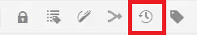
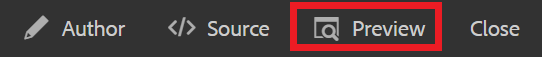

# Controle de versão do conteúdo

O controle de versão de um documento cria um instantâneo de seu estado atual. A criação de várias versões de um tópico ou mapa permite acompanhar suas alterações e recuperar trabalhos mais antigos.

>[!VIDEO](https://video.tv.adobe.com/v/336724?quality=12&learn=on)

## Criação de uma nova versão

1. Selecione o ícone Salvar como nova versão.

   

   A caixa de diálogo Salvar como nova versão é exibida.

1. No campo Comentários para nova Versão, informe um resumo breve mas claro das alterações.
1. No campo Rótulos de versão, informe todos os rótulos relevantes.

   Rótulos permitem especificar a versão que você deseja incluir ao publicar.

   >[!NOTE]
   >
   Se o seu programa estiver configurado com rótulos predefinidos, é possível selecionar um deles para garantir uma rotulagem consistente.

1. Selecione **Salvar**.

   Você criou uma nova versão do seu tópico e o número da versão é atualizado. A primeira versão de um documento será a Versão 1.0.

## Exibindo seu histórico de versão

Depois de ter várias versões do seu conteúdo, talvez você queira explorar as diferenças entre elas.

1. Selecione o ícone Histórico de versão na barra de ferramentas.

   

   A caixa de diálogo Histórico de versão é exibida.

1. Selecione uma versão na lista suspensa para comparar sua versão atual.

   As alterações de versão para versão são indicadas.

## Reverter para uma versão selecionada

Se necessário, é possível selecionar uma versão e revertê-la de volta. Isso permite que você descarte a versão atual e volte a trabalhar com uma versão anterior.

1. Na caixa de diálogo Histórico de versões, selecione a versão para a qual deseja reverter na lista suspensa.
1. Selecione **Reverter para a versão selecionada**.

A caixa de diálogo Reverter versão é exibida.

1. Adicione um comentário descritivo sobre o motivo da reversão para uma versão anterior.
1. Selecione **Confirmar**.

   Seu tópico foi revertido para a versão específica.

## Utilização de filtros para comparar versões

Você também pode visualizar as diferenças de versão na Visualização usando os filtros Rastreamento e Mostrar comparação no painel direito.

1. Selecione **Visualizar** na barra de menu superior.

   

   Seu tópico é aberto na Pré-visualização.

1. Na lista suspensa Rastreamento no painel direito, selecione **Mostrar marcação**.
1. Na lista suspensa Mostrar comparação, selecione a versão com a qual deseja comparar.

   As alterações são exibidas como conteúdo formatado.
