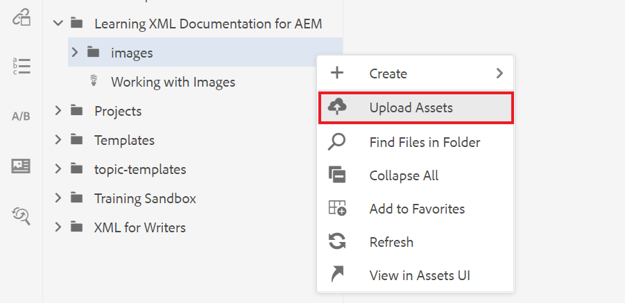
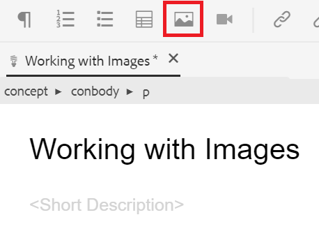
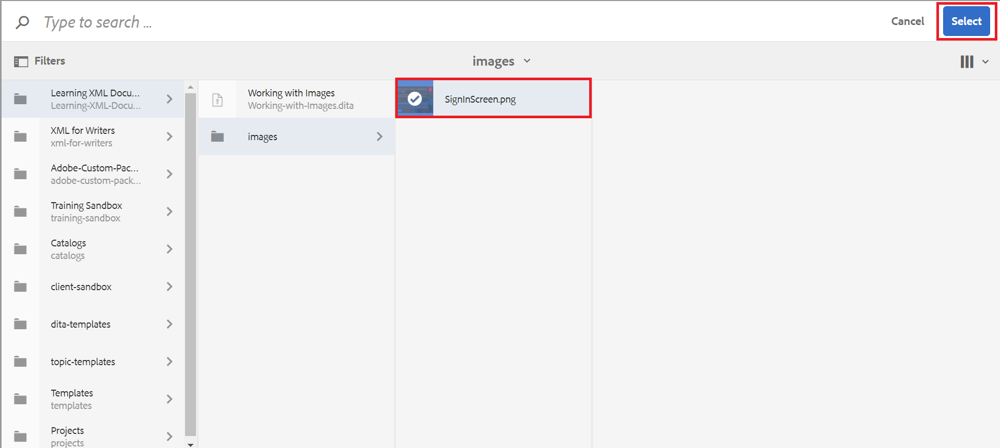

# Trabalhar com imagens

Você será orientado no upload e inserção de uma imagem, bem como no salvamento de uma nova versão de um tópico.

Você pode baixar o arquivo de imagem de exemplo de [aqui.](assets/working-with-images/SignInScreen.png)

>[!VIDEO](https://video.tv.adobe.com/v/336661?quality=12&learn=on)

## Carregamento de uma imagem

1. Passe o mouse sobre a subpasta e selecione o ícone de reticências para abrir o menu Opções.

   

1. Selecione **[!UICONTROL Carregar Assets]**.

   

1. Selecione a imagem que você deseja carregar do seu sistema local e selecione **Abrir**.

   A caixa de diálogo [!UICONTROL Carregar Assets] é exibida.

1. Selecione **Carregar**.

## Inserção de uma imagem em um tópico

Há várias maneiras de inserir uma imagem em seu tópico.

Você pode arrastar e soltar uma imagem de seu sistema local em seu tópico. Se a imagem já tiver sido carregada, você também poderá arrastá-la e soltá-la diretamente no tópico a partir do painel esquerdo. Como alternativa, você pode usar o botão Inserir imagem para inserir imagens que não estão visíveis no painel esquerdo e configurar ainda mais sua imagem antes de inseri-la.

Para o seguinte, verifique se o tópico está aberto no editor de documentos.

### Inserção de uma imagem com arrastar e soltar

1. Selecione o arquivo de imagem no seu sistema local ou no painel esquerdo e arraste-o e solte-o no seu tópico.

   A imagem é exibida no editor.

### Inserção de uma imagem com o botão Inserir imagem

1. Selecione o ícone **Inserir imagem**.

   

   A caixa de diálogo Inserir imagem é exibida.

1. Selecione o ícone de pasta ao lado do campo Selecionar arquivo para pesquisar a imagem ou navegar até o local no Repositório.
1. Selecione o ícone da imagem e **Selecione**.

   

   A caixa de diálogo Inserir imagem é exibida com as informações da imagem escolhida.

1. Insira texto nos campos Título da figura e Texto alternativo, conforme necessário.
1. Selecione **Inserir**.

   A imagem é exibida no editor, juntamente com o título da figura.

## Remoção de uma imagem de um tópico

1. Selecione a imagem no editor de documentos e pressione a tecla **Delete**.

## Como salvar uma nova versão de um tópico

O controle de versão permite revisar e comparar diferentes versões. Você pode até mesmo reverter para uma versão anterior.

Como você fez uma alteração significativa em seu tópico, agora pode ser útil salvar seu trabalho atual como uma nova versão.

1. Selecione o ícone **Salvar como nova versão**.

   

   A caixa de diálogo **Salvar como nova versão** é exibida.

1. No campo Comentários para nova Versão, informe um resumo breve mas claro das alterações.
1. No campo Rótulos de versão, informe todos os rótulos relevantes.

   Rótulos permitem especificar a versão que você deseja incluir ao publicar.

   >[!NOTE]
   > 
   Se o seu programa estiver configurado com rótulos predefinidos, é possível selecionar um deles para garantir uma rotulagem consistente.

1. Selecione **Salvar**.

   Você criou uma nova versão do seu tópico e o número da versão é atualizado.
