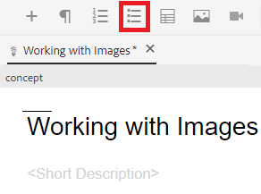
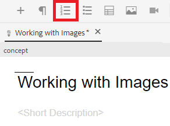

# Trabalhar com listas

Você pode precisar de listas com marcadores e numeradas para organizar suas informações. A seguir, instruções sobre como inserir e trabalhar com listas dentro de um conceito existente.

>[!VIDEO](https://video.tv.adobe.com/v/336658?quality=12&learn=on)

## Listas com marcadores

Uma lista com marcadores ou não ordenada deve ser usada quando os componentes da lista não precisam ser organizados em uma determinada ordem.

### Inserção de uma lista com marcadores

1. Selecione o ícone **Inserir Lista com Marcadores** na barra de ferramentas.

   

   Um marcador é exibido. Este é o início da sua lista.

1. Digite o primeiro item da lista.
1. Pressione Enter para criar uma segunda entrada e digite o conteúdo.
1. Continue adicionando itens de lista conforme necessário.

## Listas numeradas

Uma lista numerada deve ser usada quando os componentes da lista precisam ser ordenados ou estruturados de determinada maneira.

### Inserção de uma lista ordenada

1. Selecione o ícone **Inserir Lista Numerada** na barra de ferramentas.

   

   Um número é exibido. Este é o início da sua lista.

1. Digite o primeiro item da lista.
1. Pressione Enter para criar uma segunda entrada e digite o conteúdo.
1. Continue adicionando itens de lista conforme necessário.

## Salvar como uma nova versão

Agora que adicionou mais conteúdo ao conceito, você pode salvar seu trabalho como uma nova versão e registrar as alterações.

1. Selecione o ícone **Salvar como nova versão**.

   

1. No campo Comentários para nova Versão, informe um resumo breve mas claro das alterações.
1. No campo Rótulos de versão, informe todos os rótulos relevantes.

   Rótulos permitem especificar a versão que você deseja incluir ao publicar.

   >[!NOTE]
   > 
   Se o seu programa estiver configurado com rótulos predefinidos, é possível selecionar um deles para garantir uma rotulagem consistente.

1. Selecione **Salvar**.

   Você criou uma nova versão do seu tópico e o número da versão é atualizado.
