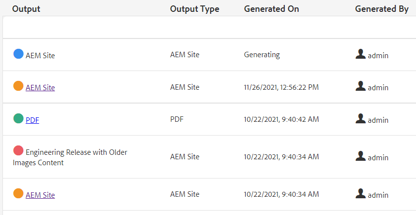

# Publicação em massa

Ao publicar, geralmente é necessário mais de um tipo de documentação. Usando Coleções de mapas, você pode controlar o número e os tipos de saída que serão montados e gerados, e iniciar a publicação em massa. O Painel de publicação permite exibir trabalhos de publicação ativos. O Painel de publicação em massa fornece uma maneira de ativar coleções em massa.

>[!VIDEO](https://video.tv.adobe.com/v/338985?quality=12&learn=on)

## Trabalhar com coleções de mapas

Usando Coleções de Mapas, você pode controlar os tipos de saída que serão gerados para um ou mais mapas.

### Criar coleções de mapas

1. No menu Navegação, clique em **Assets**.

1. Selecione Mapear coleções.

1. Clique em **Criar**.

1. Digite um Título de coleção.

   

1. Clique em **Criar**.
1. Feche a mensagem de sucesso.

1. Abra a coleção de mapas (clique na seção cinza abaixo do bloco)

1. Clique em **Editar**.

1. Adicione mapas conforme necessário.

1. Marque ou desmarque **Predefinições de saída** para cada mapa.
1. Clique em **Concluído**.

### Filtrar predefinições do mapa

1. Abra uma predefinição de mapa.

1. Em **Filtro**, expanda e selecione as opções conforme necessário.

### Gerar conteúdo em uma coleção de mapas

1. Abra uma predefinição de mapa.

1. Se desejar, clique em **Gerar tudo**.

1. OU selecione os mapas e tipos de saída a serem gerados e clique em **Gerar Selecionados**.

1. Se necessário, alterne para a guia Saídas.

1. Revise o resultado.

## Exibição de trabalhos de publicação ativos no Painel de publicação

O Painel de publicação permite exibir arquivos
trabalhos de publicação. Ela mostra uma lista dinâmica de mapas e seus status atuais. É possível rastrear, gerenciar ou cancelar a publicação de workflows.

1. Na exibição Navegação, clique no ícone **Ferramentas**.

1. Clique em **[!DNL Guides]**.

1. Selecione o bloco **Publicar painel**.

   Se o painel estiver em branco, significa que não há trabalhos de publicação em execução.

1. Filtre o painel conforme necessário para exibir todos os trabalhos de publicação.

### Trabalhar com o painel de publicação em massa

O Painel de publicação em massa permite que você trabalhe com Coleções de ativação em massa e controle vários tipos de saída.

### Criação de uma coleção de ativação em massa

1. Na exibição Navegação, clique no ícone **Ferramentas**.

1. Clique em **[!DNL Guides]**.

1. Selecione o bloco **Painel de publicação em massa**.

1. Digite um Título de coleção.

1. Clique em **Criar**.

1. Clique em **Abrir**.

1. Abra a coleção de mapas (clique na seção cinza abaixo do bloco)

1. Clique em **Editar**.

1. Adicione mapas conforme necessário.

1. Marque ou desmarque **Predefinições de saída** para cada mapa.
1. Clique em **Concluído**.
1. Feche a coleção de mapas quando terminar.

### Publicar rapidamente uma coleção de ativação em massa

1. Selecione um bloco Coleção de Ativação em Massa.
1. Clique em **Abrir**.
1. Selecione um ou mais mapas.
1. Clique em **Publicação rápida**.
