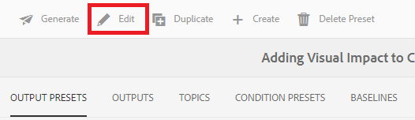

# Criando e Publicando com Linhas de Base

Usar uma linha de base permite criar uma versão dos tópicos do mapa e do conteúdo de referência relacionado. Isso pode ser baseado em uma data, hora ou rótulos específicos.

>[!VIDEO](https://video.tv.adobe.com/v/338993?quality=12&learn=on)

## Acessando a Guia Linhas de Base no Painel do Mapa

Você pode acessar suas linhas de base no Painel do mapa.

1. Exibição de Repositório, selecione o ícone de Reticências no mapa para abrir o menu Opções e **Abra o Painel do Mapa.**

   
O Painel do mapa é aberto em outra guia.

1. Selecionar **Linhas de Base**.

   

A guia Linhas de Base é exibida.

## Criação de uma linha de base com base em rótulos

1. Na guia Linhas de Base, selecione **Criar**.

   

   As informações da nova linha de base são exibidas. Seu nome padrão se baseia na data de criação.

1. Dê um novo nome à sua linha de base, se necessário.

1. No cabeçalho &quot;Definir a versão com base em&quot;, selecione o círculo para Rótulo.
   

   >[!NOTE]
   >
   >OBSERVAÇÃO: o *Usar versão mais recente se o rótulo não estiver presente* é marcada por padrão. Se essa opção não estiver selecionada e houver tópicos ou arquivos de mídia sem o rótulo escolhido no mapa, o processo de criação da linha de base falhará.

1. Insira o rótulo que deseja usar.

1. Selecione **Salvar**.

Sua linha de base foi criada. Uma tabela de todos os tópicos e suas informações associadas é exibida.

### Utilização do recurso Procurar todos os tópicos

O recurso Navegar por todos os tópicos permite exibir as informações do tópico, incluindo a versão e o rótulo, bem como especificar a versão usada. Você pode acessá-lo selecionando **Procurar todos os tópicos** ao criar ou editar sua linha de base.

## Criando uma linha de base com base em data e hora

Você também pode criar linhas de base que são um instantâneo no tempo.

1. Verifique se a guia Linhas de Base está aberta e selecione Criar.

   

1. No cabeçalho &quot;Definir a versão com base em&quot;, selecione o círculo para &quot;Versão ativada&quot;.

   

1. Selecione o ícone de calendário e especifique a data e a hora desejadas.

   

1. Dê um novo nome à sua linha de base, se necessário.

1. Selecione **Salvar**.

Sua linha de base foi criada. Uma tabela de todos os tópicos e suas informações associadas é exibida.

### Adicionar rótulos à sua linha de base

Você pode atribuir um novo rótulo em massa a todo o conteúdo do mapa.

1. Selecione a linha de base à qual você deseja adicionar rótulos.

1. Selecionar **Adicionar rótulos**.

   

   A caixa de diálogo Adicionar rótulo é exibida.

1. Insira o rótulo que deseja atribuir e selecione **Adicionar**.

O rótulo foi adicionado a todos os tópicos.

## Gerar uma saída de site AEM usando uma linha de base

1. Navegue até a guia Predefinições de Saída no Painel do Mapa.

1. Marque a caixa de seleção Site do AEM.

   

1. Selecione **Editar**.

   

   Uma nova página é exibida.

1. Marque a caixa de seleção Usar linha de base e escolha a linha de base que deseja usar na lista suspensa.

   

1. Selecionar **Concluído**.

   

1. Selecionar **Gerar**.

   

   Sua saída foi gerada com uma linha de base.

## Visualização da saída gerada

1. Navegue até a guia Saídas no Painel do Mapa.

1. Selecione o texto na coluna Configuração de Geração para abrir a saída.
   

## Removendo uma linha de base

1. Na guia Linhas de Base, selecione a linha de base que deseja remover.

1. Selecionar **Remover**.

   

   A caixa de diálogo Remover Linha de Base será exibida.

1. Selecionar **Remover**.

A linha de base é removida.

## Duplicação de uma linha de base

1. Na guia Linhas de Base, selecione a linha de base que deseja duplicar.

1. Selecionar **Duplicar**.

   

1. Selecione **Salvar**.

   

A linha de base duplicada é criada.

## Modificando uma linha de base

Você pode especificar diretamente a versão de um tópico usada em uma linha de base.

1. Na guia Linhas de Base, selecione a linha de base que deseja modificar.
1. Selecione **Editar**.

   

1. Selecionar **Procurar todos os tópicos**.

   

   Uma tabela de tópicos e suas informações associadas é exibida.

1. Para os tópicos que você deseja modificar, selecione a versão desejada na lista suspensa na coluna Versão.

   

1. Selecione **Salvar**.

Suas alterações foram salvas. Sua linha de base agora usará as versões do tópico especificadas.

## Criação de uma predefinição de saída de site AEM personalizada

É difícil distinguir entre saídas padrão do mesmo tipo na guia Saídas. Usar uma predefinição de saída personalizada com um nome exclusivo e amigável permite resolver esse problema.

Nesse caso, estamos criando uma predefinição de saída com base em uma linha de base.

1. Navegue até a guia Predefinições de Saída no Painel do Mapa.

1. Selecione **Criar**.

   

   Uma nova página de predefinição de saída é exibida, chamada Nova saída.
1. No campo Nome da Configuração, informe um nome amigável.

1. Marque a caixa de seleção Usar linha de base e selecione a linha de base desejada no menu suspenso.

   

1. Selecionar **Concluído**.

Sua nova predefinição de saída foi criada e é exibida na página de predefinições de saída.
