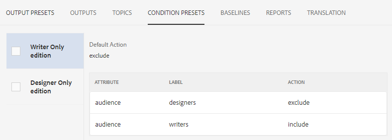

# Introdução ao painel Mapa

A seguir, uma visão geral dos principais recursos do painel de mapa.

>[!VIDEO](https://video.tv.adobe.com/v/339040)

## Abrir um mapa no painel Mapa

1. Na Exibição do Repositório, selecione o ícone Reticências no seu mapa para abrir o menu Opções e, em seguida, Abrir painel Mapa.
   

   O painel Mapa é aberto em outra guia.

## Componentes do painel Mapa

O painel do mapa contém várias guias, incluindo predefinições de saída, resultados de saída, tópico usado, linhas de base e muito mais.

### Predefinições de saída

A guia Predefinições de saída exibe as predefinições padrão para os diferentes tipos de saídas: AEM Site, PDF, HTML5, ePub e Personalizado.

Você pode selecionar uma predefinição de saída para exibir os detalhes de suas configurações, incluindo o nome da transformação, o caminho de destino, as linhas de base e as condições aplicadas.

### Saídas

A guia Saídas exibe todas as saídas geradas anteriormente e atualmente.

Um círculo verde na coluna Configurações de geração indica que a saída foi gerada com êxito. O texto nessa coluna atua como um hiperlink ativo e você pode selecioná-lo para abrir a saída gerada. As entradas na coluna Tipo indicam o tipo de saída.
Outras informações de geração de saída também são exibidas aqui, incluindo o nome do usuário que gerou a saída, a data e a hora da geração e o tempo necessário para a geração ocorrer. Se houver um erro durante a geração, você poderá selecionar a data e a hora da geração na coluna Gerado em para abrir e revisar o log de erros.

### Tópicos

A guia Tópicos exibe uma lista de todos os tópicos no mapa.

Marcar a caixa de seleção de um tópico permite executar ações adicionais. Você pode editá-la, gerá-la novamente e mostrar, aplicar ou ocultar suas tags.

### Predefinições de condição

A guia Predefinições de condição exibe as configurações do conteúdo condicional específico a ser incluído ou excluído.

Aqui, marcar a caixa de seleção da edição Somente gravador resultará em uma saída que exclui todo o conteúdo com o atributo &quot;público-alvo&quot; que tem o rótulo &quot;designers&quot; e inclui todo o conteúdo com o rótulo &quot;autores&quot;.

### Linhas de base

A guia Linhas de base permite visualizar suas linhas de base.

As linhas de base atuam como instantâneos no tempo e permitem criar uma versão dos tópicos e ativos para publicação. Por exemplo, uma linha de base que captura o conteúdo em uma data e hora específicas pode usar a versão 1.3 de um tópico e 1.0 de outro tópico, com base em suas respectivas versões no momento.
Se não houver uma linha de base especificada, a saída será gerada com as versões mais recentes de todo o conteúdo.

### Relatórios

A guia Relatórios exibe um resumo das informações do tópico, incluindo o número total de tópicos em uso, elementos ausentes nesses tópicos e o estado do documento.

Se um elemento estiver ausente em um tópico, é possível selecionar a seta mais à direita na linha para expandir a entrada e exibir detalhes sobre o erro.
