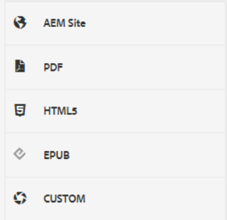
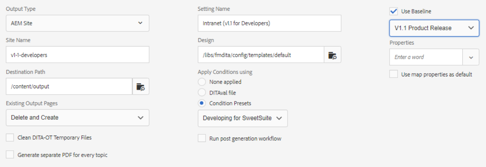

# Predefinições de saída

Uma Predefinição de saída é uma coleção de propriedades de publicação que foram atribuídas a um mapa. Eles podem ser criados ou modificados se necessário.

>[!VIDEO](https://video.tv.adobe.com/v/338989?quality=12&learn=on)

## Acesso às predefinições de saída

Uma predefinição de saída é mostrada quando um mapa no Editor XML é aberto no painel de mapa. As predefinições podem incluir informações sobre um tipo de saída específico, o caminho de destino, instruções sobre como gerenciar páginas de saída existentes e outras configurações que podem ser aplicadas a um mapa para gerar saída.

## Criação de uma predefinição de saída

>[!NOTE]
>
>OBSERVAÇÃO: alguns dos recursos usados por uma predefinição de saída podem depender do desenvolvimento inicial de uma linha de base ou de uma predefinição de condição. Se forem necessários, você deverá configurá-los usando as guias apropriadas.

1. Selecione uma predefinição de saída da linha de base. Por exemplo, AEM ou PDF podem ser selecionados se a nova predefinição a ser criada for para um site ou para fornecer conteúdo Adobe PDF.

1. Clique em **Criar**.

1. Se necessário, selecione um Tipo de saída.

1. Com base no tipo de saída, configure mais as opções.

1. Clique em **Concluído**.

## Editar uma predefinição de saída

As predefinições de saída são predefinidas, mas podem ser personalizadas conforme necessário.

1. Abra o Painel do Mapa.

1. Selecione a guia **Predefinições de saída**.

1. Selecione uma predefinição de saída.

1. Clique em **Editar**.

1. Modifique as configurações conforme necessário.

   

1. Clique em **Concluído**.
