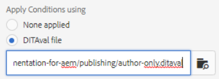

# Publicação com condições

A publicação condicional permite que uma fonte de conteúdo seja gravada para um ou mais públicos-alvo, produtos ou plataformas. Essas informações podem ser publicadas dinamicamente e apenas o conteúdo especificamente necessário pode ser incluído na saída.

>[!VIDEO](https://video.tv.adobe.com/v/339041?quality=12&learn=on)

## Preparação para o exercício

Você pode baixar arquivos de amostra para o exercício aqui.

[Exercício-Download](assets/exercises/publishing-with-conditions.zip)

## Marcação de conteúdo com atributos condicionais

1. Abra o tópico para modificar.

1. Insira o texto que deve se tornar condicional. Por exemplo, um ou mais parágrafos, uma tabela inteira, uma figura ou outro conteúdo.

   

1. Selecione o conteúdo específico ao qual atribuir um atributo condicional. Por exemplo, um único parágrafo na origem.

   

1. No painel direito, verifique se as Propriedades são exibidas.

1. Adicione um atributo para público-alvo, produto ou plataforma.

1. Atribua um valor ao atributo. As atualizações de exibição de conteúdo para mostrar marcação condicional foram aplicadas.

   

## Visualização de conteúdo condicional

1. Clique em **Visualizar**.

1. Em **Filtros**, selecione ou desmarque as condições para mostrar ou ocultar.

1. Selecionar ou desmarcar **Texto de condições de realce**.

   

## Criar uma predefinição de condição

Uma predefinição de condição é uma coleção de propriedades que definem o que deve ser incluído ou excluído, ou de outra forma marcado, durante a geração da saída.

1. No painel Mapa, selecione a opção **Predefinições de condição** guia .

1. Clique em **Criar**.

1. Selecionar **Adicionar** ou **Adicionar tudo**).

1. Nomeie a condição.

1. Selecione uma combinação de atributo, rótulo e ação.

   

1. Repita conforme necessário.

1. Clique em **Salvar**.

## Geração de saída condicional

Depois que as condições tiverem sido aplicadas ao conteúdo, ele poderá ser gerado como saída. Isso pode usar uma Predefinição de condição ou um arquivo DITAval.

## Geração de saída condicional usando uma predefinição de condição

1. Selecione o **Predefinições de saída** guia .

1. Selecione uma predefinição de saída.

1. Clique em **Editar**.

1. Em **Aplicar condição usando** selecione uma Predefinição de condição.

   

1. Clique em **Concluído**.

1. Gere a predefinição de saída e revise o conteúdo.

## Geração de saída condicional usando um arquivo DITAval

O arquivo DITAval pode ser usado para publicar conteúdo condicional. Isso requer que um arquivo seja criado ou carregado e, em seguida, referenciado na publicação.

1. Selecione o **Predefinições de saída** guia .

1. Selecione uma predefinição de saída.

1. Clique em **Editar**.

1. Em Aplicar condição usando , selecione um arquivo DITAval.

   

1. Clique em **Concluído**.

1. Gere a predefinição de saída e revise o conteúdo.
