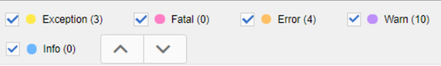

# Solução de problemas de erros de publicação

Publicar um mapa geralmente é simples. Abra o mapa, selecione uma Predefinição de saída e gere a saída! No entanto, se um mapa ou seus tópicos tiverem erros, a geração de saída poderá falhar. Quando isso acontecer, é importante saber como solucionar problemas.

>[!VIDEO](https://video.tv.adobe.com/v/338990)

## Preparação para o exercício

Você pode baixar arquivos de amostra para o exercício aqui.

[Exercício-Download](assets/exercises/publishing-basic-to-advanced.zip)

## Causas comuns da publicação de erros

Erros podem ser introduzidos no conteúdo de origem. Por exemplo:

* Referência de caminho de arquivo nomeado incorretamente

* Pasta nomeada incorretamente

* Gráfico ou ficheiro em falta

* Referência de conteúdo configurada incorretamente

* Referência cruzada quebrada

* Erros nos valores de um atributo (por exemplo, uma string em vez de um número)

* Configuração incorreta dos componentes usados pelo [!DNL AEM Guides]

## Impacto dos erros

Um erro pode ser menor e resultar em uma nota simples para avisá-lo que um arquivo não foi empacotado com êxito ou grave o suficiente para resultar em uma falha completa de gerar saída. A guia Saídas exibe ícones com códigos de cores para mostrar sucesso, erros ou falhas relacionados à geração de saída.

## Abrir e revisar logs de erros

O arquivo de log gerado pode ser aberto para revisão.

1. No **Saídas** clique no botão **data/hora em Gerado em.**

   

2. Percorra o log de erros.

## Mostrar e ocultar tipos de erro

O log de erros exibe cada tipo de erro em uma cor exclusiva.

1. **Selecionar** ou **desmarcar** qualquer tipo de erro para mostrar ou ocultar o realce.

2. Navegar pelos erros usando o **next** ou **previous** botões (setas).

## Resolução de erros

Dependendo do tipo de erro, a resolução pode ser simples ou complexa. Ele pode ser preenchido por um autor no Editor XML ou pode exigir que um administrador trabalhe com [!DNL AEM Guides]. Correções específicas dependem do erro, do impacto e dos workflows organizacionais.

* Referência de caminho de arquivo nomeado incorretamente

       Os autores podem atualizar a referência de caminho no documento de origem.
       
   
* Pasta nomeada incorretamente

       Os autores podem atualizar o nome da pasta ou mover arquivos, conforme necessário.
       
   
* Gráfico ou ficheiro em falta

       Os autores podem carregar um gráfico/arquivo ausente, renomear um gráfico/arquivo ou mover um gráfico/arquivo
       
   
* Referência de conteúdo configurada incorretamente

       Os autores podem corrigir o local do conteúdo referenciado ou alterar o caminho para a referência de conteúdo.
       
   
* Referência cruzada quebrada

       Os autores podem corrigir o local para o qual a referência cruzada aponta ou alterar o nome ou as propriedades do arquivo de destino
       
   
* Erros nos valores de um atributo (por exemplo, uma string em vez de um número)

       Os autores podem atualizar o atributo para um valor correto ou os administradores podem atualizar o sistema para suportar novos valores.
       
   
* Configuração incorreta dos componentes usados pelo [!DNL AEM Guides]

       Os administradores podem atualizar a instalação do sistema, seus componentes ou permissões.
       
   