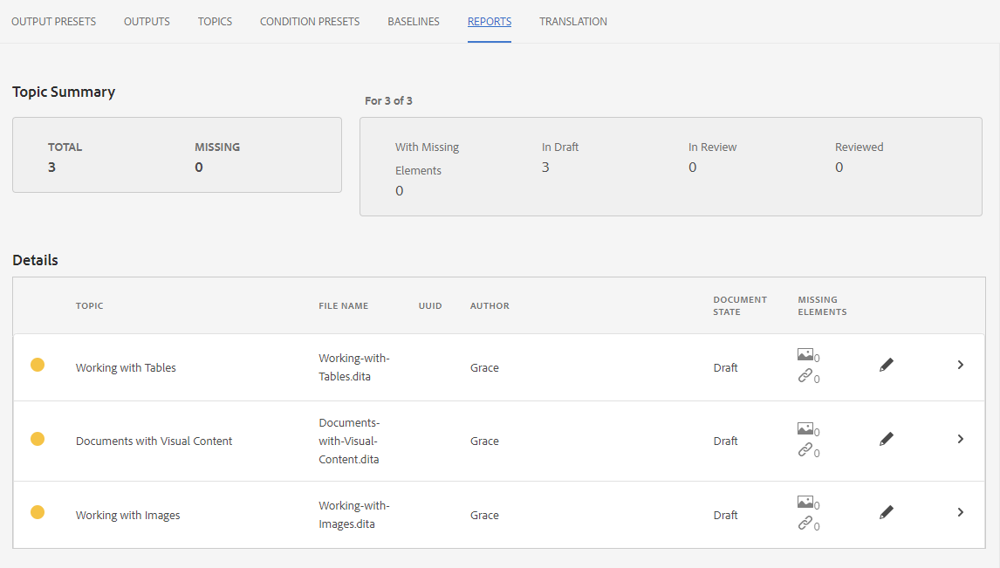

# Trabalhar com relatórios

A guia Relatórios no Painel de mapa permite identificar e resolver links quebrados, conteúdo referenciado e reutilizado (conrefs), referências cruzadas ou outras informações ausentes.

>[!VIDEO](https://video.tv.adobe.com/v/339039?quality=12&learn=on)

## Preparação para o exercício

Você pode baixar arquivos de amostra para o exercício aqui.

[Exercício-Download](assets/exercises/working-with-reports.zip)

## Fazer upload de ativos

1. Na Exibição do Repositório, selecione o ícone Reticências na pasta principal para abrir o menu Opções.

   

1. Selecionar **[!UICONTROL Fazer upload de ativos]**.

   

1. Selecione os arquivos que deseja fazer upload para a pasta e selecione **Upload**.

Os arquivos DITA são abertos e você deve analisá-los em busca de problemas com conteúdo, conrefs ou referências cruzadas ausentes.

## Criação de um mapa

1. Selecione o ícone Reticências na pasta principal para abrir o menu Opções.

   

1. Selecionar **Criar > Mapa**.

   

   A caixa de diálogo Criar novo mapa é exibida.

1. No campo Modelo , selecione **Bookmap** ou **Mapa** com base no tipo de conteúdo que você está criando) no menu suspenso e dê um título ao mapa.

1. Selecione **Criar**.

Seu mapa é criado e o painel esquerdo muda automaticamente da exibição Repositório para a exibição Mapa.

## Inserir componentes do mapa

1. Selecione o ícone de lápis no painel esquerdo.
Este é o ícone Edit e permite abrir o mapa no editor.

   

1. Volte para a visualização Repositório selecionando o ícone Repositório.

   

1. Adicione um tópico ao mapa arrastando-o e soltando-o do Repositório no mapa no editor.
O indicador de linha mostrará onde o tópico será colocado.

1. Continue a adicionar tópicos, conforme necessário.

1. Quando terminar, selecione **Salvar Como Nova Versão.**

   

1. No *Comentários para nova versão* , insira um comentário descritivo.

1. Selecione **Salvar**.

## Gerar uma saída do Site de AEM

1. No Repositório, selecione o ícone Reticências no seu mapa para abrir o menu Opções e **Abra o painel Mapa.**

   

   O painel Mapa é aberto em outra guia.
1. Na guia Predefinições de saída, selecione **Site AEM**.

   

1. Selecionar **Gerar**.

1. Navegue até a página Saídas para visualizar o status de suas saídas geradas.
Se houver erros, a guia Saídas pode exibir um círculo laranja na coluna Configuração de geração em vez de verde, indicando que a geração está concluída.

1. Selecione o link na coluna Geração de configuração para abrir a saída gerada.
Revise a saída para obter conteúdo ausente.

## A guia Relatórios

A guia Relatórios exibe um resumo de tópico e uma tabela contendo as informações do tópico e os problemas do mapa.

Idealmente, sempre verifique os Relatórios de um mapa após importar o conteúdo.

A coluna Elementos ausentes indica o número de imagens ausentes e consoles quebrados. Você pode selecionar a variável **Lápis** ícone para abrir o tópico no editor.

## Resolução de imagens ausentes

Se as imagens estiverem faltando em seus arquivos, uma causa comum pode ser que o conteúdo tenha sido carregado, mas as imagens não. Em caso positivo, resolva os problemas de imagem ausentes carregando imagens em uma pasta específica correspondente ao caminho e nomes de arquivo esperados pelos arquivos.

1. Em *Exibição do Repositório*, selecione o ícone Reticências na pasta de imagens para abrir o menu Opções .

   

1. Selecionar **[!UICONTROL Fazer upload de ativos]** e selecione as imagens ausentes.

1. Selecionar **Upload**.

As imagens ausentes foram carregadas. Agora, uma saída recém-gerada AEM Site exibirá essas imagens, e a guia Relatórios não exibirá mais nenhum erro de imagem ausente.

## Resolvendo conrefs quebrados

Se o conteúdo referenciado em outro lugar (a conref) vincular a para um arquivo em outra pasta (por exemplo, um chamado &quot;reutilizar&quot;). e o conteúdo não for carregado, um erro deverá ser resolvido. Por exemplo, você deve criar uma subpasta chamada &quot;reutilizar&quot; e fazer upload do arquivo ausente para &quot;reutilizar&quot;.

### Fazer upload de um ativo com a variável [!UICONTROL Ativos] interface

Além do [!UICONTROL Fazer upload de ativos] , é possível fazer upload de ativos arrastando e soltando na interface do usuário do Assets.

1. Na Exibição do Repositório, selecione o ícone Reticências na sua pasta de reutilização para abrir o menu Opções.

   

1. Selecionar **Exibir na interface do usuário do Assets**.

   

1. Arraste e solte o arquivo na pasta .
O arquivo é carregado e o erro conref é resolvido.

Todos os erros foram resolvidos. A página Relatórios indicará que não há mais erros e a geração de um Site AEM resultará em uma saída completa sem componentes ausentes.
