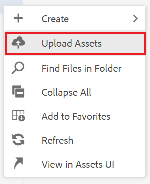

# Trabalho com relatórios

A guia Relatórios no Painel do mapa permite identificar e resolver links com falha, conteúdo referenciado e reutilizado (conrefs), referências cruzadas ou outras informações ausentes.

>[!VIDEO](https://video.tv.adobe.com/v/339039?quality=12&learn=on)

## Preparação para o exercício

Você pode baixar arquivos de amostra para o exercício aqui.

[Download de exercício](assets/exercises/working-with-reports.zip)

## Fazendo upload de ativos

1. Na Exibição de repositório, selecione o ícone de Reticências na pasta principal para abrir o menu Opções.

   

1. Selecionar **[!UICONTROL Fazer upload de ativos]**.

   

1. Selecione os arquivos que deseja carregar na pasta e selecione **Carregar**.

Os arquivos DITA são abertos e você deve analisá-los quanto a problemas com conteúdo ausente, conrefs ou referências cruzadas.

## Criação de um mapa

1. Selecione o ícone de Reticências na pasta principal para abrir o menu Opções.

   

1. Selecionar **Criar > Mapear**.

   

   A caixa de diálogo Criar novo mapa é exibida.

1. No campo Modelo, selecione **Bookmap** (ou **Mapa** com base no tipo de conteúdo que você está criando) no menu suspenso e dê um título ao mapa.

1. Selecione **Criar**.

Seu mapa é criado e o painel esquerdo muda automaticamente da exibição Repositório para a exibição Mapa.

## Inserção de componentes do mapa

1. Selecione o ícone de lápis no painel esquerdo.
Este é o ícone Editar, e permite que você abra o mapa no editor.

   

1. Volte para a visualização Repositório selecionando o ícone Repositório.

   

1. Adicione um tópico ao mapa, arrastando-o e soltando-o do Repository (Repositório) no mapa no editor.
O indicador de linha mostrará onde o tópico será colocado.

1. Continue a adicionar tópicos, conforme necessário.

1. Quando terminar, selecione **Salvar como nova versão.**

   

1. No *Comentários da nova versão* insira um comentário descritivo.

1. Selecione **Salvar**.

## Gerar uma saída do site AEM

1. No Repositório, selecione o ícone de Reticências no mapa para abrir o menu Opções e, em seguida, **Abra o Painel do Mapa.**

   

   O Painel do mapa é aberto em outra guia.
1. Na guia Predefinições de saída, selecione **Site AEM**.

   

1. Selecionar **Gerar**.

1. Navegue até a página Saídas para visualizar o status das saídas geradas.
Se houver erros, a guia Saídas pode exibir um círculo laranja na coluna Configuração de geração, em vez de verde, indicando que a geração foi concluída.

1. Selecione o link na coluna Configuração de Geração para abrir a saída gerada.
Revise a saída em busca de conteúdo ausente.

## A guia Relatórios

A guia Relatórios exibe um resumo de tópico e uma tabela contendo informações sobre o tópico e os problemas do mapa.

Idealmente, você sempre deve verificar os Relatórios em busca de um mapa após importar o conteúdo.

A coluna Missing Elements indica o número de imagens ausentes e conrefs quebrados. É possível selecionar a variável **Lápis** ícone para abrir o tópico no editor.

## Resolução de imagens ausentes

Se as imagens estiverem ausentes em seus arquivos, uma causa comum pode ser o conteúdo ter sido carregado, mas as imagens não. Em caso afirmativo, resolva os problemas de imagem ausente fazendo upload de imagens em uma pasta específica que corresponda ao caminho e aos nomes de arquivo esperados pelos arquivos.

1. Entrada *Visualização do repositório*, selecione o ícone de Reticências na pasta de imagens para abrir o menu Opções.

   

1. Selecionar **[!UICONTROL Fazer upload de ativos]** e selecione as imagens ausentes.

1. Selecionar **Carregar**.

As imagens ausentes foram carregadas. Agora, uma saída de site AEM recém-gerada exibirá essas imagens, e a guia Relatórios não exibirá mais erros de imagem ausentes.

## Resolvendo conrefs com falha

Se o conteúdo referenciado em outro lugar (um conref) for vinculado a para um arquivo em outra pasta (por exemplo, um chamado &quot;reutilizar&quot;). e o conteúdo não for carregado, um erro deverá ser resolvido. Por exemplo, você deve criar uma subpasta chamada &quot;reutilizar&quot; e fazer upload do arquivo ausente para &quot;reutilizar&quot;.

### Fazer upload de um ativo com o [!UICONTROL Assets] IU

Além do [!UICONTROL Fazer upload de ativos] você pode fazer upload de ativos arrastando e soltando na interface do usuário de Ativos.

1. Na Exibição de repositório, selecione o ícone de Reticências na pasta reutilizar para abrir o menu Opções.

   

1. Selecionar **Exibir na interface do usuário do Assets**.

   

1. Arraste e solte o arquivo na pasta.
O arquivo é carregado e o erro conref é resolvido.

Todos os erros foram resolvidos. A página Relatórios indicará que não há mais erros e a geração de um site AEM resultará em uma saída completa sem componentes ausentes.
