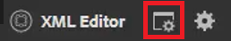

# Condições

No DITA, as condições geralmente são orientadas por atributos como Produto, Plataforma e Público-alvo. Eles também podem ter valores específicos atribuídos a eles. Os usuários podem controlar tudo isso por meio de Perfis de pasta.

Os arquivos de exemplo que você pode optar por usar para esta lição são fornecidos no arquivo [conditions.zip](assets/conditions.zip).

>[!VIDEO](https://video.tv.adobe.com/v/342755?quality=12&learn=on)

## Atribuir condições a um Perfil de Pasta

1. Selecione o **Perfis de pasta** bloco.

1. Clique em [!UICONTROL **Atributos condicionais**].

1. Clique em [!UICONTROL **Editar**] no canto superior esquerdo do perfil.

1. Clique em [!UICONTROL **Adicionar**].

   

1. Preencha os campos obrigatórios.

   - O Nome deve corresponder a um atributo usado para criação de perfil.

   - O valor é a entrada exata que será usada na fonte de código DITA.

   - Label é a palavra que será vista pelo usuário que está inserindo atributos.

1. Clique em [!UICONTROL **Salvar**].

>[!NOTE]
>
>OBSERVAÇÃO: configurar um Perfil global pode ser uma maneira antecipada e eficiente de controlar o uso de atributos e valores para seguir um guia de estilo consistente.

## Designar atributos a elementos

Se nenhum Perfil de pasta personalizado tiver sido atribuído a um conceito, você poderá atribuir atributos a elementos específicos, como parágrafos.

1. No **Visualização do repositório**, clique no elemento com o qual deseja trabalhar para selecioná-lo.

1. No **Propriedades de conteúdo** clique no botão [!UICONTROL **Atributo**] lista suspensa.

1. Escolha o atributo que deseja atribuir.

1. Adicionar um **Valor**.

O par de atributo e valor agora é atribuído ao elemento selecionado.

## Atribuir pares de atributo e valor usando condições

O painel Condições permite a atribuição controlada de pares de Atributo e Valor.

1. Modifique o **Preferências do usuário**.

   a. Clique no ícone Preferências do Usuário.

   

   b. Preencha os campos obrigatórios na **Preferências do usuário** diálogo. Por exemplo:

   

   c. Clique em [!UICONTROL **Salvar**].

1. No painel Condições, expanda os menus suspensos para Público-alvo e Plataforma. Observe que as condições disponíveis são específicas do Perfil da pasta.

1. Arraste e solte uma condição no elemento desejado para atribuí-la.

## Atribuir um esquema de assunto

Os mapas do Esquema do assunto são uma forma especializada de ditamap e são referenciados por um mapa. Esquemas de assunto são usados para definir taxonomias. Eles fornecem controle sobre os valores disponíveis.

1. Navegue até a **Visualização do repositório**.

1. Selecione um mapa que faça referência ao ditamap do Esquema do assunto. Este exemplo usa o mapa chamado _Design e layout_.

   

1. Configure as Preferências do Usuário.

   a. Clique no botão [!UICONTROL **Preferências do usuário**] ícone.

   

   b. Preencha os campos no **Preferências do usuário** diálogo.

   c. Clique no símbolo de pasta ao lado do campo Caminho base para escolher o caminho para o arquivo desejado.

   d. Clique em [!UICONTROL **Selecionar**].

   e. Clique no símbolo de chave ao lado da **Mapa raiz** para inserir um caminho.

   >[!IMPORTANT]
   >
   >Importante: o Mapa de raiz selecionado deve ser o mapa que contém o Esquema de assunto.

   

   f. Restrinja os ativos exibidos selecionando as pastas que deseja usar.

   g. Clique [!UICONTROL **Selecionar**].

   h. Clique em [!UICONTROL **Salvar**].

O esquema de assunto foi atribuído.

## Exibir o Esquema do assunto no painel Condições

1. Navegue até **Configurações do editor**.

1. Selecione o **Condições** guia.

1. Marque a caixa **Mostrar esquema do assunto no painel Condições**
