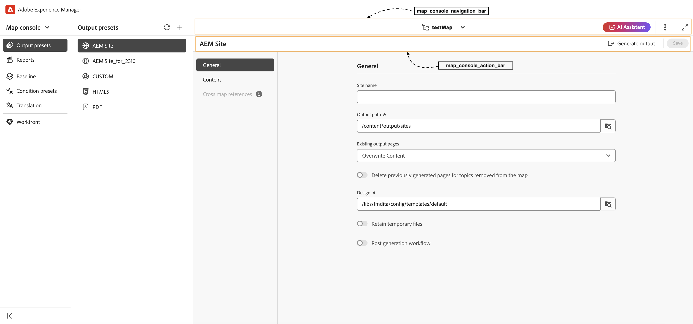

# Visão geral

Ao migrar da interface antiga para a nova interface do AEM Guides, as atualizações do **ui_config** devem ser convertidas em configurações de interface mais flexíveis e modulares. Esta estrutura ajuda a adotar as alterações facilmente na **barra_de_ferramentas_do_editor** e em [outras barras de ferramentas](/help/courses/course-3/conver-ui-config.md#editing-json-for-different-screens). O processo também suporta a modificação de outras visualizações e widgets no aplicativo.


## Edição de JSON para telas diferentes

Arquivos JSON podem ser adicionados à seção Configuração da interface do editor XML para várias telas e widgets. Veja abaixo uma lista de widgets amplamente usados e suas IDs:

1. [editor_toolbar](assets/toolbars/editor_toolbar.json): barra de ferramentas do Webeditor que consiste em ações de arquivo e conteúdo.
1. [editor_tab_bar](assets/toolbars/editor_tab_bar.json): o modo de exibição com guias de arquivos abertos no webeditor possui ações que você pode executar em arquivos abertos.
1. [file_mode_switcher](assets/toolbars/file_mode_switcher.json): ajuda a alternar entre os diferentes modos disponíveis (autor, origem, visualização) para os arquivos abertos no webeditor.

   

1. [map_console_navigation_bar](assets/toolbars/map_console_navigation_bar.json): é a barra de informações do mapa aberto no console do mapa. Permite alterar o mapa e fornece acesso às configurações.
1. [map_console_action_bar](assets/toolbars/map_console_action_bar.json): esta é a barra de ação para itens de console do mapa, como Predefinição de saída, Linha de base, Tradução e Relatórios, que fornece informações relevantes, juntamente com seus respectivos botões de ação.

   

1. [home_navigate_bar](assets/toolbars/home_navigation_bar.json): barra de cabeçalho da página inicial do Guides, onde a mensagem de boas-vindas é exibida junto com o perfil da pasta selecionada.

   

<br>

## Estrutura geral de cada JSON

Cada JSON segue uma estrutura consistente:

1. **id**: especifica o widget em que o componente está sendo personalizado.
1. **targetEditor**: define quando exibir ou ocultar um botão usando as propriedades de editor e de modo:

   Atualmente temos estes **editores** e **modos** em nosso sistema.

   **editor**: ditamap, bookmap, subjectScheme, xml, css, translation, preset, pdf_preset

   **modo**: autor, origem, visualização, sumário, divisão

   (Observação: o modo de sumário se aplica à exibição de layout.)

1. **target**: especifica onde o novo componente será adicionado. Isso usa pares de valores chave ou índices para identificação exclusiva. Os estados de exibição incluem:

   * **anexar**: adicionar no final.

   * **anexar**: adicionar no início.

   * **substituir**: substitui um componente existente.

Exemplo de estrutura JSON:

```json
{
  "id" : "editor_toolbar",
  "view": {
    "items": [
      {
        ...,
        "targetEditor": {
          "mode": [
            "preview"
          ],
          "editor": [
            "xml"
          ]
        },
        "target": {
          "key": "label",
          "value": "Table",
          "viewState": "prepend"
        },
        ...
      },
    ]
  }
}
```

<br>

## Exemplos

Veja abaixo um exemplo de como adicionar, excluir ou substituir um botão na barra de ferramentas do editor.

### Adição de um botão

Adicionando um novo botão **Inserir Tabela Personalizada** em **editor_toolbar** para adicionar uma tabela simples que seja visível somente no modo de visualização.

```json
{
  "id": "editor_toolbar",
  "view": {
    "items": [
      {
        "icon": "table",
        "title": "Insert Custom Table",
        "on-click": {
          "name": "$$AUTHOR_INSERT_ELEMENT",
          "args": [
            "simpletable",
            "table",
            "choicetable"
          ]
        },
        "key": "$$AUTHOR_INSERT_ELEMENT",
        "targetEditor": {
          "mode": [
            "preview"
          ],
        },
        "target": {
          "key": "label",
          "value": "Table",
          "viewState": "prepend"
        }
      }
    ]
  }
}
```


### Excluir um botão

Excluir um botão da barra de ferramentas. Aqui removemos o botão de adição de imagens da barra de ferramentas do editor.

```json
{
  "id": "editor_toolbar",
  "view": {
    "items": [
      {
        "hide": true,
        "target": {
          "key": "label",
          "value": "Image",
          "viewState": "replace"
        }
      }
    ]
  }
}
```

### Substituição de um botão

Substituindo o botão **Multimídia** da barra de ferramentas pelo botão de inserção de link do **Youtube**, que só é visível no modo de autor.

```json
{
  "id": "editor_toolbar",
  "view": {
    "items": [
      {
        "icon": "s2youtube",
        "title": "Youtube",
        "on-click": {
          "name": "$$AUTHOR_INSERT_ELEMENT",
          "args": "<object data='http://youtube.com'></object>"
        },
        "targetEditor": {
          "mode": [
            "author"
          ]
        },
        "target": {
          "key": "elementId",
          "value": "toolbar-multimedia",
          "viewState": "replace"
        }
      }
    ]
  }
}
```


<br>

## Como fazer upload de JSONs personalizados

1. Na guia Configuração do **Editor XML**, clique em **Editar** na barra superior.
1. Agora, na subseção **Configuração da interface do Editor de XML**, você poderá ver um botão **carregar**.

   {width="400" height="150"}

1. Você pode clicar em e fazer upload do json modificado. (O json a ser carregado deve ter o mesmo nome da ID do widget que está sendo personalizado)
1. Depois de carregado, clique em **Salvar** na barra superior.

   Para cada arquivo carregado, você também pode **excluir** o json para remover sua personalização da interface ou **baixar** para exibi-lo ou modificá-lo novamente.

   {width="400" height="150"}

<br>


## Como fazer upload de CSS personalizado

Você também pode adicionar css para personalizar a aparência dos botões adicionados personalizados ou widgets ou botões já existentes na interface do usuário.

Para um botão personalizado recém-adicionado, adicione uma **classe_de_extração** ao botão ou componente personalizado dentro do JSON.
Para uma classe antiga, você também pode inspecionar o elemento e modificar as classes existentes.

```json
{
  "icon": "table",
  "title": "Insert Custom Table",
  "extraclass": "custom-css",
  "key": "$$AUTHOR_INSERT_ELEMENT",
  "targetEditor": {
    "mode": [
      "preview"
    ],
  },
  "target": {
    "key": "label",
    "value": "Table",
    "viewState": "prepend"
  }
}
```

1. Na guia Configuração do **Editor XML**, clique em **Editar** na barra superior.
1. Agora, na subseção **Layout da página do Editor de XML**, você poderá ver um botão **carregar**.

   {width="400" height="150"}

1. Você pode clicar em e fazer upload do css modificado. (Somente arquivos css são suportados)
1. Depois de carregado, clique em **Salvar** na barra superior.

   Para cada arquivo carregado, você também pode **excluir** o css para remover sua personalização da interface ou **baixar** para exibi-lo ou modificá-lo novamente.

   {width="400" height="150"}


<br>

### Exemplo para personalizar o css do botão

Aqui adicionamos um novo botão **Inserir Tabela Personalizada** na **editor_toolbar** para adicionar uma tabela simples que é visível somente no modo de visualização e aplicar um css personalizado a ela.
Esse css modifica o plano de fundo do botão e o tamanho da fonte de seu título.


```css
#editor_toolbar {
  .custom-css {
    background-color: burlywood;
    font-size: 2rem;  
  }
}
```

```json
{
  "id": "editor_toolbar",
  "view": {
    "items": [
      {
        "icon": "table",
        "title": "Insert Custom Table",
        "extraclass": "custom-css",
        ...
      }
    ]
  }
}
```

<br>

## Etapas para converter a configuração da interface do usuário em Json modulares

1. Na tela Navegação, clique no ícone [!UICONTROL **Ferramentas**].

   

1. Selecione **Guias** no painel esquerdo.

1. Clique no bloco [!UICONTROL **Perfis de pasta**].

   

1. Selecione um Perfil de pasta.

1. Clique na guia [!UICONTROL **Configuração do editor XML**].

1. Você pode clicar no botão **Converter configuração da interface para JSON**. Isso gerará o **editor_toolbar** e o **map_console_action_bar** json, que contém as alterações feitas no **ui_config**.

   

1. Você pode fazer check-out da amostra gerada de jsons para a [Barra de ferramentas do editor](assets/editor_toolbar.json) e a [Barra de ação do console de mapa](assets/map_console_action_bar.json)


>[!NOTE]
>
>As alterações feitas nas seções da **barra de ferramentas** e da **barra de ferramentas** foram adicionadas ao json **barra_de_ferramentas_do_editor**, que pode ser visto na página Editor. As alterações feitas nos botões relacionados a Predefinições ou Tradução em **ui_config** são adicionadas ao **map_console_action_bar** json, que pode ser visto na página Console do Mapa.
