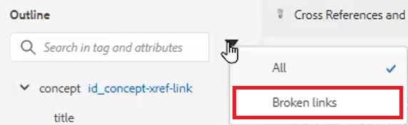

# Referências cruzadas e links

O Editor de XML e o DITA fornecem uma maneira poderosa de vincular tópicos. É importante gerenciar com eficiência as Referências de conteúdo, e isso inclui trabalhar com valores de ID exclusivos.

Os arquivos de exemplo que você pode optar por usar para esta lição são fornecidos no arquivo
[crossreferencesandlinks.zip](assets/crossreferencesandlinks.zip)

>[!VIDEO](https://video.tv.adobe.com/v/342764?quality=12&learn=on)

## Criar uma referência cruzada para um tópico externo

É possível criar uma referência cruzada externa arrastando e soltando um tópico do Repositório em um arquivo aberto. No entanto, para evitar referências cruzadas quebradas, uma ID deve primeiro ser definida como um valor relacionado ao elemento principal. Essa é uma maneira fácil de criar uma referência cruzada, garantindo que as IDs sejam atribuídas corretamente.

1. Abra um arquivo no qual você deseja inserir uma referência cruzada externa.

1. Atribua uma ID ao elemento que será referenciado.

   a. Clique dentro do elemento.

   b. No painel Propriedades de conteúdo, escolha **ID** na lista suspensa Atributo.

   c. Digite um nome lógico no campo Valor.

   d. Visualize o elemento e seu valor em **Modo de Exibição de Estrutura de Tópicos**, se desejado.

1. **Salve** o tópico para garantir que o Repositório tenha a ID atualizada.

1. Clique no ícone [!UICONTROL **Referência**] na barra de ferramentas superior.

   

1. Na guia **Referência de Conteúdo**, selecione o emparelhamento de ID e elemento que deseja inserir como referência cruzada.

1. Clique em [!UICONTROL **Selecionar**].

A referência cruzada foi adicionada ao tópico.

## Link para um site

Você pode inserir um link para um site em qualquer tópico. Para obter mais informações, consulte o vídeo do Curso 1 do AEM Guides sobre Links para sites.

## Exibir links quebrados

Algumas modificações podem resultar em referências cruzadas corrompidas. Isso inclui a exclusão de um tópico, a reorganização de uma seção que contenha uma referência cruzada ou a alteração de uma ID após a inserção da referência cruzada. Observe que um exemplo de tópico _crossreferencesandlinks.zip_ é fornecido com esta lição, o que causará a quebra de várias referências cruzadas com marcadores para conteúdo interno.

1. Navegue até **Modo de Exibição de Estrutura de Tópicos** no painel esquerdo.

1. Clique no ícone [!UICONTROL **Filtro**].

1. Selecione **links desfeitos**.

   

Os links quebrados são exibidos como objetos clicáveis. Você pode identificá-los em texto vermelho no tópico.
