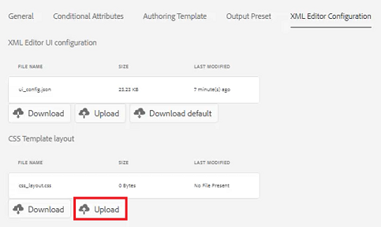
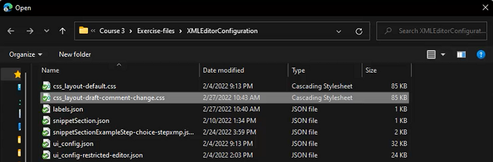

# Configuração do editor XML

Se você trabalhar em um ambiente restritivo, poderá escolher quais recursos seus autores poderão ver personalizando a Configuração do editor em um Perfil de pasta específico. A aplicação desse perfil de pasta pode alterar a aparência do próprio Editor, dos Modelos CSS, dos Trechos disponíveis e dos Rótulos de versão do conteúdo.

Os arquivos de exemplo que você pode optar por usar para esta lição são fornecidos no arquivo [xmleditorconfiguration.zip](assets/xmleditorconfiguration.zip).

>[!VIDEO](https://video.tv.adobe.com/v/342762?quality=12&learn=on)

## Personalizar a configuração padrão da interface do editor

Você sempre pode baixar a configuração padrão da interface do usuário no sistema local, fazer alterações no editor de texto de sua escolha e carregá-la novamente.

1. Na tela Navegação, clique na guia [!UICONTROL **Ferramentas**] ícone.

   

1. Selecionar **Guias** no painel esquerdo.

1. Clique em [!UICONTROL **Perfis de pasta**] bloco.

   

1. Selecione um Perfil de pasta.

1. Clique em [!UICONTROL **Configuração do editor XML**] guia.

1. Clique em [!UICONTROL **Baixar**] Padrão.

   

Agora você pode abrir e modificar o conteúdo em um editor de texto. A variável _Instalação e configuração dos guias de AEM_ O Guia contém exemplos de como remover, personalizar ou adicionar funções à configuração da interface do usuário.

## Fazer upload da configuração da interface do editor XML modificada

Depois de personalizar a configuração da interface, você pode carregá-la. Observe que um exemplo de arquivo de configuração _ui-config-restrict-editor.json_ O é fornecido com o conjunto de tópicos de suporte desta lição.

1. No Perfil de pasta, clique no link [!UICONTROL **Configuração do editor XML**] guia.

1. Em Configuração da interface do Editor XML, clique em [!UICONTROL **Carregar**].

   

1. Clique duas vezes no arquivo de configuração da interface modificada ou, como mostrado aqui, no arquivo de amostra fornecido.

   

1. Clique em [!UICONTROL **Salvar**] no canto superior esquerdo da tela.

Você carregou com êxito a configuração modificada da interface do usuário.

## Personalizar o layout do modelo CSS

Assim como na configuração da interface do usuário, você pode baixar o layout do modelo CSS. Você pode abri-lo em um editor de texto e fazer modificações para personalizar a aparência do tópico antes de fazer upload.

1. Na tela Navegação, clique na guia [!UICONTROL **Ferramentas**] ícone.

   

1. Selecionar **Guias** no painel esquerdo.

1. Clique em [!UICONTROL **Perfis de pasta**] bloco.

   

1. Selecione um Perfil de pasta.

1. Clique em [!UICONTROL **Configuração do editor XML**] guia.

1. No layout Modelo CSS, clique em [!UICONTROL **Baixar**].

   

Agora você pode modificar e salvar o conteúdo CSS em um editor de texto.

## Faça upload do layout do modelo CSS modificado

Depois de personalizar o layout do modelo CSS, você pode carregá-lo. Observe que um arquivo de amostra _css-layout-ONLY-draft-comment-change.css_ O é fornecido com o conjunto de tópicos de suporte desta lição. Esse arquivo contém somente a Alteração de comentário de rascunho, enquanto _css-layout-draft-comment-change.css_ O é o arquivo inteiro, disponível somente para fins de teste ou revisão.

1. No Perfil de pasta, clique no link [!UICONTROL **Configuração do editor XML**] guia.

1. No layout Modelo CSS, clique em [!UICONTROL **Carregar**].

   

1. Clique duas vezes no arquivo para obter seu próprio layout de CSS personalizado ou o arquivo de amostra fornecido mostrado aqui.

   

1. Clique em [!UICONTROL **Salvar**] no canto superior esquerdo da tela.
Você carregou com sucesso o layout de modelo CSS personalizado.

## Editar trechos do editor XML

Os trechos são conteúdos reutilizáveis que podem ser específicos de um produto ou grupo. Observe que os trechos de amostra são fornecidos com os arquivos de suporte desta lição.

1. Na tela Navegação, clique na guia [!UICONTROL **Ferramentas**] ícone.

   

1. Selecionar **Guias** no painel esquerdo.

1. Clique em [!UICONTROL **Perfis de pasta**] bloco.

   

1. Selecione um Perfil de pasta.

1. Clique em [!UICONTROL **Configuração do editor XML**] guia.

1. Em Trechos do editor XML, clique em **Carregar**.

   

1. Escolha seus próprios trechos ou use as amostras fornecidas.

   

1. Clique em [!UICONTROL **Salvar**] no canto superior esquerdo da tela.

Você adicionou com sucesso novos trechos ao editor.

## Personalizar rótulos da versão do conteúdo XML

Por padrão, os autores têm permissão para criar rótulos de sua escolha e associá-los a arquivos de tópico. Isso pode levar a variações diferentes no mesmo rótulo. Para evitar rótulos inconsistentes, também é possível escolher entre listas de rótulos predefinidos.

1. Na tela Navegação, clique na guia [!UICONTROL **Ferramentas**] ícone.

   

1. Selecionar **Guias** no painel esquerdo.

1. Clique em [!UICONTROL **Perfis de pasta**] bloco.

   

1. Selecione um Perfil de pasta.

1. Clique em [!UICONTROL **Configuração do editor XML**] guia.

1. Em Rótulos de versão do conteúdo XML, clique em [!UICONTROL **Baixar**].

   

Agora você está pronto para personalizar os rótulos conforme necessário.

## Fazer upload de rótulos de versão de conteúdo XML

Depois de baixar e modificar os rótulos, você pode fazer upload do tópico Rótulo da versão do conteúdo XML. Você pode optar por usar o arquivo de amostra _labels.json_, forneceu o conjunto de tópicos de suporte para esta lição.

1. No Perfil de pasta, clique no link [!UICONTROL **Configuração do editor XML**] guia.

1. Em Rótulos de versão do conteúdo XML, clique em [!UICONTROL **Carregar**].

   

1. Clique duas vezes no arquivo para obter seus próprios rótulos personalizados ou o arquivo de amostra fornecido mostrado aqui.

   

1. Clique em [!UICONTROL **Salvar**] no canto superior esquerdo da tela.

Você carregou com êxito rótulos de versão de conteúdo XML personalizados.
