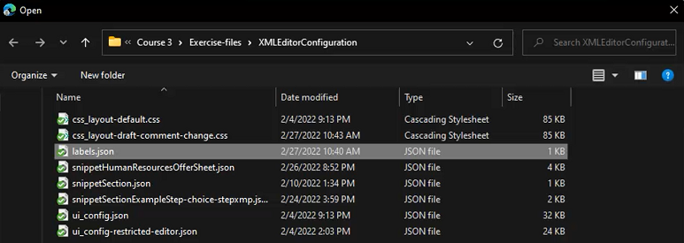

# Configuração do editor XML

Se você trabalhar em um ambiente restritivo, poderá escolher quais recursos seus autores poderão ver ao personalizar a Configuração do editor em um Perfil de pasta específico. A aplicação desse perfil de pasta pode alterar a aparência do próprio editor, dos modelos de CSS, dos trechos disponíveis e dos rótulos da versão de conteúdo.

Os arquivos de amostra que você pode optar por usar para esta lição são fornecidos no arquivo [xmleditorconfiguration.zip](assets/xmleditorconfiguration.zip).

>[!VIDEO](https://video.tv.adobe.com/v/342762)

## Personalizar a configuração padrão da interface do usuário do editor

Você sempre pode baixar a configuração padrão da interface do usuário para o sistema local, fazer alterações nele no editor de texto de sua escolha e carregá-la novamente.

1. Na tela Navegação, clique no botão [!UICONTROL **Ferramentas**] ícone .

   

2. Selecionar **Guias** no painel esquerdo.

3. Clique no botão [!UICONTROL **Perfis de pasta**] mosaico.

   

4. Selecione um Perfil de pasta.

5. Clique no botão [!UICONTROL **Configuração do editor XML**] guia .

6. Clique em [!UICONTROL **Baixar**] Padrão.

   

Agora é possível abrir e modificar o conteúdo em um editor de texto. O _Instalação e configuração dos guias de AEM_ O guia contém amostras de como remover, personalizar ou adicionar funções à configuração da interface do usuário.

## Fazer upload da configuração da interface do usuário do editor XML modificada

Após personalizar a configuração da interface do usuário, você pode carregá-la. Observe que um exemplo de arquivo de configuração _ui-config-restrict-editor.json_ O é fornecido com o conjunto de tópicos de suporte para esta lição.

1. No Perfil da pasta, clique no botão [!UICONTROL **Configuração do editor XML**] guia .

2. Em Configuração da interface do usuário do Editor XML, clique em [!UICONTROL **Upload**].

   

3. Clique duas vezes no arquivo para a configuração da interface do usuário modificada ou, como mostrado aqui, no arquivo de amostra fornecido.

   

4. Clique em [!UICONTROL **Salvar**] no canto superior esquerdo da tela.

Você carregou com êxito a configuração da interface do usuário modificada.

## Personalizar o layout do modelo CSS

Assim como na configuração da interface do usuário, você pode baixar o layout do modelo CSS. Você pode abri-lo em um editor de texto e fazer modificações para personalizar a aparência do seu tópico antes de fazer upload.

1. Na tela Navegação, clique no botão [!UICONTROL **Ferramentas**] ícone .

   

2. Selecionar **Guias** no painel esquerdo.

3. Clique no botão [!UICONTROL **Perfis de pasta**] mosaico.

   

4. Selecione um Perfil de pasta.

5. Clique no botão [!UICONTROL **Configuração do editor XML**] guia .

6. Em Layout de modelo CSS, clique em [!UICONTROL **Baixar**].

   

Agora é possível modificar e salvar o conteúdo de CSS em um editor de texto.

## Fazer upload do layout de modelo CSS modificado

Após personalizar o layout do Modelo de CSS, é possível carregá-lo. Observe que um arquivo de amostra _css-layout-ONLY-rascunho-comment-change.css_ O é fornecido com o conjunto de tópicos de suporte para esta lição. Este arquivo contém somente a Alteração de comentário de rascunho, enquanto _css-layout-rascunho-comment-change.css_ O é o arquivo inteiro, disponível somente para testes ou revisões.

1. No Perfil da pasta, clique no botão [!UICONTROL **Configuração do editor XML**] guia .

2. Em Layout de modelo CSS, clique em [!UICONTROL **Upload**].

   

3. Clique duas vezes no arquivo para obter seu próprio layout CSS personalizado ou o arquivo de amostra fornecido mostrado aqui.

   

4. Clique em [!UICONTROL **Salvar**] no canto superior esquerdo da tela.
Você carregou com êxito o layout personalizado do Modelo de CSS.

## Editar trechos do editor XML

Os trechos são partes reutilizáveis do conteúdo que podem ser específicas de um produto ou grupo. Observe que os trechos de amostra são fornecidos com os arquivos de suporte para esta lição.

1. Na tela Navegação, clique no botão [!UICONTROL **Ferramentas**] ícone .

   

2. Selecionar **Guias** no painel esquerdo.

3. Clique no botão [!UICONTROL **Perfis de pasta**] mosaico.

   

4. Selecione um Perfil de pasta.

5. Clique no botão [!UICONTROL **Configuração do editor XML**] guia .

6. Em Snippets do editor XML, clique em **Upload**.

   

7. Escolha seus próprios Snippets ou use as amostras fornecidas.

   

8. Clique em [!UICONTROL **Salvar**] no canto superior esquerdo da tela.

Você adicionou novos Snippets com êxito ao Editor.

## Personalizar rótulos de versão de conteúdo XML

Por padrão, os autores têm permissão para criar rótulos de sua escolha e associá-los a arquivos de tópico. Isso pode levar a variações diferentes no mesmo rótulo. Para evitar rótulos inconsistentes, você também pode escolher entre listas de rótulos predefinidos.

1. Na tela Navegação, clique no botão [!UICONTROL **Ferramentas**] ícone .

   

2. Selecionar **Guias** no painel esquerdo.

3. Clique no botão [!UICONTROL **Perfis de pasta**] mosaico.

   

4. Selecione um Perfil de pasta.

5. Clique no botão [!UICONTROL **Configuração do editor XML**] guia .

6. Em Rótulos de versão do conteúdo XML, clique em [!UICONTROL **Baixar**].

   

Agora você está pronto para personalizar as etiquetas, conforme necessário.

## Fazer upload de rótulos de versão de conteúdo XML

Após baixar e modificar os rótulos, é possível fazer upload do tópico Rótulo da versão do conteúdo XML . Você pode optar por usar o arquivo de amostra _labels.json_, fornecido com o conjunto de tópicos de suporte para esta lição.

1. No Perfil da pasta, clique no botão [!UICONTROL **Configuração do editor XML**] guia .

2. Em Rótulos de versão do conteúdo XML, clique em [!UICONTROL **Upload**].

   

3. Clique duas vezes no arquivo para seus próprios rótulos personalizados ou no arquivo de amostra fornecido mostrado aqui.

   

4. Clique em [!UICONTROL **Salvar**] no canto superior esquerdo da tela.

Você carregou com êxito os Rótulos de versão de conteúdo XML personalizados.
