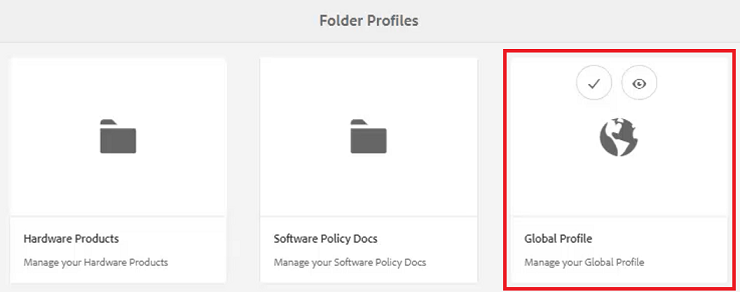
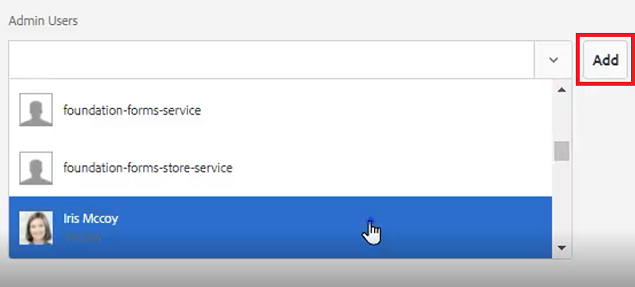
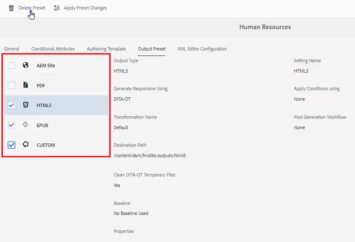
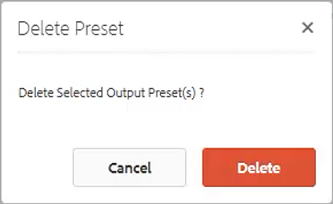
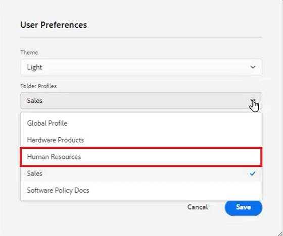

# Perfis de pasta

O AEM fornece acesso rápido às ferramentas de configuração. Ao personalizar Perfis de pasta, diferentes departamentos ou produtos podem ter modelos exclusivos, ambientes de criação, perfis de atributos condicionais, Snippets ou até mesmo configurações do Editor da Web.

Os arquivos de amostra que você pode optar por usar para esta lição são fornecidos no arquivo [folderprofiles.zip](assets/folderprofiles.zip).

>[!VIDEO](https://video.tv.adobe.com/v/342758?quality=12&learn=on)

## Perfis de pasta de acesso

As configurações são gerenciadas por meio do ícone Perfis de pasta .

1. Na tela Navegação, clique no botão [!UICONTROL **Ferramentas**] ícone .

   

2. Selecionar **Guias** no painel esquerdo.

3. Clique no botão [!UICONTROL **Perfis de pasta**] mosaico.

   

4. Selecione o perfil desejado. Por exemplo, escolha **Perfil global**, que é o perfil padrão.

   

## Editar atributos condicionais no perfil global

Após acessar o Perfil global, você pode editar sua configuração. As configurações do Perfil global são aplicadas a todos os usuários, a menos que especificado de outra forma.

1. No Perfil global, selecione o **Atributos condicionais** guia .

2. Clique em [!UICONTROL **Editar**] no canto superior esquerdo da tela.

   

3. Clique em [!UICONTROL **Adicionar**].

4. Preencha o **Nome**, **Valor** e **Rótulo** campos para a nova condição.

   

5. Clique em [!UICONTROL **Salvar**] no canto superior esquerdo da tela.
A nova condição agora está disponível para todos os usuários. Você pode selecioná-lo no painel Propriedades de conteúdo e aplicá-lo ao conteúdo, conforme necessário.

## Criar um novo perfil de pasta

Além do Perfil global padrão, você pode criar seus próprios perfis personalizados.

1. Na tela Navegação, clique no botão [!UICONTROL **Ferramentas**] ícone .

   

2. Selecionar **Guias** no painel esquerdo.

3. Clique no botão [!UICONTROL **Perfis de pasta**] mosaico.

   

4. Clique em [!UICONTROL **Criar**].

5. Na caixa de diálogo Criar perfil de pasta .

   a. Dê um nome ao perfil.

   b. Especifique um caminho.

   c. Clique [!UICONTROL **Criar**].

   

Um bloco com o novo nome de perfil é exibido na página Perfis de pasta .

## Adicionar usuários administrativos na guia Geral

Os usuários administrativos têm direitos para atualizar os Atributos condicionais, o Modelo de criação e as Predefinições de saída do Perfil da pasta.

1. Clique no bloco para abrir o Perfil de pasta desejado.

   

2. Selecione o **Geral** guia .

3. Clique em [!UICONTROL **Editar**] na parte superior esquerda da tela.

4. Em Usuários administradores, selecione um usuário na lista suspensa ou digite o nome de um usuário.

5. Clique em [!UICONTROL **Adicionar**].

   Você pode adicionar vários usuários administradores, se necessário.

   

6. Clique em [!UICONTROL **Salvar**] no canto superior direito da tela, quando todos os usuários tiverem sido adicionados.

Os usuários administrativos agora são atribuídos a este perfil.

## Adicionar um novo público-alvo na guia Atributos condicionais

Após acessar o Perfil global, você pode editar sua configuração. As configurações do Perfil global são aplicadas a todos os usuários, a menos que especificado de outra forma.

1. No Perfil de pasta desejado, selecione o **Atributos condicionais** guia .

2. Clique em [!UICONTROL **Editar**] no canto superior esquerdo da tela.

   

3. Clique em [!UICONTROL **Adicionar**].

4. Preencha o **Nome**, **Valor** e **Rótulo** campos para a nova condição.

   Clicar no [!UICONTROL **Plus**] permite adicionar pares de Valor e Rótulo adicionais para o atributo nomeado.

   

5. Clique em [!UICONTROL **Salvar**] no canto superior esquerdo da tela.

Os novos Atributos condicionais foram adicionados a este perfil.

## Escolha um modelo e mapa na guia Modelos de criação

AEM Guias vem com modelos e mapas de criação prontos para uso. Você pode restringi-los a autores específicos. Por padrão, os modelos são armazenados no local Ativos em uma pasta de modelos DITA.

1. No Perfil de pasta desejado, selecione a guia Modelos de criação .

2. Clique em Editar no canto superior esquerdo da tela.

3. Adicionar um modelo de mapa.

   a. No **Modelos de mapa** selecione uma opção nos mapas disponíveis.

   b. Clique em [!UICONTROL **Adicionar**].

   

4. Adicionar um modelo de tópico.

   a. No **Modelos de tópico** selecione uma opção nos modelos disponíveis.

   

5. Clique em [!UICONTROL **Adicionar**].

6. Adicione outros Modelos de tópico, conforme necessário.

7. Quando terminar, clique em [!UICONTROL **Salvar**] na parte superior esquerda da tela.

Os novos Modelos de criação foram adicionados a este perfil.

## Excluir predefinições não essenciais da guia Predefinições de saída

Você pode configurar cada Predefinição de saída com base no Perfil da pasta. As predefinições de saída que não são necessárias devem ser removidas.

1. No Perfil de pasta desejado, selecione o **Predefinições de saída** guia .

2. No painel esquerdo, marque as caixas de seleção de todas as predefinições que não são necessárias.

   

3. Clique em [!UICONTROL **Excluir predefinição**] no canto superior esquerdo da tela.

4. Na caixa de diálogo Excluir predefinição, clique em [!UICONTROL **Excluir**].

   

Agora, as únicas predefinições de saída exibidas são aquelas que serão usadas.

## Fazer upload de um trecho da guia Configuração do editor XML

1. No Perfil de pasta desejado, selecione o **Configuração do editor XML** guia .

2. Em Snippets do editor XML, clique em [!UICONTROL **Upload**].

   

3. Navegue até um trecho criado anteriormente.

4. Clique em [!UICONTROL **Abrir**].

5. Clique em [!UICONTROL **Salvar**] na parte superior esquerda da tela.

Modificou com êxito a Configuração do Editor para incluir Snippets.

## Especificar o Perfil da Pasta no Repositório

No Editor, você pode ver os resultados das modificações feitas nos Perfis de pasta.

1. Navegar para **Exibição do Repositório**.

2. Clique na pasta do conteúdo com o qual deseja trabalhar.

3. Clique no botão [!UICONTROL **Preferências do usuário**] na barra de ferramentas superior.

   

4. Na caixa de diálogo Preferências do usuário, selecione o Perfil de pasta desejado na lista suspensa.

   

5. Clique em [!UICONTROL **Salvar**].

Você aplicou o Perfil da pasta ao seu conteúdo. Agora, ao criar um novo tópico do DITA, você verá uma lista restrita de tipos de tópicos com base no Perfil da pasta. A Condição de público-alvo contém as configurações globais, bem como aquelas específicas para o Perfil da pasta. O arquivo Snippets que você carregou criou um conjunto de Snippets padrão para escolher. O painel Mapa exibe as Predefinições de saída restritas.
