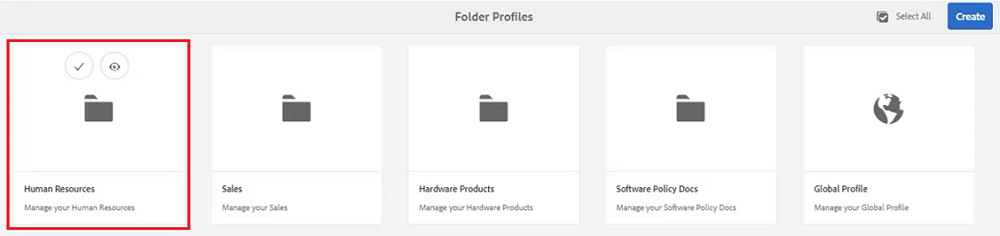

# Perfis de pasta

O AEM fornece acesso rápido às ferramentas de configuração. Com a personalização dos Perfis de pasta, diferentes departamentos ou produtos podem ter modelos exclusivos, ambientes de criação, perfis de atributo condicional, trechos ou até mesmo configurações do Editor da Web.

Os arquivos de exemplo que você pode optar por usar nesta lição são fornecidos no arquivo [folderprofiles.zip](assets/folderprofiles.zip).

>[!VIDEO](https://video.tv.adobe.com/v/342758?quality=12&learn=on)

## Acessar perfis de pasta

As configurações são gerenciadas por meio do ícone Perfis de pasta.

1. Na tela Navegação, clique no ícone [!UICONTROL **Ferramentas**].

   

1. Selecione **Guias** no painel esquerdo.

1. Clique no bloco [!UICONTROL **Perfis de pasta**].

   

1. Selecione o perfil desejado. Por exemplo, escolha **Perfil Global**, que é o perfil padrão.

   

## Editar atributos condicionais no perfil global

Depois de acessar o Perfil global, você pode editar sua configuração. As configurações de Perfil global são aplicadas a todos os usuários, a menos que especificado de outra forma.

1. No Perfil Global, selecione a guia **Atributos Condicionais**.

1. Clique em [!UICONTROL **Editar**] no canto superior esquerdo da tela.

   

1. Clique em [!UICONTROL **Adicionar**].

1. Preencha os campos **Nome**, **Valor** e **Rótulo** para a nova condição.

   

1. Clique em [!UICONTROL **Salvar**] no canto superior esquerdo da tela.
A nova condição agora está disponível para todos os usuários. Você pode selecioná-la no painel Propriedades de conteúdo e aplicá-la ao conteúdo conforme necessário.

## Criar um novo perfil de pasta

Além do Perfil global padrão, você pode criar seus próprios perfis personalizados.

1. Na tela Navegação, clique no ícone [!UICONTROL **Ferramentas**].

   

1. Selecione **Guias** no painel esquerdo.

1. Clique no bloco [!UICONTROL **Perfis de pasta**].

   

1. Clique em [!UICONTROL **Criar**].

1. Na caixa de diálogo Criar perfil da pasta.

   a. Nomeie o perfil.

   b. Especifique um caminho.

   c. Clique em [!UICONTROL **Criar**].

   

Um bloco com o novo nome de perfil é exibido na página Perfis de pasta.

## Adicionar usuários administrativos na guia Geral

Os usuários administrativos têm o direito de atualizar os Atributos condicionais, o Modelo de criação e as Predefinições de saída para o Perfil da pasta.

1. Clique no bloco para abrir o Perfil de pasta desejado.

   

1. Selecione a guia **Geral**.

1. Clique em [!UICONTROL **Editar**] na parte superior esquerda da tela.

1. Em Usuários administradores, selecione um usuário na lista suspensa ou digite o nome de um usuário.

1. Clique em [!UICONTROL **Adicionar**].

   Você pode adicionar vários usuários administradores, se necessário.

   

1. Clique em [!UICONTROL **Salvar**] no canto superior direito da tela quando todos os usuários forem adicionados.

Os usuários administrativos agora estão atribuídos a este perfil.

## Adicionar um novo público-alvo na guia Atributos condicionais

Depois de acessar o Perfil global, você pode editar sua configuração. As configurações de Perfil global são aplicadas a todos os usuários, a menos que especificado de outra forma.

1. Dentro do Perfil de Pasta desejado, selecione a guia **Atributos Condicionais**.

1. Clique em [!UICONTROL **Editar**] no canto superior esquerdo da tela.

   

1. Clique em [!UICONTROL **Adicionar**].

1. Preencha os campos **Nome**, **Valor** e **Rótulo** para a nova condição.

   Clicar no sinal de [!UICONTROL **Mais**] permite adicionar outros pares de Valor e Rótulo ao atributo nomeado.

   

1. Clique em [!UICONTROL **Salvar**] no canto superior esquerdo da tela.

Os novos Atributos condicionais foram adicionados a esse perfil.

## Escolha um modelo e um mapa na guia Modelos de Criação

O AEM Guides vem com modelos e mapas de criação prontos para uso. É possível restringi-los a autores específicos. Por padrão, os modelos são armazenados no local do Assets em uma pasta de modelos DITA.

1. Dentro do Perfil de Pasta desejado, selecione a guia Criação de Modelos.

1. Clique em Editar no canto superior esquerdo da tela.

1. Adicionar um modelo de mapa.

   a. Na lista suspensa **Modelos de Mapa**, selecione uma opção nos mapas disponíveis.

   b. Clique em [!UICONTROL **Adicionar**].

   

1. Adicione um Modelo de Tópico.

   a. Na lista suspensa **Modelos de Tópico**, selecione uma opção nos modelos disponíveis.

   

1. Clique em [!UICONTROL **Adicionar**].

1. Adicione modelos de tópico adicionais, conforme necessário.

1. Quando terminar, clique em [!UICONTROL **Salvar**] na parte superior esquerda da tela.

Os novos Modelos de criação foram adicionados a este perfil.

## Excluir predefinições não essenciais da guia Predefinições de saída

Você pode configurar cada predefinição de saída com base no Perfil de pasta. As Predefinições de saída que não são necessárias devem ser removidas.

1. Dentro do Perfil de Pasta desejado, selecione a guia **Predefinições de Saída**.

1. No painel esquerdo, marque as caixas de seleção de todas as predefinições não necessárias.

   

1. Clique em [!UICONTROL **Excluir predefinição**] no canto superior esquerdo da tela.

1. Na caixa de diálogo Excluir predefinição, clique em [!UICONTROL **Excluir**].

   

Agora, as únicas Predefinições de saída exibidas são aquelas que serão usadas.

## Fazer upload de um trecho da guia Configuração do editor XML

1. Dentro do Perfil de Pasta desejado, selecione a guia **Configuração do Editor XML**.

1. Em Trechos do Editor XML, clique em [!UICONTROL **Carregar**].

   

1. Navegue até um trecho criado anteriormente.

1. Clique em [!UICONTROL **Abrir**].

1. Clique em [!UICONTROL **Salvar**] na parte superior esquerda da tela.

Você modificou com sucesso a Configuração do editor para incluir trechos.

## Especificar o perfil da pasta no repositório

No Editor, você pode ver os resultados das modificações feitas nos Perfis de pasta.

1. Navegue até **Exibição do Repositório**.

1. Clique na pasta do conteúdo com o qual deseja trabalhar.

1. Clique no ícone [!UICONTROL **Preferências do Usuário**] na barra de ferramentas superior.

   

1. Na caixa de diálogo Preferências do usuário, selecione o Perfil de pasta desejado na lista suspensa.

   

1. Clique em [!UICONTROL **Salvar**].

Você aplicou o Perfil de pasta ao seu conteúdo. Agora, ao criar um novo tópico DITA, você verá uma lista restrita de tipos de tópicos com base no Perfil da pasta. A Condição de público-alvo contém as configurações Globais, bem como as específicas do Perfil de pasta. O arquivo de trechos que você carregou criou um conjunto de trechos padrão para sua escolha. O Painel do Mapa exibe as Predefinições de Saída restritas.
