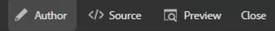
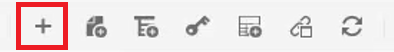

# Teclas

Diferentes conjuntos de materiais podem conter informações semelhantes que precisam ser personalizadas em lugares selecionados. As chaves permitem incluir informações variáveis no ao trabalhar com DITA.

Os arquivos de amostra que você pode optar por usar para esta lição são fornecidos no arquivo [keys.zip](assets/keys.zip).

>[!VIDEO](https://video.tv.adobe.com/v/342756?quality=12&learn=on)

## Ativar chaves

1. Faça upload do conjunto de arquivos de amostra fornecidos.

   a. Carregue o arquivo zip.

   b. Atualize o ambiente de AEM.

   c. Selecione o arquivo para extração.

   

   d. Clique em [!UICONTROL **Extrair arquivo**] na barra de ferramentas superior.

   

   e. Na caixa de diálogo, escolha o local específico para que os arquivos sejam extraídos, como uma pasta chamada Keys.

   f. Clique em [!UICONTROL **Próximo**].

   g. Ignore quaisquer conflitos, pois eles não existirão para o conteúdo que nunca foi carregado antes.

   h. Selecionar [!UICONTROL **Extract**] na parte superior direita da tela.

1. Quando a extração estiver concluída, clique em [!UICONTROL **Vá para a pasta de destino**].

   

## Resolver chaves aos valores referenciados

Para usar corretamente as Chaves, as Preferências do usuário devem fazer referência a um mapa específico como o Mapa de raiz. Dentro desse mapa há uma coleção de Keys, agrupadas dentro de um grupo de tópicos. Abrir o mapa e os tópicos resolvem as Chaves para os valores aos quais esse mapa faz referência.

1. Especifique um Mapa de Raiz.

   a. Na tela Keys (Chaves), abra um mapa.

   b. Configurar preferências de usuário.

   c. Clique no botão [!UICONTROL **Preferências do usuário**] na barra de ferramentas superior.

   

   d. Clique no ícone de chave para especificar uma **Mapa raiz** que será usada para resolver chaves.

   e. Marque as caixas de seleção de qualquer ativo desejado.

   

   f. Clique em [!UICONTROL **Selecionar**].

   g. **Salvar** as Preferências do usuário.

1. Navegue até o **Exibição do mapa**.

1. Abra o mapa especificado.

As Chaves são resolvidas.

## Adicionar uma nova tecla manualmente

1. Abra um mapa com um mapa raiz especificado.

1. Selecione uma Chave.

   

1. Insira uma nova tecla de def.

   a. Clique em um local válido no mapa.

   b. Selecione o **Keydef** na barra de ferramentas superior.

   

   c. Na caixa de diálogo Inserir Keydef, insira um valor exclusivo para Teclas que faça sentido para a definição que você está criando.

   d. Clique em [!UICONTROL **Inserir**].

1. Adicione topicmeta no keydef.

   a. Clique no botão [!UICONTROL **Inserir elemento**] na barra de ferramentas superior.

   

   b. Na caixa de diálogo Inserir elemento, pesquise e selecione &quot;topicmeta&quot;.

1. Adicione palavras-chave dentro da meta de tópicos.

   a. Clique no botão [!UICONTROL **Inserir elemento**] na barra de ferramentas superior.

   

   b. Na caixa de diálogo Inserir elemento, pesquise e selecione &quot;palavras-chave&quot;.

1. Adicione uma palavra-chave dentro da meta de tópicos.

   a. Clique no botão [!UICONTROL **Inserir elemento**] na barra de ferramentas superior.

   

   b. No **Inserir elemento** , pesquise e selecione &quot;palavra-chave&quot;

1. Digite o valor da palavra-chave na palavra-chave.

No mapa, seu keydef agora deve ser semelhante a:

## Configurar um keydef como um trecho

Os trechos são pequenos fragmentos de conteúdo que podem ser reutilizados em vários tópicos do seu projeto de documentação. Em vez de gerar manualmente cada keydef, você pode configurar um único keydef como um trecho.

1. Selecione um elemento keydef no mapa.

1. No menu contextual, clique em [!UICONTROL **Criar trecho**].

1. Na caixa de diálogo Novo trecho , adicione um Título e uma Descrição.
Também é possível remover as definições de palavras-chave ou teclas existentes do Conteúdo.

1. Clique em [!UICONTROL **Criar**].

1. No painel esquerdo, selecione **Trechos**.

1. Arraste e solte o trecho que acabou de criar do painel Snippets para o mapa.

1. Atualize a keydef conforme necessário usando Propriedades do conteúdo.
Quando salvo e atualizado, esse conjunto de chaves estará disponível para qualquer usuário que tenha definido um mapa que contenha o mesmo mapa raiz.
