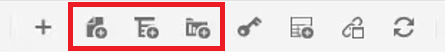
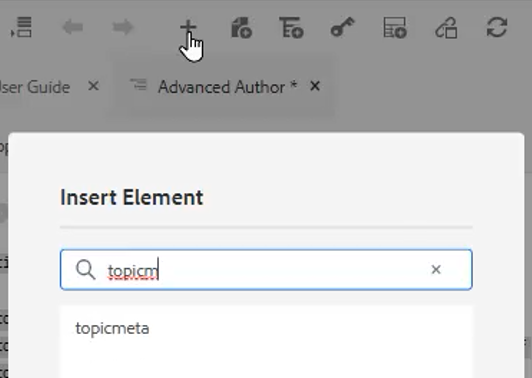

# Mapas e livros

O Editor de mapa dos guias do Adobe Experience Manager permite criar e editar arquivos de mapa. Com o Editor de mapa, você pode editar dois tipos de arquivos: mapa DITA e mapa de livros. Para nós, consideremos que estes são conceitos amplamente intercambiáveis.
O Editor de mapa vem em dois modos: o Editor de mapa básico e o Editor de mapa avançado.

>[!VIDEO](https://video.tv.adobe.com/v/342766)

## Criar um mapa

AEM Guias fornece dois modelos de mapa prontos para uso — mapa DITA e bookmap. Você também pode criar seus próprios modelos de mapa e compartilhá-los com seus autores para criar arquivos de mapa.

Execute as etapas a seguir para criar um arquivo de mapa.

1. Na interface do usuário do Assets, navegue até o local em que deseja criar o arquivo de mapa.

2. Clique em [!UICONTROL **Criar > Mapa DITA**].

3. Na página Blueprint, selecione o tipo de modelo de mapa que deseja usar e clique em [!UICONTROL **Próximo**].

4. Na página Propriedades , insira um **Título** e **Nome** para o mapa.

5. Clique em [!UICONTROL **Criar**].

## Abrir um mapa com o Editor de mapa avançado

1. No **Interface do usuário do Assets**, selecione o mapa a ser editado.

2. Clique em [!UICONTROL **Editar tópicos**].

   

Ou

1. Passe o mouse sobre o ícone do mapa.

2. Selecionar **Editar tópicos** do **Ação** menu.

## Adição de conteúdo a um mapa ou mapa de favoritos

1. Navegue até o **Exibição do Repositório**.

2. Arraste e solte o conteúdo da Visualização de Repositório em locais válidos no mapa ou no bookmap.

Ou

1. Clique em um local válido no mapa ou no mapa de favoritos.

2. Clique no botão [!UICONTROL **Ícone da barra de ferramentas**] para adicionar capítulos, tópicos ou tópicos.

   

3. Escolha um ou mais Ativos que deseja adicionar.

4. Clique em [!UICONTROL **Selecionar**].

### Promover ou rebaixar elementos em um mapa

Use **Setas da barra de ferramentas** para promover ou rebaixar capítulos e tópicos em um mapa ou mapa de reservas.

1. Selecione um elemento no mapa.

2. Clique no botão [!UICONTROL **Seta para a esquerda**] para promover um topicref para um capítulo, ou o [!UICONTROL **Seta para a direita**] para rebaixar um capítulo a um topicref.

   

3. Salve e versão do mapa, se necessário.

Ou

1. Arraste e solte elementos para reorganizá-los.

## Adição de metadados a um mapa

1. No **Barra de ferramentas Mapa**, insira um topicgroup.

   

2. Clique no botão [!UICONTROL **Ícone de adição**] para inserir elementos.

3. Escolha os elementos a serem inseridos.

   

4. Clique em [!UICONTROL **Fechar**].

## Adicionar uma tabela a um mapa

Uma tabela relável pode ser adicionada após um mapa ser estruturado.

1. Clique no mapa onde deseja inserir a tabela.

2. Use o **Ícone da barra de ferramentas** para adicionar a tabela relacionada ao mapa.

   

3. Configure a caixa de diálogo.

4. Clique em [!UICONTROL **Inserir**].

5. Arraste e solte os tópicos necessários do **Repositório** para a tabela.

6. Copie e cole os elementos necessários do mapa no Reltable usando os atalhos de teclado padrão.

## Atribuir atributos a topicrefs em um mapa

1. Realce um topicref ou uma coleção aninhada de topicrefs no mapa.

2. Em Outros atributos no painel Propriedades de conteúdo, escolha uma **Atributo** e **Valor.**

   
