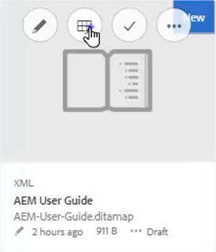
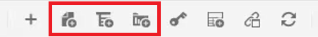
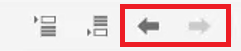
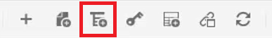
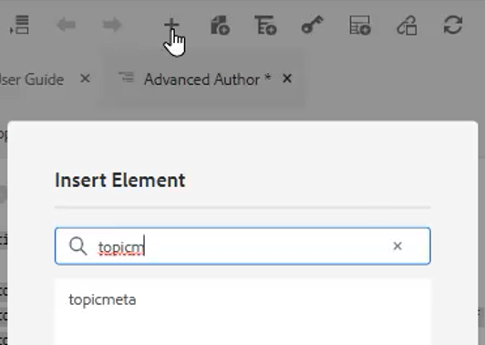
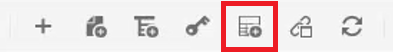
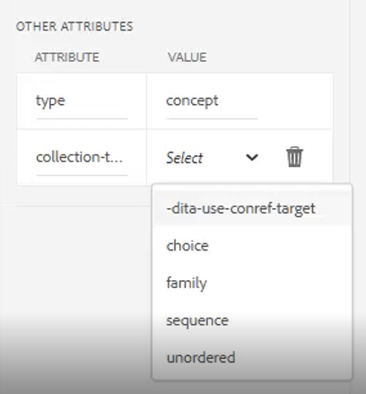

# Mapas e Livros

O Editor de mapas do Adobe Experience Manager Guides permite criar e editar arquivos de mapa. Com o Editor de mapas, você pode editar dois tipos de arquivos: mapa DITA e mapa. Para nossos propósitos, considere que esses conceitos são amplamente intercambiáveis.
O Editor de Mapas vem em dois modos: o Editor de Mapas Básico e o Editor de Mapas Avançado.

>[!VIDEO](https://video.tv.adobe.com/v/342766?quality=12&learn=on)

## Criar um mapa

O AEM Guides fornece dois modelos de mapa prontos para uso — mapa DITA e mapa. Você também pode criar seus próprios modelos de mapa e compartilhá-los com seus autores para criar arquivos de mapa.

Execute as seguintes etapas para criar um arquivo de mapa.

1. Na interface do usuário do Assets, navegue até o local em que deseja criar o arquivo de mapa.

1. Clique em [!UICONTROL **Criar > Mapa DITA**].

1. Na página Blueprint, selecione o tipo de modelo de mapa que deseja usar e clique em [!UICONTROL **Próximo**].

1. Na página Propriedades, digite um **Título** e um **Nome** para o mapa.

1. Clique em [!UICONTROL **Criar**].

## Abrir um mapa com o Editor de mapa avançado

1. Na **interface do Assets**, selecione o mapa a ser editado.

1. Clique em [!UICONTROL **Editar tópicos**].

   

Ou

1. Passe o mouse sobre o ícone do mapa.

1. Selecione **Editar tópicos** no menu **Ação**.

## Adição de conteúdo a um mapa ou bookmap

1. Navegue até **Exibição do Repositório**.

1. Arraste e solte o conteúdo da Exibição do repositório em locais válidos no mapa ou mapa.

Ou

1. Clique em um local válido dentro do mapa ou mapa.

1. Clique no [!UICONTROL **Ícone da barra de ferramentas**] apropriado para adicionar capítulos, tópicos ou referências de tópicos.

   

1. Escolha um ou mais Assets que deseja adicionar.

1. Clique em [!UICONTROL **Selecionar**].

### Promover ou rebaixar elementos em um mapa

Use as **Setas da Barra de Ferramentas** para promover ou rebaixar capítulos e referências de tópicos em um mapa ou mapa.

1. Selecione um elemento no mapa.

1. Clique na [!UICONTROL **Seta para a Esquerda**] para promover topicref a um capítulo ou na [!UICONTROL **Seta para a Direita**] para rebaixar um capítulo para topicref.

   

1. Salve e crie a versão do mapa, se necessário.

Ou

1. Arraste e solte elementos para reorganizá-los.

## Adição de metadados a um mapa

1. Na **Barra de Ferramentas do Mapa**, insira um grupo de tópicos.

   

1. Clique no [!UICONTROL **ícone de adição**] para inserir elementos.

1. Escolha os elementos a serem inseridos.

   

1. Clique em [!UICONTROL **Fechar**].

## Adição de um relacionável a um mapa

Um reltable pode ser adicionado depois que um mapa é estruturado.

1. Clique no mapa onde deseja inserir o relacionável.

1. Use o **Ícone da Barra de Ferramentas** para adicionar o relacionado ao mapa.

   

1. Configure a caixa de diálogo.

1. Clique em [!UICONTROL **Inserir**].

1. Arraste e solte os tópicos necessários do **Repositório** no relacionável.

1. Copie e cole os elementos necessários do mapa no relacionável usando atalhos de teclado padrão.

## Designar atributos a topicrefs em um mapa

1. Realce um topicref ou uma coleção aninhada de topicref no mapa.

1. Em Outros Atributos, no painel Propriedades do Conteúdo, escolha um **Atributo** e seu **Valor.**

   
