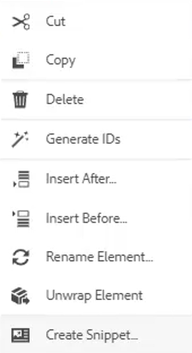
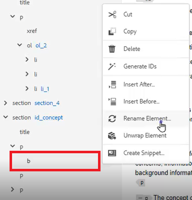

# Modo de Estrutura de Tópicos

A Exibição de estrutura de tópicos fornece uma ampla variedade de suporte ao trabalhar com um documento estruturado. Expanda e recolha a exibição, navegue pela estrutura, trabalhe com Atributos (por exemplo, para criar uma nova ID) e reorganize, decomponha e reestruture elementos com apenas um clique.

>[!VIDEO](https://video.tv.adobe.com/v/342767?quality=12&learn=on)

## Expandir e recolher a Exibição de Estrutura de Tópicos

Os elementos podem ser expandidos para mostrar elementos secundários ou recolhidos conforme necessário.

1. Clique no ícone apropriado para expandir ou recolher a Exibição de Estrutura de Tópicos.

   

   

A exibição de estrutura de tópicos alterna de expandida para recolhida.

## Navegar usando a Exibição de Estrutura de Tópicos

1. Clique em qualquer elemento para ir até esse local.

1. Clique nas [!UICONTROL **Reticências**] ao lado de um elemento para acessar as opções de atalho.

   

## Atribuir uma ID usando a Exibição de Estrutura de Tópicos

Uma nova ID pode ser gerada automaticamente com base na configuração do sistema. Usando as Propriedades de conteúdo, a ID e seu Valor também podem ser atualizados, se necessário.

1. Clique nas [!UICONTROL **Reticências**] ao lado de qualquer elemento.

1. Escolha **Gerar IDs**.

   

A ID é atribuída. As atualizações das Propriedades de conteúdo e as informações do elemento e do atributo são exibidas.

## Reorganizar elementos usando arrastar e soltar

Os elementos podem ser reordenados na Visualização de estrutura de tópicos.

1. Clique e arraste um elemento para outro local na Exibição de Estrutura de Tópicos.

1. Solte o elemento sobre outro elemento para substituí-lo. Essa ação é indicada por uma caixa quadrada ao redor do elemento a ser substituído.

   Ou

   Solte o elemento entre dois outros elementos para alterar seu local. Essa ação é indicada por uma linha entre elementos onde o novo elemento será descartado.

## Renomear um elemento

1. Selecione o elemento.

1. Clique nas [!UICONTROL **Reticências**].

1. Selecione **Renomear Elemento**.

   

1. Clique duas vezes em um novo nome de elemento.

O elemento foi renomeado.

## Decodificar um elemento

1. Selecione o elemento que deseja decodificar.

1. Clique nas [!UICONTROL **Reticências**].

1. Selecione [!UICONTROL **Decodificar elemento**].

O conteúdo permanece, mas a estrutura foi removida.

## Filtrar conteúdo usando a Exibição de estrutura de tópicos

1. Clique no ícone [!UICONTROL **Filtro**] ao lado da barra de pesquisa no Modo de Exibição de Estrutura de Tópicos.

   

1. Escolha **Todos** para mostrar todos os elementos ou **Links desfeitos** para localizar e corrigir referências desfeitas.

## Pesquisar com Modo de Exibição de Estrutura de Tópicos

Uma pesquisa pode ser restrita e retornar resultados com base em um elemento, atributo ou valor.

1. Digite o nome do elemento que você deseja localizar na barra de pesquisa.

   

1. Escolha o resultado mais relevante para suas necessidades.
