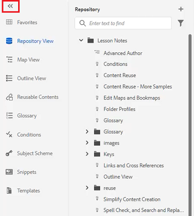
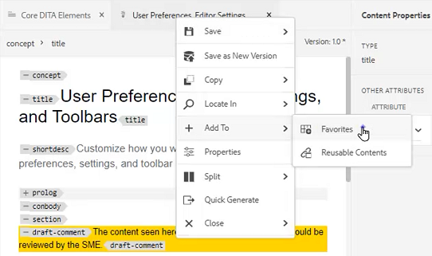
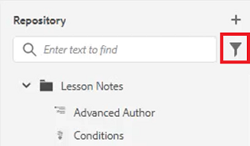
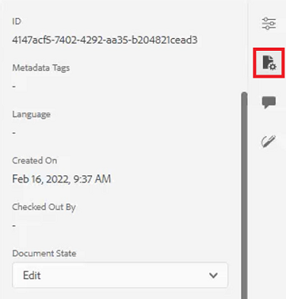

# Painéis

O Editor da Web Guias de AEM é dividido em várias seções, incluindo uma barra de ferramentas principal, uma barra de ferramentas secundária, um painel à esquerda, uma área de edição de conteúdo e um painel à direita.

>[!VIDEO](https://video.tv.adobe.com/v/342760?quality=12&learn=on)

## Redimensionar o painel esquerdo

Painéis persistentes, como o painel esquerdo, podem ser ajustados em tamanho.

1. Posicione o cursor na borda do painel.

1. Quando a seta de duas pontas for exibida, clique e arraste para dentro ou para fora, conforme necessário.

## Expandir ou recolher a barra lateral do painel esquerdo

A exibição expandida exibe os nomes e os ícones que aparecem como Dicas de ferramentas na exibição recolhida.

1. Clique no botão [!UICONTROL **Barra lateral**] ícone para expandir o painel.

   

1. Clique no botão [!UICONTROL **Barra lateral**] novamente para recolher o painel.

   

## Criar uma coleção de favoritos

No painel esquerdo, os Favoritos permitem que você crie uma lista de documentos específicos e adicione-a ao longo do tempo. Você pode criar e gerenciar uma ampla coleção de Favoritos.

1. Selecionar **Favoritos** no painel esquerdo.

1. Clique no botão [!UICONTROL **Plus**] ícone .

   

1. Na caixa de diálogo Nova coleção , digite um **Título** e **Descrição**.

   Observe que selecionar Público significa que outros usuários podem ver este Favorito.

1. Clique em [!UICONTROL **Criar**].

Agora você criou uma Coleção de favoritos.

## Adicionar um arquivo a uma coleção favorita do repositório

Após criar uma Coleção, você pode começar a adicionar Favoritos a ela.

1. Selecionar **Exibição do Repositório** no painel esquerdo.

1. Clique no botão [!UICONTROL **Elipse**] localizado ao lado de um tópico para acessar opções contextuais.

1. Selecionar **Adicionar a** > **Favoritos**.

1. Na caixa de diálogo Adicionar aos favoritos, escolha **Nova coleção** ou **Coleção existente**.

   Aqui, optamos por adicionar a uma coleção existente.

   

1. Se necessário, selecione uma coleção na lista suspensa.

1. Clique em [!UICONTROL **Adicionar**].

O tópico é adicionado à Coleção de favoritos escolhida. Você pode visualizá-lo no menu Favoritos.

## Adicionar um arquivo a uma coleção de favoritos no Editor

Outra maneira de adicionar um tópico aos seus Favoritos é a partir de um tópico aberto no Editor.

1. Navegue até o **Exibição do Repositório**.

1. Clique duas vezes em um tópico para abri-lo.

1. Clique com o botão direito do mouse no **Guia Título** no Editor para acessar opções contextuais.

1. Choose **Adicionar a** > **Favoritos**.

   

1. Na caixa de diálogo Adicionar aos favoritos, escolha **Nova coleção** ou **Coleção existente**.

   Aqui, optaremos por adicionar a uma Nova coleção.

1. Na caixa de diálogo Nova coleção , digite um **Título** e **Descrição**.

   Observe que a seleção **Público** significa que outros usuários podem ver este Favorito.

1. Clique em [!UICONTROL **Criar**].

O novo favorito foi criado e agrupado. Você pode visualizá-lo no menu Favoritos.

## Exibir e gerenciar seus favoritos

É fácil visualizar quais tópicos você já adicionou às suas Coleções de favoritos.

1. Selecionar [!UICONTROL **Favoritos**] no painel esquerdo.

1. Em Favoritos, clique no botão [!UICONTROL **Seta**] ícone ao lado de uma coleção para exibir seu conteúdo.

   

1. Clique no botão [!UICONTROL **Elipse**] ao lado de um tópico para exibir opções contextuais, incluindo a opção para excluí-lo da lista Favoritos.

## Filtrar uma pesquisa na Exibição do Repositório

O filtro aprimorado no Repositório permite procurar texto com uma grande variedade de restrições.

1. Navegar para **Exibição do Repositório**.

1. Clique no botão [!UICONTROL **Pesquisa de filtro**] ícone .

   

1. Digite o texto no caminho selecionado ou escolha um novo caminho, se necessário.

   A lista de arquivos é atualizada à medida que você digita texto no filtro.

1. Clique no ícone Seta ao lado de uma categoria de pesquisa para restringir ainda mais a pesquisa, se necessário.

   

As pesquisas podem ser restritas a tópicos DITA ou mapas DITA. Você pode pesquisar arquivos de imagem não DITA, multimídia ou outros documentos dentro do caminho selecionado. Você pode até mesmo restringir a pesquisa a Elementos DITA ou filtrar por finalização de arquivo.

## Explore a exibição de mapa

Vários recursos úteis estão disponíveis na Visualização de mapa, incluindo a capacidade de fazer check-out e bloquear arquivos, visualizar o arquivo de mapa, abrir o Painel de mapa e visualizar o mapa na interface do usuário do Assets.

Consulte a lição intitulada [Mapas e livros](./maps-and-bookmaps.md) neste curso para obter mais informações sobre a Visualização de mapa e sua funcionalidade.

## Explore a exibição de estrutura de tópicos

A Exibição de Estrutura de Tópicos fornece uma exibição hierárquica do documento atual no Contorno. É possível expandir a Exibição em Estrutura de Tópicos para mostrar vários elementos, bem como quaisquer IDs atribuídas.

Consulte a lição intitulada [Exibição da Estrutura de Tópicos](./outline-view.md) neste curso para obter mais informações sobre a Exibição de Estrutura de Tópicos e sua funcionalidade.

## Trabalhar com Conteúdos reutilizáveis

O recurso DITA principal é a capacidade de reutilizar conteúdo, de pequenas frases a tópicos ou mapas inteiros. O Editor fornece uma interface de arrastar e soltar para a reutilização do conteúdo.

Consulte a lição intitulada [Reutilização de conteúdo](./content-reuse.md) neste curso, para obter mais informações sobre conteúdo reutilizável e como gerenciá-lo com eficiência.

## Trabalhar com glossários

Usar o Glossário facilita consistentemente a formulação de informações e oferece mais clareza ao leitor. O Editor fornece uma interface de arrastar e soltar para inserir termos de glossário em um tópico.

Consulte a lição intitulada [Glossário](./glossary.md) neste curso para obter mais informações sobre como configurar e usar glossários.

## Trabalhar com condições

No DITA, as condições geralmente são orientadas pelo uso de atributos como Produto, Plataforma e Público-alvo, que podem ter valores específicos atribuídos a cada um deles. As condições são gerenciadas por meio de Perfis de pasta.

Consulte a lição intitulada [Condições](./conditions.md) neste curso para obter mais informações sobre como configurar e usar atributos condicionais.

## Criar um trecho

Os trechos são pequenos fragmentos de conteúdo que podem ser reutilizados como ponto de partida para o conteúdo ou a estrutura. O uso de Snippets reduz a quantidade de tempo necessária para criar conteúdo e melhora a qualidade estrutural e a consistência dos materiais.

1. Abra um tópico no Editor.

1. Selecione um elemento dentro do tópico.

1. Clique no botão secundário do mouse no elemento .

1. No menu resultante, escolha Criar [!UICONTROL **Snippet**].

   

1. Na caixa de diálogo Novo trecho , adicione um **Título** e **Descrição**.

1. Edite o trecho conforme necessário.

   Observe que uma verificação contextual notificará visualmente você se inserir um erro no conteúdo.

1. Clique em [!UICONTROL **Criar**].

O Snippet é adicionado à lista de Snippets disponíveis. Ele está pronto para ser arrastado e solto em um local válido no tópico.

## Trabalhar com modelos

Usando o painel Modelos, os administradores podem criar e gerenciar facilmente modelos para autores a serem usados. Por padrão, os modelos são categorizados como Mapa e Tipo de tópico.

Consulte as lições intituladas [Perfis de pasta](./folder-profiles.md) e [Fluxos de trabalho de criação de conteúdo simples](simple-content-creation-workflows.md) neste curso para obter mais informações sobre como configurar e aplicar modelos.

## Pesquisar arquivos com Localizar e Substituir

Há duas opções de Localizar e Substituir disponíveis no Editor. A primeira permite localizar e substituir funções em um tópico aberto específico, como um processador de texto tradicional. O segundo é um painel Localizar e Substituir que pesquisa texto em vários arquivos no Repositório.

Consulte a lição intitulada [Verificar ortografia e localizar e substituir](./spell-check.md)  neste curso para obter mais informações sobre o recurso Localizar e substituir .

## Atualizar propriedades do conteúdo

As Propriedades de conteúdo no painel direito incluem informações específicas sobre o elemento selecionado no momento, por exemplo, a ID de atributo e o valor.

1. Abra um tópico em **Editor XML**.

1. Selecione um **elemento**.

   As Propriedades de conteúdo exibem os Atributos e o Tipo atuais do elemento.

1. Digite um novo **Valor** para o elemento .

   

As Propriedades de conteúdo são atualizadas dinamicamente à medida que você faz alterações nos elementos.

## Adicionar um tópico a um mapa usando Propriedades do arquivo

Propriedades do arquivo mostra informações adicionais sobre todo o tópico aberto. Algumas dessas informações são controladas pelas Propriedades do tópico. As modificações em outro material, como o Estado do documento, podem depender de permissões.

1. Abra um tópico no Editor.

1. Clique no botão [!UICONTROL  **Propriedades do arquivo**] no painel direito.

   

1. Defina as **Estado do documento** para **Editar**. Observe que a lista Referências está em branco no momento.

   

1. Feche o tópico.

1. Selecionar [!UICONTROL **Exibição do Repositório**] no painel esquerdo.

1. Abra um mapa.

   A exibição é alterada para Visualização de mapa.

1. Clique no botão [!UICONTROL **Editar**] ícone .

   

1. Quando o mapa estiver aberto para edição, volte para **Exibição do Repositório**.

1. Arraste e solte o tópico com o qual você está trabalhando no mapa.

1. Clique no botão [!UICONTROL **Salvar**] na barra de ferramentas superior.

O tópico é adicionado ao mapa. Agora, ao abrir o tópico e verificar as Propriedades do arquivo, você pode ver as Referências atualizadas para refletir que o tópico é usado no mapa especificado.

## Criar uma tarefa de revisão

O painel direito contém um atalho para iniciar um fluxo de trabalho de revisão.

1. Clique no botão [!UICONTROL **Revisão**] no painel direito.

   

1. Clique em [!UICONTROL **Criar revisão**].

   

1. Na caixa de diálogo Criar tarefa de revisão , preencha os campos conforme necessário.

1. Clique em [!UICONTROL **Avançar**].

A Tarefa de revisão é criada.

## Rastrear alterações

A capacidade de rastrear as alterações oferece muito controle sobre quais alterações são mantidas em uma versão de um tópico para a próxima. Você pode usar o painel direito para gerenciar as alterações rastreadas.

Consulte a lição intitulada [Rastrear alterações](./track-changes.md) neste curso para obter mais informações sobre a funcionalidade de rastreamento de alterações.
