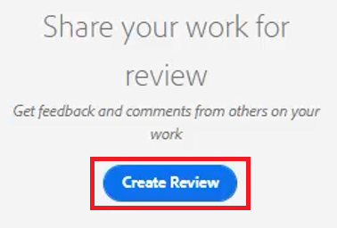

# Painéis

O Editor da Web do AEM Guides é dividido em várias seções, incluindo uma barra de ferramentas principal, uma barra de ferramentas secundária, um painel esquerdo, uma área de edição de conteúdo e um painel direito.

>[!VIDEO](https://video.tv.adobe.com/v/342760?quality=12&learn=on)

## Redimensionar o painel esquerdo

Os painéis persistentes, como o painel esquerdo, têm tamanho ajustável.

1. Posicione o cursor na borda do painel.

1. Quando a seta de duas pontas aparecer, clique e arraste para dentro ou para fora, conforme necessário.

## Expandir ou recolher a barra lateral do painel esquerdo

A exibição expandida exibe os nomes e os ícones exibidos como Dicas de ferramenta na exibição recolhida.

1. Clique no ícone da [!UICONTROL **Barra lateral**] para expandir o painel.

   

1. Clique no ícone da [!UICONTROL **Barra lateral**] novamente para recolher o painel.

   

## Criar uma coleção de favoritos

No painel esquerdo, Favoritos permite criar uma lista de documentos específicos e adicioná-la ao longo do tempo. Você pode criar e gerenciar uma ampla coleção de Favoritos.

1. Selecione **Favoritos** no painel esquerdo.

1. Clique no ícone [!UICONTROL **Plus**].

   

1. Na caixa de diálogo Nova coleção, insira um **Título** e uma **Descrição**.

   Observe que selecionar Público significa que outros usuários podem ver este Favorito.

1. Clique em [!UICONTROL **Criar**].

Agora você criou uma coleção de favoritos.

## Adicionar um arquivo a uma coleção de favoritos do repositório

Depois de criar uma coleção, você pode começar a adicionar favoritos a ela.

1. Selecione **Exibição do repositório** no painel esquerdo.

1. Clique nas [!UICONTROL **Reticências**] localizadas ao lado de um tópico para acessar as opções contextuais.

1. Selecione **Adicionar a** > **Favoritos**.

1. Na caixa de diálogo Adicionar aos favoritos, escolha **Nova coleção** ou **Coleção existente**.

   Aqui, optaremos por adicionar a uma coleção existente.

   

1. Se necessário, selecione uma coleção na lista suspensa.

1. Clique em [!UICONTROL **Adicionar**].

O tópico é adicionado à Coleção de Favoritos escolhida. Você pode visualizá-lo no menu Favoritos.

## Adicionar um arquivo a uma coleção de favoritos no editor

Outra maneira de adicionar um tópico a seus Favoritos é a partir de um tópico aberto no Editor.

1. Navegue até **Exibição do Repositório**.

1. Clique duas vezes em um tópico para abri-lo.

1. Clique com o botão direito do mouse na **guia Título** do arquivo no Editor para acessar opções contextuais.

1. Escolha **Adicionar a** > **Favoritos**.

   

1. Na caixa de diálogo Adicionar aos favoritos, escolha **Nova coleção** ou **Coleção existente**.

   Aqui, optaremos por adicionar a uma nova coleção.

1. Na caixa de diálogo Nova coleção, insira um **Título** e uma **Descrição**.

   Observe que selecionar **Público** significa que outros usuários podem ver este Favorito.

1. Clique em [!UICONTROL **Criar**].

O novo favorito foi criado e agrupado. Você pode visualizá-lo no menu Favoritos.

## Exibir e gerenciar seus Favoritos

É fácil visualizar quais tópicos você já adicionou às suas Coleções de favoritos.

1. Selecione [!UICONTROL **Favoritos**] no painel esquerdo.

1. Em Favoritos, clique no ícone de [!UICONTROL **Seta**] ao lado de uma coleção para exibir seu conteúdo.

   

1. Clique nas [!UICONTROL **Reticências**] ao lado de um tópico para exibir as opções contextuais, incluindo a opção para excluí-lo da lista Favoritos.

## Filtrar uma pesquisa na Exibição de repositório

O filtro aprimorado no Repositório permite pesquisar texto com uma grande variedade de restrições.

1. Navegue até **Exibição do Repositório**.

1. Clique no ícone [!UICONTROL **Filtrar Pesquisa**].

   

1. Digite o texto no caminho selecionado ou escolha um novo caminho, se necessário.

   A lista de arquivos é atualizada à medida que você digita texto no filtro.

1. Clique no ícone de Seta ao lado de uma categoria de pesquisa para restringir ainda mais a pesquisa, se necessário.

   

As pesquisas podem ser restritas a Tópicos DITA ou Mapas DITA. Você pode pesquisar arquivos de imagem não DITA, multimídia ou outros documentos dentro do caminho selecionado. Você pode até mesmo restringir a pesquisa a elementos DITA ou filtrar por check-out de arquivo.

## Explorar a exibição de mapa

Vários recursos úteis estão disponíveis na Exibição de mapa, incluindo a capacidade de fazer check-out e bloquear arquivos, visualizar o arquivo de mapa, abrir o painel de mapa e visualizar o mapa na interface do usuário do Assets.

Consulte a lição intitulada [Mapas e Livros](./maps-and-bookmaps.md) neste curso para obter mais informações sobre a Exibição de Mapa e suas funcionalidades.

## Explorar a Exibição de Estrutura de Tópicos

A Exibição de Estrutura de Tópicos fornece uma exibição hierárquica do documento atual na Estrutura de Tópicos. Você pode expandir a Exibição de Estrutura de Tópicos para mostrar vários elementos, bem como quaisquer IDs atribuídas.

Consulte a lição intitulada [Modo de Exibição de Estrutura de Tópicos](./outline-view.md) neste curso para obter mais informações sobre o Modo de Exibição de Estrutura de Tópicos e sua funcionalidade.

## Trabalhar com conteúdos reutilizáveis

O recurso DITA principal é a capacidade de reutilizar conteúdo, de frases pequenas a tópicos ou mapas inteiros. O Editor fornece uma interface de arrastar e soltar para reutilização de conteúdo.

Consulte a lição intitulada [Reutilização de conteúdo](./content-reuse.md) neste curso para obter mais informações
informações sobre conteúdo reutilizável e como gerenciá-lo de maneira eficaz.

## Trabalhar com glossários

O uso do Glossário facilita a Frase de informações de forma consistente e fornece melhor clareza ao leitor. O Editor fornece uma interface de arrastar e soltar para inserir termos do glossário em um tópico.

Consulte a lição intitulada [Glossário](./glossary.md) neste curso para obter mais informações sobre como configurar e usar glossários.

## Trabalhar com condições

No DITA, as condições geralmente são orientadas pelo uso de atributos como Produto, Plataforma e Público-alvo, que podem ter valores específicos atribuídos a cada um. As condições são gerenciadas por meio de Perfis de pasta.

Consulte a lição intitulada [Condições](./conditions.md) neste curso para obter mais informações sobre como configurar e usar atributos condicionais.

## Criar um trecho

Os trechos são pequenos fragmentos de conteúdo que podem ser reutilizados como ponto de partida para o conteúdo ou a estrutura. O uso de trechos reduz o tempo necessário para criar conteúdo e melhora a qualidade estrutural e a consistência dos materiais.

1. Abra um tópico no Editor.

1. Selecione um elemento dentro do tópico.

1. Clique no botão secundário do mouse dentro do elemento.

1. No menu resultante, escolha Criar [!UICONTROL **trecho**].

   

1. Na caixa de diálogo Novo Trecho, adicione um **Título** e uma **Descrição**.

1. Edite o trecho conforme necessário.

   Observe que uma verificação contextual notificará visualmente você se você introduzir um erro no conteúdo.

1. Clique em [!UICONTROL **Criar**].

O trecho é adicionado à lista de trechos disponíveis. Ele está pronto para ser arrastado e solto em um local válido no tópico.

## Trabalhar com modelos

Usando o painel Modelos, os administradores podem criar e gerenciar modelos facilmente para os autores usarem. Por padrão, os modelos são categorizados como Mapa e Tipo de tópico.

Consulte as lições denominadas [Perfis de Pasta](./folder-profiles.md) e [Fluxos de Trabalho de Criação de Conteúdo Simples](simple-content-creation-workflows.md) neste curso para obter mais informações sobre como configurar e aplicar modelos.

## Pesquisar arquivos com Localizar e Substituir

Há duas opções Localizar e Substituir disponíveis no Editor. O primeiro permite as funções Localizar e Substituir em um tópico aberto específico, de forma semelhante a um processador de texto tradicional. O segundo é um painel Localizar e substituir que pesquisa texto em vários arquivos no Repositório.

Consulte a lição intitulada [Verificação ortográfica e Localizar e substituir](./spell-check.md) neste curso para obter mais informações sobre o recurso Localizar e substituir.

## Atualizar propriedades do conteúdo

As Propriedades de conteúdo no painel direito incluem informações específicas sobre o elemento selecionado no momento, por exemplo, a ID do atributo e o Valor.

1. Abra um tópico no **Editor de XML**.

1. Selecione um **elemento**.

   Propriedades de conteúdo exibe o Tipo e os Atributos atuais do elemento.

1. Digite um novo **Valor** para o elemento.

   

As Propriedades de conteúdo são atualizadas dinamicamente à medida que você faz alterações em elementos.

## Adicionar um tópico a um mapa usando Propriedades do Arquivo

Propriedades do arquivo mostra informações adicionais sobre todo o tópico aberto. Algumas dessas informações são controladas por Propriedades do tópico. As modificações em outro material, como o Estado do documento, podem depender de permissões.

1. Abra um tópico no Editor.

1. Clique no ícone [!UICONTROL &#x200B; **Propriedades do arquivo**] no painel direito.

   

1. Defina o **Estado do Documento** como **Editar**. Observe que a lista Referências está atualmente em branco.

   

1. Feche o tópico.

1. Selecione [!UICONTROL **Exibição do repositório**] no painel esquerdo.

1. Abra um mapa.

   A exibição é alterada para Exibição de mapa.

1. Clique no ícone [!UICONTROL **Editar**].

   

1. Quando o mapa estiver aberto para edição, volte para a **Exibição do Repositório**.

1. Arraste e solte o tópico com o qual você está trabalhando no mapa.

1. Clique no ícone [!UICONTROL **Salvar**] na barra de ferramentas superior.

O tópico é adicionado ao mapa. Agora, ao abrir o tópico e verificar as Propriedades do arquivo, você pode ver as Referências são atualizadas para refletir que o tópico é usado no mapa especificado.

## Criar uma tarefa de análise

O painel direito contém um atalho para iniciar um fluxo de trabalho de revisão.

1. Clique no ícone [!UICONTROL **Revisão**] no painel direito.

   

1. Clique em [!UICONTROL **Criar revisão**].

   

1. Na caixa de diálogo Criar tarefa de revisão, preencha os campos conforme necessário.

1. Clique em [!UICONTROL **Avançar**].

A Tarefa de revisão é criada.

## Controlar alterações

A capacidade de rastrear alterações oferece muito controle sobre quais alterações são mantidas em uma versão de um tópico para a próxima. Você pode usar o painel correto para gerenciar alterações controladas.

Consulte a lição intitulada [Controlar alterações](./track-changes.md) neste curso para obter mais informações sobre a funcionalidade de controle de alterações.
