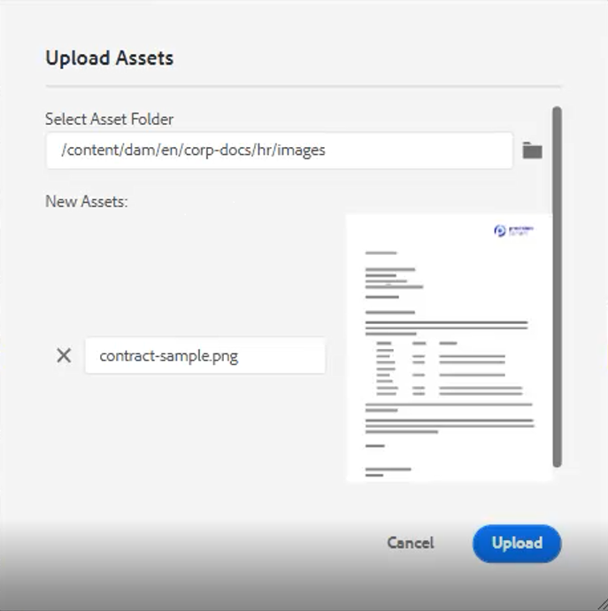
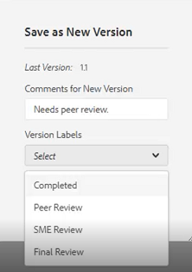

# Fluxos de trabalho de criação de conteúdo simples

O Editor de guias de AEM tem vários atalhos que simplificam o fluxo de trabalho de criação de conteúdo. Esses atalhos permitem que os usuários adicionem e modifiquem imagens rapidamente, trabalhem com vários tópicos de uma só vez, corrijam erros, baixem PDF de tópicos e trabalhem com versões e rótulos.

>[!VIDEO](https://video.tv.adobe.com/v/342770?quality=12&learn=on)

## Adicionar uma imagem

As imagens podem ser adicionadas diretamente de uma unidade local.

1. Arraste e solte a imagem diretamente no tópico. O **Fazer upload de ativos** será exibida.

   

1. Modifique o caminho da pasta para o local da imagem desejada.

1. Altere o nome da imagem para algo representativo de sua finalidade.

1. Clique em [!UICONTROL **Upload**].

## Modificar uma imagem

1. Redimensione uma imagem arrastando e soltando um canto.

1. Mova uma imagem para outro local dentro do tópico arrastando-a e soltando-a.

1. Use **Propriedades de conteúdo** no painel lateral direito para modificar um

   - scale

   - position

   - alinhamento, ou

   - outros atributos.

   

## Trabalhar com vários tópicos

A Exibição dividida é útil para comparar tópicos, copiar e colar entre tópicos ou arrastar e soltar conteúdo de um tópico para outro.

1. Abra dois ou mais tópicos relacionados.

1. Clique na guia Título de um arquivo para abrir o menu contextual.

1. Selecionar [!UICONTROL **Split**].

1. Choose **Right**.

   

## Correção de erros tipográficos

1. Localize a palavra ou frase que contém o erro.

1. Mantenha pressionada a tecla [!UICONTROL **Ctrl**].

1. Clique no botão secundário do mouse sobre o erro.

1. Selecione a ortografia correta.

O erro foi corrigido no texto do tópico.

## Baixar um PDF de tópico

Os usuários podem querer fazer o download de uma PDF do tópico atual para marcar ou compartilhar com outras pessoas.

1. Clique em [!UICONTROL **Visualizar**] na parte superior direita da tela.

1. Clique no botão [!UICONTROL **Ícone PDF**] acima do tópico. Uma caixa de diálogo é exibida.

   

1. Preencha as informações para **Nome da transformação** ou **Argumentos da linha de comando DITA-OT** se necessário. Observe que um PDF ainda é gerado se todos os campos forem deixados em branco.

1. Clique em [!UICONTROL **Baixar**]. O PDF gera.

1. Use ícones disponíveis para configurar, baixar ou compartilhar o tópico do PDF.

## Localizar um tópico no repositório ou no mapa

1. Abra o tópico.

1. Clique no botão secundário do mouse na guia Título .

1. Selecionar **Localizar em**.

1. Escolha um **Repositório** ou **Mapa** para ir para o local do tópico desejado.

## Versão de um tópico

1. Faça uma alteração em um tópico.

1. Salve o tópico.

1. Clique no botão **Repositório** no menu superior esquerdo.

   

1. Na caixa de diálogo , adicione **Comentários para a nova versão**.

   

1. Clique em [!UICONTROL **Salvar**].

O número da versão é atualizado.

## Carregar rótulos de versão

Tentar rastrear o estado de um tópico com base somente no Número da versão pode ser difícil. Rótulos facilitam a identificação do estado exato de um tópico que sofreu várias revisões.

1. Selecione um **Perfil da pasta**.

1. No Perfil da pasta, configure o Editor XML.

   a. Selecione Editar na parte superior esquerda da tela.

   b. Em Rótulos de versão do conteúdo XML, adicione um novo tópico ou use um existente.

   

1. Selecionar [!UICONTROL **Upload**].

1. Escolha um arquivo como ReviewLabels.json ou semelhante. Detalhes sobre como criar esse arquivo são abordados em outro vídeo.

1. Clique em [!UICONTROL **Abrir**].

1. Clique em [!UICONTROL **Salvar**] na parte superior esquerda da tela Perfil da pasta .

1. Clique em [!UICONTROL **Fechar**] no canto superior direito.

Os rótulos de versão agora são carregados.

## Atribuir rótulos de versão

1. Carregar rótulos de versão.

1. Clique no botão [!UICONTROL **Preferências do usuário**] ícone na parte superior esquerda do tópico atual.

   

1. Selecione o mesmo Perfil de pasta em que os rótulos de versão foram carregados anteriormente.

1. Na caixa de diálogo Preferências do usuário, verifique se o Caminho básico faz referência às mesmas informações às quais o Perfil da pasta foi aplicado.

   

1. Clique em [!UICONTROL **Salvar**].

1. Versão do tópico.

1. Adicione um comentário e selecione um rótulo de versão na lista suspensa.

   

1. Clique em [!UICONTROL **Salvar**].

O número da versão é atualizado.

## Exibir o histórico e rótulos da versão

1. No painel esquerdo, localize o título do tópico atual.

1. Clique no título para abrir o menu contextual.

1. Selecionar [!UICONTROL **Exibir na interface do usuário do Assets**].

   

   - O histórico de versões com rótulos é exibido à esquerda.

   

1. Clique em uma versão para acessar opções como **Reverter para esta versão** e **Versão de visualização**.

## Criar um novo modelo

Existem modelos para tópicos e mapas. Os administradores podem acessar Modelos no painel esquerdo.

1. Clique em [!UICONTROL **Modelos**] no painel esquerdo.

1. Selecione Mapa ou Tópico para abrir o menu contextual associado.

1. Clique em para adicionar o novo template.

   

1. Preencha os campos na caixa de diálogo resultante.

O modelo de shell é exibido, contendo o conteúdo da amostra e uma estrutura de amostra.
