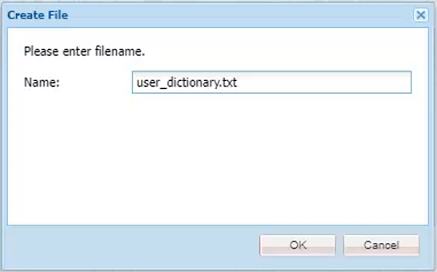

# Verificação ortográfica e Localizar/Substituir

O Editor do AEM Guides tem recursos avançados de verificação ortográfica e Localizar e Substituir.

>[!VIDEO](https://video.tv.adobe.com/v/342768?quality=12&learn=on)

Corrigir um erro de ortografia

1. Localize um erro em um tópico aberto, mostrado com um sublinhado vermelho.

1. Mantenha pressionada a tecla Ctrl + clique no botão secundário do mouse dentro da palavra.

1. Escolha a ortografia correta nas sugestões.

Se a ortografia correta não for sugerida, você sempre poderá editar a palavra manualmente.

## Alternar para verificação ortográfica do AEM

Talvez você queira usar uma ferramenta de verificação ortográfica diferente do dicionário padrão do navegador.

1. Navegue até **Configurações do editor**.

1. Selecione a guia de configurações **Geral**.

   

1. Há duas opções:

   - **Verificação ortográfica do navegador** — a configuração padrão em que a verificação ortográfica usa o dicionário interno do navegador.

   - **Verificação ortográfica do AEM** — use essa opção para criar uma lista de palavras personalizada usando o dicionário personalizado AEM.

1. Escolha a **Verificação ortográfica do AEM**.

1. Clique em [!UICONTROL **Salvar**].

Configurar um dicionário personalizado

O administrador pode alterar as configurações para que o dicionário AEM reconheça palavras personalizadas, como nomes de empresas.

1. Navegue até o painel **Ferramentas**.

1. Faça logon em **CRXDE Lite**.

   

1. Navegue até o nó **_/apps/fmdita/config_**.

   

1. Crie um novo arquivo.

   a. Clique com o botão direito do mouse na pasta de configuração.

   b. Escolha **Criar > Criar arquivo**.

   

   c. Nomeie o arquivo _**user_dictionary.txt**_.

   

   d. Clique em [!UICONTROL **OK**].

1. Abra o arquivo.

1. Adicione uma lista de palavras que você deseja incluir no dicionário personalizado.

1. Clique em [!UICONTROL **Salvar tudo**].

1. Feche o arquivo.

Os autores podem precisar reiniciar a sessão do Editor da Web para obter a lista de palavras personalizada atualizada no dicionário AEM.

## Localizar e substituir em um único arquivo

1. Clique no ícone Localizar e substituir na barra de ferramentas superior.

   

1. Na barra de ferramentas inferior, digite uma palavra ou frase.

1. Clique em [!UICONTROL **Localizar**].

1. Se necessário, digite uma palavra para substituir a palavra encontrada.

1. Clique em [!UICONTROL **Substituir**].

## Localizar e substituir no repositório

1. Navegue até o **Repositório**.

1. Clique no ícone [!UICONTROL **Localizar e Substituir**] na parte inferior esquerda da tela.

1. Clique no ícone [!UICONTROL **Mostrar configurações**].

1. Escolha um

   - **Fazer check-out do arquivo antes de substituir** — se habilitado por um Administrador, o check-out do arquivo será feito automaticamente antes da substituição dos termos de pesquisa.

   - **Somente palavra inteira** — restringe a pesquisa para retornar somente a palavra ou frase exata inserida.

   

1. Clique no ícone [!UICONTROL **Aplicar filtro**] para selecionar o caminho no Repositório onde deseja realizar a pesquisa.

1. Informe os termos para Localizar e Substituir.

1. Se necessário, selecione **Criar nova versão após substituir**.

1. Clique em [!UICONTROL **Localizar**].

1. Abra o arquivo desejado e use as setas para navegar de um resultado encontrado para o próximo.

   
