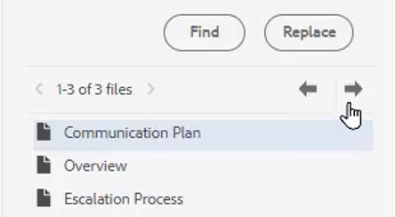

# Verificar ortografia e localizar/substituir

O Editor de guias de AEM tem recursos avançados de verificação ortográfica e localização e substituição.

>[!VIDEO](https://video.tv.adobe.com/v/342768?quality=12&learn=on)

Corrigir um erro ortográfico

1. Localize um erro em um tópico aberto, mostrado com um sublinhado vermelho.

2. Mantenha pressionada a tecla Ctrl + clique no botão secundário do mouse dentro da palavra.

3. Escolha a ortografia correta nas sugestões.

Se a ortografia correta não for sugerida, você sempre poderá editar a palavra manualmente.

## Mudar para AEM Verificação Ortográfica

Você pode usar uma ferramenta de verificação ortográfica diferente do dicionário padrão do navegador.

1. Navegar para **Configurações do editor**.

2. Selecione o **Geral** guia de configurações.

   

3. Existem duas opções disponíveis:

   - **Verificação ortográfica do navegador** — a configuração padrão em que a verificação ortográfica usa o dicionário interno do navegador.

   - **Verificação Ortográfica AEM** — use essa opção para criar uma lista de palavras personalizada usando AEM dicionário personalizado.

4. Choose **Verificação Ortográfica AEM**.

5. Clique em [!UICONTROL **Salvar**].

Configurar um dicionário personalizado

O Administrador pode alterar as configurações para que o dicionário de AEM reconheça palavras personalizadas, como nomes de empresas.

1. Navegue até o **Ferramentas** painel.

2. Faça logon em **CRXDE Lite**.

   

3. Navegue até o **_/apps/fmdita/config node_**.

   

4. Crie um novo arquivo.

   a. Clique com o botão direito do mouse na pasta de configuração.

   b. Choose **Criar > Criar arquivo**.

   

   c. Nomeie o arquivo _**user_dictionary.txt**_.

   

   d. Clique em [!UICONTROL **OK**].

5. Abra o arquivo .

6. Adicione uma lista de palavras que você deseja incluir em seu dicionário personalizado.

7. Clique em [!UICONTROL **Salvar tudo**].

8. Feche o arquivo .

Os autores podem precisar reiniciar a sessão do Editor da Web para obter a lista de palavras personalizada atualizada no Dicionário de AEM.

## Localizar e substituir em um único arquivo

1. Clique no ícone Localizar e substituir na barra de ferramentas superior.

   

2. Na barra de ferramentas inferior, digite uma palavra ou frase.

3. Clique em [!UICONTROL **Localizar**].

4. Se necessário, digite uma palavra para substituir a palavra encontrada.

5. Clique em [!UICONTROL **Substituir**].

## Localizar e substituir no repositório

1. Navegue até o **Repositório**.

2. Clique no botão [!UICONTROL **Localizar e substituir**] na parte inferior esquerda da tela.

3. Clique no botão [!UICONTROL **Mostrar configurações**] ícone .

4. Escolha um

   - **Arquivo de check-out antes de substituir** — se ativado por um Administrador, o check-out do arquivo será feito automaticamente antes da substituição dos termos de pesquisa.

   - **Somente palavra inteira** — restringe a pesquisa a retornar somente a palavra exata ou frase inserida.

   

5. Clique no botão [!UICONTROL **Aplicar filtro**] ícone para selecionar o caminho no Repositório onde deseja executar a pesquisa.

6. Insira os termos para Localizar e Substituir.

7. Se necessário, selecione **Criar nova versão após substituir**.

8. Clique em [!UICONTROL **Localizar**].

9. Abra o arquivo desejado e use as setas para navegar de um resultado encontrado para outro.

   
