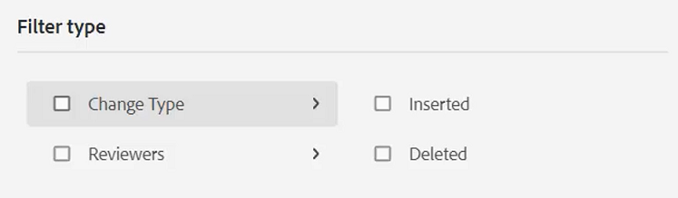

# Rastrear alterações

Você pode acompanhar todas as atualizações feitas em um documento ativando o modo Rastrear alterações . Esse modo permite que você e sua equipe capturem todas as inserções e exclusões durante o processo de revisão do documento.

>[!VIDEO](https://video.tv.adobe.com/v/342763?quality=12&learn=on)

## Trabalhar com o recurso Rastrear alterações

1. Ative o **Rastrear alterações** ícone da barra de ferramentas para ativar (ou desativar) o recurso.

   

1. Faça uma alteração no tópico.

   O conteúdo adicionado agora é exibido em verde com uma barra de alteração. O conteúdo excluído é exibido em vermelho com um tachado.

1. Selecione o **Alterações Rastreadas** ícone à direita para acessar o painel Tracking Changes .

   

1. Clique em [!UICONTROL **Salvar**].

   

1. Feche o tópico.

Outros usuários agora podem abrir o tópico e visualizar as alterações rastreadas existentes. Eles podem aceitar ou rejeitar as alterações e adicionar as suas próprias.

## Pesquisar alterações rastreadas

O recurso de pesquisa é útil quando há muitas alterações rastreadas, pois a rolagem por elas pode ser demorada.

1. Selecione o **Alterações Rastreadas** ícone à direita para acessar o painel Tracking Changes .

1. Digite uma palavra ou frase no campo Pesquisar .
A pesquisa retorna qualquer alteração que corresponda às palavras de pesquisa.

## Filtrar alterações rastreadas

Várias alterações rastreadas também podem ser filtradas por inserção, exclusão ou revisor.

1. Clique no botão [!UICONTROL **Filtro**] na parte inferior do painel Alterações rastreadas.

1. Marque as caixas de seleção para os filtros desejados.

   

1. Clique em [!UICONTROL **Aplicar**].

## Aceitar ou rejeitar alterações rastreadas

Revisores e Especialistas em assunto podem aceitar ou rejeitar as alterações de outros usuários, individualmente ou de uma só vez.

1. Clique no botão [!UICONTROL **Alterações Rastreadas**] ícone à direita para acessar o painel Tracking Changes .

1. Selecione uma alteração específica.

1. Clique no botão [!UICONTROL **Miniaturas para cima**] ou [!UICONTROL **Miniaturas para baixo**] ícone associado à alteração para aceitá-la ou rejeitá-la.

   

   Ou

   Clique no botão [!UICONTROL **Miniaturas para cima**] ou [!UICONTROL **Miniaturas para baixo**] acima da barra de Pesquisa para aceitar ou rejeitar todas as alterações.

   

1. [!UICONTROL **Salvar**] o tópico.

## Trabalhar com o recurso Mesclar

Quando você trabalha em um ambiente de vários autores, pode ser difícil rastrear quais alterações outros autores fizeram em um tópico ou mapa. O recurso Mesclar oferece mais controle sobre não apenas como visualizar as alterações, mas também sobre quais alterações são retidas na versão mais recente do documento.

1. Abra um tópico no Editor da Web.

1. Clique no botão [!UICONTROL **Mesclar**] na barra de ferramentas.

   

1. Na caixa de diálogo Mesclar, selecione uma versão do arquivo com a qual deseja comparar a versão atual do arquivo.

1. Nas Opções, escolha:

   - **Rastrear Alterações Da Versão Selecionada**: Essa opção mostra todas as atualizações de conteúdo na forma de alterações rastreadas. Em seguida, você pode optar por aceitar ou rejeitar alterações no documento, uma de cada vez ou todas de uma vez.

   - **Reverter para a versão selecionada**: Essa opção reverte a versão atual do documento para a versão selecionada. Ele não oferece controle sobre qual conteúdo é aceito ou rejeitado.

1. Clique em [!UICONTROL **Concluído**].

Se você selecionou a variável **Opção Rastrear alterações da versão selecionada** e todas as alterações da versão selecionada aparecem na guia Changes do painel direito.
