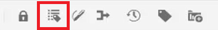
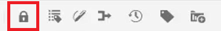
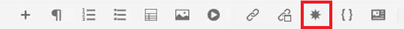

# Preferências do usuário, configurações do editor e barras de ferramentas do editor

O Editor tem uma interface altamente configurável. A combinação de Preferências do usuário, Configurações do editor e Perfis de pasta significa que você pode personalizar quase todos os aspectos de seu ambiente de trabalho específico.

>[!VIDEO](https://video.tv.adobe.com/v/342769?quality=12&learn=on)

## Mostrar ou ocultar marcas de elemento

Tags são dicas visuais que indicam os limites de um elemento. Um limite de elemento marca o início e o fim de um elemento. Em seguida, você pode usar esses limites como uma dica visual para colocar o ponto de inserção ou selecionar o texto dentro de um limite.

1. Clique no ícone [!UICONTROL **Alternar Exibição de Tags**] na barra de ferramentas secundária.

   

   As tags são exibidas dentro do tópico. Com a Exibição de tags ativada, você pode:

   - Selecione o conteúdo de um elemento clicando na tag de abertura ou fechamento.

   - Expanda ou recolha tags clicando no sinal + ou - na tag.

   - Use o menu de contexto para recortar, copiar ou colar o elemento selecionado.

   - Arraste e solte elementos selecionando a tag e soltando o elemento em um local válido.

1. Clique no ícone [!UICONTROL **Alternar Exibição de Marcas**] novamente para ocultar marcas.

As tags desaparecem, permitindo que você se concentre no texto.

## Bloquear ativos quando em uso

Bloquear (ou fazer check-out) de um arquivo oferece ao usuário acesso exclusivo de gravação ao arquivo. Quando o arquivo estiver desbloqueado (ou com check-in feito), as alterações serão salvas na versão atual do arquivo.

1. Clique no ícone [!UICONTROL **Bloquear**] na barra de ferramentas secundária.

   

   O arquivo foi retirado e um ícone Bloquear é exibido ao lado do nome do arquivo no Repositório.

1. Clique no ícone [!UICONTROL **Desbloquear**].

   

O Repositório é atualizado para mostrar que foi feito check-in do arquivo.

## Inserir caracteres especiais

1. Clique no ícone [!UICONTROL **Inserir Caracteres Especiais**] na barra de ferramentas secundária.

   

1. Na caixa de diálogo Inserir caractere especial, digite o nome do caractere na barra de pesquisa.

   Como alternativa, use a lista suspensa Selecionar categoria para exibir todos os caracteres em uma categoria específica.

1. Selecione o caractere desejado.

1. Clique em [!UICONTROL **Inserir**].

O caractere especial é inserido no texto.

## Alternar entre os modos Autor, Source e Visualização

A barra de ferramentas na parte superior direita da tela permite alternar entre exibições.

- Selecione **Autor** para exibir a estrutura e o conteúdo à medida que você trabalha com um tópico.

- Selecione **Source** para exibir o XML subjacente que compõe o tópico.

- Selecione **Visualizar** para mostrar como um tópico será exibido quando visualizado por um usuário em seu navegador.

## Alterar o tema com as Preferências do Usuário

Você pode escolher entre temas claros ou escuros para o editor. Usando o tema Luz, as barras de ferramentas e os painéis usam um plano de fundo cinza-claro. Usando o tema Escuro, as barras de ferramentas e os painéis usam um plano de fundo preto. Em ambos os temas, a área de edição de conteúdo aparece com um fundo branco.

1. Clique no ícone [!UICONTROL **Preferências do Usuário**] na barra de ferramentas superior.

   

1. Na caixa de diálogo Preferências do Usuário, clique na lista suspensa [!UICONTROL **Tema**].

1. Escolha entre as opções disponíveis.

   

1. Clique em [!UICONTROL **Salvar**].

O Editor é atualizado para exibir seu tema preferido.

## Atualizar o caminho base com as preferências do usuário

Você pode atualizar o Caminho base para que a Visualização de repositório mostre o conteúdo de um local específico assim que você iniciar o Editor. Isso reduz o tempo de acesso aos arquivos de trabalho.

1. Clique no ícone [!UICONTROL **Preferências do Usuário**] na barra de ferramentas superior.

   

1. Na caixa de diálogo Preferências do Usuário, clique no ícone [!UICONTROL **Pasta**] ao lado do Caminho Base.

   

1. Na caixa de diálogo Selecionar caminho, clique na caixa de seleção ao lado de uma pasta específica.

1. Clique em [!UICONTROL **Selecionar**].

Na próxima vez que você iniciar o Editor, o Repositório exibirá os arquivos que foram especificados no Caminho base.

## Atribuir um novo perfil de pasta

O Perfil global é um padrão do sistema. Os administradores podem criar Perfis de pasta adicionais para escolher.

1. Clique no ícone [!UICONTROL **Preferências do Usuário**] na barra de ferramentas superior.

   

1. Na caixa de diálogo Preferências do Usuário, clique na lista suspensa [!UICONTROL **Perfis de Pasta**].

   

1. Escolha um perfil entre as opções disponíveis.

1. Clique em [!UICONTROL **Salvar**].

O novo Perfil de pasta foi atribuído. Ela alterou as opções da barra de ferramentas, os modos de visualização e as Condições e trechos no painel esquerdo. Isso também pode alterar a aparência visual do conteúdo no Editor.

## Alterar o dicionário com as configurações do editor

As configurações do editor estão disponíveis para usuários administrativos. Essas preferências permitem definir uma variedade de configurações, uma delas é o dicionário que o Editor usa para verificação ortográfica.

1. Clique no ícone [!UICONTROL **Configurações do editor**] na barra de ferramentas superior.

   

1. Na caixa de diálogo Configurações do editor, clique na guia [!UICONTROL **Geral**].

1. Selecione o dicionário com o qual deseja trabalhar.

1. Clique em [!UICONTROL **Salvar**].

O dicionário é atualizado. Observe que alternar para Verificação ortográfica do AEM permite usar uma lista de palavras personalizada.

## Mostrar e ocultar painéis com Configurações do Editor

Um dos recursos que você pode personalizar com Configurações do editor é Painéis. Mais especificamente, você pode selecionar quais painéis são exibidos ou ocultos no Editor.

1. Clique no ícone [!UICONTROL **Configurações do editor**] na barra de ferramentas superior.

   

1. Na caixa de diálogo Configurações do Editor, clique na guia [!UICONTROL **Painéis**].

1. Alterne os Painéis disponíveis para Mostrar ou Ocultar, conforme necessário.

   

1. Clique em [!UICONTROL **Salvar**].

O painel esquerdo agora está configurado para mostrar apenas os painéis alternados para Mostrar.

## Nomear e rotular elementos nas Configurações do editor

A Lista de elementos permite nomear um elemento específico e atribuir a ele um rótulo mais amigável. O nome do elemento deve ser um dos elementos DITA. O rótulo pode ser qualquer string.

1. Clique no ícone [!UICONTROL **Configurações do editor**] na barra de ferramentas superior.

   

1. Na caixa de diálogo Configurações do editor, clique na guia [!UICONTROL **Lista de elementos**].

1. Digite um **Nome do elemento** e um **Rótulo** nos respectivos campos.

1. Clique no ícone [!UICONTROL **Plus**] para adicionar mais elementos à lista.

   

1. Clique em [!UICONTROL **Salvar**].

Você pode ver imediatamente a alteração na Lista de elementos nas tags existentes no Editor. Você também pode vê-las nas opções fornecidas ao adicionar um novo elemento.

## Nomeie e rotule os atributos nas Configurações do editor

A Lista de atributos funciona de forma semelhante à Lista de elementos. Em Configurações do Editor, você pode controlar a Lista de Atributos e seus nomes de exibição.

1. Clique no ícone [!UICONTROL **Configurações do editor**] na barra de ferramentas superior.

   

1. Na caixa de diálogo Configurações do editor, clique na guia [!UICONTROL **Lista de atributos**].

1. Digite um **Nome do atributo** e um **Rótulo** nos respectivos campos.

1. Clique no ícone [!UICONTROL **Plus**] para adicionar mais atributos à lista.

## Configurar condições nas Configurações do editor

A guia Condição permite configurar várias propriedades.

1. Clique no ícone [!UICONTROL **Configurações do editor**] na barra de ferramentas superior.

   

1. Na caixa de diálogo Configurações do editor, clique na guia [!UICONTROL **Condição**].

1. Marque as caixas de seleção das condições que deseja aplicar.

   

1. Clique em [!UICONTROL **Salvar**].

## Criar um perfil de publicação nas Configurações do editor

Os perfis do Publish podem ser usados para publicar a base de conhecimento. Por exemplo, o Salesforce usa um aplicativo configurado com uma chave do consumidor e segredo do consumidor. Essas informações podem ser usadas para criar um perfil de publicação do Salesforce.

1. Clique no ícone [!UICONTROL **Configurações do editor**] na barra de ferramentas superior.

   

1. Na caixa de diálogo Configurações do editor, clique na guia [!UICONTROL **Perfis**].

1. Clique no ícone do [!UICONTROL **Plus**] ao lado de Perfis.

1. Preencha os campos conforme necessário.

1. Clique em [!UICONTROL **Salvar**].

Um perfil de publicação foi criado.
