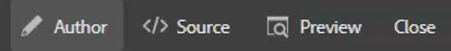
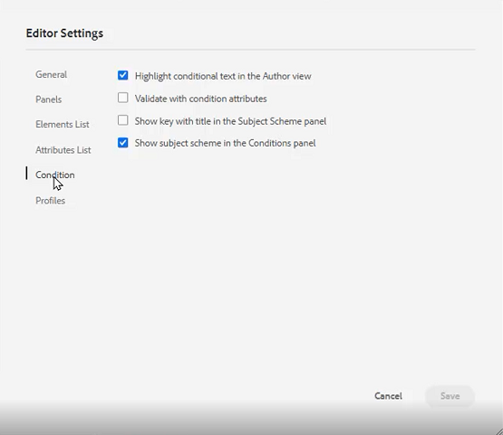

# Preferências do usuário, configurações do editor e barras de ferramentas do editor

O Editor tem uma interface altamente configurável. A combinação de Preferências de usuário, Configurações do editor e Perfis de pasta significa que você pode personalizar quase todos os aspectos para seu ambiente de trabalho específico.

>[!VIDEO](https://video.tv.adobe.com/v/342769)

## Mostrar ou ocultar tags de elemento

Tags são dicas visuais que indicam os limites de um elemento. Um limite de elemento marca o início e o fim de um elemento. Em seguida, você pode usar esses limites como uma dica visual para colocar o ponto de inserção ou selecionar o texto dentro de um limite.

1. Clique no botão [!UICONTROL **Alternar exibição de tags**] na barra de ferramentas secundária.

   

   As tags são exibidas dentro do tópico. Com a exibição Tags, é possível:

   ・ Selecione o conteúdo de um elemento clicando na tag de abertura ou fechamento .

   ・ Expanda ou recolha tags clicando no sinal + ou - na tag .

   ・ Use o menu de contexto para recortar, copiar ou passar o elemento selecionado.

   ・ Arraste e solte elementos selecionando a tag e soltando o elemento em um local válido.

2. Clique no botão [!UICONTROL **Alternar exibição de tags**] novamente para ocultar tags.

As tags desaparecem, permitindo que você se concentre no texto.

## Bloquear ativos quando em uso

Bloquear (ou fazer check-out) um arquivo dá ao usuário acesso exclusivo de gravação no arquivo. Quando o arquivo estiver Desbloqueado (ou com check-in), as alterações serão salvas na versão atual do arquivo.

1. Clique no botão [!UICONTROL **Bloquear**] na barra de ferramentas secundária.

   

   Foi feito o check-out do arquivo e um ícone Bloquear é exibido ao lado do nome do arquivo no Repositório.

2. Clique no botão [!UICONTROL **Desbloquear**] ícone .

   

O Repositório é atualizado para mostrar que o arquivo foi marcado.

## Inserir caracteres especiais

1. Clique no botão [!UICONTROL **Inserir caracteres especiais**] na barra de ferramentas secundária.

   

2. Na caixa de diálogo Inserir caractere especial, digite o nome do caractere na barra de pesquisa.

   Como alternativa, use a lista suspensa Selecionar categoria para exibir todos os caracteres em uma categoria específica.

3. Selecione o caractere desejado.

4. Clique em [!UICONTROL **Inserir**].

O caractere especial é inserido no texto.

## Alternar entre os modos Autor, Origem e Visualização

A barra de ferramentas na parte superior direita da tela permite alternar entre as exibições.

・ Selecionar **Autor** para visualizar a estrutura e o conteúdo à medida que você trabalha com um tópico.

・ Selecionar **Origem** para exibir o XML subjacente que compõe o tópico.

・ Selecionar **Visualizar** para mostrar como um tópico será exibido quando visualizado por um usuário em seu navegador.

## Alterar o tema com preferências de usuário

Você pode escolher entre temas claros ou escuros para o editor. Com o tema Luz, as barras de ferramentas e os painéis usam um fundo cinza-claro. Usando o tema Escuro, as barras de ferramentas e os painéis usam um fundo preto. Em ambos os temas, a área de edição de conteúdo aparece com um fundo branco.

1. Clique no botão [!UICONTROL **Preferências do usuário**] na barra de ferramentas superior.

   

2. Na caixa de diálogo Preferências do usuário, clique no botão [!UICONTROL **Tema**] lista suspensa.

3. Escolha dentre as opções disponíveis.

   

4. Clique em [!UICONTROL **Salvar**].

O Editor é atualizado para exibir seu tema preferido.

## Atualizar o caminho base com preferências do usuário

Você pode atualizar o Caminho base para que a Exibição do repositório mostre o conteúdo de um local específico assim que iniciar o Editor. Isso reduz o tempo para acessar arquivos de trabalho.

1. Clique no botão [!UICONTROL **Preferências do usuário**] na barra de ferramentas superior.

   

2. Na caixa de diálogo Preferências do usuário, clique no botão [!UICONTROL **Pasta**] ícone ao lado do Caminho básico.

   

3. Na caixa de diálogo Selecionar caminho , clique na caixa de seleção ao lado de uma pasta específica.

4. Clique em [!UICONTROL **Selecionar**].

Na próxima vez que você iniciar o Editor, o Repositório exibirá os arquivos que foram especificados no Caminho Base.

## Atribuir um novo perfil de pasta

O Perfil global é um padrão do sistema. Os administradores podem criar perfis de pasta adicionais para escolha.

1. Clique no botão [!UICONTROL **Preferências do usuário**] na barra de ferramentas superior.

   

2. Na caixa de diálogo Preferências do usuário, clique no botão [!UICONTROL **Perfis de pasta**] lista suspensa.

   

3. Escolha um perfil nas opções disponíveis.

4. Clique em [!UICONTROL **Salvar**].

O novo Perfil de pasta agora está atribuído. Ela alterou as opções da barra de ferramentas, os modos de exibição e as Condições e Snippets no painel esquerdo. Também pode alterar a aparência visual do conteúdo no Editor.

## Altere o dicionário com Configurações do editor

As configurações do editor estão disponíveis para usuários administrativos. Essas preferências permitem configurar um intervalo de configurações, uma das quais é o dicionário que o Editor usa para a verificação ortográfica.

1. Clique no botão [!UICONTROL **Configurações do editor**] na barra de ferramentas superior.

   

2. Na caixa de diálogo Configurações do editor, clique no botão [!UICONTROL **Geral**] guia .

3. Selecione o dicionário com o qual deseja trabalhar.

4. Clique em [!UICONTROL **Salvar**].

O dicionário é atualizado. Observe que alternar para AEM Verificação ortográfica permite usar uma lista de palavras personalizada.

## Mostrar e ocultar painéis com Configurações do Editor

Um dos recursos que você pode personalizar com as Configurações do editor são Painéis. Mais especificamente, você pode selecionar quais painéis são mostrados ou ocultos no Editor.

1. Clique no botão [!UICONTROL **Configurações do editor**] na barra de ferramentas superior.

   

2. Na caixa de diálogo Configurações do editor, clique no botão [!UICONTROL **Painéis**] guia .

3. Alterne os Painéis disponíveis para Mostrar ou Ocultar, conforme necessário.

   

4. Clique em [!UICONTROL **Salvar**].

O painel esquerdo agora está configurado para mostrar apenas os painéis alternados para Exibir.

## Elementos de nome e rótulo nas Configurações do editor

A Lista de elementos permite nomear um elemento específico e atribuí-lo um rótulo mais amigável para o ser humano. O nome do elemento deve ser um dos elementos DITA. O rótulo pode ser qualquer string.

1. Clique no botão [!UICONTROL **Configurações do editor**] na barra de ferramentas superior.

   

2. Na caixa de diálogo Configurações do editor, clique no botão [!UICONTROL **Lista de elementos**] guia .

3. Digite um **Nome do elemento** e **Rótulo** nos respectivos campos.

4. Clique no botão [!UICONTROL **Plus**] para adicionar mais elementos à lista.

   

5. Clique em [!UICONTROL **Salvar**].

Você pode ver imediatamente a alteração na Lista de elementos nas tags existentes no Editor. Você também pode vê-las nas opções fornecidas quando adiciona um novo elemento.

## Atributos de nome e rótulo em Configurações do editor

A Lista de atributos funciona de forma semelhante à Lista de elementos. Em Configurações do editor, é possível controlar a Lista de atributos e seus nomes de exibição.

1. Clique no botão [!UICONTROL **Configurações do editor**] na barra de ferramentas superior.

   

2. Na caixa de diálogo Configurações do editor, clique no botão [!UICONTROL **Lista de atributos**] guia .

3. Digite um **Nome do atributo** e **Rótulo** nos respectivos campos.

4. Clique no botão [!UICONTROL **Plus**] para adicionar mais atributos à lista.

## Configurar condições nas Configurações do editor

A guia Condition permite configurar várias propriedades.

1. Clique no botão [!UICONTROL **Configurações do editor**] na barra de ferramentas superior.

   

2. Na caixa de diálogo Configurações do editor, clique no botão [!UICONTROL **Condição**] guia .

3. Marque as caixas de seleção das condições que deseja aplicar.

   

4. Clique em [!UICONTROL **Salvar**].

## Criar um perfil de publicação nas Configurações do editor

Os perfis de publicação podem ser usados para publicar a base de conhecimento. Por exemplo, o Salesforce usa um aplicativo configurado com uma chave de consumidor e um segredo de consumidor. Essas informações podem ser usadas para criar um perfil de publicação do Salesforce.

1. Clique no botão [!UICONTROL **Configurações do editor**] na barra de ferramentas superior.

   

2. Na caixa de diálogo Configurações do editor, clique no botão [!UICONTROL **Perfis**] guia .

3. Clique no botão [!UICONTROL **Plus**] ícone ao lado de Perfis.

4. Preencha os campos conforme necessário.

5. Clique em [!UICONTROL **Salvar**].

Um perfil de publicação foi criado.
