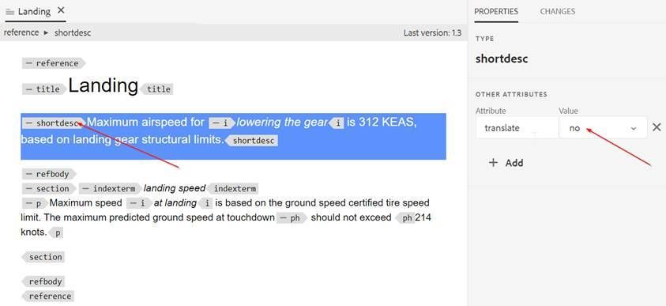

# Como excluir da tradução parágrafos dentro de um tópico

A maneira mais fácil é usar a tradução=sem atributo.

+ Os autores podem inserir o atributo adicional como **translation=no** nos parágrafos que não deseja traduzir. O fornecedor de tradução precisa ser informado e pode fazer a configuração ao final para ignorar o texto com esse atributo.
+ A tradução automática OOTB (com o conector de avaliação do Microsoft Translation) exibe o mesmo comportamento.
+ Testar com a tradução do Microsoft : se você definir **translate=no** atributo em nível de parágrafo, então não traduz o parágrafo completo. Esse atributo pode ser definido em qualquer elemento e o conteúdo dentro desse elemento não será traduzido.

Veja a seguir algumas capturas de tela para explicar isso mais detalhadamente:

**Conteúdo de origem**

**Conteúdo traduzido em espanhol**

