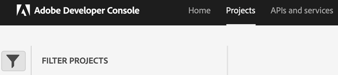
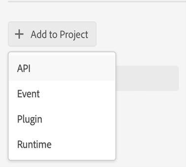

# Configurar a nova publicação baseada em microsserviços para guias de AEM as a Cloud Service

O novo microsserviço de publicação permite que os usuários executem grandes cargas de trabalho de publicação simultaneamente em Guias AEM as a Cloud Service e aproveitem a plataforma sem servidor Adobe I/O Runtime líder do setor.

Para cada solicitação de publicação AEM Guias as a Cloud Service executa um contêiner separado que é dimensionado horizontalmente de acordo com as solicitações do usuário. Isso fornece aos usuários os recursos para executar várias solicitações de publicação e obter desempenho melhor do que seus grandes servidores de AEM no local.

>[!NOTE]
>
> Atualmente, a publicação com base em microsserviços nos Guias AEM suporta apenas a saída PDF usando a publicação Native PDF ou por meio do DITA-OT. Adicionaremos suporte à publicação baseado em microsserviços para mais tipos de saída nas próximas versões.

Como o novo serviço de publicação em nuvem é protegido pela autenticação baseada em JWT do Adobe IMS, os clientes devem seguir as etapas abaixo para integrar seus ambientes com fluxos de trabalho de autenticação baseados em token seguro do Adobe e começar a usar a nova solução de publicação escalável baseada em nuvem.


## Criar configurações do IMS no Adobe Developer Console

**Função necessária para criar as configurações**: Administrador do sistema

Execute as seguintes etapas para criar configurações IMS no Adobe Developer Console:

1. Abra o Console do desenvolvedor: `https://developer.adobe.com/console`.

1. Mudar para **Projetos** da parte superior.

   

1. Para criar um novo projeto vazio, selecione **Projeto vazio** do **Criar novo projeto** lista suspensa.

   

1. Selecionar **API** do **Adicionar ao projeto** lista suspensa para adicionar a API de gerenciamento de E/S ao seu projeto.

   

   

1. Crie um novo par de chaves privadas/públicas ao adicionar a API. Isso baixará automaticamente a chave privada no sistema.

   

1. Salve a API configurada.

   

1. Volte para **Projetos** e clique em **Visão geral do projeto** à esquerda.

   

1. Clique em **Baixar** na parte superior para baixar o JSON de serviço.

   

Agora você configurou os detalhes de autenticação do JWT e também baixou a chave privada e os detalhes do serviço JSON. Mantenha esses dois arquivos acessíveis, pois eles são necessários na próxima seção.

### Adicionar configuração IMS ao ambiente

Execute as seguintes etapas para adicionar a configuração IMS ao ambiente:

1. Abra o experience manager e selecione o programa que contém o ambiente que deseja configurar.
1. Mudar para **Ambientes** guia .
1. Clique no nome do ambiente que deseja configurar. Isso deve navegar até a página Informações do ambiente .
1. Mudar para **Configuração** guia .
1. Carregue a chave privada e o JSON do projeto, conforme mostrado na captura de tela abaixo. Verifique se você está usando os mesmos nomes e a configuração realçada abaixo.

   

>[!NOTE]
>
> Você precisa abrir, copiar e colar o conteúdo da chave privada e do arquivo JSON de detalhes do serviço na coluna Valor do painel Configuração, como mostrado na captura de tela acima.

Depois de adicionar a configuração IMS ao ambiente, execute as seguintes etapas para vincular essas propriedades com Guias de AEM usando OSGi:

1. No código do projeto Git do cloud manager, adicione os dois arquivos abaixo (para o conteúdo do arquivo, consulte [Apêndice](#appendix)).

   * `com.adobe.aem.guides.eventing.ImsConfiguratorService.cfg.json`
   * `com.adobe.fmdita.publishworkflow.PublishWorkflowConfigurationService.xml`
1. Certifique-se de que os arquivos recém adicionados estejam sendo cobertos pelo `filter.xml`.
1. Confirme e envie suas alterações no Git.
1. Execute o pipeline para aplicar as alterações no ambiente .

Assim que isso for feito, você poderá usar a nova publicação em nuvem baseada em microsserviços.

## Apêndice {#appendix}

**Arquivo**:
`com.adobe.aem.guides.eventing.ImsConfiguratorService.cfg.json`

**Conteúdo**:

```
{
  "service.account.details": "$[secret:SERVICE_ACCOUNT_DETAILS]",
  "private.key": "$[secret:PRIVATE_KEY]"
}
```

**Arquivo**: `com.adobe.fmdita.publishworkflow.PublishWorkflowConfigurationService.xml`

**Conteúdo**:
* `dxml.use.publish.microservice`: Alterar para ativar a publicação de PDF com base em microsserviços usando DITA-OT
* `dxml.use.publish.microservice.native.pdf`: Alterar para ativar a publicação de PDF nativo com base em microsserviços

```
<?xml version="1.0" encoding="UTF-8"?>
<jcr:root xmlns:jcr="http://www.jcp.org/jcr/1.0" xmlns:sling="http://sling.apache.org/jcr/sling/1.0"
          jcr:primaryType="sling:OsgiConfig"
          dxml.publish.microservice.url="https://adobeioruntime.net/api/v1/web/543112-guidespublisher/default/publishercaller.json"
          dxml.use.publish.microservice="{Boolean}true"
          dxml.use.publish.microservice.native.pdf="{Boolean}true"
/>
```
