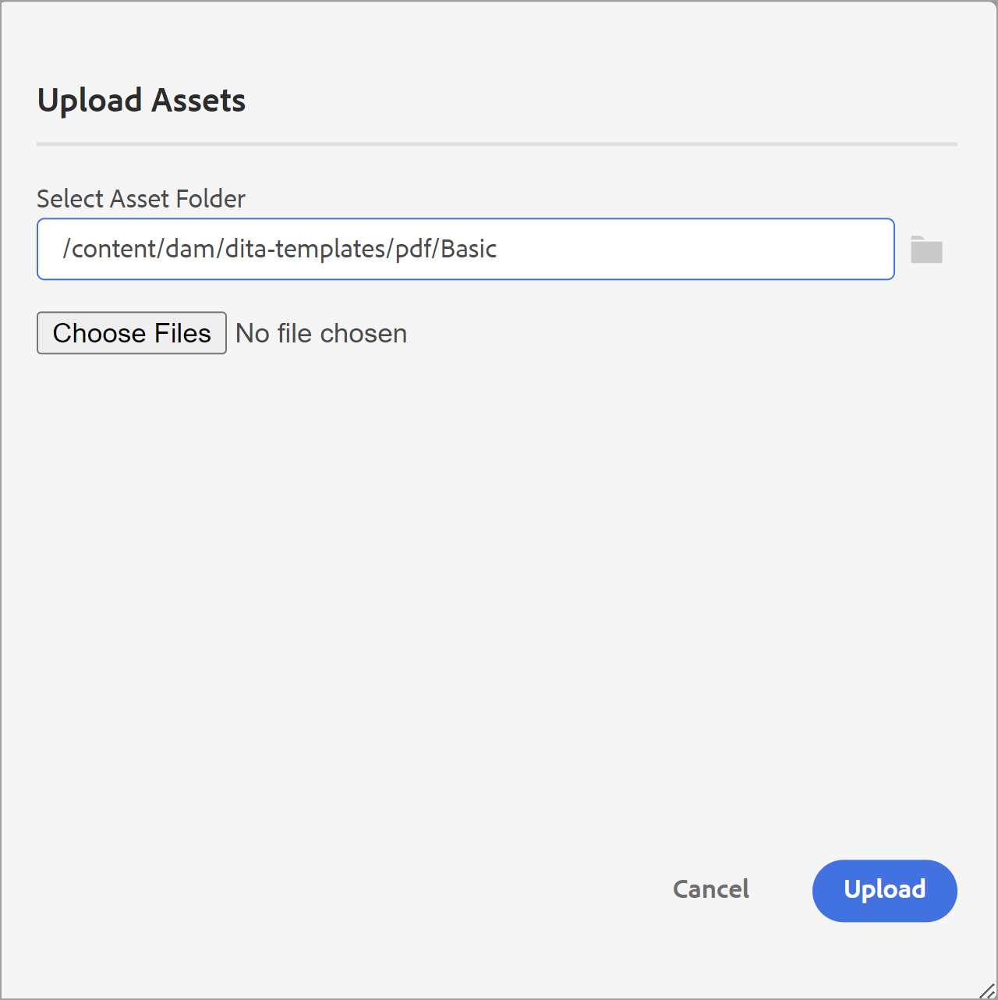

# Componentes de um template PDF {#components-pdf-template}

Um modelo de PDF tem quatro componentes: Layouts de página, folhas de estilos, recursos e configurações. Você pode criar um modelo personalizando esses componentes individuais e associando o modelo a uma predefinição de saída enquanto gera uma saída PDF. As seções a seguir abordam esses componentes e seu processo de personalização detalhadamente.

## Criar e personalizar layouts de página {#create-customize-page-layout}

As configurações no componente Layouts de página permitem que você crie a estrutura de uma página definindo o cabeçalho, o rodapé e a área de conteúdo em uma página. Usando o editor de layout de página WYSIWYG, você pode criar um layout de página para diferentes seções em um PDF, como as páginas de capa frontal e posterior, o capítulo, o Índice (TOC), o índice, a página em branco, a Lista de figuras (LOF), a Lista de tabelas (LOT), o glossário ou criar um layout para uma página personalizada. Nas Configurações do modelo de PDF, é possível atribuir um layout de página com seções diferentes em um PDF, que são usadas para gerar a saída do PDF.

### Criar um novo layout de página {#create-page-layout}

>[!NOTE]
>
>Existem layouts de página de exemplo que são enviados para uso imediato. Você pode personalizar ou criar novos layouts de página.

1. No Editor da Web, vá para o **Saída** guia .
1. Expanda a barra lateral esquerda e clique em **Modelos**.
1. Abra o template que deseja trabalhar.
   >[!NOTE]
   >
   >Você pode abrir um template clicando duas vezes em seu nome ou clicando no ícone > ao lado de seu nome.
1. Para criar um novo layout de página, siga um destes procedimentos:
   * Passar o mouse **Layouts de página** e clique em (*Opções* ícone ) **...** e escolha **Novo layout de página**.
   * No **Modelos** clique no painel **+** ícone ao lado de **Modelos** e escolha **Layout da página** no menu de contexto.

      Isso abre a caixa de diálogo Adicionar layout .

      
1. Especifique um nome para o novo layout de página.
   >[!NOTE]
   >
   >Evite usar caracteres especiais ao nomear um layout de página. Um espaço no nome é substituído por um sublinhado &quot;_&quot;.
1. Clique em **Concluído**.

   O novo layout é criado e adicionado em Layouts de página.

### Duplicação de um layout de página {#duplicate-page-layout}

1. No **Modelos** seção do template que deseja duplicar, clique duas vezes em **Layouts de página** ou clique no botão **>** ícone antes **Layouts de página**.

   Isso exibe a lista de layouts de página no modelo.

1. Passe o mouse sobre o layout da página que deseja duplicar e clique no link (*Opções* ícone ) **...** e selecione **Duplicar** no menu de contexto.

1. No _Duplicar layout_ digite um nome para o layout da página.

1. Clique em **Concluído**.
Uma cópia do layout de página selecionado é criada e adicionada em Layouts de página.

### Personalizar um layout de página {#customize-page-layout}

1. No **Modelos** seção do modelo que deseja editar, clique duas vezes em **Layouts de página** ou clique no botão **>** ícone antes **Layouts de página**.

   Isso exibe a lista de layouts de página no modelo.
1. Para personalizar qualquer layout de página, siga um destes procedimentos:
   * Clique duas vezes em qualquer layout de página.
   * Passe o mouse sobre qualquer layout de página e clique no (*Opções* ícone ) **...** e selecione **Editar** no menu de contexto.

   Isso abre o editor de layout de página para personalização.
1. Depois de fazer as alterações desejadas, clique em *Salvar tudo* ou `Crl+S`).

   Para obter mais informações sobre como definir elementos de layout individuais, como cabeçalho, rodapé, número de página, título e muito mais, consulte [Criar um layout de página](design-page-layout.md).

## Usar folhas de estilos para personalizar o PDF {#stylesheet-customization}

As configurações no componente Folhas de estilos permitem estilizar os componentes do layout da página e o conteúdo DITA usando o editor WYSIWYG ou trabalhar diretamente com o arquivo CSS. Você pode criar seus próprios estilos ou personalizar as propriedades de estilo padrão. O editor WYSIWYG oferece acesso à maioria das propriedades necessárias para criar um estilo no layout da página ou no conteúdo DITA. Para personalizações avançadas, você pode trabalhar diretamente na exibição Origem.

### Criar uma nova folha de estilos {#create-stylesheet}

Embora os arquivos CSS sejam fornecidos para conteúdo e layout, é possível criar uma nova folha de estilos para aplicar várias personalizações a um tipo de estilo específico que pode ser aplicado a um componente de destino. Por padrão, arquivos CSS de amostra são agrupados no produto. Esses arquivos CSS são destinados a ajudar você a organizar suas informações de estilo em conteúdos e layouts. Você pode optar por mesclar esses estilos em um único arquivo CSS ou em vários arquivos.

Por padrão, sempre que você cria um novo layout de página, a variável `layout.css` está incluído no novo layout de página. Se quiser que o layout da página contenha estilos de um arquivo CSS diferente, basta arrastar e soltar o arquivo CSS desejado na área de edição de conteúdo do novo layout de página. Para validar se o arquivo CSS foi incorporado no layout da página, alterne para a exibição Origem e você encontrará um link para o arquivo CSS na `<head>` elemento.

Para criar uma folha de estilos, siga as etapas abaixo:
1. No **Modelos** , execute um dos seguintes procedimentos:
   * Passe o mouse sobre **Folhas de estilos** e clique em (*Opções* ícone ) **...** e escolha **Nova folha de estilos**.
   * Clique no botão **+** ícone ao lado de **Modelos** e escolha **Folha de estilos** no menu de contexto.

   Isso abre a caixa de diálogo Adicionar folha de estilos .

   
1. Especifique um nome para a nova folha de estilos.
1. Clique em **Concluído**.

   Uma nova folha de estilos é criada e adicionada na seção Folhas de estilos .

### Criar um novo estilo {#create-style}

Por padrão, os arquivos CSS contêm estilos para cabeçalho, parágrafo, caractere, hiperlink, imagem, tabela, div, página e outros estilos. Você pode substituir o formato de estilo padrão ou criar um novo estilo.

Normalmente, você cria um novo estilo quando deseja associar um estilo personalizado a qualquer elemento DITA. Para que esses estilos personalizados funcionem, você deve garantir que esteja associando o nome da classe do estilo ao atributo outputclass do elemento DITA.

Para criar um novo estilo, siga as etapas abaixo:
1. Clique com o botão direito do mouse em qualquer estilo e escolha Novo estilo no menu de contexto.

   Isso abre a caixa de diálogo Adicionar estilo .

   
1. No **Tag** , escolha uma tag para a qual deseja criar um novo estilo.
1. Especifique um **Classe** nome.

   Esse nome de classe deve ser associado ao atributo outputclass da tag no conteúdo de origem.
1. Selecione um **Pseudo Classe** para melhorar o estilo do elemento.
1. Clique em **Concluído**.

   Um novo estilo é criado e adicionado sob o estilo base.

### Personalizar um estilo predefinido ou novo {#customize-style}

Depois de criar um novo arquivo CSS com estilos padrão ou personalizar estilos em um arquivo CSS existente, você pode usar o editor de estilos para fazer isso.

Para personalizar um estilo, siga as etapas abaixo:
1. Clique duas vezes em **Folhas de estilos** ou clique no botão **>** ícone antes **Folhas de estilos**.

   Isso exibe os arquivos CSS padrão (Conteúdo e Layout) e personalizados.
1. Abra uma folha de estilos para edição.

   Para abrir a folha de estilos para edição, siga um destes procedimentos:
   * Clique duas vezes no nome da folha de estilos.
   * Passe o mouse sobre o nome da folha de estilos, clique em (ícone Opções) ... e escolha Editar.

   Isso abre a folha de estilos para edição e exibe a lista de estilos no painel Estilos.

   

1. Para personalizar um estilo, clique duas vezes em um estilo ou clique no ícone > antes de um estilo para exibi-lo e personalizá-lo usando o editor Estilos .

para obter detalhes sobre como trabalhar com os estilos mais comuns, consulte [Trabalhar com os estilos de conteúdo comuns](stylesheet.md)

## Trabalhar com recursos {#work-with-resources}

Este é um contêiner para todos os ativos usados para criar um modelo. Pense nela como uma pasta, que contém ativos como imagens de fundo, fontes personalizadas, logotipos e muito mais. Sempre que você adiciona um ativo em seu modelo, ele é carregado ou conectado à pasta de ativos. Em seguida, você pode usar esses ativos para personalizar ou projetar seus modelos de PDF.

Para adicionar um arquivo de ativo à pasta Resources , siga as etapas abaixo:
1. Passe o mouse sobre a guia Resources folder , clique em (Options icon) ... e escolha Import.

   Isso abre a caixa de diálogo Fazer upload de ativos .

   

   O caminho onde o arquivo de ativo será carregado é mostrado na variável **Selecionar pasta de ativos** campo.
   >[!NOTE]
   >
   >Não é possível alterar o caminho para fazer upload de ativos. Por padrão, todos os ativos são armazenados no `/content/dam/dita-templates/pdf/<PDF-template-name>` pasta.

1. Clique em **Escolher arquivos** para navegar pelo arquivo de ativos do computador local

1. Clique em **Fazer upload**.
O arquivo selecionado é importado e listado na pasta Resources .

## Configurações avançadas de PDF {#advanced-pdf-settings}

Use a seção Configurações para definir as configurações avançadas para o layout da página, iniciando PDF ou página par, formatos para as referências cruzadas e ativando as marcas de impressão no PDF final gerado com o modelo.

Para configurar, clique em **Configurações** no **Modelos** painel para exibir as seguintes opções:

**Geral**

Defina as configurações básicas para iniciar um capítulo a partir de uma página ímpar ou par, a estrutura TOC e defina o formato de linha líder para as entradas TOC. Você pode definir a seguinte configuração:

* **Sempre iniciar capítulo de**: Permite definir como cada capítulo é publicado na PDF final. Você pode escolher entre uma **Nova página**, **Página ímpar** ou **Página par** opções. Se você optar por iniciar um novo capítulo a partir de uma página ímpar, uma página em branco será inserida depois de um capítulo que termina em uma página ímpar. Por exemplo, se o capítulo terminar na página número 15, o processo de publicação inserirá um 16 em brancoth para que o novo capítulo possa começar a partir do 17th página.

* **Iniciar cada tópico de uma nova página**: Se quiser que cada tópico do capítulo inicie a partir de uma nova página, selecione **Iniciar cada tópico de uma nova página** opção. Se quiser manter seus tópicos em continuação sem lacunas de página, desmarque essa opção.

* **Estrutura do sumário**: Permite personalizar a hierarquia do Índice. Ele usa as seguintes configurações adicionais:

   * **Usar Cabeçalhos até o Nível**: Ele permite ajustar o número de níveis de cabeçalho a serem exibidos na estrutura TOC do seu PDF.
   * **Não mostrar o número da página para o primeiro nível no sumário**: Selecione essa opção para ocultar os números de página correspondentes para todos os capítulos que contêm tópicos aninhados ou secundários. Considere o exemplo a seguir em que uma saída é criada sem selecionar essa opção.

   

   No exemplo acima, Configurações avançadas de PDF, Apêndice e Legal são os títulos de tópico de primeiro nível ou títulos de capítulo. Um número de página é atribuído a todos esses cabeçalhos.

   Agora, se você selecionar essa opção e gerar a saída, você obterá o seguinte TOC:
   

   Aqui, você pode observar que as configurações do primeiro capítulo do PDF Avançado não recebem nenhum número de página, pois tem tópicos aninhados ou secundários. Ao passo que um número de página é atribuído ao Apêndice e Legal porque são tópicos independentes sem nenhum tópico filho.

* **Formato Leader**: Use o menu suspenso para selecionar linhas pontilhadas, sólidas ou de pontilhado de espaço para conectar os níveis de cabeçalho aos números de página correspondentes.
Para aplicar a estrutura do sumário e os níveis de cabeçalho de estilo, consulte [Adicionar um sumário de capítulo](design-page-layout.md#add-chapter-toc).

   >[!NOTE]
   >
   >Se você for um desenvolvedor de CSS, também poderá definir o formato de pontilhado diretamente no arquivo CSS.
* **Usar marcador de continuação de tabela**: Selecione essa opção para definir marcadores para tabelas longas que se espalham por várias páginas. <!--For more information on using table continuation markers, see Use table continuation markers.-->

**Layouts de página**

As configurações de Layouts de página oferecem controle total sobre como especificar qual layout de página deve ser usado em uma seção específica do documento. Por exemplo, para selecionar um layout para o Índice, clique no menu suspenso no campo TOC e selecione o layout projetado para gerar o TOC.

Se você não tiver criado um layout para uma seção específica do documento, poderá simplesmente escolher um layout que sirva como layout padrão para essas seções ou tópicos. O layout de página padrão é aplicado a todas as seções que não têm um layout de página dedicado.

Da mesma forma, se você quiser uma capa e uma página de trás, deverá ter um layout de página criado e aplicado nas configurações. Caso contrário, o PDF não conterá a tampa e as páginas de trás.

Para obter mais informações sobre layouts de página, consulte [Criar um layout de página](design-page-layout.md).

**Imprimir**

Configure as configurações de produção de impressão para atribuir marcas de impressora, selecionar modelos de cores e especificar propriedades relacionadas à impressão da saída do PDF.

* **Marcas da impressora**: Quando você prepara um documento para produção de impressão, as marcas da impressora são adicionadas aos limites da página para auxiliar no alinhamento, aparas e seleção de cor adequados durante a impressão. Ao selecionar um sinal de impressora, o limite da página é estendido para acomodar a marca, que é cortada durante a impressão. Você pode optar por exibir as seguintes marcas de impressora na saída do PDF:
   * **Marcas de Aparar**: Selecione a opção para colocar uma marca em cada canto da área de aparagem para indicar onde o papel precisa ser cortado após a impressão.
   * **Marcas de Sangria**: Selecione para colocar uma marca em cada canto da caixa de sangria para indicar a área de aparagem da imagem estendida.
   * **Marcas de Registro**: Selecione para colocar uma marca fora da área de corte para alinhar as diferentes separações em um documento colorido.
   * **Barras de cores**: Selecione para adicionar uma faixa de cores fora da área de aparagem para manter a consistência de cores e ajustar a densidade da tinta ao imprimir.

   Definir dimensões para as marcas de impressora selecionadas usando o **Largura da linha**, **Cor da linha** e **Largura da Caixa Sangria** opções.

* **Tamanho da caixa de mídia**: Esse é o tamanho geral da página, incluindo a área estendida ocupada pelas marcas da impressora. Use a opção suspensa para selecionar o tamanho da página para a saída do PDF ou criar seu próprio tamanho personalizado.

* **Espaço da cor**: Você tem a opção de escolher espaços de cores RGB ou CMYK para imprimir seu documento PDF. Escolha RGB para exibir o PDF gerado digitalmente e CMYK para impressão física. As cores definidas no documento são convertidas no espaço de cores escolhido.
   >[!NOTE]
   >
   >Um perfil de cor ICC é necessário para a criação de PDF/A se estiver usando o espaço de cores CMYK.

   <!--For more information on applying these print settings, see *Printing preferences*.-->

**Referências cruzadas**

Use a guia Cross-reference para definir como as referências cruzadas são publicadas no PDF. É possível formatar as referências cruzadas para título de tópico, tabelas, figuras e muito mais. <!--For more information, see *Format cross-references*.-->
