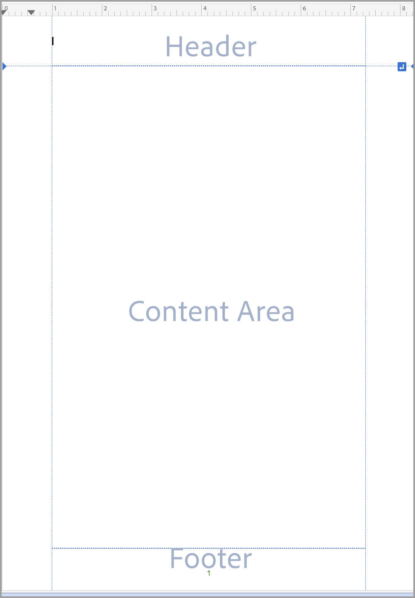
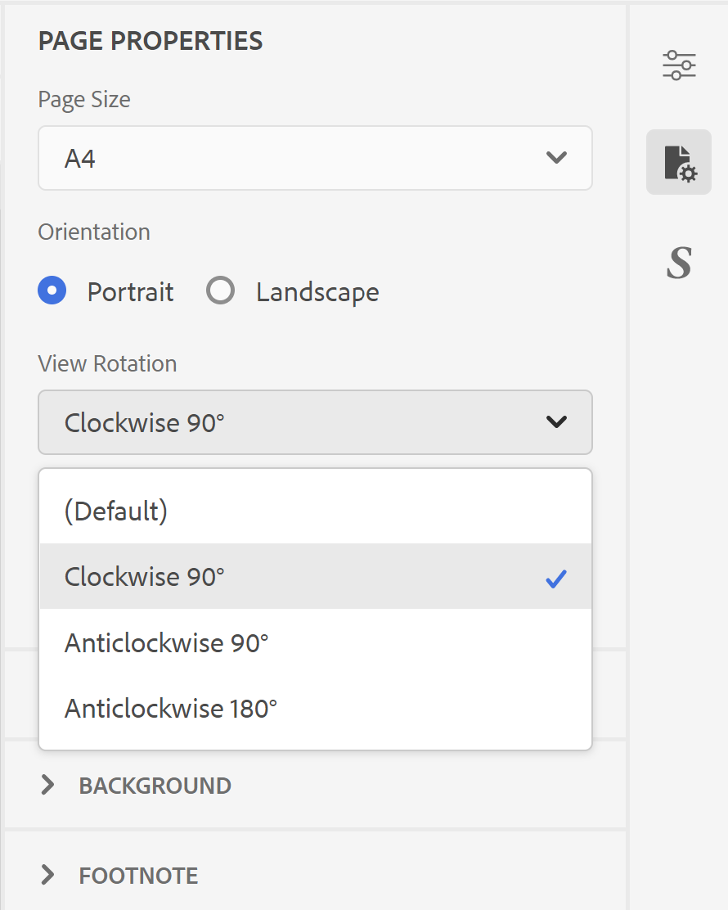
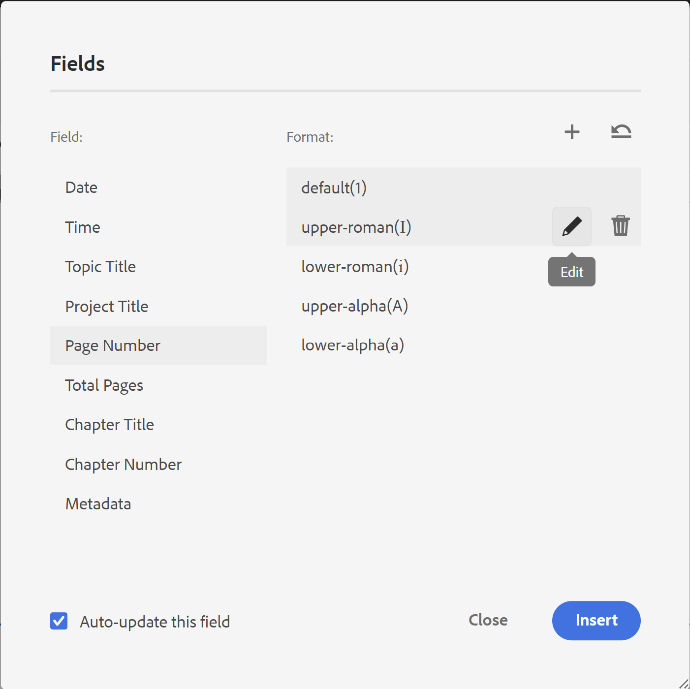
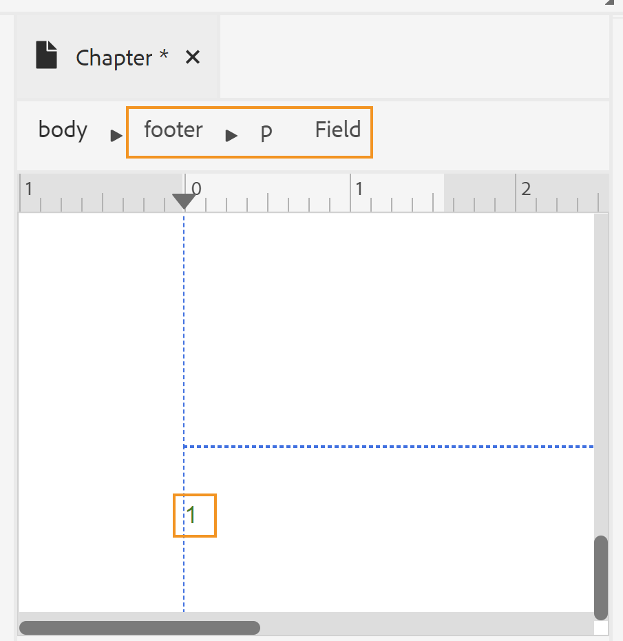

# Criar um layout de página {#design-page-layout}

Ao criar um documento do PDF, você teria seções diferentes para apresentar diferentes tipos de informações. Por exemplo, um documento de PDF começaria de uma página inicial ou de capa, que teria o logotipo, o título do livro ou as informações da versão da sua empresa. Em seguida, haveria capítulos, apêndices ou páginas de glossário. Cada seção em um documento do PDF parece diferente e isso é obtido pela criação e personalização do layout da página.

Ao projetar o layout da página, você pode definir os vários elementos que compõem uma página. Por exemplo, você pode definir o tamanho da página, as margens, o cabeçalho e o rodapé, a orientação e outras especificações da página em uma página. O recurso Publicação nativa de PDF permite que você crie sua página de acordo com a [Padrões de mídia de página](https://www.w3.org/TR/css-page-3/). A maioria das configurações abrangidas pelos padrões de Mídia paga pode ser facilmente personalizada usando a interface do usuário do recurso de Publicação nativa PDF. Para alguma outra formatação de nível avançado, você pode usar a Visualização de origem para gravar seu próprio código CSS.

Depois de criar os layouts de página, é necessário associar esses layouts às respectivas seções nas configurações de Layout de página do PDF. Consulte a [Criar e personalizar layouts de página](components-pdf-template.md#create-customize-page-layout) para obter detalhes sobre como criar e abrir um layout de página para personalização.

## Tipos de layouts de página {#types-of-page-layout}

Um documento PDF normalmente contém as seguintes seções:

* Capa
* Índice
* Aumento de números
* Aumento das tabelas
* Capítulo ou páginas de tópico
* Glossário
* Índice
* Página de trás

Essas seções precisariam de um layout de página correspondente para apresentar as informações em um formato específico. Além disso, também é possível ter uma página em branco usada como usuário para iniciar um novo capítulo de uma página ímpar ou par. Nesse caso, é possível usar o layout padrão da página ou criar um layout de página para uma página em branco. Consulte [Criar um novo layout de página](components-pdf-template.md#create-page-layout) para obter mais detalhes.

As configurações de Layouts de página na seção **Modelo>Configurações** permitem definir qual layout de página deve ser usado para diferentes seções do PDF. Cada layout de página pode ter diferentes variantes de página inicial, direita ou esquerda.

### Criar as variantes de layout da página inicial, direita ou esquerda {#page-layout-variants}

Diferentes layouts de página no modelo de PDF podem ser personalizados com diferentes variantes de layout de página inicial, direita ou esquerda. Você pode criar essas páginas de forma diferente usando o designer de layout de página.

>[!NOTE]
>
>Se quiser ter um layout de página único para uma seção do seu livro, não será necessário criar os layouts de página Primeiro, Direita ou Esquerda.

Considere os seguintes pontos ao criar layouts de página:

>[!NOTE]
>
>Os pontos a seguir tomaram o layout da página Capítulo como exemplo. No entanto, esses pontos também são válidos para outros layouts de página.

* Se você quiser usar um layout de página único para todas as páginas em um capítulo, crie apenas um layout de página de capítulo sem qualquer variante.

* Se você quiser ter uma aparência diferente para a primeira página de capítulos em seu livro, será necessário criar uma variante de layout Primeira página para seus capítulos.

* Se você quiser ter uma aparência diferente para cada página lateral esquerda e direita do seu livro, será necessário criar as variantes dos lados esquerdo e direito para o layout da página de capítulo.

* Se você quiser que seus capítulos iniciem de uma página ímpar ou par, poderá optar por criar um layout de página para a página em branco. Esse layout de página é usado para preencher a lacuna entre dois capítulos, para garantir que o capítulo inicie da página ímpar ou par desejada.

   >[!NOTE]
   >
   >Se você não criar um layout de página em branco separado, o layout padrão da página será usado. Para criar um layout de página, consulte [Criar um novo layout de página](components-pdf-template.md#create-page-layout).

O exemplo a seguir guiará você pelo processo de criação de variantes de um layout de página:

1. Crie um layout de página do &quot;Capítulo&quot; usando as etapas fornecidas em &quot;Criar um novo layout de página&quot;.

   Um layout de página do Capítulo em branco é criado e adicionado sob os Layouts da página.

   Por padrão, ao criar um layout de página, ele também é aberto para edição. A captura de tela a seguir exibe um layout de página em branco (padrão):

   

   A área de cabeçalho, rodapé e conteúdo em um modelo é criada por padrão. Você pode personalizar essas áreas facilmente usando as propriedades da página, as propriedades de conteúdo e várias ferramentas (como inserir imagens, campos e muito mais) fornecidas na interface do usuário.

   >[!NOTE]
   >
   >Para configuração avançada, você pode usar a Visualização de origem e adicionar o HTML personalizado e o código CSS.

1. Passe o mouse sobre **Capítulo** e clique em **Opções** para exibir o menu de contexto.

1. Clique ou passe o mouse sobre o mouse **Adicionar variável de layout** e escolha o layout de página desejado (Primeiro, Esquerda ou Direita) que deseja criar.

O layout de página selecionado é criado usando uma cópia do layout básico do Capítulo. Isso significa que, se você tiver alterado o layout padrão da página do Capítulo, as mesmas alterações serão replicadas no layout da página variante no momento da criação do layout da página.

## Trabalhar com as Propriedades da página de um layout de página {#page-props-page-layout}

Ao projetar um layout de página, é essencial ter controle sobre várias propriedades da página. O recurso Publicação nativa PDF encapsula todas as principais propriedades da página no painel Propriedades da página. O painel Propriedades da página fornece acesso a várias propriedades nas seguintes seções:

>[!NOTE]
>
>O painel Propriedades da página encapsula as propriedades e segue as regras definidas no [Padrões de mídia de página](https://www.w3.org/TR/css-page-3/).

* **Tamanho da página** : Especifique o tamanho de página que deseja usar para o layout de página. A lista suspensa Tamanho da página permite escolher entre mais de 15 tamanhos de página. Você também pode criar um layout de página usando um tamanho de página personalizado, consulte [Definir o tamanho da página](#set-page-size) para obter mais detalhes.

* **Orientação** : Especifique a orientação de página a ser usada para o layout de página. É possível escolher entre as orientações da página Retrato ou Paisagem. Observe que é possível optar por ter diferentes orientações aplicadas a diferentes variantes de página em um layout de página. Por exemplo, se o conteúdo contiver uma tabela larga ou uma imagem grande, você poderá criar um layout de página paisagem e aplicar esse layout à tabela ou imagem mais ampla.

* **Exibir rotação** : Especifique o lado ou a direção em que o lado superior original é representado após a rotação. Você pode escolher 90 graus no sentido horário, 90 no sentido anti-horário ou 180 graus no sentido anti-horário. Isso é muito útil em uma situação em que você deseja usar uma combinação de layouts Retrato e Paisagem na saída. Por exemplo, é possível usar o retrato como o layout de página genérico e definir um layout de página paisagem para renderizar tabelas amplas. Nessa situação, é possível definir para exibir o conteúdo da tabela em 90 graus no sentido horário. Dessa forma, a página será orientada em paisagem e o conteúdo será girado 90 graus para manter a continuidade na exibição. Veremos como isso será feito posteriormente nesta seção.

* **Reinicie a numeração a partir de** : Especifique o número de página de onde a numeração para este layout de página será iniciada. Por exemplo, é possível definir o número de página para reiniciar em cada capítulo. Nesse caso, é necessário definir a propriedade Restart Numbering From para 1 na variante de layout First page do layout da página de capítulo.

* **Layout** : Especifique as margens da página junto com o preenchimento para os lados superior, inferior, esquerdo e direito. A ilustração a seguir explica como as margens, o preenchimento e as bordas são renderizados em torno do conteúdo. Observe que a margem na parte superior e inferior de uma página contém o cabeçalho e o rodapé.

   

* **Histórico** : Inclua uma imagem ou uma cor como o plano de fundo do layout da página. Para uma imagem, é possível especificar a altura e a largura da imagem, juntamente com as propriedades de repetição e posição.

* **Nota** : Especifique as propriedades para exibir notas de rodapé em sua saída. Você pode optar por especificar as margens e as propriedades de preenchimento, juntamente com um estilo de borda.

### Definir o tamanho da página {#set-page-size}

A primeira coisa que você precisa definir em um layout de página é o tamanho da página. Nas Propriedades da página, há mais de 15 tamanhos de página que você pode escolher para um layout de página. Você também pode criar um tamanho de página personalizado executando as seguintes etapas:

1. Abra o layout de página necessário para edição.

   >[!NOTE]
   >
   >Consulte [Personalizar um layout de página](components-pdf-template.md#customize-page-layout) seção para abrir um layout de página para personalização ou edição.

1. No painel direito, clique em **Propriedades da página**.
1. No **Tamanho da página** , selecione **Personalizado**.

   Os campos Largura da página e Altura da página são exibidos.

1. Insira as dimensões de página desejadas na **Largura da página** e **Altura da página** campos.

   >[!NOTE]
   >
   >Algumas das unidades mais usadas são px (pixels), pt (pontos), rem, em, % (porcentagem) e em (polegadas).

### Usar a orientação de página e a rotação de visualização {#page-orientation-rotation}

Vamos ver um exemplo em que uma combinação de orientação de página retrato e paisagem e propriedades de rotação de visualização é usada. Neste exemplo, criaremos um PDF com a orientação de retrato padrão, mas uma tabela será renderizada na orientação de paisagem com conteúdo na exibição de 90 graus no sentido horário. A saída final será semelhante a:


Na saída acima, as informações da Lista de contatos são apresentadas no modo paisagem com o conteúdo também girado em 90 graus. O conteúdo restante é exibido no modo de retrato normal.

Para alcançar esse tipo de saída, precisamos executar as seguintes tarefas principais:

1. Crie um layout de página com a orientação Paisagem.

1. Altere o **Exibir rotação** propriedade para renderizar o conteúdo em 90°.

1. Crie um estilo personalizado para usar o novo layout de página.

1. Adicione o estilo na definição de classe de saída da tabela que queremos renderizar no layout da página paisagem.

Execute as seguintes etapas para realizar as tarefas acima:

1. Crie um layout de página com a orientação Paisagem.
   1. Crie um layout de página &quot;Paisagem&quot; usando as etapas fornecidas em &quot;Criar um novo layout de página&quot;.

   1. No painel direito, clique em **Propriedades da página**.

      
   1. Altere o **Orientação** para **Paisagem**.

1. Altere a propriedade Exibir rotação para renderizar o conteúdo em 90° no sentido horário.

   1. Selecionar **90° no sentido horário** na lista suspensa Exibir rotação .

   

   1. Clique em **Salvar tudo** para salvar as propriedades atualizadas do layout da página.

1. Crie um estilo personalizado para usar o novo layout de página.
   1. Expanda a barra lateral esquerda e clique duas vezes no modelo no qual deseja criar o estilo.

   1. Expanda a seção Folhas de estilos .

   1. Passe o mouse sobre a folha de estilos Layout e clique no botão (_Opções_ ícone ) ... e escolha Editar.

      A folha de estilos Layout é aberta para edição.

   1. Clique com o botão direito em **Outros estilos** e escolha **Novo estilo**.
      

   1. No pop-up Adicionar estilo , insira **estilo paisagem** no **classname**.
      

   1. Clique em **Concluído**.

      Um novo estilo chamado `.landscape-style` é criado e adicionado ao final da lista Outros estilos .

   1. Clique duas vezes no `.landscape-style` estilo para abri-lo para edição.

   1. Expanda o **Paginação** propriedade.

   1. Enter `Landscape` no **Layout da página** propriedade.

      

   1. Clique em **Salvar tudo** para salvar as propriedades de estilo atualizadas.

1. Adicione o estilo na `outputclass` definição da tabela que queremos renderizar no layout da página paisagem.
   1. Em um editor de arquivos DITA, abra o arquivo no qual deseja aplicar o novo layout de página.

   1. Encontre a `<table>` elemento , que deve ser renderizado no modo Paisagem.

   1. Na navegação estrutural, clique no elemento da tabela para selecionar a tabela.

      

   1. No painel direito, clique em e abra o painel Propriedades de conteúdo .

   1. No painel Propriedades de conteúdo , adicione um novo **outputclass** propriedade com **estilo paisagem** como valor da propriedade.

      

1. Clique em **Salvar tudo** para salvar o arquivo atualizado.
1. Gere a saída do PDF.

O PDF final terá o conteúdo da tabela renderizado no modo paisagem, como mostrado no início do exemplo.

### Adicionar uma imagem de plano de fundo {#add-bg-image}

Com base em seus requisitos, você pode adicionar uma imagem de fundo que aparecerá em cada primeira página de uma saída do Capítulo (PDF). As propriedades de Plano de fundo em Propriedades da página permitem adicionar facilmente uma imagem de plano de fundo. Você pode optar por replicar essa imagem em uma página e posicioná-la em qualquer lugar na parte superior, inferior ou central da página.

Por exemplo, para inserir uma imagem de plano de fundo na parte central da área de conteúdo, execute as seguintes etapas:

1. Abra o layout de página necessário para edição.

   >[!NOTE]
   >
   >Consulte [Personalizar um layout de página](components-pdf-template.md#customize-page-layout) seção para abrir um layout de página para personalização ou edição.

1. Clique em qualquer lugar na área de conteúdo.

1. No painel direito, clique em **Propriedades da página**.

1. Expanda o **Histórico** seção.

1. Clique no botão Procurar na **Caminho da imagem** campo de localização.

1. Procure e selecione a imagem que deseja usar como imagem de plano de fundo.

   A imagem é inserida e replicada para abranger a página inteira.

1. Altere o tamanho da imagem ajustando as propriedades de altura e largura.

   >[!NOTE]
   >
   >É possível inserir qualquer uma das propriedades de altura ou largura, já que a imagem é dimensionada automaticamente para manter a proporção.

1. Defina as outras propriedades para ajustar a forma como deseja que a imagem de plano de fundo apareça.

   * **Repetição em segundo plano** : Especifique se deseja que o plano de fundo se repita ou não.

   * **Posição do Plano de Fundo** : Especifique uma posição para a imagem de plano de fundo na sua página.

A captura de tela a seguir exibe a imagem de plano de fundo com a propriedade Repetição de plano de fundo definida como _sem repetição_ e a propriedade Posição do Plano de Fundo definida como _centro_.


## Trabalhar com o cabeçalho e o rodapé da página {#work-header-footer}

Ao incluir informações em um cabeçalho ou rodapé em um layout de página, essas informações são repetidas em todas as páginas que usam esse layout de página. Normalmente, a área do cabeçalho é usada para o título do capítulo ou do tópico e a área do rodapé é usada para mostrar números de página.

Ao criar um novo layout de página, a área de cabeçalho e rodapé é criada por padrão. É possível fazer muitas personalizações na área de cabeçalho e rodapé de um layout de página. Por exemplo, é possível inserir uma imagem (como um logotipo), variáveis (contendo informações dinâmicas) ou conteúdo estático.

### Alterar as margens e linhas do cabeçalho e do rodapé {#header-footer-margins}

Por padrão, as margens do cabeçalho e do rodapé são definidas como 1 polegada. Você pode alterar esse valor padrão alterando a configuração Margem no painel Propriedades da página . Execute as seguintes etapas para alterar o tamanho do cabeçalho e do rodapé:

1. Abra o layout de página necessário para edição.

   >[!NOTE]
   >
   >Consulte [Personalizar um layout de página](components-pdf-template.md#customize-page-layout) seção para abrir um layout de página para personalização ou edição.

1. No painel direito, clique em **Propriedades da página**.
1. Expanda o **Layout** seção.
1. Clique no ícone de cadeado ao lado do **Margem** propriedade.
1. Para alterar o tamanho do cabeçalho, insira o valor desejado no campo Margem superior .

   >[!NOTE]
   >
   >Algumas das unidades mais usadas são px (pixels), pt (pontos), rem, em, % (porcentagem) e em (polegadas).

1. Para alterar o tamanho do rodapé, insira o valor desejado no campo Bottom margin .

É possível criar a área de cabeçalho e rodapé para conter várias linhas. Para fazer isso, adicione um \&lt;p> usando a tag Inserir elementos de HTML () na área do cabeçalho ou rodapé.

| _Canto do desenvolvedor_:  |
|---|

Se você quiser trabalhar diretamente com o CSS e o HTML code, poderá alterar os valores da margem, como mostrado no seguinte trecho de código:

```css
…

<meta name="page-style" content="size:A4 portrait;margin-top:3cm;margin-right:30pt;margin-bottom:1in;margin-left:90px;" />

…
```

>[!NOTE]
>
>No exemplo acima, unidades diferentes são usadas para especificar os valores de margem.

### Remova o cabeçalho e o rodapé {#remove-header-footer}

A sobreposição de cabeçalho e rodapé nas margens superior e inferior. Tecnicamente, isso significa que, se você quiser ter um cabeçalho e um rodapé no layout da página, deverá reservar o espaço necessário nas margens superior e inferior.

Se você não quiser que um layout de página tenha um cabeçalho e um rodapé, há duas maneiras de fazer isso:

* Se desejar manter as margens superior e inferior, deixe a área do cabeçalho e do rodapé em branco.
* Se você não quiser reter as margens superior e inferior (como projetar a tampa frontal e traseira de uma revista), poderá remover as margens definindo as propriedades de margem superior e inferior como 0. Isso não deixa espaço para o cabeçalho e o rodapé.

### Adicionar uma imagem ou um logotipo no cabeçalho {#add-image-header}

Com base em suas necessidades, talvez você queira adicionar uma imagem que apareça na área de cabeçalho (ou em qualquer outra parte) do layout da página. Há duas maneiras de adicionar uma imagem ao layout da página:

* Use uma imagem do modelo Recursos.
* Use o \&lt;add image=&quot;&quot;> no editor de layout de página.

>[!NOTE]
>
>É recomendável usar a pasta Resources para gerenciar todos os ativos do modelo, como imagens ou fontes.

Para inserir uma imagem como o logotipo da sua empresa na área de cabeçalho, execute as seguintes etapas:

1. Abra o layout de página necessário para edição.

>[!NOTE]
>
>Consulte [Personalizar um layout de página](components-pdf-template.md#customize-page-layout) seção para abrir um layout de página para personalização ou edição.

1. Clique em Editar cabeçalho () para trazer o cursor para a área do cabeçalho.

   Ou clique dentro da área do cabeçalho.

1. Para adicionar uma imagem, escolha qualquer um dos seguintes métodos:
1. Clique no botão **Inserir imagem** () na barra de ferramentas; no **Selecionar caminho** , navegue até o local da imagem e clique em **Selecionar** para inseri-lo na área de cabeçalho.
1. Arraste e solte uma imagem da pasta Resources na área de cabeçalho.

A captura de tela a seguir mostra uma imagem de amostra adicionada na área do cabeçalho.


Depois que uma imagem é inserida, você pode modificar seus atributos para dar a ela a aparência desejada. A maneira mais fácil de alterar a aparência de uma imagem ou de qualquer outro elemento no layout da página, use o painel Propriedades do conteúdo . Consulte [Trabalhar com o painel Propriedades de conteúdo](#work-with-content-props) para as várias propriedades disponíveis por meio da interface do usuário personalizada.

### Adicionar campos e metadados {#add-fields-metadata}

Os campos são muito úteis quando você deseja inserir uma parte das informações predefinidas. Por exemplo, você pode incluir um campo Título de capítulo na área de cabeçalho do capítulo que é substituído pelo título do capítulo real quando publicado.

Existem as seguintes categorias para campos que podem ser inseridas no layout da página:

* Data
* Hora
* Título do tópico
* Título do projeto
* Número da página
* Página Total
* Título do capítulo
* Número do capítulo
* Metadados

Cada uma dessas categorias de campo contém diferentes variações nas quais as informações de campo podem ser inseridas. Por exemplo, um campo Data pode ter variações diferentes, como `YYYY-MM-DD`, `MM/DD/YY`, `MM/DD/YYYY` e assim por diante. Da mesma forma, o Número de página pode ter variações na forma de formatos romanos, decimais ou até mesmo específicos à localidade, como _Árabe_, _Devanágari_, _Hebraico_ e muito mais.

Além dos campos predefinidos, também é possível adicionar informações de metadados como variáveis ou campos no layout da página. Esses metadados são armazenados no conteúdo do mapa DITA de origem e podem ser facilmente inseridos no layout da página. <!--For more information, see [Add fields and metadata](design-page-layout.md#add-fields-and-metadata).-->

No exemplo a seguir, inserimos um número de página e um título de capítulo na área de rodapé de um layout de página.

1. Abra o layout de página necessário para edição.

   >[!NOTE]
   >
   >Consulte [Personalizar um layout de página](components-pdf-template.md#customize-page-layout) seção para abrir um layout de página para personalização ou edição.

1. Clique no botão **Editar rodapé** () para trazer o cursor para a área do rodapé.

   Ou clique dentro da área do rodapé.

1. Insira um elemento de parágrafo clicando no botão **Inserir elementos de HTML** () e selecionando Parágrafo na lista de elementos.

1. Clique no botão **Inserir campos** ().

   A janela pop-up Campos é exibida.

1. Selecione o **Número da página** na lista Campo, a categoria **default(1)** formato de número de página na lista Formato e clique em **Inserir**.

   

   >[!NOTE]
   >
   >Também é possível editar o formato de todos os campos, exceto o formato padrão. Para fazer isso, clique no ícone Edit ao lado do formato que deseja editar, faça alterações e clique em OK. Para obter mais informações, consulte [Adicionar campos e metadados](#add-fields-metadata).

   O campo de número de página padrão é inserido na área de rodapé do layout da página.

   

   A navegação estrutural superior lista os elementos em que as informações são armazenadas.

1. Insira um espaço em branco depois do campo de número de página e clique no botão **Inserir campos** ícone .

1. Selecione o **Título do capítulo** na lista Campo, a categoria **Título do capítulo** na lista Formato e clique em **Inserir**.

   O _Título do capítulo_ , que é preenchido com o título do capítulo no momento da publicação, é inserido na área do rodapé. No momento, o número da página e os campos do título do capítulo são separados por um espaço.

   

1. Para alinhar o Título do capítulo à direita, execute as seguintes etapas:

   1. Clique no elemento Campo na navegação estrutural para selecionar o campo Título do capítulo .

   1. No painel direito, clique no botão **Propriedades de conteúdo** () ícone.

   1. Expanda o **Layout** e defina a **Flutuar** valor da propriedade para **right**.
      

      O campo Título do capítulo é alinhado ao lado direito do rodapé da página.
      


| _Canto do desenvolvedor_:  |
|---|

Se você quiser trabalhar diretamente com o CSS e o HTML code, também poderá fazer isso acessando a Exibição da fonte do layout da página e fazendo alterações no código. O trecho de código a seguir mostra a mesma configuração de rodapé feita pelo código:

```css
…
<p>

<span data-field="page-number" data-format="default">1</span>

<span data-field="chapter-title" data-format="default" style="float: right">Chapter Title</span>

</p>
…
```

## Trabalhar com área de conteúdo {#content-area}

A área de conteúdo é a maior área em termos de espaço de conteúdo. A área de conteúdo é preenchida com o conteúdo de seu tópico. Em alguns casos especiais, é possível adicionar conteúdo estereotipado à área de conteúdo. Esse conteúdo é publicado no local especificado no layout da página. Por exemplo, o cabeçalho no índice, no glossário e no índice pode ser adicionado como conteúdo estereotipado, que é publicado &quot;no estado em que se encontra&quot; na saída final. Outro exemplo é o índice de capítulo, que normalmente é adicionado na primeira página de cada capítulo.

Uma das personalizações mais usadas na área de conteúdo é o layout de várias colunas. Com o poderoso designer de layout de página, é possível personalizar páginas específicas para renderizar várias colunas, mantendo o conteúdo em outras páginas em uma única coluna.

Nas seções a seguir, abordaremos vários cenários para personalizar a área de conteúdo.

### Adicionar um sumário de capítulo {#add-chapter-toc}

Um índice de capítulo serve como uma referência rápida para os leitores saberem o que está no capítulo. Normalmente, um sumário de capítulo é adicionado no início de um capítulo. Portanto, se quiser usar um sumário de capítulo, é possível adicioná-lo à área de conteúdo do layout da página de capítulo principal ou à variante de layout da primeira página de um capítulo.

No exemplo a seguir, vamos inserir um sumário de capítulo no primeiro layout de página de um capítulo:

>[!NOTE]
>
>Para esse procedimento, presume-se que você tenha criado a variante First page para um layout de página de capítulo. Para obter instruções sobre como criar uma variante de página, consulte [Criar as variantes de layout da página inicial, direita ou esquerda](#page-layout-variants).

1. Abra o layout de página necessário para edição.

   >[!NOTE]
   >
   >Consulte [Personalizar um layout de página](components-pdf-template.md#customize-a-page-layout) seção para abrir um layout de página para personalização ou edição.

1. Coloque o cursor na área de conteúdo do layout da página.

1. Clique no sumário do capítulo () ícone.

   O índice padrão do capítulo é inserido na área de conteúdo.

   

   >[!NOTE]
   >
   >O índice padrão contém os cabeçalhos 1 a 4. Aqui, o Título 1 é o próprio Título do Capítulo. Portanto, talvez você não queira ter o título do capítulo novamente no TOC ou talvez queira aumentar o nível de cabeçalhos que deseja no TOC. Você pode personalizar o sumário alterando as propriedades.

1. Abra o painel Propriedades de conteúdo para personalizar os níveis de cabeçalho do sumário.

   Por exemplo, se você quiser começar do Cabeçalho 2, altere a primeira lista suspensa para iniciar em 2.

   

   Da mesma forma, se você quiser ter cabeçalhos até o nível 5, altere a segunda lista suspensa para 5. O sumário atualizado será exibido conforme mostrado abaixo:

   

   >[!NOTE]
   >
   >O PDF publicado final mostrará apenas as entradas do TOC com base no conteúdo dos capítulos. Se você não tiver cabeçalhos de nível 5 em um capítulo, eles não serão mostrados na saída final.

A aparência do TOC padrão pode ser personalizada usando as folhas de estilos. O estilo que começa com `chaptoc-level-#` (como `chaptoc-level-1`, `chaptoc-level-2`e assim por diante) são usados para personalizar os estilos do sumário do capítulo. <!--For more details on the stylesheet elements used in the TOC and how to customize them, see _Customize default chapter TOC_-->.

>[!IMPORTANT]
>
>No momento, se você fizer atualizações de estilo em uma folha de estilos, elas poderão não ser refletidas na visualização de conteúdo. No entanto, a saída é renderizada com os estilos atualizados.

### Trabalhar com layout de página de várias colunas {#multi-column-layout}

Layouts de página com várias colunas são muito comuns em publicações de revistas ou índices em um livro. O recurso Publicação nativa PDF permite que você divida facilmente seu documento em várias colunas. Usando diferentes layouts de página, você pode optar por manter apenas uma seção específica dividida em várias colunas, mantendo as outras seções em um único layout de coluna (ou normal).

Para criar um layout de página com várias colunas, execute as seguintes etapas:

1. Abra o layout de página necessário para edição.

   >[!NOTE]
   >
   >Consulte [Personalizar um layout de página](components-pdf-template.md#customize-a-page-layout) seção para abrir um layout de página para personalização ou edição.

1. Como o layout de várias colunas é aplicado ao conteúdo, excluindo a área de cabeçalho e rodapé, é necessário selecionar o elemento de conteúdo na navegação estrutural.

   Após selecionar a navegação estrutural do conteúdo, o painel Propriedades do conteúdo mostrará as propriedades de Várias Colunas.

   

1. Use as propriedades de várias colunas para personalizar o layout de página de várias colunas:

   * **Contagem de Colunas:** Especifique o número de colunas para dividir a página. Use os ícones de seta para cima e para baixo ou insira um número para definir o número de colunas.

   * **Largura da coluna:** Especifique a largura de uma coluna em um layout de várias colunas. Por padrão, o tamanho é definido em pixels (px), você também pode especificá-lo em pt, rem, em, % ou em unidades.

      >[!NOTE]
      >
      >Se um tamanho não for especificado, as colunas serão divididas uniformemente para se ajustarem a uma determinada página. Na maioria dos casos, não é necessário especificar esse valor.

   * **Intervalo de colunas** : Especifique o espaço entre colunas individuais.

   * **Gasto da coluna** : Se você quiser que qualquer elemento no layout da página se estenda entre colunas, será necessário usar essa propriedade. Isso é feito modificando o estilo do elemento desejado usando as Folhas de estilos. <!--for more information see _Section explaining style customization_-->.

   No layout da página, se você quiser que um determinado texto apareça na primeira página de todos os layouts de página de capítulo, poderá adicioná-lo à variante Primeira página do layout de página do Capítulo.

   Como mostrado no exemplo a seguir, a propriedade Coluna de expansão para o texto de cabeçalho é definida como tudo. Isso garante que, mesmo que o documento tenha várias colunas, o cabeçalho se expanda entre as colunas.

   

   >[!IMPORTANT]
   >
   >Você pode aplicar a propriedade Coluna de expansão a qualquer elemento DITA usando o atributo outputclass.

   * **Preenchimento da coluna** : Especifique como o conteúdo preenche colunas. Por padrão, é definido como Saldo, que preenche cada coluna com a mesma quantidade de conteúdo.

   * **Regra de coluna** : Se você quiser ter uma linha entre colunas, use essa propriedade para definir os estilos de linha ou de regra. Especifique os valores para Estilo, Cor e Largura da regra para adicionar uma linha entre colunas.


## Trabalhar com o painel Propriedades de conteúdo {#work-with-content-props}

O painel Propriedades de conteúdo permite atualizar facilmente a aparência dos elementos no layout da página. As propriedades no painel Propriedades de conteúdo são divididas nas seguintes seções:

* **Fonte** : Contém propriedades relacionadas ao texto. Você pode definir Família de fontes, Peso, Tamanho, Decoração de texto (como sublinhado, linha sobreposta, passagem de linha), Estilo de texto (como Negrito, Itálico e muito mais), Alinhamento de texto (como esquerda, direita, centro ou justificado), manipular Espaços brancos (como formato predefinido, sem quebra automática de linha, e muito mais), Altura da linha, Espaçamento entre letras e Recuo de texto.

* **Borda** : Contém propriedades para adicionar e formatar uma borda para um elemento no layout da página. É possível definir Lado da Borda (como tudo, parte superior, inferior, direita ou esquerda), Estilo da Borda (como Sólido, Tracejado, Linhas Pontilhadas ou mais), Cor da Borda, Largura e Raio para ter uma borda curva. No exemplo a seguir, uma borda curva foi adicionada na área de cabeçalho da página.

   

* **Layout** : Contém propriedades para configurar o layout de um elemento no layout da página. É possível definir Altura, Largura, Margens e Preenchimento (para cima, inferior, esquerda ou direita), Horizontal ou Vertical alignment, Float (à esquerda, direita ou nenhum), Clear (à esquerda, à direita ou nenhum), Clear (à direita ou nenhum), Elemento (como absoluto, fixo, relativo ou mais), Display (como bloco, conteúdo, correção ou mais), Z Index, Transparency, Transform (por rotação ou escala) e Transformar origem (por X e Y-offset).

* **Histórico** : Contém propriedades para incluir uma imagem de fundo ou sombra de cores. É possível definir o Tamanho da imagem (definindo Altura ou Largura), a Repetição do Plano de Fundo (como repetição, não repetição, arredondar ou mais) e a Posição do Plano de Fundo (como parte superior esquerda, centro direito, parte inferior central ou mais).
* **Várias colunas** : Contém propriedades para configurar propriedades de várias colunas para a página ou qualquer elemento específico, como o Índice do capítulo. Para obter mais detalhes sobre as propriedades e como usá-las, consulte [Trabalhar com layout de página de várias colunas](#multi-column-layout).
