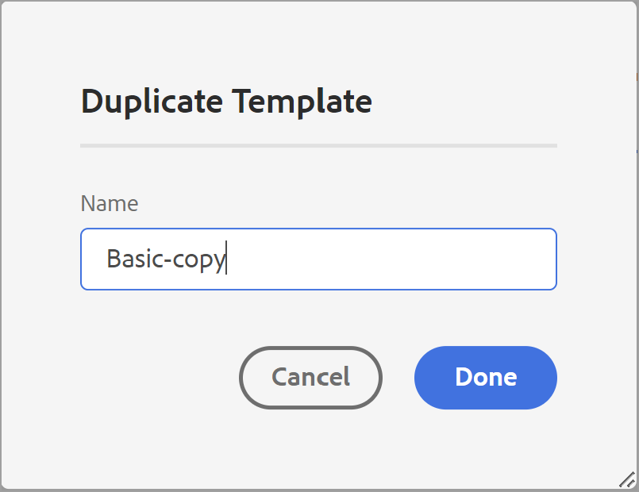

# modelo PDF {#PDF-template}

Usar um modelo garante a consistência no layout e na estrutura do conteúdo. Como os modelos são predefinidos, você pode evitar o retrabalho em problemas de formatação que surgem para cada novo projeto ou atualização. Os modelos permitem que você crie layouts de página, estime o conteúdo e aplique várias configurações para personalizar o PDF.

Embora os autores possam usar as predefinições de PDF para gerar saída, os desenvolvedores podem criar seus próprios templates. Existem modelos de exemplo enviados para uso imediato, que podem ser personalizados ou duplicados pelos desenvolvedores de acordo com suas necessidades organizacionais.

## Criar um novo modelo de PDF {#create-pdf-template}

Você pode criar modelos de PDF personalizados com layouts de página específicos e definir a formatação de componentes de layout de página (como TOC, índice, glossário) ou componentes DITA (como cabeçalho, parágrafo, lista) usando folhas de estilos. Você pode criar um novo modelo do zero ou criá-lo usando um modelo de amostra.

Para criar um novo template PDF, siga as etapas abaixo:
1. No Editor da Web, vá para o **Saída** guia .
1. Expanda a barra lateral esquerda e clique em **Modelos**.

1. No painel **Modelos**, clique no ícone **+** ao lado de **Modelos** e escolha **Modelo de PDF**.
1. Especifique um nome para o modelo na caixa de diálogo **Novo modelo**.
1. Clique em **Concluído**.

O novo modelo é criado e adicionado no *Modelos* painel.

## Duplicar um template PDF {#duplicate-pdf-template}

Para criar um novo modelo com os mesmos layouts de página e formatação de um modelo existente, você pode criar uma cópia. Depois que um modelo for duplicado, você poderá personalizar ainda mais seus componentes, conforme necessário.

Para duplicar um template PDF existente, siga as etapas abaixo:
1. No Editor da Web, vá para o **Saída** guia .
1. Expanda a barra lateral esquerda e clique em **Modelos**.

   Isso abre o painel Modelos.
1. Passe o mouse sobre o template que deseja duplicar e selecione o (*Opções* ícone ) **...** e escolha **Duplicar** no menu de contexto.

   Isso abre a caixa de diálogo Duplicar modelo .\
   
1. Especifique um nome para o modelo.

   O **Nome** O campo é preenchido previamente como uma cópia do mesmo nome do modelo de origem.

1. Para especificar um nome preferencial, remova o nome pré-preenchido e especifique um nome.
1. Clique em **Concluído**.

   Um modelo duplicado é criado e adicionado em Modelos.

## Personalizar um modelo de PDF {#customize-pdf-template}

Você pode personalizar modelos ao ajustar os componentes do modelo e aplicar formatos de estilo usando folhas de estilos.

Para personalizar um modelo de PDF, siga as etapas abaixo:
1. No Editor da Web, vá para a guia Saída .
1. Expanda a barra lateral esquerda e clique em Modelos.

   Isso abre o painel Modelos.
1. Para exibir os componentes de um modelo, execute um dos seguintes procedimentos:

   * Clique no ícone > ao lado de um modelo ou clique duas vezes no nome do modelo.
   * Passe o mouse sobre qualquer modelo, clique em ... (ícone Opções) e escolha Editar no menu de contexto.

      Por padrão, isso abre o painel Configurações no editor de modelos.
   

   Os vários componentes de modelo que você pode personalizar são categorizados nas seguintes seções:
   * Layouts de página: Um PDF típico contém páginas diferentes, como capa frontal ou página de título, TOC, capítulo, índice e muito mais. A seção Layouts de página permite que você crie a aparência de páginas diferentes que formariam seu PDF. Além da aparência, também é possível definir a disposição dos elementos da página, como as áreas de cabeçalho, rodapé e conteúdo em uma página. Para saber mais sobre como personalizar o layout de uma página, consulte [Criar e personalizar layouts de página](components-pdf-template.md#create-customize-page-layout).
   * Folhas de estilos: As configurações na seção Folhas de estilos permitem personalizar a aparência dos componentes do layout da página, como TOC, índice, glossário e muito mais. Além disso, também é possível personalizar os estilos do conteúdo DITA, como cabeçalhos, parágrafos, listas e muito mais. Para saber mais sobre o uso das folhas de estilos, consulte [Usar folhas de estilos para personalizar o PDF](components-pdf-template.md#stylesheet-customization).
   * Recursos: Armazene arquivos de ativos que você precisaria para personalizar ou projetar modelos de PDF. Os recursos como logotipos, fontes personalizadas, imagens de fundo e muito mais são armazenados nos Recursos. Para saber mais sobre a utilização de recursos, consulte [Trabalhar com recursos](components-pdf-template.md#work-with-resources).
   * Configurações: Defina as configurações de saída para gerar um PDF usando o template. Esta seção permite definir o mapeamento de modelo para várias páginas em um PDF, página inicial do capítulo, marcadores de impressão e muito mais. Para obter mais informações sobre como aplicar configurações, consulte [Configurações avançadas de PDF](components-pdf-template.md#advanced-pdf-settings).
1. Para personalizar um componente de modelo, clique duas vezes em um componente de modelo ou clique no ícone > antes dele.

   Por exemplo, clique duas vezes em *Layouts de página* ou clique no botão *>* ícone antes *Layouts de página* para exibir os layouts de página disponíveis.
1. Depois de fazer as alterações desejadas, clique em *Salvar tudo* ou `Ctrl+S`).
