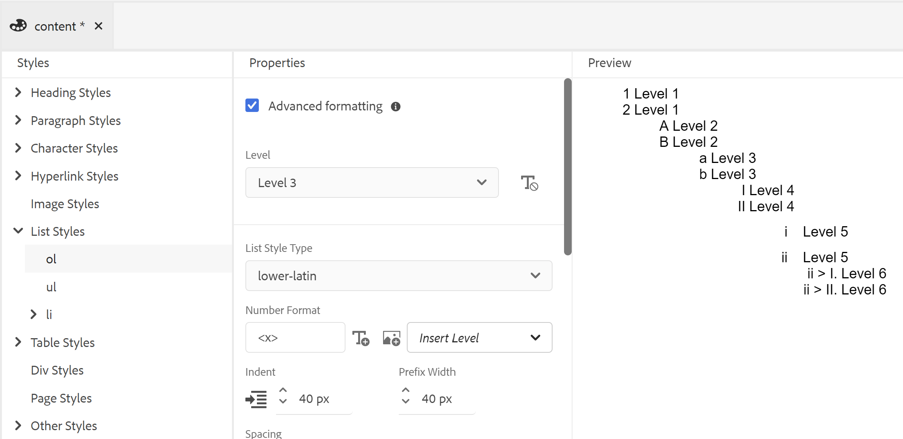

# Trabalhar com os estilos de conteúdo comuns

Uma folha de estilos contém as definições de estilos para os elementos usados na saída do PDF. Você pode optar por trabalhar com as folhas de estilos de amostra ou criar novas. Na maioria dos casos, criar uma cópia da folha de estilos da amostra OOTB ajudará você a começar a usar rapidamente.

O editor de estilos é um editor WYSIWYG que oculta todas as complexidades de um código CSS por trás da interface do usuário. Com o editor de estilos, você pode personalizar os estilos de maneira fácil e rápida para os elementos de sua escolha. Os estilos são classificados nas seguintes cabeças:

* Estilos de cabeçalho
* Estilos de parágrafo
* Estilos de caractere
* Estilos de hiperlink
* Estilos de imagem
* Estilos de Lista
* Estilos de Tabela
* Estilos Div
* Estilos de página
* Outros estilos

Ao trabalhar com conteúdo DITA estruturado, o mapeamento de estilo para a maioria dos elementos DITA está em vigor na folha de estilos padrão. Se você estiver trabalhando com elementos DITA padrão, é possível alterar a aparência deles diretamente, fazendo alterações na definição do estilo. Essas definições de estilo estão disponíveis na categoria Outro estilo . Para obter mais detalhes, consulte *Trabalhar com outros estilos* mais tarde neste tópico.

As seções a seguir abordam as configurações de estilo mais usadas na forma de exemplos.

>[!NOTE]
>
>Nos exemplos a seguir, presume-se que você esteja trabalhando com a folha de estilos de amostra fornecida com o produto.

## Trabalhar com estilos de cabeçalho

Os estilos de cabeçalho encapsulam todos os estilos base dos cabeçalhos usados no seu conteúdo. OOTB você terá 6 estilos de cabeçalho básicos e um estilo de cabeçalho para o tópico/capítulo e o cabeçalho do título do apêndice. Em um documento estruturado, o H1 representa o título do tópico ou do capítulo e H2 a H6 são usados para subtópicos ou seções em um tópico/capítulo. Essa hierarquia de cabeçalhos é aplicada automaticamente ao seu conteúdo sempre que o cabeçalho correspondente for encontrado.

>[!NOTE]
>
>Você pode criar seus próprios estilos de cabeçalho personalizados e eles podem ser usados no seu conteúdo usando a classe de saída. Para obter mais detalhes, consulte a Etapa 4 em *Usar a orientação de página e a rotação de visualização* exemplo.

### Criar cabeçalhos personalizados no nível do capítulo

Em um livro (ou mapa de livros), você trabalha com capítulos. Os estilos de cabeçalho básico são projetados de forma que sejam aplicados nos cabeçalhos de nível de capítulo sem nenhuma personalização. No entanto, se você quiser criar cabeçalhos especializados para o seu conteúdo, será necessário criar esses cabeçalhos. Por exemplo, o padrão `h1.chapter` é aplicado ao título do capítulo. Se você quiser que o título do capítulo apareça em um estilo diferente, será necessário personalizar a variável `h1.chapter` estilo. Da mesma forma, é possível criar estilos personalizados para subcabeçalhos no capítulo. Por exemplo, se você deseja criar um estilo personalizado para todos 2nd e 3rd cabeçalhos de nível em seu capítulo, em seguida, é necessário criar um novo estilo como `h2.chatper` e `h3.chatper`.

Como o recurso Publicação nativa PDF contém as definições de estilo base para os estilos mais comuns, mesmo que você exclua acidentalmente um estilo, o estilo padrão é aplicado no conteúdo. Por exemplo, se não houver uma definição de estilo para o estilo h2 na sua folha de estilos, o recurso Publicação nativa de PDF aplicará algum estilo base ao conteúdo h2.

Neste exemplo, criaremos um estilo de cabeçalho de capítulo de segundo nível:

1. Abra a folha de estilos necessária para edição.
   >[!NOTE]
   >
   >Consulte *Personalizar um estilo predefinido ou novo* seção para abrir uma folha de estilos para personalização ou edição.

1. No **Estilos** , expanda a **Estilos de cabeçalho**.
1. Clique com o botão direito do mouse em **Estilos de cabeçalho** estilo e escolha **Novo estilo**.
1. No *Adicionar estilo* mantenha o **Tag** name como `h2` e insira `chapter` no **Classe** campo de nome.
1. Clique em **Concluído**.

Um novo estilo de cabeçalho chamado `h2.chapter` é criada e adicionada na lista Estilos de cabeçalho .

Depois de criar um estilo, você pode personalizar as propriedades necessárias do estilo usando o editor de estilos.

### Criar cabeçalhos de números automáticos

Um dos estilos de saída mais usados é o cabeçalho com numeração automática. Estes títulos representam o número do capítulo, os números dos tópicos e dos subtópicos. Os cabeçalhos de números automáticos são diferentes dos estilos de lista, onde uma lista de itens em um tópico recebe números automáticos.

Neste exemplo, vamos personalizar os cabeçalhos do nível 1 para o nível 3 para usar os números automáticos em diferentes formatos.

1. Abra a folha de estilos necessária para edição.

   >[!NOTE]
   >
   >Consulte *Personalizar um estilo predefinido ou novo* seção para abrir uma folha de estilos para personalização ou edição.

1. No **Estilos** , expanda a **Estilos de cabeçalho**.

1. Selecione o **h1** na lista.
As propriedades do estilo h1 são mostradas no painel Propriedades junto com a Visualização.

   >[!NOTE]
   >
   >O painel Visualização oferece uma visualização em tempo real de todas as atualizações de estilo que você aplica a qualquer elemento.

1. Selecione o **Autonumber** propriedade.

   Os estilos que podem ser aplicados na lista de números automáticos são mostrados abaixo da propriedade Autonumber.

1. Defina as seguintes propriedades:
   * **Estilo**: Selecione de uma grande variedade de estilos de numeração genéricos ou específicos da localidade. Você pode escolher estilos como arábico-índico, Devanagari, georgiano, decimal, inferior-alfa e muito mais. No exemplo atual, selecione `upper-alpha`.

   * **Formato**: O formato padrão está definido como `<x>`, em que `x` é substituído pelo Estilo de numeração selecionado na propriedade Estilo. Por exemplo, se você tiver selecionado `decimal` (1) Estilo e valor de `x` incrementos automáticos para cada instância do `h1` estilo e vai como 2, 3 e assim por diante. Também é possível adicionar texto personalizado no campo para formatar o estilo do cabeçalho. Por exemplo, se você quiser que todos os cabeçalhos h1 tenham um prefixo de `Chapter`, é necessário definir esse campo como `Chapter <x>`.

   * **Inserir caractere**: Se quiser adicionar um caractere especial no Formato, clique no caractere Inserir () ícone. Selecione o caractere desejado que deseja adicionar no formato de estilo e clique em Inserir. Existem diferentes tipos de caracteres especiais que você pode escolher na lista suspensa Selecionar categoria . Para nosso exemplo, selecione a Marca de cotação de ângulo duplo de ponteiro direito na categoria Pontuação .

      

   * **Iniciar numeração a partir de**: Se desejar que a numeração comece a partir de um número específico, forneça esse valor. No nosso exemplo, mantenha o valor padrão de 1.

   * **Recuo**: Se você quiser recuar o cabeçalho, será necessário definir o valor Recuar. Para nosso exemplo, defina-o para 0 px.

      >[!NOTE]
      >
      >Você pode inserir o valor em px (pixels), pt (pontos), rem, em, % (porcentagem) ou em unidades (polegadas).

   * **Largura do prefixo**: Essa é a área ocupada pelo formato de número automático. Ele é automaticamente definido para um tamanho que pode acomodar facilmente o formato de estilo selecionado. Se quiser aumentar o tamanho, é possível substituir o valor padrão.

      Ao definir esse valor manualmente, tente alterar as outras propriedades que afetarão a largura. Por exemplo, altere o tamanho da fonte, o formato com o prefixo (Capítulo) ou um sufixo (:), e defina o valor máximo na função *Iniciar numeração a partir de* e as várias propriedades de fonte com o tamanho ideal.

      No nosso exemplo, mantenha o valor padrão.

   * **Espaçamento**: Especifique o espaçamento horizontal e vertical. No nosso exemplo, mantenha os valores padrão.

      Com as personalizações acima, o estilo é personalizado conforme mostrado abaixo:

      

   * **Aplicar Formatação a**: As propriedades na categoria Autonumber ajudarão você a definir o estilo de numeração. Para aplicar mais personalizações ao estilo de numeração ou ao conteúdo do seu formato de cabeçalho, você pode escolher Numeração ou Parágrafo neste campo. Se você escolher Numeração, as alterações em Fonte, Borda, Layout e outras categorias serão aplicadas apenas ao estilo de numeração no cabeçalho. No entanto, se você escolher Parágrafo, as alterações serão aplicadas ao conteúdo do cabeçalho e não ao estilo de numeração.

   Use as seguintes configurações para gerar uma saída mostrada na seguinte captura de tela:

   |**Estilo do cabeçalho**|**Propriedade**|**Valor**|**Comentários adicionais**| | :- | :- | :- | :- | |h1|Estilo|Decimal|Estas propriedades estão na categoria Número de Autonário | ||Formato|`Capter <x>:`| ||Largura do prefixo|160 px|| ||Fonte > Alinhamento do texto|Esquerda|Certifique-se de que a opção Aplicar formatação a está definida como Numeração| |h2|Estilo|Decimal|Estas propriedades estão na categoria Número de Autonário | ||Formato|`Section <x>:`| ||Largura do prefixo|125 px|| ||Fonte > Alinhamento do texto|Esquerda|Certifique-se de que a opção Aplicar formatação a está definida como Numeração| |h3|Estilo|Decimal|Estas propriedades estão na categoria Número de Autonário | ||Inserir Nível|2|| ||Formato|`Section <2>.<x>:`| ||Largura do prefixo|125 px|| ||Fonte > Alinhamento do texto|Esquerda|Certifique-se de que a opção Aplicar formatação a está definida como Numeração| |

   

## Trabalhar com estilos de parágrafo

Um estilo de parágrafo pode ser criado para aplicar formatação especial em um parágrafo inteiro. No entanto, usando a pseudo-classe, você pode aplicar um estilo somente a uma parte específica do texto. No exemplo a seguir, criaremos um estilo de parágrafo para usar o estilo de capitulação.

### Criar o estilo da capitulação

Um estilo de capitulação é usado em revistas e documentos literários, onde o primeiro caractere de um parágrafo ou seção recebe um estilo especial. Você pode obter o mesmo efeito usando o recurso Publicação nativa de PDF.

No exemplo a seguir, criaremos um estilo de capitulação:

1. Abra a folha de estilos necessária para edição.

   >[!NOTE]
   Consulte *Personalizar um estilo predefinido ou novo* seção para abrir uma folha de estilos para personalização ou edição.

1. No **Estilos** , expanda a **Estilos de parágrafo**.

1. Clique com o botão direito do mouse no **Estilo de parágrafo** e escolha **Novo estilo**.

1. No *Adicionar estilo* mantenha o **Tag** como p e no **Pseudo** **Classe** , selecione `::first-letter`.

1. Clique em **Concluído**.

   Um novo estilo de parágrafo chamado `::first-letter`  é criado e adicionado em **Estilos de parágrafo** lista.

1. Selecionar `::first-letter` no estilo p e defina as seguintes propriedades:

   * **Fonte**: Defina a fonte desejada para a primeira letra em seu parágrafo. No nosso exemplo, defina a Família de fontes como cursiva, com peso de fonte em 500, tamanho de fonte em 30 pontos e escolha uma cor de fonte.

   * **Layout**: Defina o alinhamento vertical do texto em torno do estilo da lista suspensa. Para nosso exemplo, definiremos o Alinhamento vertical como Inferior.

Como `p` é mapeada com a variável `
` no DITA, não é necessário adicionar explicitamente esse estilo usando o atributo outputclass. Onde quer que esteja no seu conteúdo `
` for usado, o estilo de soltar é aplicado automaticamente a ele. Na captura de tela a seguir, o título do capítulo, a descrição curta e os elementos da lista de definição não foram formatados com o estilo de soltar. Somente o estilo de parágrafo é formatado com o estilo de soltar:

## Trabalhar com estilos de caracteres

Com os estilos de caractere, é possível criar estilos para a formatação de caracteres ou palavras no seu conteúdo. Por exemplo, você pode criar um estilo de caractere para código em linha ou nome de arquivo, ou pode criar um estilo que use vários formatos de estilo no conteúdo selecionado.

### Criar um estilo de caractere em linha

A formatação de caracteres em linha ou palavras em um parágrafo é um estilo muito comum. O processo de criação de um estilo em linha envolve duas tarefas - primeiro, criar um novo estilo na folha de estilos e, segundo, aplicar o estilo no seu conteúdo usando a variável `outputclass` atributo.

No exemplo a seguir, criaremos um estilo de caractere em linha:

1. Abra a folha de estilos necessária para edição.

   >[!NOTE]
   Consulte *Personalizar um estilo predefinido ou novo* seção para abrir uma folha de estilos para personalização ou edição.

1. No **Estilos** , expanda a **Estilos de caracteres**.

1. Clique com o botão direito do mouse no **Estilo de caractere** e escolha **Novo estilo**.

1. Na caixa de diálogo Adicionar estilo , mantenha a **Tag** nomeie como span e insira `BoldItalic` no **Classe** campo de nome.

   

1. Clique em **Concluído**.

   Um novo estilo de caractere chamado código é criado e adicionado na lista Estilos de caractere.

1. Selecionar `span.BoldItalic` do **Estilo de caractere** e defina as seguintes propriedades:

   * **Fonte**: Todas as propriedades relacionadas a fontes podem ser personalizadas nessa seção. Por padrão, há algumas fontes agrupadas com o produto. Você pode escolher a fonte desejada para o estilo de caractere. Para nosso exemplo, defina a Família de fontes como *Serif,* e selecione *Negrito* e *Itálico* na propriedade Estilo da fonte. Você também pode personalizar outras propriedades de fonte, como Peso da fonte (como negrito, mais claro), Decoração do texto (como sublinhado, linha sobreposta), Tamanho da fonte, Cor da fonte, Alinhamento do texto e muito mais.

      >[!NOTE]
      Você também pode adicionar fontes ao seu modelo, que são armazenadas na seção Resources do seu modelo. Para obter mais detalhes sobre como adicionar fontes e trabalhar com Recursos, consulte **Adicionar um link à seção Recursos**.

   * **Layout**: É possível definir as propriedades relacionadas ao layout, como Altura e Largura, Margem, Preenchimento, Alinhamento e muito mais.

   * **Histórico**: As propriedades de Plano de fundo permitem formatar a cor de plano de fundo de um estilo específico. Você pode definir a cor ou a imagem do plano de fundo para qualquer estilo.

Depois de criar o estilo de caractere em linha, é necessário aplicá-lo ao conteúdo. Para aplicar o estilo do código em linha, vá para a exibição de origem e adicione o `outputclass` no conteúdo desejado:

`outputclass="BoldItalic"`

O exemplo a seguir mostra o formato Negrito itálico sendo aplicado em diferentes locais no texto em execução:

## Personalizar estilo de lista

Os estilos de lista contêm as configurações de estilo padrão para as listas ordenadas e não ordenadas. Você pode personalizar facilmente esses estilos de lista para atender aos requisitos de documentação.

No exemplo a seguir, vamos personalizar o estilo de lista numerado ou ordenado:

1. Abra a folha de estilos necessária para edição.

   >[!NOTE]
   Consulte *Personalizar um estilo predefinido ou novo* seção para abrir uma folha de estilos para personalização ou edição.

1. No **Estilos** , expanda a **Estilos de Lista**.

1. Selecione o **ol** na lista.

   As propriedades do estilo antigo são mostradas no painel Propriedades junto com a Visualização.

   

1. Selecione o **Formatação avançada** opção.

   Uma mensagem de confirmação é exibida.

1. Clique em **Sim** no *Confirmação* para abrir a **Formatação avançada** propriedades.

   As seguintes propriedades estão disponíveis por padrão:

   * **Nível**: Por padrão, há 6 níveis de listas numeradas. O nível selecionado nessa lista suspensa controla as alterações de estilo no nível selecionado e em todos os níveis subsequentes. Por exemplo, se você selecionar o nível 4, todas as alterações de estilo aplicadas serão definidas nos níveis 4, 5 e 6.

   * **Tipo de estilo da lista**: Há vários estilos de numeração de listas que você pode escolher. A lista contém estilos de numeração genéricos e específicos para localidades usados para criar uma lista numerada. Alguns dos tipos de estilo de lista são árabe, cambojano, devanagari, etíope, angul, hebraico, japonês, coreano, chinês simples, urdu e muito mais.

   Além disso, você pode trabalhar com as seguintes propriedades de Formatação avançada:

   * **Formato do número**: O formato padrão está definido como `<x>`, em que `x` é substituído pelo Estilo de numeração selecionado na propriedade Tipo de estilo da lista. Por exemplo, se você tiver selecionado `decimal` (1) Estilo e valor de `x` incrementos automáticos para cada instância do elemento de lista e chega a 2, 3 e assim por diante. Também é possível adicionar texto personalizado no campo para formatar o estilo da lista. Por exemplo, se você quiser que todos os estilos de lista de primeiro nível tenham um sufixo &quot;`)`&quot;, você precisa definir este campo para o estilo de lista de primeiro nível como &quot;`<x>)`&quot;.

   * **Inserir caractere**: Se quiser adicionar um caractere especial no Formato do número, clique no caractere Inserir () ícone. Selecione o caractere desejado que deseja adicionar no formato de estilo e clique em Inserir. Existem diferentes tipos de caracteres especiais que você pode escolher na lista suspensa Selecionar categoria .

   * **Inserir nível**: Você pode incluir o número de qualquer um dos níveis anteriores no formato de número. Por exemplo, se você quiser incluir o formato de número do 5º nível no formato de número do 6º nível, escolha 5 na lista suspensa Inserir nível . Observe que a lista suspensa Inserir nível mostra os números somente dos níveis anteriores e não o seguinte. Por exemplo, enquanto você está no Nível 3, a lista Inserir nível só mostrará os níveis 1 e 2.

      

      Você também pode alterar o Formato do número para apresentar os valores da lista, conforme necessário. Por exemplo, ao usar um estilo de numeração aninhado para o nível 3, você pode formatá-lo como &quot;`<2>.<x>))`&quot;. Isso mostrará a lista número 2, seguida de um ponto, seguido do número da lista 3 e, em seguida, de dois colchetes, como `2.3))`.

   * **Recuo**: Se você quiser recuar a lista, será necessário definir o valor Recuar. Qualquer alteração no recuo pode ser analisada no painel Visualização e ajustada.

      >[!NOTE]
      Você pode inserir o valor em px (pixels), pt (pontos), rem, em, % (porcentagem) ou em unidades (polegadas).

   * **Largura do prefixo**: Esta é a área ocupada pelo Formato do Número. Ele é automaticamente definido para um tamanho que pode acomodar facilmente o formato selecionado. Se quiser aumentar o tamanho, é possível substituir o valor padrão.

      Ao definir esse valor manualmente, tente alterar as outras propriedades que afetarão a largura. Por exemplo, altere o tamanho da fonte, o formato com prefixo ou sufixo e as várias propriedades da fonte para obter o tamanho ideal.

   * **Espaçamento**: Especifique o espaçamento horizontal entre o formato do número da lista e o conteúdo. O espaçamento vertical controla a distância entre os dois itens da lista.

      A captura de tela a seguir mostra a lista de pedidos personalizados para cada nível:

      

## Trabalhar com estilo de tabela

Com as folhas de estilos, você pode criar *n* número de estilos de tabela. Usando os estilos da tabela, é possível projetar como toda a tabela, uma linha ou coluna específica. Com controle no estilo de nível de célula, é possível criar estilos de tabela muito apresentáveis.

No exemplo a seguir, vemos como criar um estilo de tabela e as várias opções de estilo de tabela que podem ser personalizadas:

1. Abra a folha de estilos necessária para edição.

   >[!NOTE]
   Consulte *Personalizar um estilo predefinido ou novo* seção para abrir uma folha de estilos para personalização ou edição.

1. No **Estilos** , clique com o botão direito do mouse na **Estilo de tabela** e escolha **Novo estilo**.

1. No *Adicionar estilo* mantenha o **Tag** name como `table` e insira `double-border` no **Classe** campo de nome.

1. Clique em **Concluído**.

   Um novo estilo de tabela chamado `table.double-border` é criada e adicionada na lista Estilos de tabela .

1. Selecionar `table.double-border` do **Estilos de Tabela** e defina as seguintes propriedades:

   * **Aplicar Formatação a**: É possível optar por aplicar a formatação de estilo a toda a tabela, a linhas ou colunas ímpares/pares ou à primeira/última linha ou coluna.

      >[!NOTE]
      As configurações a seguir estão disponíveis na seção **Geral** seção quando **Aplicar Formatação a** está definida como **Tabela inteira**.

   * **Quebra de texto**: Selecione como quebrar texto ao redor da tabela. Isso é útil quando a tabela está em outro elemento de nível de bloco e a tabela deve ser renderizada junto com outro conteúdo no elemento de bloco. As opções de quebra automática são *left* ou *right* alinhadas, ou *nenhum*.

   * **Recolher Borda**: Selecione a aparência da borda da tabela. Se você selecionar recolher, somente uma linha de borda será desenhada entre as células da tabela. No entanto, para um estilo separado, a borda é visível ao redor de cada célula com preenchimento adicional.

      

   * **Espaçamento entre Bordas**: Essa configuração está disponível somente quando Recolher borda está definido como Separado. Usando essa configuração, você pode especificar o espaçamento vertical e horizontal entre as bordas da célula.

      

      >[!NOTE]
      As configurações a seguir estão disponíveis na seção **Célula** seção quando **Aplicar Formatação a** está definida como **Tabela inteira**.

   * **Preenchimento**: Especifique o preenchimento entre as células da tabela. Você pode especificar diferentes valores de preenchimento para os lados superior, inferior, esquerdo e direito.

   * **Alinhamento vertical**: Especifique o alinhamento vertical para o conteúdo da célula. As opções disponíveis são: Parte superior, meio e parte inferior.

   * **Lado da borda, Estilo, Cor, Largura, Raio:** Especifique as propriedades relacionadas à borda. Você pode optar por ter bordas somente em lados específicos, como Esquerda ou Direita. O Estilo da borda lista os estilos de borda disponíveis como Sólido, Tracejado, Linha dupla e muito mais. Especifique a cor da borda usando a paleta de cores. Você pode especificar a largura da borda em px, pt, rem, em, % e em unidades. O Raio define a curva para fazer cantos circulares.

   As outras propriedades em Fonte, Borda, Layout, Paginação e Plano de Fundo são explicadas em outros exemplos neste tópico. Dependendo da sua seleção no **Aplicar Formatação a** , é possível aplicar esses valores a toda a tabela ou a linhas ou colunas selecionadas.

   Uma visualização de uma tabela de amostra com linhas diferentes formatadas de maneira diferente é mostrada abaixo:

   

## Trabalhar com outros estilos

Se estiver trabalhando com conteúdo estruturado (DITA), você observará que quase todos os elementos DITA têm um mapeamento de estilo na folha de estilos padrão. Por exemplo, um `<shortdesc>` o estilo do elemento é definido em **Outro estilo** > **.short desc** definição de estilo. Você pode personalizar facilmente qualquer um desses estilos e eles são aplicados automaticamente na saída do PDF gerada a partir do seu conteúdo estruturado. Isso significa que, diferente de outros estilos personalizados, não é necessário adicionar um `outputclass` no conteúdo desses estilos.

Caso queira criar uma definição de estilo para qualquer elemento que não esteja disponível por padrão ou tenha um elemento personalizado, você pode criá-lo facilmente na folha de estilos. O único ponto que você deve considerar é criar o estilo com o mesmo nome do nome do elemento estruturado.

No exemplo a seguir, criaremos um título de nova janela (`wintitle`) estilo:

1. Abra a folha de estilos necessária para edição.

   >[!NOTE]
   Consulte *Personalizar um estilo predefinido ou novo* seção para abrir uma folha de estilos para personalização ou edição.

1. No **Estilos** listar, expandir **Outros estilos**.

1. Clique com o botão direito do mouse no **Outro estilo** e escolha **Novo estilo**.

1. No *Adicionar estilo* mantenha o **Tag** name como *blank* e insira `wintitle` no **Classe** campo de nome.

   As `wintitle` é um nome de elemento DITA reconhecido, sua definição de estilo é mapeada automaticamente para o `<wintitle>` na sua origem.

1. Clique em **Concluído**.

   Um novo estilo chamado `.wintitle` é criado e adicionado em **Outros estilos** lista.

1. Selecione .wintitle na guia **Outros estilos** e defina as propriedades conforme necessário.

A captura de tela a seguir exibe o estilo wintitle que está sendo aplicado ao texto &quot;Controle primário&quot;.

