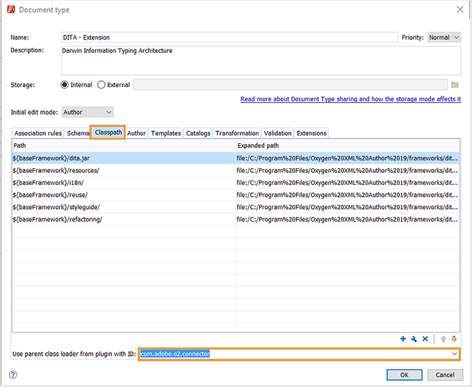
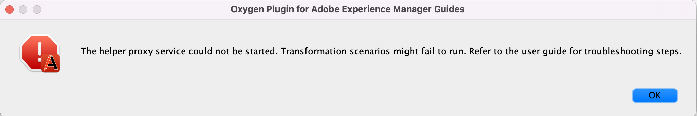

# Plug-in de Oxigênio para Guias do Adobe Experience Manager {#id1645H6010Q5}

O Plug-in de Oxigênio para Guias do Adobe Experience Manager \(mais tarde conhecido como Plug-in de Oxigênio para Guias AEM no guia\) permite que você conecte o Autor XML de Oxigênio ao repositório Adobe Experience Manager \(AEM\) para criação e gerenciamento de conteúdo. Você pode usar o plug-in para navegar, pesquisar e abrir arquivos; Arquivos de check-out e check-in; carregue pastas e arquivos AEM repositório. O painel Guias de AEM no aplicativo de desktop permite marcar as pastas desejadas \(AEM repositório\) na lista de pastas favoritas para acesso rápido. Além disso, você pode instalar um pacote AEM interface da Web e abrir seus arquivos DITA no Autor Oxygen XML diretamente da interface AEM Web.

## Baixe e instale {#id1826M0L0PUI}

O Plug-in Oxygen para Guias AEM é disponibilizado pelo Portal de Distribuição de Software Adobe. Procure por &quot;oxigênio&quot; na guia Experience Manager e baixe o instalador de plug-ins do seu [Portal de distribuição de software do Adobe](https://experience.adobe.com/#/downloads/content/software-distribution/en/general.html).

>[!NOTE]
>
>Verifique a compatibilidade da versão do Conector Oxygen nas notas de versão dos Guias específicos do Adobe Experience Manager.

Depois de ter o instalador, instale-o em sua máquina local onde o Autor XML do Oxigênio está instalado. Antes de iniciar o processo de instalação, você deve garantir que seu sistema atende aos requisitos técnicos para instalar o plug-in Oxygen para guias de AEM.

### Requisitos técnicos

- Autor do Oxygen XML versão 24.1

- Guias do Adobe Experience Manager versão 3.4 ou superior

- Adobe Experience Manager versão 6.5 com Service Pack 10, 11, 12 e 13

- Sistema operacional suportado pelo Autor Oxygen XML versão 24.1

- Kit de desenvolvimento Java
   - Oracle SE 8 JRE 1.8

### Instalar o plug-in no Windows

>[!IMPORTANT]
>
>Se você tiver uma versão mais antiga do plug-in instalada em seu sistema, certifique-se de desinstalá-la antes de iniciar o processo de instalação. Consulte a **Desinstalação de pacotes** na seção [Como trabalhar com pacotes](https://helpx.adobe.com/br/experience-manager/6-4/sites/administering/using/package-manager.html) artigo para instruções de desinstalação.

Execute as seguintes etapas no sistema em que o Autor XML do Oxigênio está instalado:

1. Inicie o do instalador `.exe` arquivo.

   A tela de boas-vindas do assistente de instalação é exibida.

1. Clique em **Próximo** e navegue até o local onde o arquivo .exe do Autor Oxygen XML está disponível.

1. Selecione o arquivo e clique em **Abrir**.

   O local do arquivo selecionado é adicionado ao assistente de instalação.

1. Clique em **Avançar**.

1. Clique em **Instalar**.

1. Clique em **Concluir** para fechar o assistente de instalação.
1. Inicie o Autor XML do Oxigênio.

   O painel Guias de AEM é exibido no Autor XML do Oxigênio.

   

   >[!NOTE]
   >
   >Se você não vir o painel Guias AEM, consulte as soluções na seção Solução de problemas—[Painel Guias AEM ausentes](#id192BH200ZAX).


### Instalar o plug-in no Mac

>[!IMPORTANT]
>
>Se você tiver uma versão mais antiga do plug-in instalada em seu sistema, certifique-se de desinstalá-la antes de iniciar o processo de instalação. Consulte a **Desinstalação de pacotes** na seção [Como trabalhar com pacotes](https://helpx.adobe.com/br/experience-manager/6-4/sites/administering/using/package-manager.html) instruções de desinstalação do artigo.

Execute as seguintes etapas no sistema em que o Autor XML do Oxigênio está instalado:

1. Localize o arquivo .dmg do plug-in no sistema.

1. Clique duas vezes no arquivo .dmg para abrir o conteúdo do arquivo.

   O arquivo .dmg contém uma pasta aem-connector-x.x e um arquivo de configuração aem-connector-x.x.

   >[!NOTE]
   >
   >x.x nos nomes de arquivo é o número da versão do plug-in.

1. Copie a pasta aem-connector-x.x na pasta de plug-ins do Oxygen XML Author.
1. Clique duas vezes no arquivo de configuração aem-connector-x.x para iniciar o instalador.

1. Inicie o Autor XML do Oxigênio.

   O painel Guias de AEM é exibido no Autor XML do Oxigênio.

   

   >[!NOTE]
   >
   >Se você não vir o painel Guias AEM, consulte as soluções na seção Solução de problemas—[Painel Guias AEM ausentes](#id192BH200ZAX).


### Instale o pacote para habilitar o recurso de edição de documento AEM interface da Web {#id182CE0Q0TY4}

Como autor, você pode abrir e editar seus mapas DITA ou tópicos no Autor do Oxygen XML diretamente da interface da Web AEM. Para habilitar esse recurso AEM interface da Web, o administrador do AEM precisa instalar um pacote na instância de criação do AEM.

Como administrador de AEM, execute as seguintes etapas para instalar o pacote:

1. Obtenha o arquivo .zip do pacote de sua equipe de TI.
1. Faça logon em sua instância do AEM *\(como administrador\)* e navegue até o Gerenciador de pacotes do CRX. O URL padrão para acessar o gerenciador de pacotes é

   `http://<server name>:<port>/crx/packmgr/index.jsp`

   O Gerenciador de pacotes gerencia os pacotes na instalação local do AEM. Para obter mais informações sobre como trabalhar com o Gerenciador de Pacotes, consulte [Como trabalhar com pacotes](https://experienceleague.adobe.com/docs/experience-manager-cloud-service/content/implementing/developer-tools/package-manager.html?lang=en) na documentação AEM.

   

1. Para carregar o pacote Oxygen, clique em **Fazer upload do pacote**.
1. Na caixa de diálogo Fazer upload do pacote, navegue até o arquivo de pacote do Oxigênio que você baixou na Etapa 1 e clique em OK.

   O pacote é carregado na sua instância de AEM.

1. Para iniciar o processo de instalação, clique em **Instalar**.

   

1. Na caixa de diálogo Instalar pacote, clique em **Instalar**.
1. Depois que a instalação for concluída, clique no botão Início no canto superior esquerdo do Gerenciador de pacotes do CRX.
1. Selecione um arquivo DITA na pasta de ativos.

   **Editar no oxigênio** está disponível na barra de ferramentas. Para obter mais informações sobre como usar essa opção, consulte [Abra o tópico DITA no Autor XML do Oxigênio AEM interface da Web](#id182CE0I905Z).

   >[!NOTE]
   >
   >O **Editar no oxigênio** estará visível ao selecionar um tópico DITA. Se você selecionar vários tópicos, a opção não estará visível.


## Configurar o plug-in Oxygen para guias de AEM {#id1826KF00AHS}

Após baixar e instalar o plug-in, é necessário configurar os seguintes itens para funcionar com o plug-in:

- **Configurações de autenticação da Web**: Configurações para autenticação SSO no plug-in dos Guias de AEM.
- **Configurações gerais**: Configurações de conexão do plug-in, como URL do servidor AEM, detalhes de logon e assim por diante.
- **Preferência para personalização do atributo de criação de perfil**: Essa configuração é necessária para os esquemas de atributo de criação de perfil dos conjuntos de documentação.

### Configurações de autenticação da Web

JxBrowser é usado para Autenticação SSO pelo plug-in do conector Oxygen. É um navegador baseado em cromo. Para o java 9+, o acesso a APIs não públicas é necessário e você deve conceder explicitamente esse acesso ao JxBrowser. Para obter mais detalhes, consulte [Solução de problemas do JxBrowser](https://jxbrowser-support.teamdev.com/docs/guides/troubleshooting/issues.html).

Atualize os arquivos fornecidos para definir as configurações de autenticação da Web no Plug-in Oxygen para Guias AEM:

>[!NOTE]
>
>Faça um backup do arquivo antes de atualizá-lo.

**Para Mac e Oxigênio 24.1**

Adicione as seguintes linhas em env.sh

```java
--illegal-access=permit\
--add-opens=java.desktop/javax.swing.plaf.basic=ALL-UNNAMED\
--add-exports=javafx.controls/com.sun.javafx.scene.control=ALL-UNNAMED\
--add-exports=javafx.graphics/com.sun.javafx.stage=ALL-UNNAMED\
--add-exports=javafx.graphics/com.sun.javafx.scene=ALL-UNNAMED\
--add-exports=javafx.graphics/com.sun.javafx.scene.traversal=ALL-UNNAMED\
--add-exports=javafx.graphics/com.sun.javafx.tk=ALL-UNNAMED\
--add-exports=javafx.graphics/com.sun.glass.ui=ALL-UNNAMED\
--add-opens=javafx.graphics/com.sun.glass.ui=ALL-UNNAMED\
--add-opens=javafx.graphics/javafx.stage=ALL-UNNAMED\
--add-opens=javafx.graphics/com.sun.javafx.tk.quantum=ALL-UNNAMED\
--add-exports=java.desktop/sun.awt=ALL-UNNAMED\
--add-opens javafx.swing/javafx.embed.swing=ALL-UNNAMED
```

Adicione as seguintes linhas no oxigênioAuthor.sh

```java
-Djdk.module.illegalAccess=permit\-Djava.ipc.external=true\
```

**Para Windows e Oxigênio 24.1**

Adicione as seguintes linhas em env.bat

```java
--illegal-access=permit --add-opens=java.desktop/javax.swing.plaf.basic=ALL-UNNAMED --add-exports=javafx.controls/com.sun.javafx.scene.control=ALL-UNNAMED --add-exports=javafx.graphics/com.sun.javafx.stage=ALL-UNNAMED --add-exports=javafx.graphics/com.sun.javafx.scene=ALL-UNNAMED --add-exports=javafx.graphics/com.sun.javafx.scene.traversal=ALL-UNNAMED --add-exports=javafx.graphics/com.sun.javafx.tk=ALL-UNNAMED --add-exports=javafx.graphics/com.sun.glass.ui=ALL-UNNAMED --add-opens=javafx.graphics/com.sun.glass.ui=ALL-UNNAMED --add-opens=javafx.graphics/javafx.stage=ALL-UNNAMED --add-opens=javafx.graphics/com.sun.javafx.tk.quantum=ALL-UNNAMED --add-exports=java.desktop/sun.awt=ALL-UNNAMED --add-opens javafx.swing/javafx.embed.swing=ALL-UNNAMED
```

Adicione as seguintes linhas no oxigênioAuthor.bat

```java
-Djdk.module.illegalAccess=permit -Djava.ipc.external=true
```

>[!NOTE]
>
>Você precisa executar oxigênio a partir de oxigênioAuthor.sh para Mac e oxigênioAuthor.bat para Windows como administrador.

### Configurações gerais

Execute as seguintes etapas para definir as configurações de conexão no Plug-in Oxygen para os Guias do Adobe Experience Manager:

1. No painel Guias do AEM, clique no ícone de configurações e selecione **Configurações**.

   

1. Especifique os seguintes detalhes:
   - **URL do servidor**: URL do servidor AEM, por exemplo:

      ```http
      http[s]://<host>:<port>
      ```

      Na URL acima, especifique o nome do host e a porta do servidor em que AEM servidor é implantado.

      >[!IMPORTANT]
      >
      >Se o servidor de AEM for implantado na porta 80 ou 443, não será necessário especificá-lo no URL.

   - **Autenticação:** Escolha de **Básico \(Nome de usuário/senha\)** ou **Autenticação da Web**. Caso selecione **Básico** autenticação, você precisa inserir o **Nome do usuário** e **Senha** na caixa de diálogo Preferências.

      Se você selecionar Autenticação da Web, será exibida a tela Logon AEM. Insira suas credenciais de logon e clique no botão **Fazer logon** botão. Ao fazer o logon bem-sucedido, a tela Logon do AEM é fechada e o painel Guias do AEM exibe a lista de arquivos do servidor AEM.

   - **Tempo limite da conexão**: Especifique o tempo em segundos que o cliente aguardará uma resposta do servidor AEM. Caso nenhuma resposta do servidor seja recebida dentro do tempo especificado, a solicitação será encerrada. O valor padrão é de 20 segundos.

   - **Pasta local**: Local na máquina local, onde os arquivos AEM repositório são armazenados após o check-out. Se você especificar um local que não existe na unidade, o plug-in criará esse local.
   - **Abrir arquivo ao fazer check-out**: Se selecionada, abre os arquivos no check-out.
   - **Fechar arquivo ao fazer o check-in**: Se selecionada, fecha os arquivos no check-in. Antes de fechar o arquivo, é exibida uma pop-up na qual é possível especificar os comentários da versão.
   - **Mostrar caixa de diálogo de check-in ao fechar arquivo**: Se selecionada, você verá uma pop-up ao fechar um arquivo. Na janela pop-up , é possível optar por fazer check-in no arquivo ou fechar o arquivo sem fazer check-in.
   - **Arquivo de checkout automático quando aberto**: Se selecionado, clicar duas vezes em um arquivo o faz automaticamente e o abre para edição. Caso o arquivo já tenha passado pelo check-out, ele é simplesmente aberto para edição. Se essa opção não estiver selecionada, a abertura de um arquivo no qual você não tem um bloqueio o abrirá no modo somente leitura.
1. Clique em **OK**.

### Preferência para personalização do atributo de criação de perfil {#id1827K0D0OHT}

Você precisa configurar as preferências no Autor XML do Oxigênio para usar o atributo de criação de perfil associado aos tópicos do DITA no repositório AEM.

Execute as seguintes etapas para configurar os atributos de criação de perfil:

1. No Autor do Oxygen XML, clique em **Opções** \> **Preferências**.
1. No **Associação de Tipo de Documento** guia , selecione **DITA** e, em seguida, clique em **Estender**.

   

1. No **Classpath** selecione com.adobe.o2.connector no **Usar carregador de classe pai do plug-in com ID** lista suspensa.

   

1. No **Extensões** , faça as seguintes alterações:
1. 
   - Clique em **Choose** ao lado do **Ouvinte do estado da extensão do autor** under **Extensões individuais** e selecione CustomAuthorExtensionStateListener - com.adobe.o2.framework.extn no **Classe** lista. Clique em **OK**.
- Clique em **Choose** ao lado do **Editor de valor de atributo personalizado do autor** under **Extensões individuais** e selecione CustomValueEditor - com.adobe.o2.framework.extn no **Classe** lista. Clique em **OK**.
A captura de tela a seguir mostra o **Extensão** guia para tópicos do DITA:

   

1. Clique em **OK** em todas as caixas de diálogo para salvar as alterações.

### Configurar extensão de mapa DITA

A configuração da extensão do mapa DITA é necessária para habilitar a abertura de arquivos de mapa no Autor XML do Oxigênio diretamente da interface da Web AEM. Essas configurações são semelhantes às configurações para atributos de criação de perfil feitas no procedimento anterior.

Execute as seguintes etapas para configurar a extensão do mapa DITA:

1. No Autor do Oxygen XML, clique em **Opções** \> **Preferências**.
1. No **Associação de Tipo de Documento** guia , selecione **Mapa DITA** e, em seguida, clique em **Estender**.
1. No **Classpath** selecione com.adobe.o2.connector no **Usar carregador de classe pai do plug-in com ID** lista suspensa.
1. No **Extensões** , faça as seguintes alterações:
1. 
   - Clique em **Choose** ao lado do **Ouvinte do estado da extensão do autor** under **Extensões individuais** e selecione CustomDITAMapAuthorExtensionStateListener - com.adobe.o2.framework.extn no **Classe** lista. Clique em **OK**.
- Clique em **Choose** ao lado do **Editor de valor de atributo personalizado do autor** under **Extensões individuais** e selecione CustomValueEditor - com.adobe.o2.framework.extn no **Classe** lista. Clique em **OK**.
- *\(Opcional\)* Se você não quiser resolver referências ao abrir um arquivo de mapa, será necessário executar a seguinte configuração adicional:

   Clique em **Choose** ao lado do **Resolvedor de referências** under **Extensões individuais** e selecione CustomDITAMapReferenceResolver - com.adobe.o2.framework.extn no **Classe** lista. Clique em **OK**.

   A captura de tela a seguir mostra o **Extensão** guia :

   

1. Clique em **OK** em todas as caixas de diálogo para salvar as alterações.

## Trabalhar com o plug-in Oxygen para guias de AEM {#id1826JG00WY4}

### Painel Guias AEM

A tela a seguir mostra o painel Guias de AEM.


**A**\) Mostra a barra de pesquisa.

**B**\) Mostra a pasta Favoritos. Por padrão, está vazio. Você pode adicionar pastas do repositório AEM como favorito, as pastas favoritas são exibidas aqui.

**C**\) A pasta DAM mostra o repositório AEM. Você pode expandir e recolher a visualização de pasta.

**D**\) O ícone Configurações \(engrenagem\) com as seguintes opções:

- **Connect**: Selecione esta opção para se conectar ao servidor AEM. A opção é desabilitada quando o Autor XML do Oxigênio está conectado ao Servidor AEM.
- **Atualizar**: Selecione essa opção para obter o status mais recente dos arquivos e pastas do repositório AEM.

   >[!NOTE]
   >
   >Salve os arquivos antes de atualizá-los. Ao selecionar **Atualizar** , você recebe um aviso para salvar seus arquivos antes de atualizá-los. Se você não tiver salvo seus arquivos, clique em **Cancelar** e salvá-los.

- **Configurações**: Você pode usar essa opção para abrir a caixa de diálogo Preferências gerais do Plug-in.
- **Logout**: Selecione essa opção para fechar a conexão do servidor AEM. Essa opção só estará disponível se você estiver usando o modo de Autenticação da Web.

### Funções do menu de contexto

As funções do Plug-in Oxygen para Guias AEM estão disponíveis clicando com o botão direito do mouse em uma pasta ou arquivo no repositório AEM. As funções disponíveis para as pastas são diferentes dos arquivos. Esta é uma lista completa de funções no Plug-in Oxygen para AEM menu de contexto Guias :

- **Abrir**: Abre o arquivo selecionado ou expande a pasta selecionada.
- **Abrir em**: Você pode optar por abrir o arquivo selecionado no Editor da Web AEM Guias, no Painel de Mapa ou no Editor de Mapa. Para obter mais informações sobre essas opções, consulte [Abra o arquivo no editor AEM Guias](#id195GH0V30KX).
- **Check-out**: Faz check-out de um arquivo AEM repositório. Para obter mais detalhes, consulte [Arquivos de check-out](#id195HC020TS4).
- **Check-out com dependentes**: Faz check-out de um arquivo com suas referências diretas. Para obter mais detalhes, consulte [Arquivos de check-out](#id195HC020TS4).
- **Check-out com dependentes somente leitura**: Faz check-out do arquivo selecionado junto com seus dependentes. Não é possível fazer alterações nos arquivos dependentes. Para obter mais detalhes, consulte [Arquivos de check-out](#id195HC020TS4).
- **Cancelar check-out**: Cancela o arquivo com check-out, fecha o arquivo do editor e reverte as alterações para a última versão do arquivo salva no servidor.
- **Atualizar**: No caso de um arquivo, o busca a cópia mais recente do arquivo do repositório AEM. Para uma pasta, ela busca a estrutura da pasta e o status do arquivo. Isso significa que um arquivo é adicionado e será exibido na Exibição de guias de AEM. Além disso, se for feito o check-out de um arquivo no servidor AEM, fazer uma atualização no Autor do Oxigênio mostrará o arquivo como check-out. No entanto, isso não atualiza a lista de arquivos na *Arquivos com check-out nos guias de AEM* Exibir.
- **Atualizar arquivos com check-out**: Atualiza a lista de arquivos com check-out no *Arquivos com check-out nos guias de AEM* Exibir. Se for feito o check-out de um arquivo no servidor AEM, a atualização de uma atualização atualizará a lista de arquivos com check-out no *Arquivos com check-out nos guias de AEM* Exibir. No entanto, se um novo arquivo tiver sido adicionado ou o status de um arquivo tiver sido alterado, ele não o atualizará na visualização em árvore dos Guias AEM. Para atualizar o status dos arquivos no AEM, você deve fazer uma Atualização.
- **Check-in**: Faz check-in de arquivos que você fez check-out. Para obter mais detalhes, consulte [Fazer check-in de um arquivo](#id182CF0J0FHS).
- **Check-in com dependentes**: Se tiver feito check-out de arquivos com dependentes, essa opção fará o check-in do arquivo principal junto com seus dependentes. Para obter mais detalhes, consulte [Fazer check-in de um arquivo](#id182CF0J0FHS).
- **Criar pasta**: Cria uma pasta no repositório AEM. Essa opção está disponível somente no nível da pasta.
- **Upload de arquivo\(s\)**: Carrega um ou vários arquivos. Para obter mais detalhes, consulte [Upload de arquivos e pastas](#id195HC03F03J).
- **Fazer upload com dependentes**: Carrega arquivos DITA \(XML, DITA, mapa de livros ou mapa DITA\) com seus dependentes. Para obter mais detalhes, consulte [Upload de arquivos e pastas](#id195HC03F03J).
- **Fazer upload da pasta**: Carrega uma pasta no repositório AEM. Para obter mais detalhes, consulte [Upload de arquivos e pastas](#id195HC03F03J).
- **Adicionar aos Favoritos**: Adiciona uma pasta ao *Favoritos* no painel Guias do AEM. É recomendável adicionar sua pasta de trabalho aqui, o que facilita a sincronização de arquivos e o status do arquivo a partir do AEM.
- **Remover de Favoritos**: Remove uma pasta de *Favoritos*. Para obter mais detalhes, consulte [Adicionar ou remover Favoritos](#id195HC04405P).
- **Exibir metadados**: Mostra os metadados, como Classe DITA, Título do documento, Tipo, UUID e outras informações associadas a um arquivo. Para obter mais detalhes, consulte [Exibir os metadados de um arquivo](#id195GHN0H05C).
- **Exibir versões**: Mostra o histórico de versões de um arquivo. Para obter mais detalhes, consulte [Visualizar o histórico de versões de um arquivo](#id195GI000D5Q).

### Abra um arquivo no Autor XML do Oxigênio {#id195GHJ0A0UB}

Depois de se conectar ao repositório AEM, você poderá abrir arquivos para edição no Autor XML do Oxigênio. Execute as seguintes etapas para abrir um arquivo para edição no Autor XML do Oxigênio:

1. Clique com o botão direito do mouse em um arquivo no painel Guias de AEM que deseja abrir para edição.

1. Selecionar **Abrir** no menu de contexto.

   O arquivo é aberto no editor do Oxygen XML Author.

   

   Ao passar o ponteiro do mouse sobre a guia de um arquivo, é mostrado o caminho do servidor junto com a UUID. Na captura de tela acima, o UUID do documento é realçado.


Se você selecionou a variável **Arquivo de checkout automático quando aberto** opção \(na caixa de diálogo Preferências\), em seguida, ao abrir um arquivo, o arquivo é automaticamente submetido a check-out e está disponível para edição. Para abrir um arquivo, clique duas vezes em um nome de arquivo ou clique com o botão direito do mouse no nome do arquivo e escolha **Abrir** no menu de contexto. Se essa opção não estiver selecionada, o arquivo será aberto no modo somente leitura.

>[!NOTE]
>
>Você também pode clicar duas vezes em um arquivo para abri-lo.

### Abra o arquivo no editor AEM Guias {#id195GH0V30KX}

Se quiser usar os editores disponíveis nos Guias AEM, é possível fazer isso selecionando a opção necessária no menu de contexto. Execute as seguintes etapas para usar o editor dos Guias AEM no lugar do editor do Autor do Oxygen XML:

1. Clique com o botão direito do mouse em um arquivo no painel Guias de AEM que deseja abrir para edição.

1. Selecionar **Abrir em** no menu de contexto e escolha entre as seguintes opções:

   - **Editor de tópicos da Web**: Se o arquivo que você está abrindo for um arquivo .xml ou .dita, você poderá abri-lo para edição no Editor da Web. Escolha a **Editor de tópicos da Web** para abrir o arquivo selecionado para edição no Editor da Web.

   - **Mapear painel**: Você pode optar por editar um arquivo .ditamap no painel de mapa, onde você pode executar várias operações no arquivo de mapa. Essas operações dependem da função/grupo ao qual você pertence.

   - **Editor de mapa DITA da Web**: Se quiser abrir o arquivo .ditamap para edição no Editor de mapa, escolha essa opção. Com a opção Editor de mapa DITA , é possível adicionar ou remover tópicos, adicionar tabelas de relacionamento e executar outras operações no mapa.


### Arquivos de check-out {#id195HC020TS4}

Ao fazer check-out de um arquivo, ele é armazenado localmente em seu sistema e bloqueado para edição no repositório AEM. Execute as seguintes etapas para fazer check-out de um arquivo:

1. Clique com o botão direito do mouse em um arquivo no painel Guias de AEM.
1. Selecione uma das seguintes opções:
   - **Check-out:** Faz check-out de um arquivo AEM repositório e o disponibiliza para edição.
   - **Check-out com dependentes**: Faz check-out de um arquivo com suas referências diretas. É possível fazer alterações em páginas pai e filho usando essa opção. O Plug-in Oxygen para Guias AEM suporta o check-out de um nível de dependentes. Por exemplo, o Mapa A faz referência ao Tópico A e ao Tópico A faz referência ao Tópico B. A verificação do Mapa A fará check-out do Tópico A independentemente do seu nível na hierarquia do TOC. No entanto, ele não verificará o Tópico B porque não está diretamente vinculado ao Mapa A.
   - **Check-out com dependentes somente leitura**: Faz check-out de um arquivo e baixa seus dependentes no computador local como cópias somente leitura. Não é possível fazer alterações nos arquivos dependentes.

Se você selecionou a variável **Abrir arquivos no check-out** opção \(na caixa de diálogo Preferências\), em seguida, ao fazer check-out de um arquivo, o arquivo é aberto automaticamente para edição.

Se você selecionou a variável **Arquivo de checkout automático quando aberto** opção \(na caixa de diálogo Preferências\), em seguida, ao abrir o arquivo, o arquivo é automaticamente submetido a check-out e é disponibilizado para edição. Para abrir um arquivo, clique duas vezes em um nome de arquivo ou clique com o botão direito do mouse no nome do arquivo e escolha **Abrir** no menu de contexto.

Quando o check-out de um arquivo é feito, o ícone do arquivo muda para mostrar seu status bloqueado.


Na captura de tela acima, um arquivo com saída dada por outro usuário é mostrado com um ícone de cadeado de cor preta \(A\). O arquivo com check-out feito pelo usuário atual é mostrado com um bloqueio verde colorido \(B\).

>[!NOTE]
>
>Se o arquivo com check-out for excluído ou movido para qualquer outra pasta no AEM, você receberá uma mensagem de erro ao fazer check-in no arquivo. Certifique-se de que o arquivo com check-out não seja movido ou excluído usando a interface da Web AEM.

### Fazer check-in de um arquivo {#id182CF0J0FHS}

Ao fazer o check-in de um arquivo, a cópia local do sistema é armazenada no repositório AEM e o bloqueio no arquivo é removido. Execute as seguintes etapas para fazer check-in em um arquivo:

1. Salve seu arquivo clicando em **Arquivo** \> **Salvar**.

1. Clique com o botão direito do mouse em um arquivo com check-out e escolha uma das duas opções a seguir:

   - **Check-in**: Faz o check-in do arquivo selecionado de seu sistema local em AEM repositório.
   - **Check-in com Dependentes:** Se você tiver feito check-out de um arquivo junto com seus dependentes, use essa opção para verificar todos os arquivos dependentes em uma única operação. Ao selecionar essa opção, é exibida a caixa de diálogo Check-in com todos os arquivos dependentes. Clique em OK para fazer check-in de todos os arquivos de uma só vez.

   Se você não tiver feito check-out de arquivos dependentes e, em seguida, escolher essa opção, somente os arquivos dependentes com check-out \(separadamente\) serão marcados. Será exibida uma lista de arquivos que não puderam ser verificados:

   

   É altamente recomendável não mover um arquivo com check-out. No entanto, se um arquivo com check-out for movido para um local diferente, você deverá cancelar o check-out desse arquivo. Se quiser fazer atualizações nesse arquivo, confira o arquivo novamente, faça as alterações e depois faça o check-in novamente. Se você tentar fazer check-in de um arquivo que foi movido de seu local original, aparecerá um erro.

   Se for feito check-out de um arquivo dependente no AEM, o Check-in com Dependentes não mostrará o arquivo dependente na caixa de diálogo Check-in. Para obter uma lista de arquivos dependentes com check-out no AEM, você deve fazer uma pasta Refresh.

   Da mesma forma, se você tiver feito check-in em um arquivo dependente por meio de AEM, a lista de arquivos não será atualizada no Autor do Oxigênio até que você faça uma atualização da pasta e atualize os arquivos com check-out. Se você fizer um Check-in com Dependentes com alguns arquivos verificados pelo AEM, aparecerá um erro listando os arquivos que não puderam ser verificados.

1. \(Opcional\) Na caixa de diálogo Check-in, adicione um comentário em **Comentários da versão** caixa de texto.

   >[!NOTE]
   >
   >Esse comentário é exibido no histórico de versões AEM do arquivo.

1. Clique em **OK**.

>[!NOTE]
>
>Se o arquivo com check-out for excluído ou movido para qualquer outra pasta no AEM, você receberá uma mensagem de erro ao fazer check-in no arquivo. Certifique-se de que o arquivo com check-out não seja movido ou excluído usando a interface da Web AEM.

### Arquivos com check-out na exibição Guias AEM

Quando você tem em várias pastas, não é fácil descobrir quantos arquivos estão com check-out em uma visualização. AEM Guias fornece Arquivos com Check-out na Exibição de Guias AEM que fornece um instantâneo completo dos arquivos com check-out atual. Usando essa visualização, você pode descobrir facilmente quais arquivos foram verificados por você em AEM repositório usando AEM Guias. Execute as seguintes etapas para acessar e trabalhar com essa visualização:

1. Clique em **Window** \> **Mostrar exibição** \> **Arquivos com check-out nos guias de AEM**.

   Os arquivos com check-out na exibição Guias AEM são exibidos.

   

1. Clique com o botão direito do mouse em um arquivo nessa visualização para obter as seguintes opções:

   - [Abrir](#id195GH0V30KX)
   - [Abrir em](#id195GH0V30KX)
   - Cancelar Check-out
   - [Check-in](#id182CF0J0FHS)
   - [Check-in com Dependentes](#id182CF0J0FHS)
   - [Exibir metadados](#id195GHN0H05C)
   - [Exibir versões](#id195GI000D5Q)

**Notas sobre arquivos com check-out na exibição Guias AEM:**

- O *Arquivos com check-out nos guias de AEM* A exibição mantém as sessões do usuário. Isso significa que os arquivos com check-out feito pelo usuário atual são armazenados e mantidos na exibição nas sessões \(ou cache\) do mesmo usuário.

- Se o usuário alterar as credenciais de logon ou o servidor AEM, os dados do arquivo com check-out \(ou cache\) na exibição serão redefinidos. O usuário deve executar manualmente uma *Atualizar arquivos com check-out* em cada pasta de onde os arquivos foram verificados anteriormente. Para simplificar, é recomendável adicionar suas pastas de trabalho ao *Favoritos* de onde você pode fazer uma atualização rápida de pastas.

- Você pode classificar a lista de arquivos com base nos nomes de arquivo, Título ou Caminho. Se for feito o check-out de um novo arquivo, ele aparecerá na ordem classificada na exibição.


### Fazer upload de arquivos e pastas {#id195HC03F03J}

Execute as seguintes etapas para carregar arquivos ou pastas:

1. Clique com o botão direito do mouse em uma pasta no painel Guias de AEM.
1. Selecione uma das seguintes opções:
   - **Upload de arquivo\(s\)**: Selecione essa opção para fazer upload de um ou vários arquivos para a pasta selecionada no repositório de AEM. Na caixa de diálogo Selecionar arquivos \(s\) para fazer upload, selecione os arquivos e clique em **Abrir**.
   - **Fazer upload com dependentes**: Selecione essa opção para carregar um arquivo DITA com seus dependentes. Na caixa de diálogo Selecionar arquivo a ser carregado, selecione os arquivos e clique em **Abrir**.
   - **Fazer upload da pasta**: Selecione essa opção para carregar uma pasta no repositório AEM. Na caixa de diálogo Escolher , selecione a pasta e clique em **Choose**.

**Observações adicionais sobre como trabalhar com arquivos baseados em UUID**:

Os pontos a seguir devem ser considerados ao mover ou copiar conteúdo do sistema local para AEM repositório:

- Ao carregar um ou mais arquivos, um novo UUID é gerado para arquivos que não têm UUID. Essa UUID é adicionada na variável `topic id` de um arquivo DITA.

- Ao copiar uma pasta, as referências aos arquivos \(dentro da pasta\) são atualizadas automaticamente em todos os mapas DITA que fazem referência a arquivos nessa pasta.

- Ao copiar um arquivo de mapa DITA, as referências UUID no arquivo de mapa não são alteradas.

- Se um arquivo ou uma pasta tiver um conflito ou tiver uma duplicata, um nome de arquivo exclusivo será gerado para o novo arquivo que está sendo copiado ou movido.

- Dois arquivos podem ter o mesmo UUID. Uma UUID exclusiva é atribuída a todos os novos arquivos.

- Se um arquivo estiver sendo carregado por dois usuários diferentes ao mesmo tempo, o arquivo processado posteriormente substituirá o arquivo anterior. No entanto, essa prática deve ser evitada.

- Ao fazer check-out do conteúdo AEM repositório e fazer alterações no sistema local, certifique-se de que o nome do arquivo não seja alterado no momento do upload do arquivo.


### Adicionar ou remover Favoritos {#id195HC04405P}

Execute as seguintes etapas para adicionar ou remover uma pasta da pasta Favoritos no painel Guias de AEM:

- Clique com o botão direito do mouse em uma pasta e selecione **Adicionar aos Favoritos**. Você pode adicionar uma pasta aos favoritos se ela não estiver nos Favoritos.
- Você pode remover uma pasta dos favoritos das seguintes maneiras:
   - Clique com o botão direito do mouse em uma pasta no **Favoritos** e selecione **Remover de Favoritos**.
   - Clique com o botão direito do mouse em uma pasta no repositório AEM em **DAM** pasta que já foi adicionada como favorita e selecione **Remover de Favoritos**.

### Visualizar o histórico de versões de um arquivo {#id195GI000D5Q}

Execute as seguintes etapas para visualizar o histórico de versão de um arquivo:

1. Clique com o botão direito do mouse em um arquivo no painel Guias de AEM.

1. Selecionar **Exibir versões** no menu de contexto.

   O histórico de versões do arquivo é exibido na caixa de diálogo Versões.

   


### Exibir os metadados de um arquivo {#id195GHN0H05C}

Execute as seguintes etapas para visualizar os metadados de um arquivo:

1. Clique com o botão direito do mouse em um arquivo no painel Guias de AEM.

1. Selecionar **Exibir metadados** no menu de contexto.

   Os metadados do arquivo, como Classe DITA, Estado do documento, data de modificação, tamanho, Título e UUID, são exibidos na caixa de diálogo Metadados.

   


## Pesquisar um tópico no repositório de AEM {#id1826J20405Z}

Você pode pesquisar por tópicos no repositório de AEM usando a barra Pesquisar no painel Guias de AEM. Você pode pesquisar em toda a pasta do DAM ou selecionar uma pasta e depois pesquisar por um tópico nessa pasta. O resultado da pesquisa mostra os tópicos que têm correspondência de texto com sua consulta de pesquisa.

Execute as seguintes etapas para pesquisar tópicos:

1. Selecione uma pasta no repositório AEM onde deseja pesquisar um tópico.
1. Insira a consulta de pesquisa \(por exemplo, `introduction`\) na barra de pesquisa do plug-in Oxygen para guias de AEM.
1. Clique no botão de pesquisa ou pressione Enter.

   O resultado é exibido na guia Resultados da pesquisa como uma lista com o caminho do arquivo. Se não houver resultado correspondente para sua consulta de pesquisa, Nenhum resultado será encontrado em &lt;path of=&quot;&quot; the=&quot;&quot; selected=&quot;&quot; folder=&quot;&quot;> será exibida.

   

1. \(Opcional\) Clique duas vezes em um arquivo no resultado da pesquisa para abri-lo no Autor XML do Oxigênio.
1. Para voltar para a exibição do Repositório AEM, execute um dos seguintes procedimentos:
   - Para exibir a visualização AEM Repositório sem limpar os resultados da pesquisa, clique em **Procurar** guia .
   - Para limpar os resultados da pesquisa e exibir o Repositório AEM, clique no ícone de pesquisa Excluir .

## Abra o tópico DITA no Autor XML do Oxigênio AEM interface da Web {#id182CE0I905Z}

Você pode abrir e editar o tópico DITA no Autor XML do Oxigênio na interface da Web AEM. É necessário instalar um pacote no AEM para habilitar essa opção. Para obter mais informações sobre a instalação do pacote, consulte [Instale o pacote para habilitar o recurso de edição de documento AEM interface da Web](#id182CE0Q0TY4).

>[!NOTE]
>
>O **Editar no oxigênio** é acessível a partir de vários locais no AEM: quando um tópico é selecionado, quando um tópico é visualizado ou da guia Tópicos e relatórios do console do mapa DITA. Se você selecionar vários tópicos, a opção não estará visível na barra de ferramentas.

**Abrir um tópico DITA**

Execute as seguintes etapas para abrir um tópico DITA no Autor do Oxygen XML:

1. Selecione um tópico em seus ativos e clique em **Editar no oxigênio** na barra de ferramentas.

   >[!NOTE]
   >
   >Se o tópico não for desmarcado, então é primeiro desconectado e aberto no Oxygen no modo de edição.

1. Selecionar Autor XML do Oxigênio *&lt;version>* no **Iniciar aplicativo** caixa de mensagem. Você pode selecionar **Lembrar minha escolha por AEM links** para salvar sua preferência.

**Editar um tópico DITA**

Execute as seguintes etapas para editar um tópico DITA no Autor do Oxygen XML:

1. Selecione e faça check-out de um tópico em seus ativos.
1. Clique em **Editar no oxigênio** na barra de ferramentas.

   >[!NOTE]
   >
   >Se o tópico não for desmarcado, então é primeiro desconectado e aberto no Oxygen no modo de edição.

1. Selecionar Autor XML do Oxigênio *&lt;version>* no **Iniciar aplicativo** caixa de mensagem. Você pode selecionar **Lembrar minha escolha por AEM links** para salvar sua preferência.
1. Edite o tópico em Autor XML do Oxigênio.
1. Dê uma olhada no tópico do Plug-in de Oxigênio para Guias de AEM.

   Para obter mais informações sobre o check-in de um tópico usando o plug-in do Oxygen para guias de AEM, consulte [Fazer check-in de um arquivo](#id182CF0J0FHS).

   >[!NOTE]
   >
   >Certifique-se de fazer check-in do tópico usando Plug-in de Oxygen para guias de AEM, se você fizer check-in na interface AEM Web, as alterações feitas no Autor XML do Oxygen não serão salvas na versão do check-in do tópico.


## Trabalhar com perfis de atributo {#id1827JA002YK}

AEM Guias permitem criar e associar atributos condicionais facilmente usando os atributos DITA relevantes. Você pode definir atributos condicionais no nível global ou de pasta. As condições definidas globalmente são visíveis em todos os projetos e as condições no nível da pasta são visíveis apenas nos projetos criados na pasta especificada. Os autores de conteúdo podem usar esses atributos condicionais para condicionar o conteúdo em seus tópicos DITA ou mapas que criarem ou usarem. Para saber mais sobre como criar atributos condicionais no AEM usando os Guias de AEM, consulte *Configurar atributos condicionais para perfis globais ou de nível de pasta* em Instalar e configurar os guias do Adobe Experience Manager.

>[!NOTE]
>
>Certifique-se de ter adicionado os atributos condicionais no AEM e ter definido [Preferência para personalização do atributo de criação de perfil](#id1827K0D0OHT) antes de adicionar atributos condicionais ao seu conteúdo.

Execute as etapas a seguir para adicionar atributos condicionais ao seu conteúdo no Autor XML do Oxigênio:

1. Fazer check-out e abrir um tópico do *Plug-in de Oxigênio para Guias de AEM*.
1. Selecione a parte do conteúdo à qual deseja aplicar os atributos condicionais.
1. Clique duas vezes no atributo condicional no painel Atributos do Autor XML do Oxigênio.

   

1. No **Disponível** na coluna da caixa de diálogo Editar Atributo, selecione o atributo\(s\) e clique em **Adicionar**.

   A tela a seguir mostra `audience` atributos.

   

1. Clique em **OK**.

   Os atributos são adicionados ao conteúdo.


## Solução de problemas comuns {#id188ABC00RY4}

Este tópico aborda alguns dos problemas mais comuns que você pode enfrentar ao trabalhar com o plug-in, juntamente com suas soluções.

### Painel Guias AEM ausentes {#id192BH200ZAX}

**Problema** - Se você não vir o painel Guias AEM no Autor XML do Oxigênio, tente as seguintes soluções:

Solução 1:

1. No Autor XML do Oxigênio, ative o plug-in.

   Clique em **Opções** \> **Preferências** \> **Plug-ins** e selecione **Plug-in de Oxigênio para Guias do Adobe Experience Manager.**

1. Reinicie o Autor XML do Oxigênio.


Solução 2:

1. Se você ainda não vir o painel Guias AEM, ative AEM janela Guias.

   No Autor do Oxygen XML, clique em **Window** \> **Mostrar exibição** \> **Guias de AEM**.

Solução 3:

1. Desinstale e reinstale o plug-in Oxygen para Guias do Adobe Experience Manager.

   - No Windows, desinstale o plug-in do **Adicionar ou remover programas** lista. Em seguida, reinstale o plug-in.

   - No Mac, acesse a pasta aem-connector-x.x na pasta de plug-ins do Oxygen XML Author e mova-a para **Lixeira**. Em seguida, esvazie o **Lixeira** pasta.


### Configurar porta para transformação de DITA-OT

**Problema** - Ao executar qualquer transformação DITA-OT em arquivos processados pelo Plugin, a transformação falha com o seguinte erro:



**Solução** - Esse problema foi corrigido adicionando um servidor proxy entre o DITA-OT e o plug-in. Esse servidor proxy processa e compartilha todos os arquivos solicitados pelo DITA-OT para transformações. A porta padrão na qual este servidor foi configurado é: `5972`. Se você estiver usando essa porta para outro servidor, poderá especificar uma porta diferente para o servidor proxy.

Execute as seguintes etapas para alterar a porta padrão do servidor proxy:

1. Navegue até o diretório inicial \(do usuário\).
1. Crie um arquivo chamado aem\_connector\_proxy.
1. Abra o arquivo em qualquer editor de texto e adicione um número de porta disponível na primeira linha do arquivo.
1. Salve e feche o arquivo.
1. Reinicie o Autor XML do Oxigênio e execute a transformação DITA-OT.


### O painel Guias AEM não navega até o local do arquivo aberto

Problema: Ao optar por abrir um arquivo para edição no Autor XML do Oxigênio AEM servidor, o arquivo é aberto para edição no Autor XML do Oxigênio. No entanto, AEM painel Guias não mostra o local do arquivo na árvore de navegação.

Solução: Esse problema foi observado em cenários em que o caminho do arquivo contém /content/dam duas vezes nele. Por padrão, todos os ativos no AEM são armazenados na pasta /content/dam. Se você carregar ou criar uma estrutura de pastas que também contenha /content/dam, esse problema será observado. Você pode executar todas as operações normais nesses arquivos, no entanto, a localização na árvore de navegação não é mostrada por padrão. Para acessar esse arquivo na árvore de navegação, é necessário navegar manualmente até o local do arquivo. Observe que, na árvore de navegação, o caminho duplicado /content/dam é substituído por /content/assets.

### Configurar registro

Problema: Por padrão, o plug-in Oxygen para Guias AEM não gera logs, o que dificulta a depuração de qualquer cenário de erro.

Solução: Execute as seguintes etapas para ativar o recurso de geração de logs no Plug-in:

1. Navegue até o local de instalação do Autor do Oxygen XML.

1. Abra o arquivo oxigênioAuthor19.1.vments em um editor de texto.

   >[!NOTE]
   >
   >O número da versão do arquivo pode ser diferente com base no número da versão do aplicativo instalado no sistema.

1. Anexe a seguinte linha no arquivo:

   ```java
   -Djava.util.logging.config.file=./log.properties
   ```

1. Salve e feche o arquivo.

1. No mesmo local, crie um arquivo chamado log.properties com o seguinte conteúdo:

   ```java
   handlers=java.util.logging.FileHandler
   java.util.logging.FileHandler.level = DEBUG
   java.util.logging.FileHandler.limit = 1048576
   java.util.logging.FileHandler.count = 5
   java.util.logging.FileHandler.pattern = %h/aem-plugin%g.log
   java.util.logging.FileHandler.formatter = java.util.logging.SimpleFormatter
   java.util.logging.FileHandler.format=[%1$tF %1$tT] [%4$s] %5$s %n
   ```

1. Salve e feche o arquivo.
1. Inicie o Autor XML do Oxigênio.


O plug-in agora cria logs no diretório inicial do usuário com o nome de arquivo aem-pluginX.log \(*onde X indica o número de rotação*\).