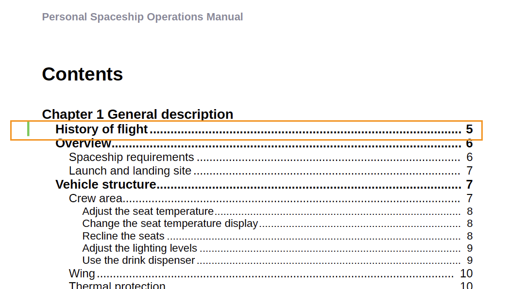

# Versão mais recente do Adobe Experience Manager Guides as a Cloud Service

## Atualizar para a versão mais recente

Atualize seus Guias do Adobe Experience Manager atuais as a Cloud Service (mais tarde chamados de *Guias de AEM as a Cloud Service*), executando as seguintes etapas:
1. Confira o código Git do Cloud Services e alterne para a ramificação configurada no pipeline Cloud Services correspondente ao ambiente que você deseja atualizar.
2. Atualizar `<dox.version>` propriedade no `/dox/dox.installer/pom.xml` arquivo do seu código Git Cloud Services para 2023.2.235.
3. Confirme as alterações e execute o pipeline do Cloud Services para atualizar para a versão mais recente dos Guias do AEM as a Cloud Service.

## Etapas para indexar o conteúdo existente (somente se você estiver em uma versão anterior à versão de setembro do AEM Guides as a Cloud Service)

Execute as seguintes etapas para indexar o conteúdo existente e usar o novo texto de localização e substituição no nível do mapa:

* Execute uma solicitação POST no servidor (com a autenticação correta) - `http://<server:port>/bin/guides/map-find/indexing`.
(Opcional: é possível passar caminhos específicos dos mapas para indexá-los; por padrão, todos os mapas serão indexados || Exemplo: `https://<Server:port>/bin/guides/map-find/indexing?paths=<map_path_in_repository>`)

* A API retornará um jobId. Para verificar o status do trabalho, você pode enviar uma solicitação de GET com id de trabalho para o mesmo ponto de extremidade - `http://<server:port>/bin/guides/map-find/indexing?jobId={jobId}`
(Por exemplo: http://&lt;
_localhost:8080_>/bin/guides/map-find/indexing?jobId=2022/9/15/7/27/7dfa1271-981e-4617-b5a4-c18379f11c42_678)

* Quando o trabalho for concluído, a solicitação do GET acima responderá com sucesso e mencionará se algum mapa falhou. Os mapas indexados com êxito podem ser confirmados nos logs do servidor.

## Matriz de compatibilidade

Esta seção lista a matriz de compatibilidade dos aplicativos de software compatíveis com os Guias do AEM as a Cloud Service na versão de fevereiro de 2023.

### FrameMaker e FrameMaker Publishing Server

| Versão do AEM Guides as a Cloud | FMPS | FrameMaker |
| --- | --- | --- |
| 2023.02.0 | Não compatível | 2022 ou superior |
|  |  |  |

*A linha de base e as condições criadas no AEM são compatíveis com as versões do FMPS a partir de 2020.2.

### Conector de oxigênio

| Versão do AEM Guides as a Cloud | Janelas do conector Oxygen | Conector Oxygen Mac | Editar no Oxygen Windows | Editar no Oxygen Mac |
| --- | --- | --- | --- | --- |
| 2023.02.0 | 2.8-uuid-8 | 2.8-uuid-8 | 2.3 | 2.3 |
|  |  |  |  |

## Novos recursos e melhorias

O AEM Guides as a Cloud Service oferece aprimoramentos e novos recursos na versão mais recente:

### Gerar relatórios pelo Editor da Web

O AEM Guides vem com um recurso no Editor da Web que permite verificar a integridade geral de seus documentos técnicos e gerar relatórios para eles.
Você pode visualizar a lista de tópicos, gerenciar os metadados e ver a multimídia usada em todas as referências para o mapa atual no
**Relatórios** no Editor da Web.

**Gerar a exibição da Lista de tópicos**

Você pode gerar a Lista de tópicos que fornece informações detalhadas sobre os tópicos, como tipo de referência, estado do documento e autor. Você também pode gerar o CSV para baixar o instantâneo atual dos tópicos no mapa DITA.

**Gerenciar metadados e alterar estado do documento**

Você pode aplicar tags a um tópico individual ou usar o recurso de marcação em massa para aplicar várias tags a vários tópicos, um mapa DITA ou um submapa. Você também pode alterar o estado do documento de todos os tópicos selecionados para o próximo estado de documento comum possível.

**Gerar o relatório Multimídia**

Você pode gerar o relatório multimídia que contém informações detalhadas sobre a multimídia usada em suas referências no mapa atual. Você tem a flexibilidade de filtrar e classificar os arquivos multimídia listados no relatório.
Você também pode gerar o CSV para baixar o instantâneo atual da multimídia usada no mapa DITA.

### UX renovado para a funcionalidade de revisão

Agora, os guias de AEM fornecem um UX aprimorado que ajuda a analisar os tópicos compartilhados para análise. Na experiência mais recente, a funcionalidade de revisão tem as seguintes melhorias:

* Interface do usuário atualizada
* Painel Condições, que permite realçar o conteúdo de acordo com as condições disponíveis no tópico
* Cada comentário no painel de comentários é vinculado ao texto correspondente no tópico atual. Isso ajuda a identificar o texto comentado.
* Os comentários são exibidos na ordem do texto comentado no documento.
* O nome da tarefa de revisão é exibido no workflow de revisão.
* Selecione o roteiro da tarefa de revisão que é usado para resolver todas as referências principais e termos de glossário usados no conteúdo da revisão.
* Barra de ferramentas contextual que ajuda a destacar ou tachar rapidamente o texto
* Menu Opções para editar ou excluir seus próprios comentários
* Para comentários desatualizados, você tem acesso à exibição lado a lado, o que ajuda a comparar a versão anterior do tópico com a versão de revisão atual.
* Ao usar os filtros, os comentários no painel direito são filtrados de acordo com a seleção e o número de comentários no painel esquerdo é atualizado adequadamente.

   

### Aprimoramentos de tradução

Agora você tem aprimoramentos mais fáceis de usar no painel Tradução que ajudam a traduzir facilmente seus documentos do Editor da Web.

**Passar o rótulo da versão para a versão de destino**

Guias do AEM permitem passar o rótulo do arquivo de origem para o arquivo de destino. Isso ajuda a identificar facilmente a versão de origem do arquivo traduzido.

Por exemplo, se você tiver alguns arquivos de origem com o rótulo da versão Release 1.0 aplicado a eles, também será possível passar o rótulo de origem (Release 1.0) para o arquivo traduzido.

**Forçar sincronização para ativos fora de sincronização**

Se você fizer alterações em alguns ativos, os Guias do AEM os marcará como Fora de sincronia. Você pode traduzir novamente os ativos modificados ou optar por descartar o status Fora de sincronização. Por exemplo, se você tiver feito algumas pequenas alterações que realmente não precisam de uma tradução, poderá marcar o status delas como Em sincronia.

**Exibir projetos de tradução em andamento para um tópico ou mapa**

Algumas das referências no painel de tradução podem estar em andamento. Agora, o AEM Guides fornece um recurso para ajudar você a visualizar a lista de todos os projetos de tradução em andamento (juntamente com o idioma de destino) que contêm a referência selecionada.

### Gerar saída em vários formatos no Editor da Web

Agora é possível gerar facilmente a saída dos tópicos ou do mapa DITA no Editor da Web. Você pode configurar várias predefinições de saída, como AEM Site, PDF, HTML5, JSON (um formato de saída headless) e saída personalizada. Você pode usá-los para gerar as respectivas saídas.

Você pode definir atributos em seus tópicos DITA e, em seguida, usar a predefinição de condição para aplicar uma condição ao publicar a saída. Você também pode usar o recurso de publicação de linha de base para publicar seletivamente uma versão específica do mapa ou tópico DITA.

### Localizar e substituir o texto no nível do mapa

O Guia AEM permite procurar arquivos em um mapa que contenha texto específico. O texto pesquisado é destacado nos arquivos. Agora, você também pode substituir a palavra ou frase pesquisada por outra palavra ou frase em todos os arquivos. É possível selecionar **Substituir tudo** ícone na parte superior direita da lista para substituir todas as ocorrências do termo pesquisado em todos os arquivos.

### Excluir e duplicar arquivos no painel de repositório

Agora é possível criar facilmente uma duplicata ou uma cópia de um arquivo do **Opções** do arquivo selecionado no painel repositório. Por padrão, o arquivo é criado com um sufixo `filename_1.extension`).

### Outras melhorias no Editor da Web

* Nos Guias do AEM, você pode executar algumas operações comuns para imagens e arquivos de mídia usando o menu de contexto. Agora, também é possível localizar a imagem ou mídia selecionada no repositório ou visualizar o arquivo na interface do usuário do Assets.

* O nome do Perfil de pasta atual é exibido como um rótulo para o ícone Preferências do usuário na barra de ferramentas principal. Isso ajuda a identificar o perfil da pasta em que você está trabalhando.

* Quando você abre um mapa na exibição de mapa, o título do mapa atual é exibido no centro da barra de ferramentas principal. Isso é útil para informar aos usuários qual mapa está aberto no momento.

### Visualizar o título no lugar da UUID no editor de oxigênio

Agora o AEM Guides permite que você escolha **Usar Título no Editor e no Gerenciador de Mapas** em Configurações. Se você selecionar essa opção, o título do arquivo será exibido na guia do arquivo quando aberto no Editor ou no Gerenciador de mapas DITA. Se você não selecionar essa opção, a UUID do arquivo será exibida na guia do arquivo.

### Publicação baseada em microsserviços para guias do AEM as a Cloud Service

O novo microsserviço de publicação permite que você execute grandes cargas de trabalho de publicação simultaneamente no AEM Guides as a Cloud Service e aproveite a plataforma Adobe I/O Runtime sem servidor, líder do setor.

Para cada solicitação de publicação, o AEM Guides as a Cloud Service executa um contêiner separado que é dimensionado horizontalmente de acordo com as solicitações do usuário. Isso permite executar várias solicitações de publicação e obter um desempenho aprimorado.

Para obter mais detalhes, consulte [Configure a nova publicação baseada em microsserviços para os Guias do AEM as a Cloud Service](https://experienceleague.adobe.com/docs/experience-manager-guides-learn/tutorials/knowledge-base/publishing/configure-microservices.md).

### PDF nativo | Adicionar um marcador personalizado na saída do PDF

Agora é possível adicionar um marcador personalizado em um conteúdo específico na saída final do PDF para facilitar a navegação. Isso seria adicionado ao índice criado a partir dos títulos de tópico ou seção no mapa DITA.

### PDF nativo | Aplicar estilo personalizado em entradas de índice e conteúdo de tópico

Guias de AEM fornecem o recurso para aplicar um estilo personalizado nas entradas do índice ou em um tópico específico na saída do PDF. Por exemplo, é possível alterar a cor do texto no índice e no título do tópico. Também é possível aplicar estilos a todo o conteúdo do tópico.

### PDF nativo | Estilo do marcador de página no componente de nota de rodapé

Agora é possível estilizar o marcador de página nas notas de rodapé. Por exemplo, é possível adicionar colchetes ou alterar a cor. Esses estilos ajudam os usuários a identificar facilmente os marcadores de página no documento.

### PDF nativo | Alterar barra para indicar tópicos alterados no Sumário

Agora, os Guias do AEM permitem identificar rapidamente os tópicos alterados no índice da saída de PDF.  Ela mostra uma barra de alterações à esquerda dos tópicos alterados no índice. Você pode clicar no tópico no índice e exibir as alterações detalhadas.

## Problemas corrigidos

Os bugs corrigidos em várias áreas estão listados abaixo:

### Criação  

* As alterações no html do Editor da Web causam problemas com `<dl>` e `<dlentry>`. (11024)
* Alguns atributos não estão sendo tratados como condicionais e estão causando problemas. (10895)
* Três níveis ou mais aninhados `<indexterm>` não estão aninhados na exportação de PDF nativa. (10799)
* O conteúdo desaparece no corpo de uma tarefa ao alternar da visualização Autor para Fonte. (10735)
* Comentários de revisão são colocados fora do lugar em uma tarefa de revisão. (10625)
* **Desfazer** ou **Refazer** O não está funcionando corretamente em alguns arquivos. (10373)
* Os metadados personalizados não são mantidos na ação de copiar e colar. (10367)
* A opção Desfazer no Editor de XML leva o usuário para a parte superior da página. (10091)
* As propriedades do nó são removidas após a operação de copiar e colar de um ativo. (10053)
* O mimeType é codificado para criação e atualização de ativos DITA. (8979)
* O nome do criador de versão no Histórico de versão é &quot;fmdita-serviceuser&quot; para os arquivos carregados pela interface do usuário do Assets. (8910)
* Os fragmentos de conteúdo não podem ser copiados e colados quando o AEM Guides está instalado na nuvem. (11315)
* O navegador (Editor da Web) congela ao carregar conteúdo com um esquema personalizado. (11211)

### Gerenciamento

* Copiar um ativo de mapa DITA (da interface do usuário do Assets ) causa linhas de base incorretas no ativo copiado. (11218)
* A mensagem de aviso não é exibida no upload de um arquivo maior do que o limite permitido no AEM (2 GB por padrão). (10817)
* Editor da Web - Linha de base | O comportamento da coluna Mais recente é diferente no novo painel da linha de base no Editor da Web. (10808)
* Tradução | A tarefa de tradução não é iniciada devido a /libs/fmdita/i18n/ja.json inválido. (10543)
* Tradução | Ocorre um erro em um projeto de tradução de escopo criado a partir do painel de tradução (Tradução humana). (10526)
* Tradução | O pós-processamento está bloqueado para toda a pasta de idioma cujos ativos estão presentes em um projeto de tradução ativo. (10332)
* Vários pop-ups são exibidos para qualquer ativo se a versão for alterada e salva no editor de linha de base. (10399)
* O vazamento da sessão ocorre em `com.day.cq.search.impl.builder.QueryBuilderImpl.createResourceResolver(QueryBuilderImpl.java:210)`. (10279)

### Publicação

* A regeneração de tópico não está funcionando para alguns cenários. (10635)
* O Publishlistener não exibe os dados solicitados em logs de informações e também contém alguns logs de lixo eletrônico.( 10567)
* PDF nativo | Ao criar uma predefinição de saída com a opção &quot;Adicionar ao perfil de pasta&quot;, a geração de PDF falha com uma exceção de ponteiro nulo. (10950)
* PDF nativo | Problemas ao girar o cabeçalho da tabela. (10555)
* PDF nativo | Aninhado `<indexterm>` não estão aninhados na exportação de PDF nativa. (10521)
* PDF nativo | Tópicos aninhados nos apêndices são todos transformados em h1 no HTML temporário. (10454)
* Falha na publicação da linha de base para o PDF gerado usando o FrameMaker Publishing Server 2020. (10551)
* PDF nativo | Adição `xref` a uma Imagem não renderiza a imagem no PDF gerado. (11346)
* PDF nativo | Marca de imagem adiciona o atributo display-inline a todas as imagens. (10653)
* PDF nativo | Comentários de rascunho são ocultos por padrão na saída gerada. (10560)
* PDF nativo | navtitle não é homenageado por topichead. (10509)
