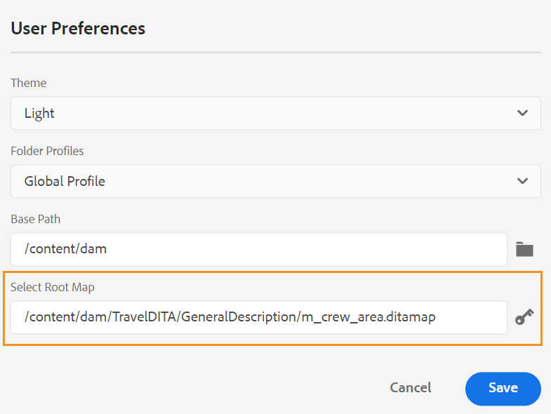

# Versão 4.1.x dos Guias do Adobe Experience Manager

Estas notas de versão abordam as instruções de atualização, os novos recursos e as melhorias na versão 4.1.x dos Guias do Adobe Experience Manager (mais recente, conhecido como *Guias de AEM*).

## Atualizar para a versão mais recente

Você pode atualizar facilmente sua versão atual dos Guias de AEM para a versão 4.1.3. Antes de continuar com a atualização para a versão 4.1.3 dos Guias de AEM, considere os seguintes pontos:
* Se você estiver usando a versão 4.1 ou 4.1.x, poderá atualizar diretamente para a versão 4.1.3.
* Se você estiver usando a versão 4.0.x, será necessário atualizar para a versão 4.1 ou 4.1.x antes de atualizar para a 4.1.3.
* Se você estiver usando a versão 3.8.5, será necessário atualizar para a versão 4.0.x antes de atualizar para a 4.1.
* Se você tiver uma versão anterior à 3.8.5, consulte a seção atualização no guia de instalação específico do produto.

Para obter detalhes, consulte [Instruções de atualização](assets/Adobe-Experience-Manager-Guides-Upgrade-Instructions-EN.pdf).

## 4.1.3 | Notas de versão

## Matriz de compatibilidade

Esta seção lista a matriz de compatibilidade para os aplicativos de software suportados pela versão 4.1.3 dos Guias AEM.

### Adobe Experience Manager

**Não UUID**
Versão 6.5 Service Pack 13, 12, 11 ou 10

**UUID**
Versão 6.5 Service Pack 13, 12, 11 ou 10

Para obter mais detalhes, consulte a seção Requisitos técnicos no guia Instalar e configurar guias do Adobe Experience Manager .

### Servidor de publicação do FrameMaker e do FrameMaker

| Versão | FMPS 2020 | FMPS 2019 | De 2020 | De 2019 |
| --- | --- | --- | --- | --- |
| 4.1.3 (não UUID) | 2020.2 ou superior* | 2019 | 2020.3 ou superior | 2019.8 (atualização mais recente) |
| 4.1.3 (UUID) | 2020.2 ou superior* | Não compatível | 2020.4 ou superior | Não compatível |
|  |  |  |  |

*A linha de base e as condições criadas em AEM são suportadas em versões FMPS a partir de 2020.2.

### Conector de oxigênio

| Versão | Janelas do conector de oxigênio | Conector de oxigênio Mac | Editar no Windows Oxygen | Editar no Oxygen Mac |
| --- | --- | --- |--- |--- |
| 4.1.3 (não UUID) | 2,0 | 2,0 | 1,6 | 1,6 |
| 4.1.3 (UUID) | 2.7 | 2,7 | 2.3 | 2,3 |
|  |  |  |

## Problemas corrigidos

O erro corrigido está listado abaixo:

* O Editor da Web carrega uma página em branco intermitentemente. (10678)

## 4.1.2. | Notas de versão

## Matriz de compatibilidade

Esta seção lista a matriz de compatibilidade para os aplicativos de software suportados pelo AEM Guias 4.1.2.

### Adobe Experience Manager

**Não UUID**
Versão 6.5 Service Pack 13, 12, 11 ou 10

**UUID**
Versão 6.5 Service Pack 13, 12, 11 ou 10

Para obter mais detalhes, consulte a seção Requisitos técnicos no guia Instalar e configurar guias do Adobe Experience Manager .

### Servidor de publicação do FrameMaker e do FrameMaker

| Versão | FMPS 2020 | FMPS 2019 | De 2020 | De 2019 |
| --- | --- | --- | --- | --- |
| 4.1.2 (não UUID) | 2020.2 ou superior* | 2019 | 2020.3 ou superior | 2019.8 (atualização mais recente) |
| 4.1.2 (UUID) | 2020.2 ou superior* | Não compatível | 2020.4 ou superior | Não compatível |
|  |  |  |  |

*A linha de base e as condições criadas em AEM são suportadas em versões FMPS a partir de 2020.2.

### Conector de oxigênio

| Versão | Janelas do conector de oxigênio | Conector de oxigênio Mac | Editar no Windows Oxygen | Editar no Oxygen Mac |
| --- | --- | --- |--- |--- |
| 4.1.2 (não UUID) | 2,0 | 2,0 | 1,6 | 1,6 |
| 4.1.2 (UUID) | 2,7 | 2,7 | 2,3 | 2,3 |
|  |  |  |

## Problemas corrigidos

Os bugs corrigidos em várias áreas estão listados abaixo:

* Ao selecionar todos os perfis de pasta, um perfil de pasta invisível (que está incorreto) é exibido. (10393)
* A criação da linha de base não escolhe a versão mais recente, quando o fuso horário do usuário é diferente do fuso horário do servidor. (10336)
* O atalho Control+F não abre o modal de pesquisa do navegador no Console Ativos após a instalação dos Guias AEM 4.1. (10339)
* Ocorre um erro de criação de linha de base para o tópico que tem a referência a uma pasta. (10383)
* A guia Predefinições de saída mostra uma tela em branco intermitentemente e, em alguns casos, predefinições não editáveis são exibidas. (10390)
* O gerenciamento de espaço de chaves está gerando exceções e erros. (10449)

### Problemas conhecidos com solução alternativa

* A linha de base exportada durante a tradução não é carregada na guia da linha de base do editor.

   **Solução alternativa**: Use a guia da linha de base do painel de mapa DITA.

## 4.1. | Notas de versão

Estas notas de versão abordam as instruções de atualização, os novos recursos e as melhorias na versão 4.1.x dos Guias do Adobe Experience Manager (mais recente, conhecido como *Guias de AEM*).

## Matriz de compatibilidade

Esta seção lista a matriz de compatibilidade para os aplicativos de software suportados pelo AEM Guias 4.1.

### Adobe Experience Manager

**Não UUID**
Versão 6.5 Service Pack 13, 12, 10 ou 11

**UUID**
Versão 6.5 Service Pack 13, 12, 10 ou 11

Para obter mais detalhes, consulte a seção Requisitos técnicos no guia Instalar e configurar guias do Adobe Experience Manager .

### Servidor de publicação do FrameMaker e do FrameMaker

| Versão | FMPS 2020 | FMPS 2019 | De 2020 | De 2019 |
| --- | --- | --- | --- | --- |
| 4.1 (não UUID) | 2020.2 ou superior* | 2019 | 2020.3 ou superior | 2019.8 (atualização mais recente) |
| 4.1 (UUID) | 2020.2 ou superior* | Não compatível | 2020.4 ou superior | Não compatível |
|  |  |  |  |

*A linha de base e as condições criadas em AEM são suportadas em versões FMPS a partir de 2020.2.

### Conector de oxigênio

| Versão | Janelas do conector de oxigênio | Conector de oxigênio Mac | Editar no Windows Oxygen | Editar no Oxygen Mac |
| --- | --- | --- |--- |--- |
| 4.1 (não UUID) | 2,0 | 2,0 | 1,6 | 1,6 |
| 4.1 (UUID) | 2,7 | 2,7 | 2,3 | 2,3 |
|  |  |  |

## Novos recursos e melhorias

AEM Guias fornece muitos aprimoramentos e novos recursos na versão 4.1:

### Publicação PDF nativa

O suporte para criar um PDF nativo também foi adicionado na versão 4.1 dos Guias AEM. Um novo mecanismo de publicação foi introduzido com os seguintes recursos:
* Criar um modelo de CSS
* Criar modelos de página diferentes
* Modelos de PDF de design que incluem CSS e modelos de página
* Publicar mapa e conteúdo de tópico no formato PDF

### Suporte para caminho do site da base de conhecimento na publicação baseada em artigo

AEM Guias fornece o recurso de publicação baseado em artigos para gerar de forma incremental uma saída de um ou mais tópicos ou publicar seu conteúdo em uma plataforma da base de conhecimento. Com a versão 4.1, você tem uma opção adicional para escolher o caminho do site da Base de conhecimento para o qual o tópico/mapa precisa ser publicado. Depois que você selecionar o caminho, a saída será gerada no caminho especificado.

### Editor da Web aprimorado

* **Resolução de chave aprimorada**

Uma referência de chave de conteúdo DITA insere uma parte do conteúdo de um tópico em outro. Ele usa uma chave para localizar o conteúdo. As referências principais associadas a um tópico DITA precisam ser resolvidas. O mapa-raiz selecionado tem a maior precedência para resolver referências-chave.

Agora, as referências principais são resolvidas com base no mapa raiz definido na seguinte ordem de prioridade:

1. Preferências do usuário
2. Painel Visualização de mapa
3. Perfil da pasta

Para obter mais detalhes, consulte *Resolver referências de chave* no guia Uso dos guias do Adobe Experience Manager.

* **Adicionar um painel personalizado no painel esquerdo**

Agora é possível adicionar um painel personalizado no painel esquerdo do Editor da Web. Você pode usar um painel personalizado para vários propósitos, como fornecer ajuda ou fazer o teste de um projeto. Se um painel personalizado tiver sido configurado, ele também aparecerá na lista de painéis dentro do **Configurações do editor**. Você pode alternar o switch para mostrar ou ocultar o painel personalizado.

* **Capacidade de alterar o estado dos tópicos do documento em um mapa DITA**

Agora é possível alterar facilmente o estado do documento de tópicos selecionados em um mapa DITA. Também é possível abrir e editar as propriedades dos tópicos selecionados em um mapa DITA no **Mais opções** na parte inferior do painel Visualização de mapa.

* **Informações da versão exibidas no modo de Visualização**

O Editor da Web ajuda você a gerenciar suas versões. Agora você também pode ver a versão do tópico ativo ou mapa DITA no canto superior direito da guia do arquivo do tópico no modo de Visualização de um tópico.

* **Melhora do comportamento de atualização do Editor da Web**

Os seguintes aprimoramentos agora estão disponíveis com a operação de atualização do navegador no Editor da Web:

* Agora você tem suporte para atualizar o navegador enquanto edita seu conteúdo no Editor da Web. Se você clicar no ícone de atualização do navegador enquanto um ou mais arquivos com alterações não salvas forem abertos para edição, será solicitado a salvar seus arquivos ou cancelar a ação de atualização.

* Mesmo ao atualizar o navegador, as exibições do painel esquerdo e do painel direito são mantidas.

* O tópico ativo ou mapa DITA é reaberto na área de edição de conteúdo.

* **Criar mapas com base em modelos personalizados**

Agora você tem o recurso avançado para criar modelos de mapa personalizados. Você pode usá-los para criar mapas DITA junto com os modelos de tópico e modelos de mapa referenciados no modelo de mapa.

Também é possível consultar outros modelos de mapa e modelos de tópico do modelo de mapa personalizado. Os modelos de mapa referenciados podem se referir a vários modelos de mapa, modelos de tópico, tópicos, mapas, imagens, vídeos e outros ativos.

O modelo de mapa personalizado pode ajudar você a replicar facilmente os modelos de mapa e toda a estrutura de pasta referenciada. Esses modelos personalizados são especialmente úteis para criar e recriar vários mapas que têm estruturas e referências recursivas.

* **Suporte a Schematron**
&quot;Schematron&quot; refere-se a uma linguagem de validação baseada em regras usada para definir testes para um arquivo XML. Usando um arquivo Schematron, você pode definir determinadas regras e validá-las para um tópico DITA ou um mapa. O editor da Web suporta arquivos Schematron. Você pode importar os arquivos do Schematron e também editá-los no Editor da Web. O suporte ao Schematron no Editor da Web ajuda você a validar os arquivos em relação a um conjunto de regras e a manter a consistência e a correção nos tópicos.

* **Caixa de diálogo melhorada ao fechar o arquivo**

AEM Guias solicita que você salve suas alterações e desbloqueie seus arquivos bloqueados quando tentar fechar um arquivo aberto no Editor da Web. Os prompts são exibidos com base na variável **Solicitar check-in ao fechar** e **Solicitar nova versão ao fechar** configurações definidas pelo administrador.

Com base na configuração, você obtém a opção de salvar as alterações e criar uma nova versão do documento. Ou também é possível fazer check-in do arquivo e salvar as alterações na versão atual.

Para obter mais detalhes, consulte *Fechar e salvar cenários* no guia Uso dos guias do Adobe Experience Manager.* O **Inserir palavra-chave** foi aprimorado. Agora é possível encontrar uma Palavra-chave mais facilmente a ser inserida, pois as palavras-chave estão listadas em ordem alfabética. Também é possível pesquisar palavras-chave digitando uma sequência de caracteres de pesquisa na caixa Pesquisar.

* **Suporte para documentos Markdown**
O Markdown é uma linguagem de marcação leve que pode ajudar você a adicionar elementos de formatação a documentos de texto simples. O Editor da Web permite usar documentos do Markdown (.md) junto com os documentos DITA. Você pode criar e visualizar facilmente um documento do Markdown no Editor da Web e também adicioná-lo ao arquivo de mapa por meio do editor de mapa DITA.  Para obter mais detalhes, consulte 
*Autorizar documentos do Markdown no Editor da Web* em Uso do guia dos Guias do Adobe Experience Manager.

* **Capacidade de configurar uma exibição de tags padrão**
Se um usuário ativar a Exibição de tags no Editor da Web, ela permanecerá ativada mesmo nas sessões.  Isso significa que você não precisa ativar a Exibição de tags novamente para acessá-la posteriormente. O administrador pode configurar o estado padrão para a Exibição de tags no Editor da Web. O valor padrão da Exibição de tags para uma sessão de novo usuário é determinado pela propriedade tagsView no arquivo ui_config.json .

* Agora, os arquivos de Exibição do Repositório são carregados em lotes. Todos os arquivos presentes no principal ou `/content/dam folder` estão listadas. Mas a partir do próximo nível ou da pasta secundária, 75 arquivos são carregados de cada vez. Esse carregamento em lote é eficiente e você pode acessar os arquivos mais rápido em comparação ao carregamento de todos os arquivos existentes em uma pasta.

### Novo painel de linha de base

A versão dos Guias AEM 4.1 fornece o recurso Linha de base integrado ao Editor da Web. Agora é possível criar linhas de base no Editor da Web e usá-las para publicar ou traduzir tópicos de diferentes versões.

**Observação**: Para o sistema atualizado, atualize o mais recente **ui_config.json** para Perfil da pasta.

Use esse recurso para criar uma linha de base com uma versão específica dos tópicos disponíveis em uma data e hora específicas. Além disso, você obtém o suporte da API para criar ou atualizar uma linha de base com um rótulo definido para uma versão de tópicos.

Você pode pesquisar os arquivos com base em nomes de arquivo ou no local do arquivo. Você também pode filtrar os tópicos a serem exibidos na janela de edição da linha de base e classificá-los com base em colunas específicas.

O desempenho do processo de criação da linha de base foi aprimorado ainda mais. O processo para criar linhas de base é assíncrono, portanto, você pode continuar editando outros arquivos no Editor da Web enquanto a linha de base estiver sendo criada. Para obter mais detalhes, consulte *Criar e gerenciar linhas de base no Editor da Web* no guia Uso dos guias do Adobe Experience Manager.

Observação: A guia Linha de base no painel de mapa está oculta por padrão. O administrador pode ativar a guia Linha de base no painel de mapa.

* O parâmetro de linha de base nas APIs do Mapa de Download agora usa o título da linha de base para recuperar o conteúdo com versão.

### Processo de tradução aprimorado

* **Capacidade de criar um projeto de tradução de escopo**
Se você precisar criar apenas o escopo de um projeto a ser traduzido, poderá selecionar 
**Criar um novo projeto de tradução de escopo**. Isso não enviará as cópias para tradução e o status de tradução original dos arquivos será mantido.

* O **Languages** exibe as pastas de idioma junto com seus códigos de idioma. Por exemplo, francês (fr) e alemão (de).

Para obter mais detalhes sobre a tradução, consulte *Traduzir documentos do Editor da Web* em Uso do guia dos Guias do Adobe Experience Manager.

### Publicação aprimorada

* Você também pode acessar a variável **Publicar painel** na guia Saídas enquanto você gera a saída do painel de mapa. Uma lista de todas as tarefas de publicação ativas está disponível no Painel de publicação.

* No painel de mapa, você pode selecionar vários arquivos DITAVAL para gerar conteúdo condicional. Você pode manter a ordem dos arquivos adicionando ou excluindo arquivos. Você também pode passar o mouse sobre o nome do arquivo para ver o caminho no repositório AEM onde o arquivo está armazenado.

* As linhas de base foram respeitadas para os metadados de saída AEM site. Também é possível processar as propriedades de uma versão da linha de base como metadados. Se nenhuma linha de base for definida, as propriedades da versão mais recente serão processadas como metadados.

* O **Nome do arquivo** e **Argumentos da linha de comando DITA-OT** foram adicionadas opções para HTML5, EPUB e predefinições de saída Personalizadas. Agora é possível especificar o nome do arquivo com o qual deseja salvar a saída. Você também pode especificar os argumentos adicionais que deseja que o DITA-OT processe ao gerar a saída.

### Painel de mapa

Ao optar por baixar o mapa DITA, a solicitação é colocada em fila e você recebe uma notificação quando o mapa estiver pronto para download. Você pode optar por baixar o arquivo de mapa imediatamente ou baixá-lo posteriormente no link fornecido na Caixa de entrada de notificação AEM.

### Outras melhorias de recursos

* AEM Guias agora oferecem suporte ao Autor Oxygen XML versão 24.1.
* O parâmetro de linha de base nas APIs do Mapa de Download agora usa o título da linha de base para recuperar o conteúdo com versão.

### Recurso obsoleto

AEM Guias não são mais compatíveis com a geração do formato de saída DITA para documentos do FrameMaker. Essa opção do DITA também foi removida das Predefinições de saída do painel do Mapa.

## Problemas corrigidos

Os bugs corrigidos em várias áreas estão listados abaixo:

* Suporte à criação não disponível como uma alternativa para a referência baseada no caminho de arquivo para publicação. (8076)
* O pacote DITA Add on impede a detecção de ativos duplicados do DAM. (8417)
* Após o check-in de um documento do Oxygen para o AEM, o conteúdo japonês no documento é substituído por pontos de interrogação (???). (9124)
* A atualização dos arquivos com check-out não está funcionando no logon com autenticação da Web no Oxygen. (9179)
* O arquivo não é verificado quando aberto no Oxigênio. (9192)
* Após o check-in de um documento do Oxygen para o AEM, o conteúdo japonês no documento é substituído por pontos de interrogação (???). (9276)
* A autenticação da Web não está funcionando no Oxygen. (9296)
* O recarregamento falha no Oxygen quando o(s) arquivo(s) já existe(m) no AEM no mesmo local. (9328)
* Opção não disponível para sincronizar com força o conteúdo entre o AEM e o sistema local. (9439)
* A ID não é gerada automaticamente para o elemento adicionado usando **Inserir conteúdo reutilizável** na barra de ferramentas secundária. (5826)
* Nenhuma caixa de diálogo de confirmação é exibida ao carregar uma imagem com o mesmo nome de um arquivo existente, por meio do editor. (6011)
* Um espaço sem quebra não disponível no palete de caracteres. (7523)
* A lista de elementos (Alt+Enter) aparece esmaecida no tema Escuro/Mais Escuro. (7913)
* A versão não é atualizada ao salvar a revisão de um tópico da barra de ferramentas do painel de mapa. (8228)
* xref não pode ser inserido mesmo em locais válidos. (8354)
* A operação &#39;getversionlabels&#39; tem limitações e não fornece o desempenho esperado. (8513)
* Ocorrem problemas com a caixa de diálogo de confirmação ao fechar um arquivo bloqueado ou editado que não está aberto no editor. (8692)
* Ocorre um erro ao adicionar um usuário como administrador no perfil da pasta quando a ID do usuário é numérica. (8908)
* O painel Tradução fica visível mesmo ao abrir o mapa DITA no Editor de mapa. (9053)
* O código de idioma não é exibido com o idioma no painel Tradução. (9108)
* As guias Tradução e Linha de base ficam visíveis por algum tempo no painel Mapa. (9146)
* Quando a tradução é feita, uma versão adicional é criada para o ativo traduzido. (9310)
* A tradução aprovada não é integrada ao idioma de destino quando o código de idioma de destino contém cinco caracteres como `fr_ca`. (9357)
* O conteúdo traduzido é interrompido quando o código de idioma de destino criado é mencionado como `fr-fr, `, `en-us`. (9527)
* Ao carregar um mapa DITA que esteja fora da pasta de idioma, uma exceção é registrada no back-end.(9543)
* Não é possível criar o arquivo DITA usando o modelo DITA personalizado no editor. (7262)
* O mapa DITA é perdido ao publicar um mapa DITA UUID via FMPS. (7278)
* AEM Guias não copia as propriedades não exclusivas de um ativo quando ele é copiado e colado. (8241)
* O nome de arquivo do mapa DITA não é convertido em minúsculas na criação. (8383)
* A descrição da tarefa de revisão não é exibida na notificação por email que está sendo enviada quando uma nova tarefa de revisão está sendo atribuída. (8507)
* API do mapa de download | Pastas temporárias que não estão sendo limpas caso ocorra erros no processo de download. (8523)
* `columnpreview.jsp` depende da controladora.  (8543)
* Trabalhos de saída com status como &quot;Aguardando&quot; ou &quot;Executando&quot; não são limpos no Painel de publicação.  (8569)
* Ícone padrão escolhido ao gerar um relatório usando o botão Gerar , mesmo quando a propriedade do ícone é definida. (8573)
* Problemas ocorrem no processo de revisão durante a atualização do 3.8.X para o 4.0. (8788)
* No painel Revisão do Editor da Web, se um nome de usuário for longo, os ícones para aceitar/rejeitar não serão exibidos claramente. (8793)
* A árvore de referência é interrompida após a remoção de um tópico e a execução de uma operação de movimentação. (8804)
* O DTD personalizado definido pelo usuário não tem precedência sobre o DTD DITA padrão incorporado no DITA-OT. (9104)
* A posição do realce está incorreta na exibição Lado a Lado. (9305)
* A nota de rodapé de uso por referência não é rolada para a seção de nota de rodapé AEM saída do site. (9061)
* A ordem das notas de rodapé está incorreta na saída do Site de AEM. (9327)
* Os ativos DITA recém-criados são sempre verificados por outro usuário. (9387)
* O erro sempre é registrado na criação do novo conteúdo. (9388)
* A terceira tela no processo de criação da tarefa de revisão não mostra a lista de glossários. (4558)
* Referências UUID incorretas atribuídas ao carregar vários arquivos do FrameMaker/Conector Oxygen. (8269)
* A notificação por email não está sendo enviada quando uma tarefa de revisão está sendo atribuída novamente na Caixa de entrada. (8376)
* O segundo usuário administrador não pode ser adicionado como o primeiro usuário administrador a uma pasta. (8430)
* **Aplicar rótulos** na guia Linha de base não exibe rótulos na lista suspensa. (8455)
* Ao usar a publicação da linha de base com imagem como conref no tópico, a imagem não é publicada na saída. (8564)
* O recurso de limpeza de saída falha se houver um grande número de nós do histórico de saída restantes. (8568)
* No painel Histórico de versões, a seção da versão atual mostra um carimbo de data e hora incorreto e foi modificado por informações. (8765)
* Linha de base não atualizada com base no rótulo definido. (8799)
* Ocorre um erro quando os arquivos cuja pasta principal tem caracteres especiais no nome do arquivo são abertos no Oxygen (usando o **Editar no oxigênio** botão). (8918)
* Falha no upload de arquivos do Oxygen para AEM. (9157)
* O mapa de download com linha de base não funcionará se o conteúdo for movido para outra pasta. (9331)
* O Oxigênio verifica uma versão incorreta de um tópico após a reversão de uma versão em AEM. (9411)
* A pesquisa no painel Repositório e na caixa de diálogo de navegação topicref congela a tela quando o conteúdo é grande. (9432)
* Se a configuração **Criar nova versão para o arquivo carregado** estiver ATIVADO, uma nova versão será criada ao reverter e salvar em qualquer nó congelado. (9473)
* As diferenças incorretas no carimbo de data e hora são exibidas na interface do usuário do Assets ao reverter uma versão de arquivo. (9480)
* O check-out dos arquivos é feito automaticamente ao reverter para qualquer versão. (9482)
* O ícone de cadeado é exibido na visualização do repositório mesmo quando o arquivo é feito com check-in no editor.  (5756)
* Não é possível adicionar elementos de matéria de frente e de fundo em um mapa de favoritos usando a visualização Autor do Editor da Web. (7652)
* O modo de Visualização não é compatível `deliveryTarget` atributo de processamento condicional no DITA. (7685)
* Ao abrir um tópico de glossário no editor XML, o AEM força a salvá-lo mesmo que não tenha sido modificado. (8105)
* A caixa de diálogo Inserir referências é aberta ao adicionar subjetivo a um mapa usando a interface do usuário. (8212)
* Reutilizar o painel de conteúdo trava ao pesquisar caracteres especiais `[` ou `*` .(8279)
* Ao criar entrada de Glossário, o Editor da Web mostra o conteúdo como uma Nota. (8384)
* O Editor XML remove a nova linha no codeblock. (8522)
* A alternância entre o modo de origem e autor marca o tópico como sujo e requer que o conteúdo seja salvo novamente.(8524)
* Não é possível fechar um tópico desbloqueado. (8545)
* Não existe opção para escolher o caminho da Base de conhecimento nas predefinições de publicação baseadas em artigos. (8636)
* Os atributos estão ausentes ao adicionar um capítulo ao mapa de favoritos usando a opção Arrastar e soltar da exibição Favoritos. (8746)
* A caixa de diálogo Inserir palavra-chave não tem a capacidade de pesquisa e as palavras-chave não são listadas em ordem classificada. (9094)
* Realizar uma pesquisa no Editor XML faz com que a página fique congelada. (9452)
* Os sites estão ausentes AEM predefinições na guia Saída. (9567)
* Imagens de SVG que não são renderizadas corretamente nos modos de criação do Editor XML. (9426)
* A linha de base não está sendo honrada ao publicar via salesforce. (8953)
* A capacidade de limpar o roteiro das configurações de preferências do usuário não está presente. (8534)
