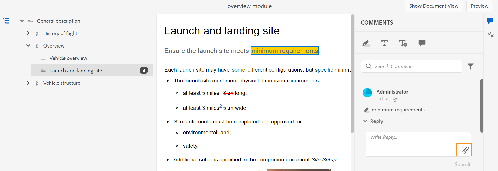
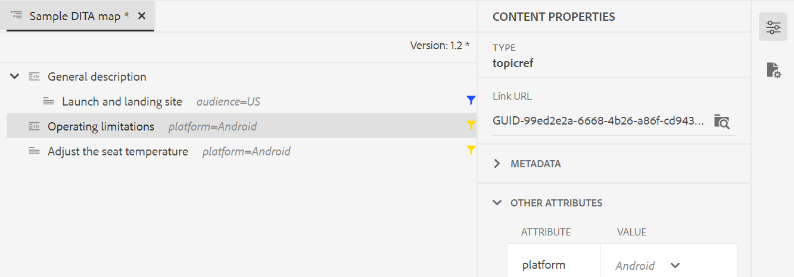

# Versão 4.2 dos Guias do Adobe Experience Manager (fevereiro de 2023)

Esta nota de versão aborda as instruções de atualização, os novos recursos e as melhorias na versão 4.2 dos Guias do Adobe Experience Manager (mais recente, conhecido como *Guias de AEM*).

## Atualizar para a versão mais recente

Você pode atualizar facilmente sua versão atual dos Guias de AEM para a versão 4.2. Antes de continuar com a atualização para a versão 4.2 dos Guias de AEM, você deve considerar os seguintes pontos:
* Se você estiver usando a versão 4.0, 4.1 ou 4.1.x, poderá atualizar diretamente para a versão 4.2.
* Se você estiver usando a versão 3.8.5, precisará atualizar para a versão 4.0 antes de atualizar para a versão 4.2.
* Se você estiver em uma versão anterior à 3.8.5, consulte o *Atualizar guias de AEM* no guia de instalação específico do produto.

>[!NOTE]
>
>Você deve instalar AEM service pack antes de atualizar AEM versão dos Guias.

Para obter detalhes, consulte [Instruções de atualização](assets/Adobe-Experience-Manager-Guides-Upgrade-Instructions-EN.pdf).

## 4.2. | Notas de versão

## Matriz de compatibilidade

Esta seção lista a matriz de compatibilidade para os aplicativos de software suportados pelo AEM Guias 4.2.

### Adobe Experience Manager

**Não UUID**
Versão 6.5 Service Pack 15, 14, 13 ou 12

**UUID**
Versão 6.5 Service Pack 15, 14, 13 ou 12

Para obter mais detalhes, consulte a *Requisitos técnicos* no guia Instalar e configurar os guias do Adobe Experience Manager.

### Servidor de publicação do FrameMaker e do FrameMaker

| Versão | FMPS 2022 | FMPS 2020 | De 2022 | De 2020 |
| --- | --- | --- | --- | --- |
| 4.2 (não UUID) | 2022 ou superior | 2020.2 ou superior* | 2022 ou superior | 2020.3 ou superior |
| 4.2 (UUID) | 2022 ou superior | 2020.2 ou superior* | 2022 ou superior | 2020.4 ou superior |
|  |  |  |  |

*A linha de base e as condições criadas em AEM são suportadas em versões FMPS a partir de 2020.2.

### Conector de oxigênio

| Versão | Janelas do conector de oxigênio | Conector de oxigênio Mac | Editar no Windows Oxygen | Editar no Oxygen Mac |
| --- | --- | --- |--- |--- |
| 4.2 (não UUID) | 2.1-regular-4 | 2.1-regular-4 | 1.6 | 1.6 |
| 4.2 (UUID) | 2.8-uuid-8 | 2.8-uuid-8 | 2.3 | 2.3 |
|  |  |  |

## Novos recursos e melhorias

AEM Guias fornece muitos aprimoramentos e novos recursos na versão 4.2:

### Gerar relatórios pelo Editor da Web

AEM Guias vem com um recurso no Editor da Web que permite verificar a integridade geral de seus documentos técnicos e gerar relatórios para eles.
Você pode exibir a lista de tópicos e gerenciar os metadados de todas as referências do mapa atual do
**Relatórios** no Editor da Web.

**Gerar a exibição de Lista de tópicos**

Você pode gerar a Lista de tópicos que fornece informações detalhadas sobre seus tópicos, como tipo de referência, estado do documento e autor. Você também pode gerar o CSV para baixar o instantâneo atual dos tópicos no mapa DITA.

**Gerenciar metadados e alterar o estado do documento**

Você pode aplicar tags em um tópico individual ou usar o recurso de marcação em massa para aplicar várias tags em vários tópicos, um mapa DITA ou um submapa. Também é possível alterar o estado do documento de todos os tópicos selecionados para o próximo estado comum possível do documento.

### UX remodelado para a funcionalidade de revisão

Agora, os guias de AEM fornecem um UX aprimorado que ajuda a revisar os tópicos compartilhados para revisão. Na experiência mais recente, a funcionalidade de revisão tem os seguintes aprimoramentos:

* Interface do usuário atualizada
* Painel Condições , que permite realçar o conteúdo de acordo com as condições disponíveis no tópico.
* Cada comentário no painel de comentário está vinculado ao texto correspondente no tópico atual. Ajuda a identificar o texto comentado.
* Os comentários são exibidos na ordem do texto comentado no documento.
* O nome da tarefa de revisão é exibido no workflow de revisão.
* Selecione o rootmap para a tarefa de revisão que é usada para resolver todas as referências principais e termos de glossário usados no conteúdo de revisão.
* Barra de ferramentas contextual que ajuda você a realçar ou tachar rapidamente o texto.
* Menu Opções para editar ou excluir seus próprios comentários.
* Para comentários desatualizados, você tem acesso à visualização lado a lado, o que ajuda a comparar a versão anterior do tópico com a versão de revisão atual
* Ao usar os filtros, os comentários no painel direito são filtrados de acordo com a seleção, e o número de comentários no painel esquerdo é atualizado adequadamente.

Para obter mais detalhes, consulte a *Rever tópicos ou mapas* no guia Uso dos guias do Adobe Experience Manager.

### Aprimoramentos de tradução

Agora você tem melhorias mais fáceis de usar no painel Tradução , que ajudam a traduzir facilmente seus documentos do Editor da Web.

**Coluna Rótulo da versão adicionada ao painel de tradução**

No painel de tradução, você também pode ver a coluna Rótulo da versão . Isso exibe o Rótulo da versão selecionada do arquivo de origem. Isso pode ajudá-lo a selecionar todos os arquivos com um rótulo específico e traduzi-los de uma só vez.

**Exibir diferença de versão para arquivos Fora de Sincronização no painel de tradução**

Agora você pode verificar as diferenças entre a versão selecionada e a última versão de origem traduzida dos tópicos. Você também pode optar por traduzir a variável **Fora de Sincronização** arquivos com base nas alterações feitas entre as duas versões de um tópico.

**Passe o rótulo da versão para a versão de destino**

AEM Guias permite que você passe o rótulo do arquivo de origem para o arquivo de destino. Isso ajuda você a identificar facilmente a versão de origem do arquivo traduzido.

Por exemplo, se você tiver alguns arquivos de origem com o rótulo da versão Versão 1.0 aplicado a eles, também poderá passar o rótulo da origem (Versão 1.0) para o arquivo traduzido.

**Forçar sincronização para ativos fora de sincronia**

Se você fizer alterações em alguns dos ativos, AEM Guias os marcará como Fora de Sincronização. Você pode traduzir novamente os ativos modificados ou optar por descartar o status Fora de Sincronização. Por exemplo, se você fez algumas pequenas alterações que realmente não precisam de uma tradução, é possível marcar o status como Em sincronia.

**Exibir projetos de tradução em andamento para um tópico ou mapa**

Algumas das referências no painel de tradução podem estar em andamento. Agora os Guias AEM fornecem um recurso para ajudá-lo a visualizar a lista de todos os projetos de tradução Em andamento (junto com o idioma de destino) que contêm a referência selecionada.

Para obter mais detalhes, consulte a *Traduzir documentos do Editor da Web* no guia Uso dos guias do Adobe Experience Manager.

### Gerar saída em vários formatos no Editor da Web

Agora é possível gerar facilmente a saída dos tópicos ou do mapa DITA pelo Editor da Web. Você pode configurar várias predefinições de saída, como AEM Site, PDF, HTML5, JSON (um formato de saída sem cabeçalho) e saída personalizada. Use-os para gerar as respectivas saídas. Você pode definir atributos nos tópicos do DITA e usar a predefinição de condição para aplicar uma condição enquanto publica a saída. Você também pode usar o recurso de publicação da linha de base para publicar seletivamente uma versão específica do seu mapa ou tópico do DITA.

**Gerenciar predefinições de saída do Perfil global e de pasta**

Os Guias AEM fornecem o recurso para criar e gerenciar predefinições de saída para os Perfis Global e de Pasta. Em seguida, você pode usar facilmente essas predefinições de saída para gerar saída para todos os mapas relacionados a esse perfil Global ou Folder.

Essas predefinições globais aparecem sob a **Saída** de todos os mapas relacionados. Você pode usá-los para gerar a saída para todos os mapas relacionados. Você pode selecionar a predefinição como PDF padrão para gerar a saída do PDF. Você também pode **Editar**, **Renomear**, **Duplicar** ou **Excluir** uma predefinição de saída existente do **Opções** menu.

>[!NOTE]
>
>Somente usuários administrativos de nível de pasta podem criar predefinições de Perfil Global e de Pasta.

### Localizar e substituir o texto no nível de mapa

Agora é possível pesquisar arquivos em um mapa que contenha texto específico. O texto pesquisado é realçado nos arquivos. Também é possível substituir a palavra ou frase pesquisada por outra palavra ou frase dentro dos arquivos. Selecione o **Substituir ocorrência única** ícone para substituir a ocorrência atual e o **Substituir tudo no arquivo** ícone para substituir todas as ocorrências no arquivo selecionado. Você pode selecionar **Substituir tudo** ícone para substituir todas as ocorrências do termo pesquisado em todos os arquivos.

Por padrão, as opções **Arquivo de check-out antes de substituir** e **Criar nova versão após substituir** estiverem selecionadas, portanto, o check-out de um arquivo é realizado antes da substituição do texto, e uma nova versão é criada após a substituição do texto. Também é possível pesquisar a string nas referências indiretas no mapa DITA. Por padrão, essa opção fica desativada para que a pesquisa seja executada somente nas referências diretas.

### Exibição de layout no Editor de mapa

Agora é possível exibir o layout completo de um mapa DITA no Editor de mapa. Ao abrir um mapa para edição, ele abre a exibição Layout do Editor de mapa. Nesta visualização, é possível ver a hierarquia do mapa em uma visualização em árvore. Também é possível editar e organizar ou estruturar os tópicos em um mapa.

A exibição Layout contém uma barra de ferramentas separada que ajuda a executar muitas tarefas nos tópicos presentes em um mapa.
Você pode inserir referências de tópico, grupo de tópicos, definições-chave em um mapa. Você pode reorganizar os tópicos presentes em um mapa movendo-os para cima, para baixo, para a esquerda ou para a direita. Você também pode arrastar e soltar os tópicos para movê-los em um mapa. O Editor de mapa também fornece ícones para bloquear ou desbloquear arquivos, verificar o histórico de versões e fazer um gerenciamento de rótulos de versão.

A exibição Layout também fornece a variável **Opções de Exibição** para mostrar ou ocultar a caixa de seleção número de linha, mostrar ou ocultar, ou mostrar o nome do arquivo ou o título dos tópicos em um mapa.
Também é possível exibir os tópicos com base nos filtros condicionais aplicados neles.

Além de organizar tópicos no arquivo de mapa, você também pode adicionar, mover, copiar, colar ou excluir referências usando o **Opções** disponível para um elemento na exibição Layout.

O painel direito exibe as Propriedades do conteúdo e as Propriedades do mapa na exibição Layout do Editor de mapa. Agora, também é possível definir as informações de metadados para os tópicos ou o mapa. É possível definir o Título da navegação, o Texto do link, a Descrição curta e as Palavras-chave para o tópico ou mapa selecionado.

Para obter mais detalhes, consulte *Exibição de layout* no guia Uso dos guias do Adobe Experience Manager.

### Painel Geração rápida

Agora AEM Guias fornece o painel Geração rápida , que ajuda a gerar e exibir rapidamente a saída das predefinições criadas para o mapa DITA.

No **Geração rápida** , é possível ver a lista de todas as predefinições de saída criadas para o mapa DITA. Também é possível visualizar rapidamente a saída gerada para as predefinições. Uma mensagem de sucesso ou falha é exibida na conclusão da geração de saída. Você também pode visualizar o log de erros que contém detalhes do erro que ocorreu no processo de geração.

### Criar uma linha de base dinâmica com base em rótulos

Agora AEM Guias fornece o recurso para criar linhas de base dinâmicas com base em rótulos. Se você gerar uma linha de base, baixar uma linha de base ou criar um projeto de tradução usando uma linha de base, os arquivos serão selecionados dinamicamente com base nos rótulos atualizados. Esse recurso é útil, pois não é necessário modificar a linha de base ao atualizar os rótulos.

### Excluir e duplicar arquivos do painel de repositório

Agora, é possível excluir facilmente os arquivos (um único arquivo de cada vez) do **Opções** do arquivo selecionado no painel de repositório. Um prompt de confirmação é exibido antes de excluir o arquivo. Se o arquivo não for referenciado de nenhum outro arquivo, ele será excluído e uma mensagem de sucesso será exibida.

Também é possível criar uma duplicata ou uma cópia do arquivo selecionado. Por padrão, o arquivo é criado com um sufixo (como filename_1.extension).

### Outras melhorias no Editor da Web

* Nos Guias AEM, é possível executar algumas operações comuns para imagens e arquivos de mídia usando o menu de contexto. Agora, também é possível localizar a imagem ou a mídia selecionada no repositório ou visualizar o arquivo na interface do usuário do Assets.

* O nome do Perfil da pasta atual é exibido como um rótulo para o ícone Preferências do usuário na barra de ferramentas principal. Isso ajuda a identificar o perfil da pasta em que você está trabalhando.

* Ao abrir um mapa na exibição de mapa, o título do mapa atual é exibido no centro da barra de ferramentas principal. Isso é útil para informar aos usuários qual mapa está aberto no momento.

### Limpeza de versões selecionadas de arquivos

À medida que você cria e mantém o conteúdo, muitas versões podem ser criadas para os arquivos DITA no repositório. AEM Guias permitem limpar versões mais antigas dos arquivos DITA do repositório e liberar espaço em disco.

AEM Guias não exclui a primeira versão do arquivo ou uma versão que esteja incluída em uma linha de base, ou tenha um rótulo aplicado a ele. A operação de limpeza nem exclui arquivos incluídos em uma tradução ou em um fluxo de trabalho de revisão. Você pode escolher o número de versões a serem mantidas e também decidir excluir os arquivos que são mais antigos do que o número definido de dias.

Antes de iniciar a operação de limpeza, é possível visualizar o relatório para ver as versões que serão limpas. Em seguida, você pode decidir iniciar ou cancelar a operação de limpeza.

Quando a operação de limpeza estiver concluída, você poderá verificar o relatório de limpeza para ver os arquivos limpos.

### Exibir título no lugar de UUID no Editor de Oxigênio

Agora, AEM Guias permite escolher **Usar título no Editor e no Gerenciador de Mapas** em Configurações. Se você selecionar essa opção, o título do arquivo será exibido na guia do arquivo, quando aberto no Editor ou no Gerenciador de mapas DITA. Se você não selecionar essa opção, a UUID do arquivo será exibida na guia do arquivo.

### Interface de usuário de metadados disponível para predefinições do PDF

Você pode definir os metadados da predefinição de saída de um mapa DITA. É possível definir os metadados de Título, Autor, Assunto e Palavras-chave. Esses metadados são mapeados para os metadados nas Propriedades do arquivo do PDF de saída. Esses metadados substituem os metadados definidos no nível do livro. Você pode definir os metadados especificamente em cada predefinição de saída e passá-los para o PDF de saída.

### PDF nativo | PDF com barra de alteração mostrando a diferença entre as versões do documento

Agora é possível criar uma PDF que mostre as diferenças no conteúdo entre duas versões usando a barra de alterações. Você pode optar por comparar a versão atual com uma linha de base da versão anterior ou comparar entre as duas versões de linha de base selecionadas.

Uma barra de alteração é exibida no PDF para indicar o conteúdo modificado, inserido ou excluído. Você também tem as opções para fazer o seguinte:
* Mostrar o conteúdo inserido em cor verde e sublinhado
* Mostrar o conteúdo excluído em cor vermelha e marcado com um tachado

### PDF nativo | Suporte a variáveis para Caminho de saída e Nome do arquivo PDF

Agora você também pode usar as seguintes variáveis prontas para uso para definir o Caminho de saída e o Arquivo PDF. Você pode usar uma única ou uma combinação de variáveis para definir estas opções:
* ${map_filename}
* ${map_title}
* ${preset_name}
* ${language_code}
* ${map_parentpath} (Somente para Caminho de Saída)
* ${path_after_langfolder} (Somente para Caminho de Saída)

### PDF nativo | Gerar Índice para mapas DITA e reorganizar layouts de página

Agora você também pode gerar o TOC em mapas DITA usando uma configuração de PDF avançada do modelo. Você pode optar por ativar ou desativar a exibição dos vários layouts de página e também reorganizar sua posição.

### PDF nativo | Adicionar um marcador personalizado na saída do PDF

Agora é possível adicionar um marcador personalizado em um conteúdo específico na saída final do PDF para facilitar a navegação. Isso seria adicionado ao TOC, que é criado a partir dos títulos de tópico ou seção no mapa DITA.

### PDF nativo | Aplicar estilo personalizado em entradas de sumário e conteúdo de tópico

AEM Guias fornece o recurso para aplicar estilo personalizado às entradas TOC ou a um tópico específico na saída do PDF. Por exemplo, você pode alterar a cor do texto no sumário e o título do tópico. Também é possível aplicar estilos em todo o conteúdo do tópico.

## Problemas corrigidos

Os bugs corrigidos em várias áreas estão listados abaixo:

### Criação  

* O painel esquerdo quebra ao adicionar uma guia. (11126)
* As alterações no html do Editor da Web causam problemas com `<dl>` e `<dlentry>`. (11024)
* Alguns atributos não estão sendo tratados como condicionais e causando problemas. (10895)
* Três níveis ou mais aninhados `<indexterm>` não estão aninhados na exportação de PDF nativo. (10799)
* O conteúdo desaparece no corpo de uma tarefa ao alternar da exibição Autor para Origem. (10735)
* Os comentários de revisão são colocados incorretamente em uma tarefa de revisão. (10625)
* `<conref>` a nota dentro de uma tag para não está sendo exibida no modo de visualização. (10559)
* A ocorrência do backspace no final de um item de lista remove toda a lista. (10540)
* A tela é exibida como em branco no Chrome v106 no ícone de arrastar e soltar em qualquer elemento da interface do usuário (por exemplo, no painel Condições ). (10524)
* O botão Recuo automático está ausente na barra de ferramentas na **Origem** exibir. (10448)
* O primeiro caractere de um item de lista às vezes é perdido quando a lista está sendo criada no editor.( 10447)
* **Desfazer** ou **Refazer** O não está funcionando corretamente em alguns arquivos. (10373)
* Os metadados personalizados não são retidos na ação de copiar e colar. (10367)
* Ocorre um erro ao fazer uma cópia (ctrl+c) e colar (ctrl+v) do conteúdo. (10304)
* O painel Contorno não exibe o conteúdo quando alternado do modo Autor para o Modo de origem. (10296)
* O submapa não é criado quando se refere a um mapa principal em Modelos DITA. (10231)
* Problemas de navegação ocorrem no Editor da Web após a atualização 4.0. (10159)
* A opção Desfazer no Editor XML leva o usuário para a parte superior da página. (10091)
* As propriedades de nó são removidas após a operação de copiar e colar um ativo. (10053)
* Os arquivos SVG adicionados aos tópicos do DITA não são exibidos no modo de visualização do editor. (10010)
* Os resultados da pesquisa para localizar e substituir no Editor da Web não podem ser lidos no modo Escuro. (9978)
* Não existe nenhum carregador ao criar um mapa a partir do modelo de mapa. (9891)
* Conref no modelo de tópico não funciona e a id de hash copiada não é atualizada na cópia de conteúdo. (9890)
* Nenhuma opção é exibida para procurar os tópicos ou o modelo de mapa dentro das subpastas do tópico ou da pasta de mapa. (9889)
* Não há opção para criar um novo modelo nas subpastas de tópicos ou mapas. (9888)
* O Editor XML não atualiza as imagens nos tópicos. (9500)
* mimeType é codificado para criação e atualização de ativos DITA. (8979)
* Um hífen normal é inserido na seleção de Hífen não quebrável no campo **Inserir Caractere Especial** caixa de diálogo. (8919)
* O nome do criador da versão no Histórico da versão é &quot;fmdita-serviceuser&quot; para os arquivos carregados por meio da interface do usuário do Assets. (8910)
* A opção Editar não funciona para imagens ao trabalhar na exibição em Coluna da interface do usuário do Assets. (8758)
* O tópico DITA não é atualizado automaticamente com as alterações feitas em **Propriedades** página. (8745)
* Ao mover elementos dentro do tópico no Editor da Web, as IDs atribuídas nos elementos são substituídas por IDs atribuídas automaticamente. (7895)

### Gerenciamento

* Copiar um ativo de mapa DITA (da interface do usuário do ativo ) causa erros nas linhas de base no ativo copiado. (11218)
* A mensagem de aviso não é exibida no upload de um arquivo maior que o limite permitido em AEM (2 GB por padrão). (10817)
* Linha de Base do Editor da Web | O comportamento da coluna Mais recente é diferente no novo painel de linha de base no Editor da Web. (10808)
* Tradução | O trabalho de tradução não é iniciado devido a /libs/fmdita/i18n/ja.json inválido. (10543)
* Tradução | Um erro ocorre em um projeto de tradução de escopo criado a partir do painel de tradução (Tradução Humana). (10526)
* Tradução | O pós-processamento é bloqueado para a pasta de idioma inteira cujos ativos estão presentes em um projeto de tradução ativo. (10332)
* Tradução| Metadados e tags não estão sendo propagados para as cópias traduzidas. (4696)
* Vários pop-ups são exibidos para qualquer ativo se a versão for alterada e salva no editor de Linha de base. (10399)
* O vazamento da sessão ocorre em com.day.cq.search.impl.builder.QueryBuilderImpl.createResourceResolver(QueryBuilderImpl.java:210). (10279)
* O arquivo de vídeo está ausente na linha de base se a pasta pai contiver espaço no nome. (10031)

### Publicação

* A regeneração de tópico não está funcionando para alguns cenários. (10635)
* A publicação de PDF falha ao gerar a saída para uma predefinição duplicada (de uma predefinição existente). (10584)
* O botão Exibir log não está funcionando caso a geração do PDF falhe em uma predefinição. (10576)
* O Publishlistener não exibe os dados solicitados em logs de informações e também contém alguns logs de lixo.( 10567)
* PDF nativo | A geração de PDF falha com uma exceção de Null Pointer. (10950)
* PDF nativo | conkeyref não está sendo resolvido na saída gerada. (10564)
* PDF nativo | Problemas ocorrem com os metadados de um mapa que precisa ser referenciado na saída do PDF.( 10556)
* PDF nativo | Problemas ao girar o cabeçalho da Tabela. (10555)
* PDF nativo | Problemas na remoção de tópicos com função de processamento=&#39;somente recurso&#39; ocorrem. (10554)
* PDF nativo | Keyrefs vazios são exibidos na saída do PDF. (10553)
* PDF nativo | Aninhado `<indexterm>` não estão aninhados na exportação de PDF nativo. (10521)
* PDF nativo | O PDF nativo usa o estilo em linha em vez do nome da classe para as tags geradas. (10498)
* PDF nativo | Topicref aninhado em apêndices são todos transformados em h1 no HTML temporário.( 10454)
* PDF nativo | Não é possível ocultar os tópicos da frente do Índice. (10355)
* PDF nativo | Atributo de quadro de tabela não propagado para o HTML temporário (como classe). (10353)
* PDF nativo | Arquivos HTML temporários adicionam classes colsep e rowsep a <td> e <th> mesmo se o valor for 0 no DITA de origem. (10352)
* PDF nativo | Reiniciar os números de página no layout do capítulo inicia aleatoriamente a numeração a partir do fim do capítulo anterior. (10154)
* PDF nativo | As referências de chave para teclas com imagem ou links externos não estão sendo resolvidas. (10063)
* PDF nativo | O apêndice está sendo exibido como um capítulo no PDF gerado. (9829)
* A guia Modelo no editor xml não está sendo exibida para os administradores do Perfil da pasta. (10266)
* A publicação da linha de base falha para PDF gerado usando o FrameMaker Publishing Server 2020. (10551)
* O erro do aplicativo ocorre ao clicar no botão Editar depois de selecionar todas as predefinições por meio da caixa de seleção Predefinições de saída no pop-up Gerar rapidamente. (10388)
* Se a guia Saída no Editor da Web tiver mais predefinições, a seção predefinições não será verticalmente rolável e não exibirá todas as predefinições disponíveis. (9787)
* Não é possível excluir predefinições do fluxo de trabalho Saída ao publicar pelo Editor. (9100)
* O link de par é renderizado como texto normal em vez de um link na página gerada. (7774)

### Problema conhecido

O Adobe identificou o seguinte problema conhecido para a versão dos Guias AEM 4.2:

* Os usuários podem executar operações de revisão mesmo após a conclusão da tarefa de revisão.
