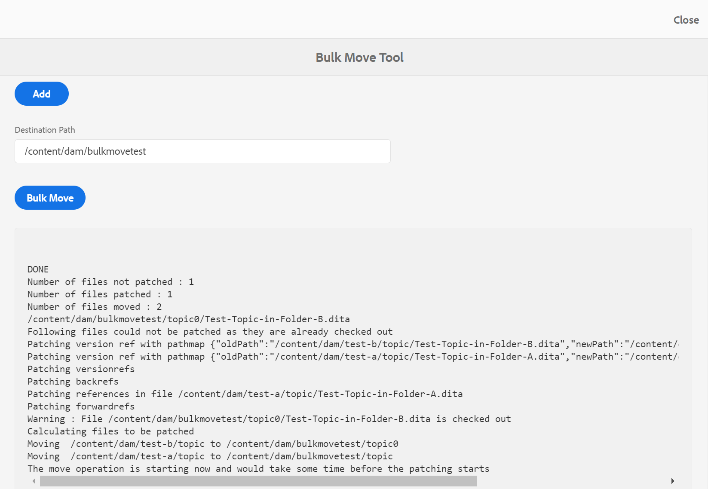

# Gerenciar arquivos e pastas {#id2116G0L08XA}

Esta seção explica como os Guias AEM lidam com as operações básicas de arquivo, como copiar, colar, arrastar e soltar e excluir arquivos. Os seguintes cenários são possíveis:

## Copiar e colar arquivos

**Se o arquivo tiver um nome de arquivo legível**

- *Se o arquivo com o mesmo nome não existir na pasta de destino*: Uma nova cópia do arquivo é criada e um UUID também é atribuído a ele. Aqui, o nome do arquivo é igual ao nome do arquivo original.
- *Se o arquivo com o mesmo nome já existir na pasta de destino*: Uma nova cópia do arquivo é criada com um sufixo \(como filename0.extension\). Um UUID também é atribuído ao arquivo recém-criado.

**Se o nome do arquivo for baseado em um padrão UUID**

- *Se o arquivo com o mesmo nome não existir na pasta de destino*: Uma nova cópia do arquivo é criada e uma nova UUID também é atribuída a ele no novo local. Aqui, o nome do arquivo é igual ao UUID.
- *Se o arquivo com o mesmo nome já existir na pasta de destino*: Uma nova cópia do arquivo é criada e uma nova UUID também é atribuída a ele. O nome do arquivo é igual ao UUID.

## Copiar e colar pastas

**Copiar e colar a pasta no mesmo local**

- *A pasta tem arquivos com nomes de arquivo legíveis*: Uma nova cópia da pasta é criada com um sufixo \(como folder name0\). Uma nova UUID também é atribuída aos arquivos dentro da pasta. No entanto, não há alteração nos nomes dos arquivos.

- *A pasta tem arquivos com nomes de arquivo com base em um padrão UUID*: Uma nova cópia da pasta é criada com um sufixo \(como folder name0\). Uma nova UUID também é atribuída a todos os arquivos dentro da nova pasta. Os nomes dos arquivos também são alterados; os nomes de arquivo são iguais ao novo UUID.

**Copiar e colar a pasta em um local diferente**

- *A pasta tem arquivos com nomes de arquivo legíveis*: Uma nova cópia da pasta é criada e um novo UUID também é atribuído a todos os arquivos dentro da pasta no novo local. Aqui, não há alterações nos nomes de pasta ou arquivo.

- *A pasta tem arquivos com nomes de arquivo com base em um padrão UUID*: Uma nova cópia da pasta é criada com o mesmo nome da pasta original. Uma nova UUID também é atribuída a todos os arquivos dentro da nova pasta. Os nomes dos arquivos também são alterados; os nomes de arquivo são iguais ao novo UUID.

## Arrastar e soltar arquivos

**Arrastar e soltar com nomes de arquivo legíveis**

- *Arrastar e soltar no mesmo local*: As opções para **Substituir arquivo existente\(s\)**, **Manter ambos os arquivos\(s\)** e uma opção para criar uma versão da cópia de trabalho existente.

   {width="650" align="center"}

   Se você escolher a variável **Substituir arquivo existente\(s\)** , o arquivo que está sendo carregado substitui a versão de trabalho atual do arquivo existente no local original. A UUID não é criada ou alterada.

   Se você escolher a variável **Manter ambos os arquivos\(s\)** , uma nova cópia do arquivo é criada com um sufixo \(como filename0.extension\). Uma nova UUID também é atribuída ao arquivo recém-copiado.

   Com a opção Substituir arquivo existente\(s\) , se você escolher a opção para criar uma versão a partir da cópia de trabalho existente, uma nova versão da cópia de trabalho do documento também será criada.

   >[!NOTE]
   >
   > **Criar nova versão para o arquivo carregado** deve ser habilitado pelo administrador. Se esse recurso estiver ativado, uma nova versão do arquivo carregado será criada. Se a opção estiver desmarcada, uma versão do arquivo carregado não será criada. Para obter mais detalhes, consulte *Criar nova versão para o arquivo carregado* na seção Instalar e configurar os guias do Adobe Experience Manager as a Cloud Service.

   Se um arquivo já estiver com check-out para edição por outro usuário e você tentar fazer upload e substituir o arquivo existente, ele falhará e exibirá um erro.

   >[!NOTE]
   >
   >O **Substituir arquivo com check-out no upload** deve ser desativado pelo administrador. Se este recurso estiver ativado, é possível substituir arquivos com check-out. Se o recurso não estiver ativado, um arquivo com check-out não poderá ser substituído. Para obter mais detalhes, consulte *Substituir arquivo com check-out no upload* na seção Instalar e configurar os guias do Adobe Experience Manager as a Cloud Service.

- *Arrastar e soltar arquivos em um local diferente*: Uma nova cópia do arquivo é criada e uma nova UUID também é atribuída a ele no novo local. Aqui, o nome do arquivo é igual ao nome do arquivo original.

**Arraste e solte com nomes de arquivo com base em um padrão UUID**

*Arrastar e soltar arquivo no mesmo local*: As opções para **Substituir arquivo existente\(s\)** junto com a opção para criar uma versão da cópia de trabalho existente.

{width="650" align="center"}

Quando o arquivo é substituído, não há alteração no nome do arquivo ou em seu UUID.

Se você selecionar a variável **Criar versão para a cópia de trabalho existente** , é criada uma nova versão da cópia de trabalho do documento; quando o novo arquivo é carregado, uma nova versão do arquivo também é criada e é feita como a cópia de trabalho do documento.

**Criar nova versão para o arquivo carregado** deve ser habilitado pelo administrador. Se esse recurso estiver ativado, uma nova versão do arquivo carregado será criada. Se a opção estiver desmarcada, uma versão do arquivo carregado não será criada. Para obter mais detalhes, consulte *Criar nova versão para arquivo carregado* na seção Instalar e configurar os guias do Adobe Experience Manager as a Cloud Service.

*Arrastar e soltar arquivo em um local diferente*: As opções para **Substituir arquivo existente\(s\)**, **Mover Arquivo\(s\) para Novo Local** e uma opção para criar uma versão da cópia de trabalho existente.

{width="650" align="center"}

Se você escolher a variável **Substituir arquivo existente\(s\)** , o arquivo que está sendo carregado substitui o arquivo existente no local original. A UUID não é criada ou alterada.

Se você escolher a variável **Mover Arquivo\(s\) para Novo Local** , o arquivo existente é movido para o local atual e, em seguida, é substituído pelo arquivo que está sendo carregado. Mover um arquivo para o novo local não quebra nenhuma referência existente de ou para o arquivo.

Com a substituição ou movimentação dos arquivos, se você escolher a opção de criar uma versão a partir da cópia existente, uma nova versão da cópia de trabalho do documento será criada; o novo arquivo é substituído no local existente ou movido para o novo local.

## Mover arquivos em massa

AEM Guias vem com a Ferramenta de movimentação em massa que ajuda um administrador a mover uma pasta com um grande número de arquivos de um local para outro. Essa ferramenta pode mover facilmente arquivos dentro de uma ou mais pastas para uma pasta diferente no repositório AEM. Um dos principais recursos dessa ferramenta é que ela não só move um grande número de arquivos, como também mantém as referências para e dos arquivos que estão sendo movidos. Você pode ajustar o número de arquivos que podem ser movidos em lotes sem prejudicar as tarefas de criação e publicação.

>[!NOTE]
>
> A ferramenta Mover em massa funciona somente no nível da pasta. Se você deseja mover tópicos individuais ou arquivos de mapa, use a ferramenta de movimentação regular da interface do usuário do AEM Assets.

Estes são alguns dos recursos fornecidos pela ferramenta Mover em massa:

- Você pode ajustar o número de arquivos a serem processados em cada lote. Isso pode exigir que você execute alguns testes antes de chegar a um número ideal que seu sistema possa lidar facilmente.
- Os serviços de criação e publicação são executados sem interrupções na operação de movimentação.
- Ter controle completo sobre o intervalo de tempo entre os processos em lote subsequentes \(execução de\). Esse intervalo de tempo garante que a operação de pós-processamento seja concluída antes de iniciar o próximo lote de arquivos.

- Manuseio automático de pastas com o mesmo nome. Esse recurso garante que, mesmo que haja pastas com o mesmo nome sendo movidas, elas não sejam substituídas.

- Tratamento automático de referências para e dos arquivos que estão sendo movidos.

Você deve considerar os seguintes pontos antes de executar o processo em lote:

- Se você planeja mover tópicos que estão sendo revisados no momento, é necessário fechar o processo de revisão em todos esses tópicos antes de movê-los. Não fechar a tarefa de revisão quebrará o processo de revisão.
- Você deve executar apenas uma única operação de movimentação em massa no sistema a qualquer momento. Isso garante o tratamento adequado das referências aos tópicos que estão sendo transferidos.

Para mover arquivos em massa, execute as seguintes etapas:

1. Clique no link do Adobe Experience Manager na parte superior e escolha **Ferramentas**.
1. Selecionar **Guias** na lista de ferramentas.
1. Clique no botão **Ferramenta Mover em massa** mosaico.

   A página Ferramenta Mover em massa é exibida.

   {width="550" align="center"}

1. Forneça os seguintes detalhes na página Ferramenta Mover em massa :

   - **Adicionar sufixo a arquivos duplicados**: Caso esteja movendo pastas com o mesmo nome, é necessário selecionar essa opção. Por exemplo, na captura de tela acima, a variável **Caminho de origem** contém o nome das pastas a serem movidas. O tópico chamado pasta existe em dois locais diferentes — teste A e teste B. Ao selecionar essa opção, as pastas serão movidas com êxito. A primeira pasta movida será chamada de tópico, enquanto a segunda pasta será chamada de tópico0. A operação de movimentação adiciona um sufixo nas séries sequenciais \(0, 1, 2 e assim por diante\) às pastas com o mesmo nome.

      Se você estiver movendo pastas com o mesmo nome sem selecionar essa opção, a operação será abortada com uma mensagem.

   - **Caminho de origem\(s\)**: Especifique o local das pastas que deseja mover. Normalmente, você terá que copiar e colar o local de origem na barra de endereços do navegador. Você pode especificar vários locais de pastas clicando no botão **Adicionar** botão.

   - **Caminho de destino**: Especifique o local onde deseja mover as pastas de origem.

1. Clique em **Movimentação em massa**.

   O sistema inicia a movimentação de arquivos do local de origem para destino. Quando o processo for concluído, um resumo do processo de movimentação será exibido na parte inferior da página.

   {width="650" align="center"}

## Pesquisar conteúdo DITA

Por padrão, o AEM não reconhece o conteúdo DITA, portanto, não fornece nenhum mecanismo para pesquisar o conteúdo DITA em seu repositório. AEM Guias adiciona uma camada sobre AEM, o que permite que AEM entenda e processe o conteúdo DITA. O recurso Pesquisar conteúdo DITA nos Guias AEM permite pesquisar o conteúdo DITA AEM repositório.

>[!NOTE]
>
>O administrador do sistema pode configurar o **Elemento DITA** componente de pesquisa e, em seguida, você pode usar o recurso da interface do usuário do AEM Assets. Para obter mais detalhes, consulte *Adicionar componente de pesquisa do elemento DITA na interface do usuário do Assets* em Instalar e configurar os Guias do Adobe Experience Manager as a Cloud Service.

Usando o recurso de pesquisa, é possível:

- Procure por conteúdo DITA com base em um valor de elemento; por exemplo, `author`= xml
- Procure por conteúdo DITA com base em um valor de atributo; por exemplo, `@platform`= windows
- Usar uma combinação de elemento DITA e valor de atributo; por exemplo, `author`= xml `AND` `@platform`= windows

Execute as seguintes etapas para pesquisar o conteúdo DITA no repositório AEM:

1. Abra a interface do usuário do Assets.

1. No painel à esquerda, selecione **Filtros**.

   {width="450" align="center"}

   As opções de filtragem de conteúdo são mostradas no painel esquerdo. Você também encontrará a opção de filtragem - Elemento DITA, que é usado para filtrar o conteúdo DITA.

   {width="450" align="center"}

1. *\(Opcional\)* No **Selecionar Diretório de Pesquisa** navegue pelo local que deseja pesquisar.

1. No **Elemento DITA** , forneça o **Nome do elemento**, **Atributo** e um valor que você deseja pesquisar. Por exemplo, para procurar documentos que tenham `author` elemento que é `@type` criador, é necessário fornecer as informações, conforme mostrado na seguinte captura de tela:

   {width="650" align="center"}

   Os critérios de pesquisa inseridos na variável **Elemento DITA** é exibido na parte superior da barra de pesquisa. Os arquivos que correspondem aos critérios de pesquisa são mostrados na variável **Resultados da pesquisa** área.

   Considere os seguintes pontos ao especificar os critérios de pesquisa:

   - Para procurar uma frase exata, insira a frase no campo Valor entre aspas `"`pesquisa de frases`"`.
   - Você pode adicionar até 3 critérios de pesquisa do elemento DITA.
   - Caso você especifique vários critérios de pesquisa, todos serão combinados usando a lógica E.
   - Não é possível usar um caractere curinga em seus critérios de pesquisa. Por exemplo, para procurar a plataforma \(atributo\) com o valor do Windows — você não pode especificar \*formulário ou Windows?s.

**Filtro de status de finalização na pesquisa**

Além do filtro Elemento DITA, os Guias AEM também permitem pesquisar por conteúdo com base no status de finalização. Isso é útil quando você deseja filtrar rapidamente os arquivos que estão com check-out feito por você e deseja fazer check-in deles novamente.

Execute as seguintes etapas para pesquisar arquivos com base em seu status de check-out:

1. Abra a interface do usuário do Assets.

1. Clique em **Filtro** no painel esquerdo.
1. Digite sua palavra-chave de pesquisa na barra de Pesquisa.
1. Aplique os filtros necessários do painel esquerdo.

   Por exemplo, você pode aplicar **Status de finalização** filtro para mostrar os tópicos com check-out ou com check-in. Você pode refinar essa lista escolhendo o usuário ou grupo na lista Check-out por .

   O resultado da pesquisa é exibido.

## Excluir arquivos

A exclusão de arquivos AEM repositório é um recurso restrito, controlado pelo administrador do sistema. Com base nas configurações, a exclusão de arquivos pode ser restrita se:

- Check-out
- Ter referências de entrada ou saída

Também é possível excluir arquivos somente se você pertencer a um grupo de usuários específico que tenha privilégios para excluir arquivos.

>[!NOTE]
>
> Para obter mais detalhes sobre as configurações no gerenciamento de arquivos, consulte *Impedir exclusão de arquivos com check-out* e *Impedir exclusão de arquivos referenciados* nas seções Instalar e configurar os Guias do Adobe Experience Manager as a Cloud Service.

Se o administrador tiver dado a permissão de exclusão de arquivo a todos os usuários, a seguinte mensagem será exibida ao excluir arquivos que contenham referências:

{width="650" align="center"}

Nesse cenário, é possível excluir com força os arquivos sem remover as referências de entrada ou saída dos arquivos.

Se as permissões de exclusão forem fornecidas a um grupo de usuários específico, a mensagem acima também será exibida para os usuários que pertencem a esse grupo. No entanto, para outros usuários, a seguinte mensagem é exibida:

{width="650" align="center"}

Neste cenário, os usuários não poderão excluir arquivos até que todas as referências de entrada e saída tenham sido removidas.

## Trabalhar com arquivos de mídia

Arquivos de mídia como imagens e vídeos são parte integrante do seu conteúdo. Ao carregar e gerenciar o conteúdo, você também pode trabalhar com arquivos de mídia.

Se o arquivo de mídia tiver sido alterado, você poderá encontrar e visualizar os arquivos na **Histórico da versão**.Para descobrir as alterações nas diferentes versões de um arquivo de mídia:

1. Acesse o arquivo em **Interface do usuário do Assets**.
1. Selecione o arquivo para o qual deseja exibir o histórico de versões.
1. No painel à esquerda, clique em **Histórico da versão** e selecione uma versão.
1. Você também pode ver as miniaturas das diferentes versões no Histórico de versões.

   {width="800" align="center"}

1. Nas versões listadas, selecione aquela que deseja usar como a versão base e clique em **Versão de visualização**. A visualização da versão selecionada é mostrada na janela Visualização da versão .

   {width="650" align="center"}

**Tópico principal:**[ Gerenciar conteúdo](authoring.md)

