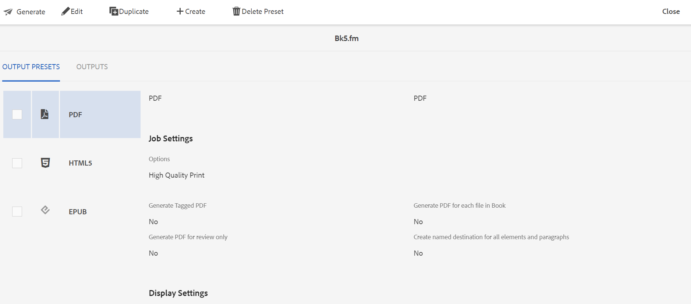

# Gerar saída de arquivos .book ou .fm {#generating_output_fm_docs}

Execute as seguintes etapas para gerar saída para documentos do FrameMaker:

1. Na interface do usuário do Assets, navegue e clique no link `.book` ou `.fm` arquivo que deseja publicar.

   O console do mapa DITA é exibido mostrando a lista de Predefinições de saída disponíveis para gerar saída.

   

1. Selecione uma ou várias Predefinições de Saída que você deseja usar para gerar a saída.

1. Clique no ícone Generate para iniciar o processo de geração de saída.

>[!NOTE]
>
> Você pode visualizar o status atual da solicitação de geração de saída clicando em Saídas. Para obter mais informações, consulte [Exibir o status da tarefa de geração de saída](fm-output-view-status.md).

**Tópico principal:**[ Gerar saída de documentos do FrameMaker](fm-output-generatation.md)

