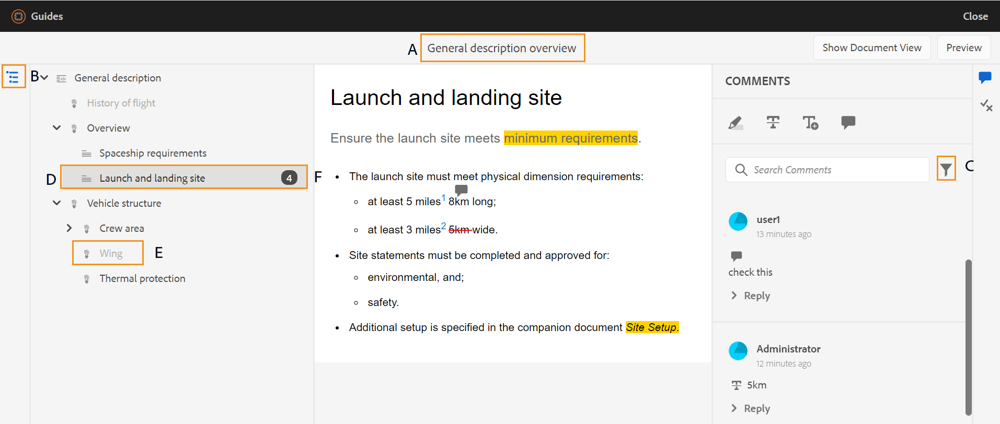
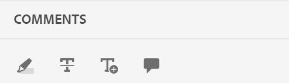
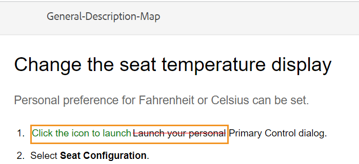
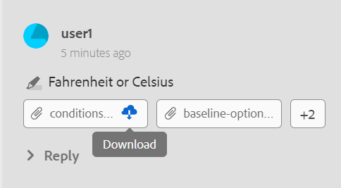
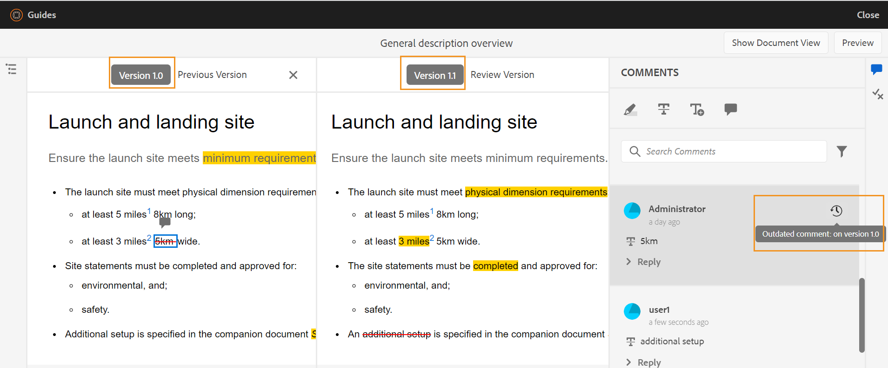

# Tópicos de revisão {#id2056B0W0FBI}

Se você for um revisor, você receberá um email de solicitação de revisão com o link para os tópicos de revisão. Clicar no link o direciona para a página de revisão, onde você pode adicionar seu feedback sobre os tópicos compartilhados.

Execute as seguintes etapas para revisar um tópico:

1. Clique no link direto fornecido no email de solicitação de revisão.

   O tópico ou link de mapa é aberto em um navegador.

   >[!NOTE]
   >
   > Também é possível acessar o link de revisão de tópico da área de notificações da Caixa de entrada na interface do usuário do AEM.

1. Dependendo de como a revisão de tópico é iniciada, você pode ver qualquer uma das duas telas a seguir:

   >[!NOTE]
   >
   > A interface do usuário pode ser diferente se você tiver criado a revisão em:
   >
   > - AEM Guias as a Cloud Service versão de novembro de 2022 ou anterior
   > - AEM Guias versão 4.1 ou anterior

   A tela a seguir é exibida quando um mapa DITA é usado para iniciar o fluxo de trabalho de revisão:

   

   As seguintes opções estão disponíveis nesta tela:

   - **A**: O nome da tarefa de revisão.
   - **B**: Clique no ícone Exibição de tópicos para mostrar ou ocultar o painel de tópicos.

   - **C**: Os números destacados por ***F*** pode ser filtrado escolhendo a opção de filtro desejada aqui. Você pode filtrar comentários por tipo, status, revisor ou versão. Por exemplo, se você quiser ver quantos comentários do Strikethrough foram feitos em cada um dos tópicos de revisão abaixo, clique no ícone de filtro e escolha **Tipo de revisão** \> **Exclusão**.

      >[!NOTE]
      >
      > Ao aplicar os filtros, somente os comentários que correspondem aos filtros selecionados são exibidos no painel de comentários. O número de comentários filtrados é mostrado à esquerda no painel Tópicos .

   - **D**: Um tópico atribuído para revisão ao revisor atual é mostrado em preto e é clicável. Quando o revisor clicar em um link de tópico, esse tópico será trazido para a parte superior da tela.
   - **E**: Um tópico que não está disponível para revisão está esmaecido. O tópico é mostrado no modo somente leitura e você não tem permissão para adicionar comentários de revisão a esses tópicos.

   - **F**: Número de comentários recebidos sobre um tópico. Esse número muda com base no filtro que você aplica.

   Todos os tópicos no mapa são mostrados como um único documento composto. Os tópicos que o revisor tem permissão para revisar são mostrados normalmente. Os tópicos que a revisão não tem permissão para revisar não são mostrados.

   

   Na captura de tela acima, o tópico Descrição geral é compartilhado para analisar o revisor atual, que é mostrado normalmente. No entanto, o próximo tópico, Histórico do conteúdo do voo não é compartilhado para revisão e é mostrado no modo somente leitura. O tópico que está atualmente em foco é também salientado no sumário.

   A tela a seguir é exibida quando um tópico ou vários tópicos são selecionados e compartilhados para revisão:

   

   >[!NOTE]
   >
   > No caso de vários tópicos, eles serão mostrados como um documento composto na exibição de documento. A captura de tela acima destaca dois tópicos diferentes apresentados um após o outro em uma única visualização.

1. Abra o painel Comentários clicando no botão **Comentários** ícone no canto superior direito da barra de ferramentas.

   Forneça comentários de revisão selecionando um tipo de comentário apropriado na barra de ferramentas e pressione Enter para enviar seu comentário.

   >[!NOTE]
   >
   > O painel Comentários mostra os comentários fornecidos apenas nos tópicos atuais. Quando você move o foco para outro tópico, os comentários dados no outro tópico são mostrados.

1. Clique em **Fechar** após concluir a revisão do tópico. Ao clicar no botão **Fechar** , você será redirecionado para a página de onde acessou o tópico de revisão.

## Recursos de adição disponíveis na tela de revisão

**Exibição de documento e exibição de tópico** - Por padrão, se vários tópicos forem compartilhados para revisão, uma exibição de documento composto de tópicos será mostrada aos revisores. No caso de uma revisão do mapa DITA, todos os tópicos do mapa são apresentados na forma de um único documento, semelhante a uma visualização de livro. Se desejar, você também pode clicar em um tópico específico e somente esse tópico será exibido na tela de revisão.

Ao exibir um único tópico, você obtém uma opção adicional para voltar para a exibição do documento. Na captura de tela a seguir, um tópico específico de um arquivo de mapa é aberto para revisão. A opção realçada — **Mostrar Exibição de Documento** permite que o usuário alterne de volta para a exibição de documento do arquivo de mapa.

**Trabalhar com diferentes tipos de ferramentas de comentário** - Você pode adicionar comentários em linha destacando o texto, marcando o texto, inserindo o texto ou adicionando uma nota de comentário. Os diferentes tipos de ferramentas de comentário fornecidas na barra de ferramentas Comentários são descritos abaixo:

- **Realçar** \(\): Para adicionar um comentário de destaque, selecione o texto e clique no ícone Realçar . Ou clique no ícone Realçar e selecione o texto desejado:

   

   Um pop-up é exibido no painel Comentários, onde é possível adicionar o comentário para o conteúdo destacado.

- **Tachado** \(\): Caso deseje sugerir a remoção do conteúdo, é possível fazer isso selecionando o conteúdo e clicando no ícone Tachado . Ou selecione o texto desejado e clique na tecla Delete :

   Um pop-up é exibido no painel Comentários, onde você pode adicionar seu comentário para o conteúdo excluído.

- **Inserir texto** \(\): Para inserir texto, clique no ícone Inserir texto e coloque o cursor onde deseja inserir o texto e digite as informações. Ou coloque o cursor onde deseja inserir o texto e comece a digitar. As informações adicionadas aparecem em fonte verde colorida:

- **Adicionar comentário**\(\): Se desejar adicionar um tipo de comentário de nota adesiva, clique no ícone Adicionar comentário e insira o comentário no pop-up.

**Barra de ferramentas contextual**

Também é possível destacar ou tachar o texto rapidamente com a barra de ferramentas contextual. Execute as seguintes etapas para comentar usando a barra de ferramentas contextual:

1. Selecione o texto que deseja destacar ou riscar. A barra de ferramentas contextual é exibida.

   

1. Clique no botão **Realçar** ou **Tachado** ícone .
1. Você pode adicionar comentários no painel de comentários para a ação de destaque ou tachado.

**Revisar usando o painel Comentários** - O painel Comentários exibe uma lista de comentários sobre o tópico atual. Esse painel também lista comentários de outros revisores, se o tópico for enviado a vários revisores. Cada comentário no painel de comentário está vinculado ao texto correspondente no tópico atual. Ajuda a identificar o texto comentado. Cada comentário exibe o nome do revisor que adicionou o comentário junto com o carimbo de data e hora.

Os comentários são exibidos na ordem do texto comentado no documento. Por exemplo, há um comentário de destaque na primeira frase e um comentário de texto inserido na segunda frase do primeiro parágrafo, então o comentário de texto realçado é exibido antes do comentário de texto inserido.

As tarefas que você pode executar usando o painel Comentários estão descritas abaixo:

- Clicar em um comentário destaca e mostra a localização do comentário correspondente no documento.
- Você pode adicionar respostas aos comentários.
- Você pode editar seu próprio comentário clicando no texto comentado no painel Comentários e selecionando **Editar** no menu Opções.
- Você pode excluir seus próprios comentários clicando no comentário no painel Comentários e selecionando o **Excluir** no menu Opções.

   

   >[!NOTE]
   >
   > O menu Opções é exibido somente quando você passa o mouse sobre seus próprios comentários. Não é exibido para os comentários de outros revisores.

- Todos os usuários participantes podem responder aos comentários enviados por outros usuários. Em um comentário, clique em **Responder** e pressione Enter para enviar uma resposta.

**Modo de visualização**

- Abrir um tópico no modo de Visualização mostra como um tópico será exibido quando for visualizado por um autor depois de aplicar todas as alterações. Por exemplo, todo o texto inserido é mostrado como texto normal e todo o texto destacado \(excluído\) é removido do conteúdo.

- A captura de tela a seguir mostra o conteúdo em *Revisão* modo:

A captura de tela a seguir mostra o conteúdo em *Visualizar* modo:

**Adicionar anexos aos comentários** - Se quiser complementar seu comentário fornecendo informações adicionais que estão disponíveis em outro arquivo, anexe-o ao seu comentário. Como revisor, você pode adicionar facilmente um ou vários arquivos do sistema local ao seu comentário. Um arquivo pode ser adicionado a todas as formas de comentários suportadas - Destaque, Tachado, Inserir texto ou Comentário.

Ao inserir qualquer um dos comentários, a janela pop-up de comentário é exibida. Depois de fornecer comentários ou informações adicionais na janela pop-up, envie-a pressionando Enter. Após adicionar o comentário, você terá a opção de adicionar um anexo a esse comentário.

Na captura de tela acima, o documento contém o pop-up do comentário de destaque e o comentário também é adicionado no painel Comentários . O ícone de anexo do arquivo O está disponível junto com o comentário em ambos os locais.

Execute as seguintes etapas para adicionar anexos ao seu comentário:

1. Clique no botão *Adicionar anexo* ícone  no comentário com o qual deseja adicionar um anexo.

   A caixa de diálogo Abrir arquivo é exibida.

1. Selecione um ou vários arquivos que deseja anexar.

   Os arquivos selecionados são mostrados junto com o comentário no painel Comentários .

   No painel Comentários , é possível visualizar o nome do arquivo e seu tamanho. Você também tem a opção de remover um arquivo clicando no ícone excluir  associado ao nome do arquivo.

1. Clique em **Enviar**.

   Os anexos são carregados e adicionados ao comentário.

**Observações adicionais sobre o trabalho com anexos:**

- Por padrão, apenas dois arquivos anexados a um comentário são mostrados. Se houver mais arquivos, **Exibir anexo** O botão à direita mostra o número de todos os anexos \(que são mais de dois\) associados ao comentário. Você pode clicar no número para exibir todos os anexos. Por exemplo, se você tiver quatro anexos com um comentário, você verá +2 no botão .

- Passar o ponteiro do mouse sobre um anexo dá as opções para baixar ou remover o anexo. A remoção do anexo só estará disponível se o revisor atual tiver adicionado esse comentário, como mostrado na seguinte captura de tela:

Os outros revisores ou autores obtêm apenas a opção de download do anexo.

- Você pode baixar todos os anexos associados a um comentário da **Exibir anexos** caixa de diálogo. Selecione os anexos e clique no botão **Baixar** no nível do comentário.

- Também é possível excluir os anexos associados a um comentário da **Exibir anexos** caixa de diálogo. Selecione os anexos e clique no botão **Excluir** ícone .

**Painel Condições** - Se o tópico tiver conteúdo condicional, você verá a variável **Condições** \(\) ícone à direita. Clicando em **Condições** abre o painel Condições , que permite realçar o conteúdo de acordo com as condições disponíveis no tópico.

: Por padrão **Realçar todas as condições** estiver ativada, todas as condições serão selecionadas, o conteúdo inteiro será exibido e o conteúdo condicional será exibido como realçado no modo de revisão e visualização.

: Você pode desativar **Realçar todas as condições** e ver todo o conteúdo presente no tópico como texto normal sem nenhum destaque.

Você pode optar por ocultar ou mostrar uma condição específica.

- Se você ocultar uma condição, o conteúdo com essa condição não será realçado no modo de revisão.
- Se você mostrar uma condição, o conteúdo condicional é realçado no modo de revisão. Por exemplo, na captura de tela a seguir, somente o conteúdo usa duas condições - `win` e `mac` é realçada.

No modo de visualização, o conteúdo não condicionado e o conteúdo condicional que usa as duas condições exibidas - `win` e `mac` é exibida. O conteúdo condicional restante para o qual as condições estão ocultas não é exibido.

**Revisão em tempo real** - O painel Comentários é atualizado em tempo real com comentários e o feedback ou ação do autor sobre os comentários.

- Vários revisores poderão deixar comentários ou responder a comentários simultaneamente no mesmo documento. Você pode descobrir quem está revisando o documento no momento, passando o mouse sobre o ícone do usuário no canto superior direito da tela.

- Se um tópico fizer parte de várias tarefas de revisão, os comentários feitos em uma tarefa não serão mostrados na outra tarefa.

- Clicar no ícone Comentário desatualizado \(\) exibe as diferenças entre as versões mais recente e comentada do documento. Os números de versão \(das versões que estão sendo comparadas\) são exibidos na parte superior dos documentos.

   

   >[!NOTE]
   >
   > Quando você passa o mouse sobre o ícone Comentário desatualizado , o número da versão do tópico no qual o comentário foi adicionado é exibido. Por exemplo, se um comentário foi dado na versão 1.0, o mesmo será exibido.

- Clicar em um comentário desatualizado abre a versão desse comentário no painel esquerdo. A versão anterior é mostrada no painel esquerdo e a versão atual é exibida no painel direito. Todos os comentários sobre a versão desatualizada são importados no lado esquerdo. Você pode comparar a versão anterior com a versão atual.

**Filtrar comentários** - Você pode filtrar comentários em um documento para exibir comentários específicos, conforme necessário. Para filtrar comentários, clique no botão **Filtro** ícone \(\) que aparece no menu à direita da caixa de texto Pesquisar comentários no painel Comentários .

Selecione uma ou mais das seguintes opções de filtragem na **Tipo de filtro** e clique em **Aplicar**.

- **Tipo de revisão** - Filtre com base no tipo de comentário - Realçar, Excluir, Inserção ou Comentário.
- **Status da revisão** - Filtre com base no status do comentário como Aceito, Rejeitado ou Nenhum.
- **Revisores** - Filtrar com base no nome do revisor.

- **Versões** - Filtrar com base nos comentários recebidos sobre uma determinada versão do tópico.

   Ao usar os filtros, os comentários no painel direito são filtrados de acordo com a seleção, e o número de comentários no painel esquerdo é atualizado adequadamente.

Para remover o filtro e exibir todos os comentários, desmarque todos os filtros do **Tipo de filtro** e clique em **Aplicar**.

**Tópico principal:**[ Rever tópicos ou mapas](review.md)

