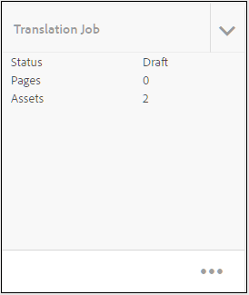

# Traduzir tópicos modificados {#id16A5A0B6072}

Se você fizer alterações em alguns tópicos, esses tópicos exigirão uma nova tradução. Você pode acompanhar os tópicos modificados do mapa DITA. Na pasta de cópia do idioma de origem, clique no arquivo de mapa DITA e clique na guia Translation . Você pode ver o status de cada tópico se ele requer ou não uma nova tradução.

Execute as seguintes etapas para enviar um tópico modificado para nova tradução:

1. Clique no arquivo de mapa DITA da pasta de cópia do idioma de origem.

1. Clique no botão **Tradução** guia .

1. No **Filtro** à esquerda, selecione o **Traduzir idiomas** que você deseja verificar o status e clique em **Concluído**.

   Você pode ver o status da tradução para cada tópico. Os tópicos que têm outra revisão de tópico disponível que o que foi enviado para tradução mostram uma **Desatualizado** status.

   >[!NOTE]
   >
   > O fluxo de trabalho de tradução compara a última revisão salva do arquivo de tópico na pasta do idioma de origem com a versão traduzida.

   Se você clicar na seta para ver mais detalhes. você pode ver a cópia de idioma específica que está desatualizada.

   {width="800" align="left"}

1. Clique na caixa de seleção para selecionar os tópicos que deseja enviar para nova tradução.

   Quando você seleciona uma data fora de sincronia, a variável **Criar/atualizar cópias de idioma** aparece no painel Referências e na guia **Ignorar Status Fora de Sincronização** acima do **Filtro** ícone .

   Você pode usar o **Dispensar Fora de Sincronia** para substituir o status de desatualizado dos tópicos no mapa DITA. Por exemplo, se você tiver alterado a versão em inglês do tópico que não precisa de tradução, poderá usar esse botão e alterar o status Desatualizado do tópico selecionado.

   >[!NOTE]
   >
   > Se você clicar no botão **Ignorar Status Fora de Sincronização** , ele define o status do tópico como Atualizado para os tópicos Desatualizados selecionados.

1. Clique em **Atualizar Cópias de Idioma** e configure o trabalho de tradução.

1. Você pode optar por criar um novo projeto de tradução ou adicionar tópicos a um projeto de tradução existente. Forneça os detalhes necessários para configurar o projeto de tradução.

1. Clique em **Iniciar**.

   Uma mensagem de confirmação é exibida mostrando que o tópico foi enviado para tradução.

1. Navegue até o projeto de tradução no console Projeto . Um novo cartão de trabalho de tradução é criado na pasta . Clique nas reticências para ver os ativos da pasta.

   {width="300" align="left"}

1. Para iniciar a tradução, clique na seta no cartão do trabalho de tradução e selecione **Iniciar** na lista. Uma mensagem notifica que o trabalho foi iniciado.

   Você também pode visualizar o status do tópico que está sendo traduzido ao clicar nas reticências na parte inferior do cartão de trabalho de tradução.

   >[!NOTE]
   >
   > Se você estiver usando o serviço de tradução Humana, será necessário exportar o conteúdo para tradução. Depois de ter o conteúdo traduzido, é necessário importá-lo de volta para o projeto de tradução.

1. Após a conclusão da tradução, o status é alterado para **Pronto para revisar**. Clique nas reticências para ver os detalhes do tópico e siga um destes procedimentos na barra de ferramentas:

   - Clique em **Receita em ativos** para ver e verificar a tradução.

   - Clique em **Aceitar tradução** se você acha que as alterações foram traduzidas corretamente. Uma mensagem de confirmação é exibida.

   - Clique em **Rejeitar tradução** se você acha que o trabalho precisa ser refeito. Uma mensagem de rejeição é exibida.
   >[!NOTE]
   >
   > É importante Aceitar ou Rejeitar o ativo traduzido; caso contrário, o arquivo permanece no local temporário e não é copiado para o DAM.

1. Navegue de volta ao arquivo de mapa DITA na pasta do idioma de origem na interface do usuário do Assets. Os tópicos retraduzidos agora estão sincronizados.

**Tópico principal:**[ Traduzir conteúdo](translation.md)
