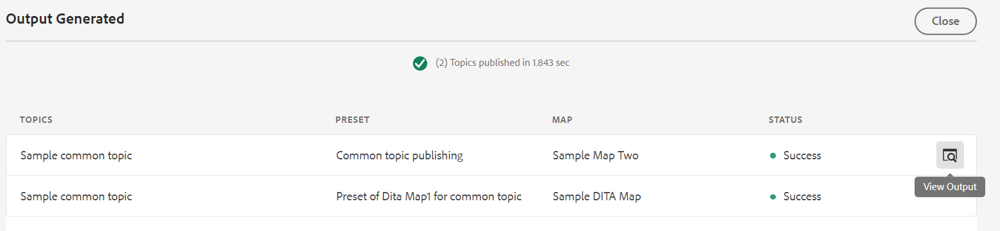

# Gerar saída do painel Repositório ou do painel Visualização de mapa {#id218CL6010AE}

Você também pode usar as predefinições de saída criadas para o mapa DITA para gerar saída do painel Repositório ou do painel Visualização de mapa .

- Use o **Geração rápida** no painel Repositório ou no painel Visualização de mapa para gerar saída para o único tópico selecionado ou para todo o mapa DITA.

   >[!NOTE]
   >
   > Você também pode acessar a variável **Geração rápida** do painel Favoritos ou do painel Pesquisar.

- Use o **Gerar saída** no painel Visualização de mapa para gerar a saída para os vários tópicos selecionados.

## Publicar um tópico usado em um ou mais mapas DITA

Execute as etapas a seguir para gerar a saída de um ou mais tópicos no mapa DITA:

1. No **Autor** selecione o tópico no mapa DITA que deseja publicar.

1. Selecionar **Geração rápida** no menu Opções do tópico selecionado.
   

1. Para publicar um tópico usado em um único mapa DITA, selecione as predefinições de saída do mapa que deseja usar para publicar e clique em **Gerar**.
   

1. Você verá o status do processo de geração de saída. Para exibir a saída, passe o ponteiro do mouse sobre o tópico e clique em Exibir saída.

1. Se você tiver um tópico comum que seja usado em vários tópicos, selecione os vários mapas DITA e também as predefinições de saída que deseja usar para publicar e clicar **Gerar.**

   

1. Você verá o status do processo de geração de saída.

   - **Tópicos**: Lista os tópicos selecionados para os quais a saída está sendo gerada.
   - **Predefinição**: Exibe as predefinições de saída que contêm os tópicos selecionados.
   - **Mapa**: Lista os mapas DITA que contêm o tópico selecionado.
   - **Status**: Exibe o status de publicação de cada tópico.
Para exibir a saída, passe o ponteiro do mouse sobre o tópico e clique em Exibir saída.
      

## Gerar saída para um mapa DITA no Editor da Web

Execute as etapas a seguir para gerar a saída para todo o mapa DITA:

1. No **Autor** selecione o mapa DITA que deseja publicar.

1. Selecionar **Geração rápida** no menu Opções do mapa DITA.

   

1. Selecione as predefinições de saída do mapa DITA que deseja usar para publicar e clicar **Gerar.**

1. Você verá o status do processo de geração de saída. Para exibir a saída, passe o ponteiro do mouse sobre o tópico e clique em Exibir saída.

## Gerar saída para mais de um tópico

Execute as etapas a seguir para gerar a saída de mais de um tópico no mapa DITA no painel Visualização de mapa :

1. No **Autor** selecione os tópicos que deseja publicar.

1. Selecionar **Gerar saída** no menu Opções, na parte inferior.

1. Selecione a predefinição de saída do mapa DITA que deseja usar para publicar.

   >[!NOTE]
   >
   > Você verá apenas as predefinições de saída do mapa DITA atual que contêm todos os tópicos selecionados.

   

1. Você verá o status do processo de geração de saída. Para exibir a saída, passe o ponteiro do mouse sobre o tópico e clique em Exibir Saída.

**Tópico principal:**[ Publicação baseada em artigo no Editor da Web](web-editor-article-publishing.md)

