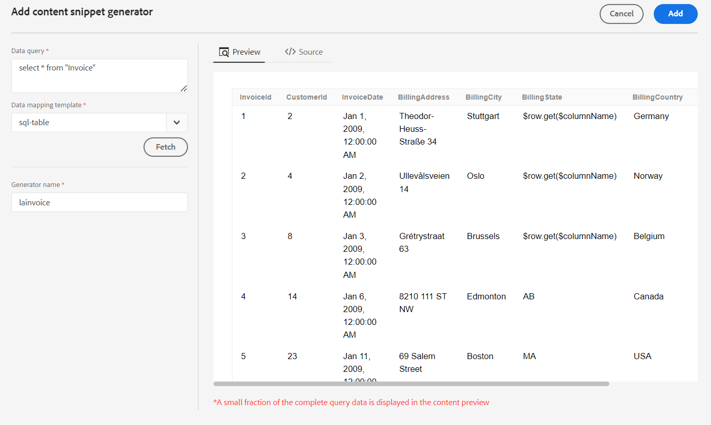

# Inserir um trecho de conteúdo da sua fonte de dados

O Guias do AEM fornece o recurso para se conectar com sua fonte de dados. Você pode buscar seus dados, inseri-los em seus tópicos e editá-los. Você pode criar facilmente um trecho de conteúdo usando o gerador de trecho de conteúdo e reutilizá-lo em seus tópicos.

Execute as seguintes etapas para criar um trecho de conteúdo usando o gerador de trecho de conteúdo e insira-o em seu tópico:

1. Selecionar **Fontes de dados**    no painel esquerdo para exibir as fontes de dados conectadas. O painel Fontes de dados é aberto e exibe todas as fontes de dados conectadas. Para obter mais detalhes, consulte [Configurar um conector de fonte de dados](../cs-install-guide/conf-data-source-connector.md).
   >[!NOTE]
   >
   > Você verá as fontes de dados para as quais o administrador configurou o conector.

1. Selecione uma fonte de dados para exibir os geradores de trecho de conteúdo disponíveis para a fonte de dados selecionada.
   {width="300" align="left"}
1. Selecionar **Adicionar** para adicionar um novo gerador de trecho de conteúdo. A variável **Adicionar gerador de trecho de conteúdo** é aberto.

1. Insira a consulta na caixa de texto Data query.
1. Selecione o modelo que mapeia com sua fonte de dados na **Modelo de mapeamento de dados** lista suspensa.
Os modelos prontos para uso da fonte de dados selecionada são exibidos na lista suspensa. Por exemplo, você pode exibir o modelo &quot;sql-table&quot; para a origem de dados denominada &quot;PostgreSQL&quot;.

   >[!NOTE]
   >  
   > Se o administrador tiver configurado modelos personalizados, esses modelos também serão exibidos na lista suspensa (com base nas configurações de caminho do modelo feitas pelo administrador).
1. Clique em **Buscar** para buscar os dados da fonte de dados e aplicar o modelo nos dados resultantes da consulta SQL.
1. É possível exibir os dados na visualização ou na exibição da fonte DITA.

   1. A visualização mostra como os dados serão exibidos quando inseridos no conteúdo. A visualização exibe uma pequena fração dos dados no formato do modelo selecionado.
Por exemplo:
      * Se você selecionou o template sql-table, é possível exibir os dados SQL em formato tabular.
      * Se você selecionou o modelo jira-ordered-list, é possível visualizar uma lista ordenada para os problemas do Jira.

   1. A exibição fonte mostra os dados na exibição fonte DITA.
      {width="800" align="left"}
1. Para salvar os resultados da consulta, digite o nome do gerador e clique em **ADICIONAR**.   Um novo gerador de trecho de conteúdo é adicionado à lista.

   >[!NOTE]
   >
   > Você precisa seguir a convenção de nomenclatura de arquivo para o nome do novo gerador de conteúdo. Você não pode ter um espaço no nome do gerador de trecho de conteúdo. Além disso, não é possível salvar um novo gerador de conteúdo com o nome de um gerador de conteúdo existente. Ocorre um erro.

## Opções para um gerador de snippet de conteúdo

Clique com o botão direito do mouse em um gerador de trecho de conteúdo para abrir as Opções. Usando as opções, você pode executar as seguintes operações:
* **Inserir**: use essa opção para inserir o trecho de conteúdo selecionado no tópico aberto para edição no Editor da Web. À medida que os dados são inseridos como um trecho, você também pode editar os dados dentro do tópico no Editor da Web.

  >[!NOTE]
  > 
  > A opção Inserir é exibida somente enquanto você está editando um tópico.

* **Editar**: use essa opção para fazer alterações no gerador de snippet de conteúdo e salvá-lo.
* **Excluir**: use essa opção para excluir o gerador de trecho de conteúdo selecionado.
* **Duplicar**: use essa opção para criar uma duplicata ou uma cópia do gerador de snippet de conteúdo selecionado. A duplicata é criada com um sufixo (como generator_1) por padrão.

### Inserir um trecho de consulta

Você também pode usar a variável **Inserir trecho da consulta**    na barra de ferramentas principal para inserir o trecho de dados nos tópicos.  Você pode selecionar um gerador na lista suspensa, editar sua query ou alterar o modelo e inserir os dados em seu tópico.

{width="800" align="left"}

